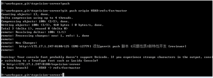
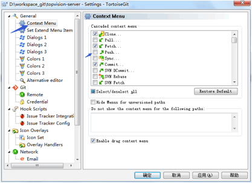
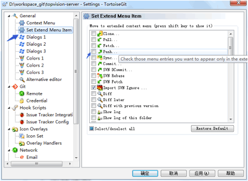
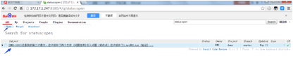
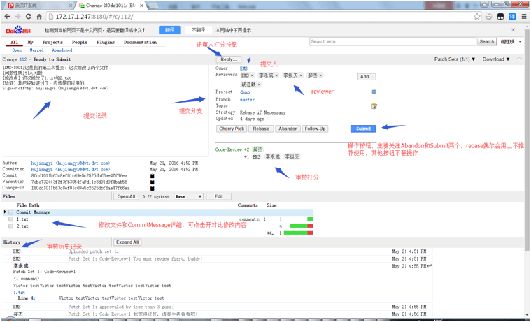
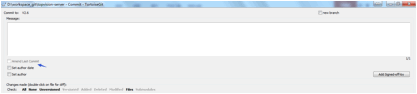

培训讲师：胡江昳

# 客户端配置

## Host文件中添加

172.17.1.247       emsgit.topvision.cn

## Url修改

老链接

[http://whgit.topvision.com/ems/topvision-s](http://whgit.topvision.com/ems
/topvision-installer)erver

http://whgit.topvision.com/ems/topvision-installer

http://whgit.topvision.com/ems/topvision-console

新链接

http://emsgit.topvision.cn:8180/topvision-server

http://emsgit.topvision.cn:8180/topvision-installer

http://emsgit.topvision.cn:8180/topvision-console

## Push方法

Git其他图形界面都能继续使用除了push不能使用

Push必须使用命令

在项目根目录会提供push.bat文件，在命令行直接执行push即可

为了避免错误，建议在git setting中将push按钮隐藏掉

# Gerrit审核流程

1、fetch rebase

2、修改本地仓库代码

3、Cmd  git push

4、修改的记录会提交到refs/for/branchs

5、在gerrit下可以看到

6、点击需要审核的记录

7、

## 问题单提交格式

[EMS-1001]不限制字数

[问题性质]

遗留问题

引入问题

新特性开发

关联问题

[reviewer] 必须有此模块 但后面可以没有内容 如需要指定reviewer使用名称全拼使用逗号分隔

必须存在 Signed-off-by

## 解决冲突

1、当submit出现错误的时候可以先尝试一下rebase按钮，如果rebase后能够正常submit则没有其他问题

2、如果rebase也不能解决冲突，只能使用abandon按钮，将评审库中的记录回退，然后到本地重新解决冲突

3、一般出现冲突的原因是其他人修改的没有同步的代码已经评审通过并合并到了heads库中，本地没有这些代码，导致发生了冲突，回退之后在本地再次fetch、re
base，在本地解决完冲突之后再push提交评审

4、对于abandon的提交如果不需要做任何修改想再次提交评审，则需要通过commit界面中的Amend last
Commit按钮再次生成一次新的commit才能提交评审

