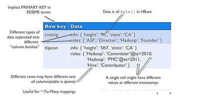
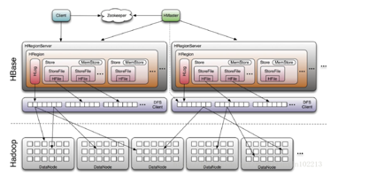
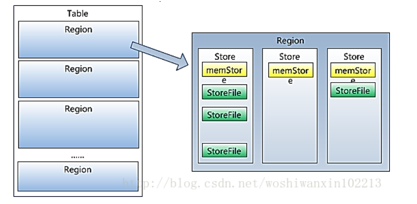
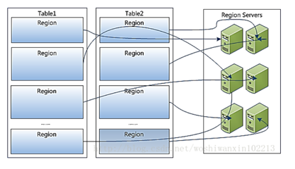
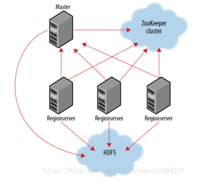

# HBase 学习

## 基础知识

RowKey：是Byte
array，是表中每条记录的“主键”，方便快速查找，Rowkey的设计非常重要。  
Column Family：列族，拥有一个名称(string)，包含一个或者多个相关列  
Column：属于某一个columnfamily，familyName:columnName，每条记录可动态添加  
Version Number：类型为Long，默认值是系统时间戳，可由用户自定义  
Value(Cell)：Byte array

## 与存储的对应

每个Hregionserver维护一个Hlog ，而不是每个Hregion一个。这样做是为了减少在写操作的磁盘寻址次数，提高写性能，图中的HLog位置不正确

HBase 为每个值维护了多级索引，即：<key, column family, column name, timestamp>

column family是最小存储单位（Hbase：StoreFile、Hadoop：Hfile），每个column
family存储在HDFS上的一个单独文件中，空值不会被保存，Key 和 Version number在每个 column family中均有一份

一个Store包含一个MemStore和多个StoreFile

一个Region包含多个Store

HRegion 包含一个HLog和多个Store，请问HRegion和Region的关系？

一个HRegionServer包含多个HRegion  

## Hbase基本组件说明

### **Client**

包含访问HBase的接口，并维护cache来加快对HBase的访问，比如region的位置信息

### **Master**

为Region server分配region

负责Region server的负载均衡

发现失效的Region server并重新分配其上的region

管理用户对table的增删改查操作

### **Region Server**

Regionserver维护region，处理对这些region的IO请求

Regionserver负责切分在运行过程中变得过大的region

### **Zookeeper****作用**

通过选举，保证任何时候，集群中只有一个master，Master与RegionServers 启动时会向ZooKeeper注册

存贮所有Region的寻址入口

实时监控Region server的上线和下线信息。并实时通知给Master

存储HBase的schema和table元数据

默认情况下，HBase 管理ZooKeeper 实例，比如， 启动或者停止ZooKeeper

Zookeeper的引入使得Master不再是单点故障

