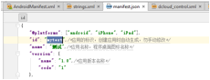

# Android Studio 构建MUI离线打包工程

## MUI 5+ SDK下载地址

<http://download.dcloud.net.cn/Android-SDK@1.9.9.30983_20170414.zip>

其中1.9.9.30983为基座版本号，需要与control.xml中的version一致

## 新建Android工程

1、使用Android studio建立一个空工程

## 删除项目中的所有包依赖

## 初始化MUI项目需要的基础目录

1、建立app\src\main\assets目录

2、建立app\src\main\assets\apps目录

3、建立app\src\main\assets\data目录

4、拷贝Android-SDK\SDK\assets\data\dcloud_control.xml到app\src\main\assets\data目录

5、拷贝Android-
SDK\SDK\assets\data\dcloud_properties.xml到app\src\main\assets\data目录

6、删除app\src\main\res目录下除app\src\main\res\value\strings.xml以外所有文件和目录

7、拷贝Android-
SDK\SDK\src\io\dcloud\RInformation.java到app\src\main\java\io\dcloud

## 根据Feature-Android.xml添加项目包依赖

此次是为了做实验，只加入基本依赖，故只关注《Hbuilder基础包》部分，和NativeUI部分

1、从SDK Android-SDK\SDK\libs如下包到工程中android-test\app\libs目录

android-support-v4.jar

json_simple-1.1.jar                                    没有找到，但好像已经包含在其他几个包中

nineoldandroids-2.4.0.jar             在SDK中的名字叫my-nineoldandroids-2.4.0.jar

pdr.jar

my-imageloader.jar

ui.jar

nativeui.jar

2、在Modules Dependencies中加入这些包

3、添加基础包依赖权限，修改app\src\main\AndroidManifest.xml

4、添加基础Activity支持，修改app\src\main\AndroidManifest.xml

5、从sdk中拷贝相应资源文件到android工程

6、根据XML修改app\src\main\assets\data\properties.xml

7、根据XML修改io.dcloud.Rinfomation.java继承的接口

8、必须严格按照dcloud_styles.xml的要求添加相关的styles

## 修改并匹配MUI APP项目参数与Android项目参数

1、在app\src\main\assets\apps目录下建立MUI APP项目

2、MUI APP项目名称必须与app\src\main\assets\apps下建立的目录名称一致，比如此次测试项目名称是mytest

3、AndroidManifest.xml(am)、manifest.json(mf)、dcloud_control.xml(dc)、string.xm(s
)l三个文件需要进行参数对比配置

**版本名称**

am.android:versionName=mf.version.name=dc.apps.app.appver

**版本code**

am.android:versionCode=mf.version.code

**项目名称**

目录名=mf.id=dc.apps.app.appid

**APP****对外显示名称**

mf.name=s.app_name

**基座编号**
    
    
    下载的Android_SDK@基座编号.zip=dc.**version**

AndroidManifest.xml

manifest.json

dcloud_control.xml

String.xml

## MUI APP权限配置

由于项目规划中只规划了基本包和NativeUI包，故只在MUI APP项目中添加Native权限即可

