iOS 构建MUI离线打包工程

## MUI 5+ SDK下载地址

<http://download.dcloud.net.cn/iOS-SDK@1.9.0.30956_20170414.zip>

其中1.9.0.30956为基座版本号，需要与control.xml中的version一致

## 初始化MUI项目需要的基础目录

1、建立Pandora目录

2、建立Pandora\apps目录

3、拷贝iOS-SDK\SDK\control.xml到 项目根目录

4、拷贝HBuilder-Hello工程AppDelegate.h、AppDelegate.m、ViewController.h、ViewControlle
r.m到根目录，替换掉工程中的对应文件

5、拷贝inc目录到工程中

## 创建应用标识

## 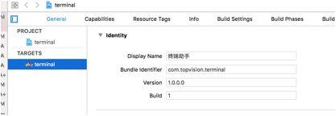

其中Bundle Identifier为苹果的AppID，必须与应用发布是配置的Profile关联的AppID一致；Version为应用版本号，在App
Store中显示的版本号，推荐与manifest.json中version下的name值一致；Build为编译版本号，App
Store判断升级使用，推荐与manifest.json中version下的code值一致。

## 修改ARC配置

## 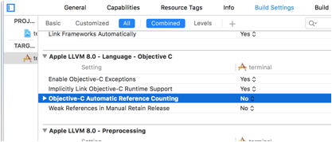

## 修改头文件搜索路径

## 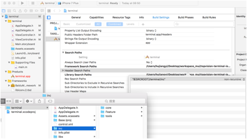

## 添加WEB应用到工程

## 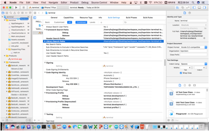

## 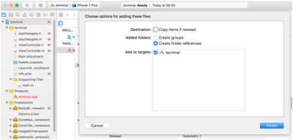

## 根据Feature-Android.xml添加项目包依赖

此次是为了做实验，只加入基本依赖，故只关注《Hbuilder基础包》部分，和NativeUI部分

1、LinkerFlags

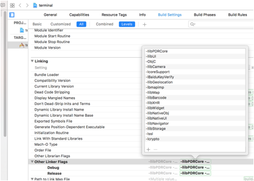

2、Library(.a) 拷贝sdk中对应文件放入工程的libs目录

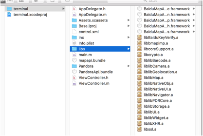

3、Framework

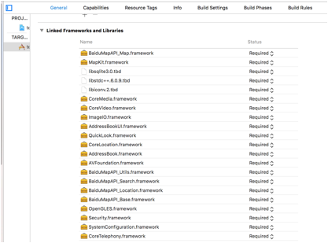

4、资源 拷贝需要的bundle到根目录

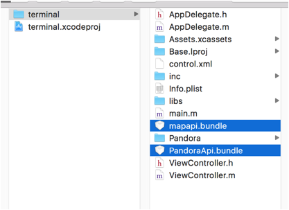

5、info

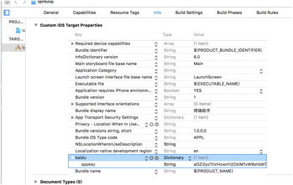

## 修改并匹配MUI APP项目参数与iOS项目参数

1、         info.plist

Bundle Identifier与APPID一致

Version 与manifest.json中的version.name一致

Build 与manifest.json中的version.code一致

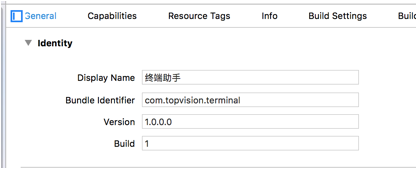

2、         control.xml

version是sdk基座版本号一致

appid为hbuilder应用的appid与Pandroa/apps下的工程目录名一致，与manifest.json中的id值完全一致

appver为hbuilder应用版本号，必须保持与manifest.json中的version.name一致

3、         manifest.json

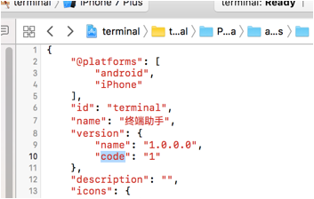

## 注意

Pandora目录为folder references引入方式，修改后不会自动更新,需要在模拟器或设备删除应用后再重新运行

拷贝到Pandora目录的www目录中manifest.json需要删除注释

