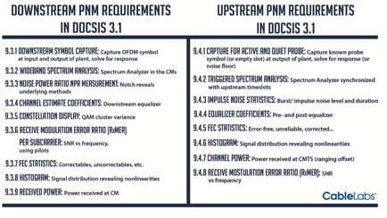
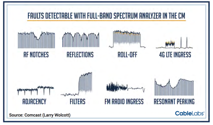
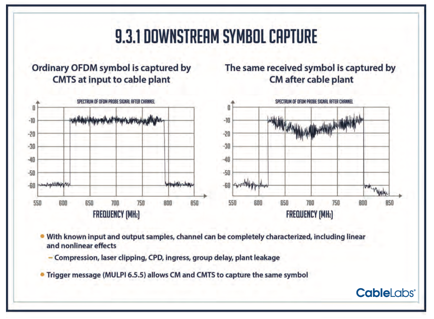
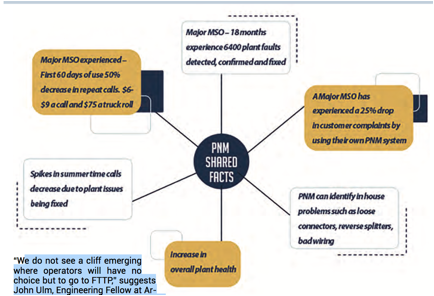
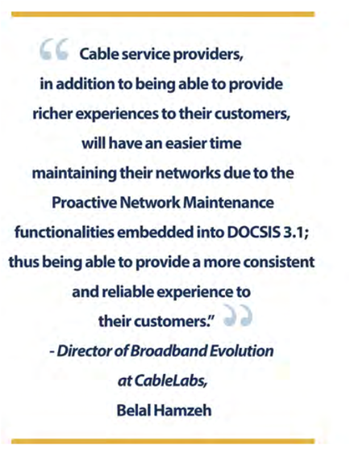

**Introduction **

This paper examines the Proactive Network Maintenance toolbox and it’s
functionali\- ty within the DOCSIS 3.1 standard. The approach with PNM in the
new speci cations is to include remote visibility into the operations of the
cable plant and its equipment. Making PNM a requirement in DOCSIS 3.1 ensures
manufacturer support of proactive troubleshooting and network maintenance.

**Laying the Groundwork **

As cable networks transform, and services such as data, video, telephone, home
monitoring and other services are

going through them, the demand for exceptional reliability increases. To
achieve such reliability the old break- x routine also has to transform.
Operators have to x problems before they have an impact on service.

With this in mind, the goal of Proactive Network Maintenance (PNM) is to take
all the information that can be gathered from devices already in the plant and
use that information to determine what’s happening and where in the plant the
fault can be found. The net results being improved reliability and a drastic
reduction in maintenance costs, significantly improving the provider’s
operational efficiencies.

DOCSIS devices are evolving, and elaborate monitoring tools such as full band
spectrum analysis, are built in. This allows us on the downstream side to have
the functionality of a spectrum analyzer implemented right in the software. We
can now see tilt, ripple, ingress, nulls, etc remotely. In the upstream we can
do triggered spectrum analysis that delivers a comparison of captured spectrum
with trans- mitted signals.

DOCSIS 3.1 turns every single cable modem into a network probe that can be
used to identify net- work impairments. By using the newly equipped devices as
network probes, cable operators can easily collect device and network data.
Analyzing this data alongside the plant topology and device locations, it is
now possible to isolate the type of problem and the approximate location of
that problem. The key benefit of the new DOCSIS requirements is the reduction
of time in finding and resolving problems thereby reducing operational costs.
With the capability to detect and resolve problems before they impact customer
service, churn is reduced. Additionally, improvements in network reliability
can lead to commercial services business and other advanced services thereby
generating new revenue.

**Powerful Technology, Powerful Changes **

PNM is now part of the DOCSIS standard and is a requirement in 3.1. This means
that all modems and CMTS equipment, in order to be certified as DOCSIS 3.1,
must include all of the PNM characteristics. This assures that all the devices
will support PNM technology correctly and will enable the actual benefits
accurately.

**CMTS CACHE **

In the upstream, CMTS equipment now must be capable of upstream capture. Part
of the requirement in the new specification is the CMTS has to be able to take
samples of the network. This gives the ability to actually see what is and is
not ingress across the entire upstream.

**FULL BAND CAPTURE **

On the downstream side new modems have spectrum analyzers inside and a picture
of the entire forward spectrum. In essence, the CPE becomes a remotely
controlled spectrum analyzer. Modems are also required to support the powerful
technology of FBC. The Full Band Capture ability in the CMTS will detect
faults such as reflections, resonant peaking, 4G LTE Ingress, Roll-off, RF
Notches, FM Radio Ingress and others.

**NEW OFDM CARRIER**

Also on the downstream side there’s a new data carrying symbol. This means the
CMTS will have the ability to send a known symbol and have the cable modem
capture that same symbol and send it back to the CMTS. By examining the
differences in a symbol sent by the CMTS and what the cable modem sends back
we can determine what’s going on in the plant as it’s passing through. The
ability to collect this intelligence is accomplished by examining the unique
attributes of the components.

Each type of modem has individual characteristics with specific signatures
unique to each different modem. Types of impairments also have individual
characteristics that can be identified. After extensive analysis of these
signatures, CableLabs realized that there are common problems that particular
types of cable modems have to deal with.

** **********

By correlating this data from groups of cable modems, we can see if cable
modems in a group are exhibiting common impairment characteristics, such as
micro-reflections or group delay. The clustering of the CM signature responses
can be sorted out into different categories to see the various faults that are
occurring.

If the cable modems in a group exhibit common problems, such as micro-
reflection or group delay, the estimated distance to the impedance mismatch
causing the micro-reflection can be determined by using powerful algorithms.
By measuring this distance between the taps and then correlating with known
equipment out in the plant, pinpointing the almost exact location of the
impairment is possible, thus dramatically reducing the typical troubleshooting
repair time.

**GRANULARITY **

Better granularity enables the ability to create correlated groups. DOCSIS 3.0
is a time based tap platform but the change in 3.1 is the taps will be
frequency based. Basically each carrier will be its own tap which means there
will be a much wider band in which to isolate problems. The wider the band the
easier to see more symbols being compared. This makes the entire process of
analysis and deduction of impairments much more accurate.

**The Exceptions **

The new DOCSIS 3.1 cable modem chipsets are so superior at taking advantage of
this monitoring capability, it‘s giving

MSOs even greater incentive to move 3.1 modems into the field as quickly as
possible. However, it should be noted that some of the functions remain
available without a 3.1 modem. With a 3.1 CMTS, all of the pure CMTS features
such as seeing ingress will still happen.

Without the 3.1 modems though the new capture functions of the OFDM, the
synchronized downstream captures and other valuable functionality will not be
available.

**Remaining Challenges **

The remaining challenges in the near term include the development of
installation and maintenance tools, and

training for cable engineers and technical staff. Unlike with DOCSIS 3.0,
DOCSIS 3.1 means that new cable modems will no longer operate at a fixed
modulation. Some cable modems in a service group could be using 1024 QAM,
while others could be running on 4096 QAM. New tools must be able to identify
which modulation pro les work best where and understand how to manage the
modulation diversity.

Vendors designing new DOCSIS 3.1 test and measurement tools will need to
develop all new algorithms to test entire channels while automatically
identifying subcarriers that have MER, BER or ingress issues. But existing
techniques are being modified to provide technicians with simple, intuitive
test procedures that don’t require a steep learning curve.

**Future Applications **

Cable’s flexibility gives it a vast amount of tools at its disposal without
needing to invest in costly FTTH solutions any time soon. It might even be
questioned whether cable will have to go all fiber at all. Even though FTTH is
widely regarded as future-proof, thanks to DOCSIS 3.1 technology, cable will
offer average customer broadband speeds of 10 Gbps in downstream and 1 Gbps in
the upstream.

Capacity modeling, based on continued aggressive video and data growth
scenarios, has shown that there is plenty of life left in HFC, and certainly
more than ten years.

“We do not see a cliff emerging where operators will have no choice but to go
to FTTP,” suggests John Ulm, Engineering Fellow at Arris. In fact, he points
out that FTTP is a complimentary aspect of a company’s HFC portfolio.

“I think that cable will always have a choice. Cable operators will be
competitive with the telcos for a long time and always have that advantage
that they have a choice as opposed to being forced to go one way or another,”
agrees John Chapman, engineering fellow and CTO of Cisco System’s Cable Access
Business Unit.

**Conclusion **

Cable is once again opening up its toolkit in order to fulfil requirements of
future services and increasing demand for

more capacity. The real key to getting the most out of PNM is to have a good
understanding of what’s in the toolkit, how it reduces capital and operational
expenses and how it significantly improves the subscriber experience. With
this knowledge a roadmap for implementation can be created and cable operators
will stay ahead of the telco FTTH deployments for (at least) the next decade.

