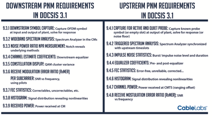
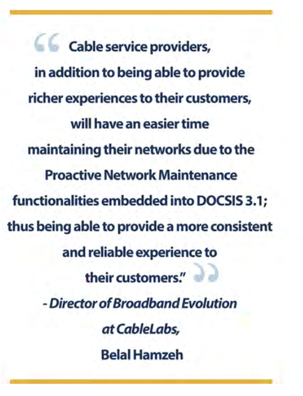

**介绍**

本文将考察“主动网络维护”工具箱及其在DOCSIS 3.1标准中的功能。 PNM在新规范中的方法是将远程可见性包括在电缆厂及其设备的运行中。
使PNM成为DOCSIS 3.1中的一个要求，确保制造商支持主动故障排除和网络维护。

**铺设基础**

随着电缆网络的转型，诸如数据，视频，电话，家庭监控等服务的服务

通过他们，对特殊可靠性的需求增加。 为了实现这种可靠性，旧的破解程序也必须改造。 运营商在服务产生影响之前必须先行x问题。

考虑到这一点，主动网络维护（PNM）的目标是从工厂中已经有的设备获取所有可以收集到的信息，并使用该信息来确定发生了什么的情况以及工厂内哪些位置可以找到故障。
净结果是提高了可靠性，大大降低了维护成本，大大提高了供应商的运营效率。

DOCSIS设备正在不断发展，并且内置了精细的监控工具，例如全频谱分析，这使得我们在下游方面能够在软件中实现频谱分析仪的功能。
我们现在可以远程查看倾斜，波纹，入口，空值等。 在上游，我们可以进行触发频谱分析，将捕获的频谱与发射信号进行比较。

DOCSIS 3.1将每个单一的电缆调制解调器转换成可用于识别网络损伤的网络探针。
通过使用新配备的设备作为网络探测器，电缆运营商可以轻松收集设备和网络数据。 分析这些数据以及工厂拓扑和设备位置，现在可以隔离问题的类型和问题的大致位置。
新DOCSIS要求的主要优点在于减少查找和解决问题的时间，从而降低运营成本。 能够在影响客户服务之前检测和解决问题，从而减少流失。
此外，网络可靠性的提高可以导致商业服务业务和其他高级服务，从而产生新的收入。

**强大的技术，强大的变化**

PNM现在是DOCSIS标准的一部分，是3.1中的要求。 这意味着为了被认证为DOCSIS 3.1，所有调制解调器和CMTS设备都必须包含所有的PNM特性。
这确保所有的设备都能正确地支持PNM技术，并能够准确地实现实际的优势。

**CMTS CACHE**

在上游，CMTS设备现在必须能够进行上游捕获。 新规范的部分要求是CMTS必须能够采集网络样本。 这样能够实际看到整个上游的内容是什么，而不是入口。

**全带拍**

在下游方面，新的调制解调器内部有频谱分析仪和整个正向频谱的图像。 实质上，CPE成为遥控频谱分析仪。 调制解调器也需要支持FBC的强大技术。
CMTS中的全频段捕获能力将检测诸如反射，共振峰值，4G LTE入口，滚降，RF陷波，FM无线电入口等故障。

**新的****OFDM****载波**

在下游还有一个新的数据携带符号。 这意味着CMTS将具有发送已知符号的能力，并使有线调制解调器捕获相同的符号并将其发送回CMTS。
通过检查CMTS发送的符号和电缆调制解调器发回的符号的差异，我们可以确定工厂正在经历的情况。 通过检查组件的独特属性来实现收集这种智能的能力。

每种类型的调制解调器具有独特的特征，每个不同调制解调器都具有特定的特征。 损伤类型也有可以识别的个体特征。
在对这些签名进行了广泛的分析之后，CableLabs意识到有些类型的电缆调制解调器需要处理的常见问题。

******  ******

通过将这些数据与电缆调制解调器组相关联，我们可以看到一组中的电缆调制解调器是否具有常见的损伤特性，如微反射或群延迟。
CM签名响应的聚类可以分类为不同的类别，以查看正在发生的各种故障。

如果组中的电缆调制解调器出现常见的问题，例如微反射或群延迟，则可以通过使用强大的算法来确定导致微反射的阻抗失配的估计距离。
通过测量水龙头之间的距离，然后与工厂中的已知设备相关联，精确确定损伤几乎精确的位置是可能的，从而大大降低了典型的故障排除维修时间。

**粒度**

更好的粒度能够创建相关组。 DOCSIS 3.0是一个基于时间的Tap平台，但是3.1中的更改 是以抽头为基础的。
基本上每个载体将是自己的水龙头，这意味着将有更广泛的区隔来隔离问题。 频带越宽越容易看到更多的符号被比较。 这使得整个分析和减少损伤的过程更加准确。

**例外**

新的DOCSIS 3.1电缆调制解调器芯片组在利用这种监控功能方面非常优越，它是给予的

MSO更大的动力是尽可能快地将3.1调制解调器移入现场。 然而，应该注意的是，一些功能在没有3.1调制解调器的情况下仍然可用。 使用3.1
CMTS，所有纯CMTS功能，如看到入口，仍然会发生。

没有3.1调制解调器虽然新的捕获功能的OFDM，同步的下游捕获和其他有价值的功能将不可用。

**剩下的挑战**

近期的其他挑战包括开发安装和维护工具，以及

电缆工程师和技术人员的培训。 与DOCSIS 3.0不同，DOCSIS 3.1意味着新的电缆调制解调器将不再在固定调制下工作。
服务组中的某些电缆调制解调器可能使用1024 QAM，而其他电缆调制解调器可能正在运行4096 QAM。
新工具必须能够识别哪种调制方案在哪里最好地理解并理解如何管理调制多样性。

设计新的DOCSIS 3.1测试和测量工具的供应商将需要开发所有新的算法来测试整个通道，同时自动识别具有MER，BER或入口问题的子载波。
但是，现有技术正在被修改，以便技术人员提供简单直观的测试程序，这些测试程序不需要陡峭的学习曲线。

**未来应用**

Cable的灵活性为其提供了大量工具，无需投资昂贵的FTTH解决方案。 甚至有疑问，电缆是否必须全部去纤维。
尽管FTTH被广泛认为是面向未来的，由于DOCSIS 3.1技术，电缆将提供下行10Gbps的平均客户宽带速度和上游的1Gbps。

能力建模基于持续进取的视频和数据增长情景，已经显示，氢氟碳化合物的使用寿命已经很长，十多年了。

Arris工程研究员约翰·乌尔姆（John Ulm）表示：“我们看不到一个悬崖，运营商别无选择，只能去FTTP。
事实上，他指出，FTTP是公司HFC组合的一个免费方面。

“我认为电缆总是有选择。 有线电视运营商将长时间与电信运营商竞争，并始终拥有这样的优势：他们有选择，而不是被迫以某种方式“，思科系统有线接入业务部门的工程师
兼首席技术官约翰·查普曼（John Chapman） 。

**结论**

电缆再次开放其工具包，以满足未来服务的需求和不断增长的需求

更多的容量。 充分利用PNM的真正关键是了解工具包中的内容，降低资本和运营成本以及如何显着改善用户体验。
有了这个知识，可以创建实施路线图，有线运营商将保持领先于电信FTTH部署（至少）在未来十年。

