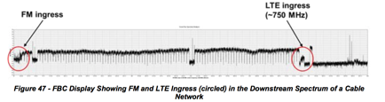
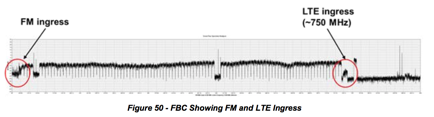
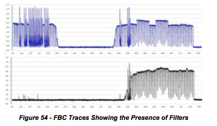
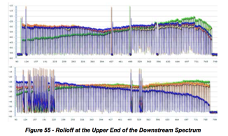
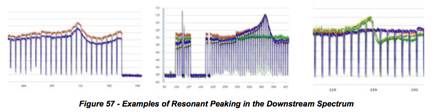
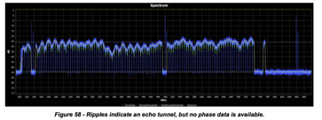
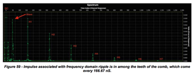

# 7 PNM USING FULL BAND CAPTURE 

## 7.1 Technical Description of Process 

This section focuses on downstream FBC.

Spectrum analyzers are specialized instruments that provide a graphical
display of amplitude versus frequency. Figure 46 shows a typical spectrum
analyzer display.

Spectrum analyzers have been used by cable operators for decades for routine
maintenance and troubleshooting. However, spectrum analyzers are expensive
instruments, so they have not typically been widely available to field
personnel. Technicians could only imagine having a spectrum analyzer in every
home.

FBC is a relatively new concept that takes advantage of low-cost discrete
Fourier transform (DFT) and fast Fourier transform (FFT) technology to support
spectrum analyzer-like functionality in customer premises equipment such as
cable modems.

Integrated spectrum analyzer-like functionality is supported by the latest
Broadcom and MaxLinear CPE silicon. The CPE’s spectrum data can be accessed
remotely using simple network management protocol (SNMP) or similar, allowing
a cable operator to see where ingress or other impairments might be
problematic. Figure 47 shows an example of FBC, in which FM and LTE ingress
are visible.

### 7.1.1 What Does FBC Do For Operators? 

FBC can be used to remotely troubleshoot a variety of headend, outside plant,
and subscriber drop problems. Since the spectrum analyzer-like functionality
is integrated in the cable modem or other device, it’s much like having a
spectrum analyzer in every home that has FBC-equipped CPE. Figure 48 shows
examples of impairments that can be identified using FBC.

Problems can be identified by evaluating the RF spectrum without rolling a
truck. If a sufficient number of FBC-equipped devices are available in
subscribers’ homes, it may be possible to determine the approximate location
of the source of a given impairment. A technician can be dispatched directly
to the suspected problem area, simplifying troubleshooting and saving time.

### 7.1.2 How FBC Works 

As mentioned previously, a spectrum analyzer is a device which measures the
frequency content of an input signal. Fortunately, this is precisely what DFT
does. Multiplying by the DFT matrix measures the correlation of the input
signal with each row in the DFT matrix, and each row is a sine/cosine of a
particular frequency. Thus, each output bin represents the power of the input
signal at that frequency.

Figure 49 shows a block diagram of a digital spectrum analyzer which may
reside in a cable modem or CMTS. The input signal enters at the left of the
diagram; this signal is the full upstream or downstream band of the cable
plant. An analog front end amplifies the signal and provides RF gain control.
A high- speed analog-to-digital converter (ADC), typically 2.5 giga-samples
per second (Gsps) or higher, provides digital samples of the signal. A digital
tuner, consisting of a digital oscillator and lowpass filter, selects the
desired analysis band around a specified center frequency. The signal from the
selected band is applied to the FFT, which multiplies the signal by the DFT
matrix. Each bin of the FFT output comprises a complex value consisting of two
numbers, real (I) and imaginary (Q), giving the correlation of the input
signal with the particular frequency corresponding to a single row of the DFT
matrix. Typically a spectrum analyzer is only concerned with the magnitude,
not the phase, of the FFT output. So, the power (magnitude-squared) of each
bin is computed, that is, I2 \+ Q2 for each bin. If spectrum smoothing is to
be applied, the previously-described process is repeated with a fresh set of
data from the same band, and the power values from several captures are
averaged at each bin location. The smoothed bins are converted to decibels by
taking 10*log10 of each bin power value. These decibel values, one for each
frequency bin, are displayed as the spectrum of the input signal.

Note that if the entire band is able to be processed as a single analysis
band, the tuner shown in Figure 49 is not necessary. However, if the band is
being analyzed in segments, then the tuner is used to step through a sequence
of analysis segments of the band, and the individual spectrum segments are
spliced together to produce the overall wideband spectrum.

## 7.2 Field examples and screen shots 

This section includes several examples of FBC screen shots as “seen” at the
cable modem. The horizontal axis in each figure is frequency in MHz, and the
vertical axis is in dB. Images are courtesy of Comcast.

### 7.2.1 Ingress 

Technicians can look at a captured spectrum display for indications of the
presence of downstream ingress (and in some cases, direct pickup). If a
sufficient number of FBC capable devices are available, it may be possible to
roughly isolate the area of plant where the ingress is entering the network.
Figure 50 shows an example of visible ingress in the FM band (left edge of
figure) as well as in the LTE band (near the right end of the figure).

### 7.2.2 Multiple problems 

Figure 51 shows a FBC from one modem, in which multiple downstream impairments
can be seen

The most serious problem is the suckout (notch) visible between 697 MHz and
731 MHz. The suckout, which is about 18 dB deep, affects a half dozen QAM
channels. Another problem evident in the display is called adjacency, where a
group of eight channels in the roughly 600 MHz to 650 MHz range are several dB
higher than other channels in that part of the spectrum, likely caused by
incorrect narrowcast injection levels. A third problem is a QAM channel near
563 MHz that is a few dB lower than the adjacent channels. A fourth problem
also is level-related, in the vicinity of 250 MHz.

### 7.2.3 Displaying Multiple Modems 

It is possible to simultaneously display an overlay of spectrum data from
multiple cable modems - say, modems in the same neighborhood. Figure 52
illustrates this.

Standing waves, also known as amplitude ripple, are caused by impedance
mismatches in the RF signal path. Standing waves are usually easy to see in a
FBC display. Figure 53 shows several examples of standing waves. Of particular
interest is the combination of two standing waves in the lower right screen
shot.

### 7.2.4 Presence of filters 

Figure 54 includes two examples where filters are present in subscriber drops.
The upper trace in the figure shows the effects of a bandstop filter (an
adjacency problem is visible at two locations in the

### 7.2.5 Rolloff 

Rolloff is a non-flat loss of signal level-versus-frequency at or near the
lower or upper end of the RF spectrum. When rolloff occurs at the upper end of
the downstream spectrum, the cause can be active device misalignment, active
or passive device damage, presence of older cable or equipment in the network
designed for a lower upper frequency limit than the network’s existing
operating frequency range, and so on. Figure 55 shows examples of rolloff at
the upper end of the downstream spectrum.

### 7.2.6 Tilt 

Figure 55 - Rolloff at the Upper End of the Downstream Spectrum 

Tilt describes the condition where signal levels vary from low to high in a
more or less linear manner as frequency increases (positive tilt), or from
high to low in a linear manner as frequency increases (negative tilt).
Depending on the location in the plant, tilt may be desirable - for example,
at the output of an amplifier. Ideally the frequency response at the input to
CPE should be flat, but in some cases the response may be tilted excessively
for a variety of reasons. Figure 56 shows examples of negative and positive
tilt.

### 7.2.7 Resonant Peaking 

Resonant peaking affects a relatively narrow frequency range, typically no
more than a handful of channels. The peaking can exist anywhere in the
spectrum, and typically occurs in an active or passive device. Vibration and
temperature changes may affect the nature of the peak: The response peak can
be intermittent, change in level and/or shape, and move around in frequency.
Examples of causes include defective components, cold solder joints, loose
modules (or module covers), loose or missing screws, and so forth. Figure 57
highlights examples of resonant peaking.

### 7.2.8 Making It Work 

#### 7.2.8.1 How to Capture Data from Devices Equipped with FBC Functionality 

7.2.8.1.1 Design Considerations 

Capturing spectrum information requires SNMP read/write access to the cable
modems, which generally are on RFC 1918 address space. This means that direct
access from a workstation is unlikely. In general, implementations will
consist of a server (or servers) that has access to the non-routable IP
addresses used by the modems, and has an external IP address or a static
network address translation (NAT) that allows external clients access to it so
that the server can make the SNMP requests on behalf of the clients. The
clients could be web based, mobile, or desktop software. An operator likely
will already have one or more OSS servers that fits these requirements, but
the existing servers may or may not have sufficient capacity for the
additional load. Additionally, the implementation of FBC will be done for a
somewhat different operational group - and in many cases a different
department -- than the primary OSS users, since field technicians are going to
be much more likely to use this data than some of the other normal OSS tools.
A good exercise is taking a look at how field technicians currently use their
hand held meters, as well as thinking about other uses for a remote spectrum
display that aren't practical today.

There are several considerations that development teams need to understand
before getting started. Security is a large issue for this kind of system,
because it is necessary to perform SNMP SET operations to enable the capture,
and have access to parts of the network that aren't normally reachable. Some
sort of server side authentication system should be used to ensure that only
authorized users can access and use the server. In some cases the FBC requests
will be coming from devices over untrusted networks, such as field technicians
using tablets or smart phones. This could be resolved by requiring virtual
private network (VPN) connections before allowing usage, or with strong
authentication coupled with transport layer security (TLS) or other
encryption. Locking and session management are also needed, because having
multiple users trying to perform a capture on the same device can cause issues
for that device. Other multiple user issues could occur if the device changes
frequency or some other variable in response to one user while another is
trying to interpret results for a different setting. An important
consideration is how to deal with the data. In general, a maximum granularity
capture across the widest window will generate a 10-20 kbps stream of data. By
itself this isn't a large data stream, but it does mean that it's not
practical for most organizations to collect this data for all modems and then
store the information in a database for analysis the way that is typically
done for OSS functions. If a user is only going to work on a real time display
then this consideration isn't particularly problematic, but if the data is for
proactive analytics then it's a large challenge.

## 7.3 Method to Find a Time Response from an IFFT when Phase Data is Not Available 

The FBC is used by cable modems and set-top boxes to provide magnitude-only
spectral data about RF path conditions in a remote location, such as a home.
In some cases, the downstream channels being monitored are digital channels,
such as 64- or 256-QAM. In other cases the signals are analog signals or noise
and ingress.

This method applies to blocks of QAM signals to identify the existence of an
echo tunnel that causes ripple in the frequency response. See `

### 7.3.1 Method: 

26.         Pick a block of averaged (smoothed) contiguous digital signals, as many as possible. For example, each 7.5 MHz block of frequency domain data may have 256 spectral components, and multiple blocks are pasted together to make a wide spectral response. 


27.         Extract samples from the lower band edge of the lowest QAM signal to the upper band edge of the highest QAM signal, and convert the values into linear values. Use these values as I (in-phase) components. 


28.         Use zeroes for all Q (quadrature) values. 


29.         If necessary zero-pad the values to fill out a 2^n IFFT transform, such as 16,384 or 4096. 


30.         Optionally, a window should be applied to the data. 


31.         A frequency region with another signal, such as an analog RF carrier, or vacant band can be filled 
in with a straight line connecting the channel just above the vacant band to the channel just below 
the vacant band. 


32.         Perform an IFFT to put the data into the time domain. 


33.         Transformed data will be symmetrical due to not providing quadrature values. You can discard the 
image. 


34.         A DC term will be present. Comb teeth will be present every 166.67 ns due to the notch between 6 
MHz channels. 


35.         If there is an echo in the frequency response, there will be a ripple in the frequency domain. The 
ripple will linearly transform to an impulse located among the comb teeth. If the echo is an exact multiple of 166.67 ns, it cannot as easily be observed. The delay between the main impulse and echo is the round trip time of an echo tunnel, corrected for velocity of prorogation velocity of cable. Since you know the shape of the teeth on the comb, they can be removed by subtraction. 


This method is valuable because the wide bandwidth of the multiple QAM signals
makes for exceedingly accurate time resolution, so the cable operator makes a
hole to repair a buried cable, not a trench.

Another anticipated method to remove effect of the notches between carriers is
to interpolate over the notches. Yet another method to reduce the effect of
the notches is to equalize the magnitude response, but equalization cannot go
all the way to zero due to negligible energy in the notch.

This method could also work with analog spectrum analyzers, for example, using
GPIB or other interface technology supported by the analyzer to extract the
magnitude data.

Note that it should not work to detect group delay problems, since there is no
phase information available.

The code to do this is in the CableLabs Spectrum Impairment Detector (SID)
which is in the PNM repository.

