**5 PNM USING UPSTREAM EQUALIZATION **

**5.1 Reactive versus Proactive Network Maintenance **

In this document, the definition of reactive network maintenance is a
stringent one and, in the era of multimedia, business and advanced services,
is perhaps one that the cable industry should follow. Reactive network
maintenance consists of network maintenance practices that are initiated by
metrics which show service performance has been impacted. Under this
definition, it is not assumed the need of customer feedback/calls for network
maintenance to be reactive. As long as conditions such as FEC statistics,
power starvation, CPD, narrowband interferers, laser clipping, impulse noise
and other service impacting symptoms are detected, the response to such is
reactive. In the case of distortion that is completely corrected by pre-
equalization there is no performance impact, therefore maintenance actions
that arise from these impairment discoveries are considered to be proactive.
If there are symptoms that combine performance impacting conditions with
distortion detected through equalization, the maintenance that arises from it
is still considered reactive.

Impairments that result in network maintenance classified as reactive would
likely be given higher priority for resolution because they are already
impacting performance.

In most scenarios, upstream pre-equalization mechanisms can completely
compensate for certain problems in the network and no symptoms are detected in
FEC statistics or through other metrics. The fact that equalization can fully
compensate for network linear distortion can buy the operator time in
resolving the issue before there is service impact, thus enabling a proactive
network maintenance strategy.

**5.2 Linear Impairments **

In the upstream portion of the CATV network there are different types of
impairments. These can be classified based on the impact these impairments
have on the signal as linear as well as nonlinear impairments. In the case of
a “linear” impairment, the impact on the signal will be given by a change in
amplitude and phase of the original signal. In the case of a “nonlinear
impairment“, the signal generates distortion components, including harmonics
of the original signal or multiplies the original signal with other energy
present in the return band. For example, in the linear distortion case,
transmitting information across the upstream channel will result in an
amplitude and phase deviation for a given frequency point. A micro-reflection,
which is analogous to a wireless multipath signal, could result from the
bouncing back and forth of a signal between two interfaces that have impedance
mismatches, generating an amplitude and phase distortion of the signal as
summation of a time-delayed signal copy- the reflection or echo-combined with
the desired signal. A second example of a linear distortion occurs at the
diplex filter rolloff that marks the upper edge of the upstream frequency
spectrum around 42 MHz. At this rolloff frequency, the amplitude and the phase
suffer considerable distortion. In particular, the phase distortion is
noticeable prior to reaching the band-edge. This phase distortion is more
easily shown when expressed as group delay which is defined as:

_GroupDelay _= − _d_φ _d_ω

whereφ is the phase in radians, ω is the frequency in radians per second, and
group delay is in seconds. Group delay is ideally constant across the band of
interest. Group delay variation across the band is known

as group delay distortion. Additional discussion about linear impairments can
be found in the tutorial material in Appendix I.

One thing to keep in mind is that even impairments that are considered
“nonlinear” such as common path distortion (CPD) may have associated linear
distortion elements. For instance, the corrosion of a center conductor that
generates a mixer effect also results in an impedance mismatch that can
generate a noticeable micro-reflection.

Examples of impairments that are nonlinear include the previously mentioned
CPD, as well as composite second order (CSO) and composite triple beat (CTB)
distortions, cross-modulation, and laser clipping. Ingress and impulse noise
are considered additive impairments, although if an impairment such as impulse
noise is high enough to cause laser clipping, it can be considered nonlinear
in nature too.

**5.2.1 Micro-reflection Types **

The following sections describe multiple scenarios in which micro-reflections
may be generated within the HFC network. Micro-reflection Example 1 describes
a case where there are HFC components whose low return loss (R) values are
contributing to the micro-reflection source. Micro-reflection Example 2
describes a case where an HFC component whose isolation performance and an
impedance mismatch are contributing to the micro-reflection source. Lastly,
micro-reflection Example 3 describes a case where the micro-reflection
impairments represent a combination of the two previous cases. Micro-
reflection sources are not limited to the examples presented here. For more
information about micro-reflections, refer to the tutorial section of this
document.

**_5.2.1.1 Micro-reflection Example 1 _**

This type of commonly experienced micro-reflection is exhibited when the
upstream signal encounters impedance mismatches somewhere in its upstream path
to the CMTS, causing redirection of a fraction of the signal’s energy back
towards the CM. Once the redirected signal becomes incident on another
impedance mismatch, it is then directed back toward the CMTS. Figure 1
illustrates an upstream signal, labeled Upstream Signal #2, on the cable
originating between two reflection points, Γ1, and Γ2. However, the upstream
signal may originate anywhere downstream from the first reflection point, Γ1,
illustrated in Figure 1 as Upstream Signal #1. The majority of the upstream
signal passes through the impedance mismatch and continues toward the CMTS and
is labeled Main Signal in the figure. A fraction of the upstream signal is
reflected back towards the signal source at Γ1. This reflected signal
encounters a second reflection point, Γ2 which reflects a fraction of the
reflected signal energy back into the direction of the original signal,
represented as Reflected Signal in Figure 1.

This general case describes the signal passing through two reflectors, neither
of which is the CM itself. One technique to determine whether the CM is one of
the reflectors is to add a 3 dB inline attenuator at the CM port (upstream
output). If the micro-reflection magnitude is lessened by 6 dB or more,
because of the reflected signal passing through the attenuator twice, then the
CM is indeed one of the reflectors. If there is no significant change in
micro-reflection magnitude, then the pair of reflectors lies remote to the CM
location. This technique of adding attenuation would work equally well to
isolate reflections elsewhere in the network, but it is much more difficult to
install attenuation between line passives.

The reflected signal from Γ2 proceeds upstream and again encounters the
reflection point Γ1. This causes yet another reflection back downstream, and
the process repeats endlessly. (It is analogous to looking at one’s reflection
in a mirror, when there is another mirror behind. There will be an endless
sequence of images, each one progressively smaller.) Each passage between Γ1
and Γ2 is called a transit. The main micro-reflection echo results from the
triple transit, up/down/up. The next echo is from the 5th-order transit
up/down/up/down/up, and so on. This type of response, which goes on forever,
is called infinite impulse response (IIR). It consists of a geometric series
of echoes, separated by equal delays (equal to twice the propagation delay
between the points Γ1 and Γ2), with each echo value smaller than the last (by
the same ratio Γ1 Γ2 or, dB difference 10 log Γ1 \+ 10 log Γ2). The decaying
micro-reflections may quickly be lost in the noise floor after two or three
trips through the micro-reflection source.

Conversely, the adaptive equalizer response, which is approximately the
inverse of the channel response, will have only a single tap after the main
tap for this case.

Though the reflector examples in Figure 1 are feeder taps, it should be noted
that many devices can produce similar results, including damaged cables or
corroded splices, which are often causes of micro- reflections as well.

Note that the delay between echoes equals twice the propagation delay between
the two reflection points Γ1 and Γ2, so the distance between the two
reflectors is known. However it does not relate how far along the plant these
two reflectors are, that is, the location of the impairment in the plant. To
determine the location of the fault, additional information is necessary as
described in Section 6.6, Fault Localization.

**_5.2.1.2Micro-reflection Example 2 _**

The second type of micro-reflection may occur anywhere in the network, but its
magnitude is most noticeable in CMs located off the highest value feeder taps.
Figure 2 describes the upstream signal flow from a CM sending its upstream
signal into the port of the 23 dB feeder tap. The intent of the plant design
is that the primary path of upstream signal flow is toward the left of the
page, toward the CMTS. Some signal energy may be reflected from the amplifier
to the left of the 23 dB feeder tap, but this energy is usually insignificant
because of good impedance matching of the amplifier.

The 23 dB feeder tap is a combination directional coupler and splitter meaning
it directs the upstream signal in the upstream direction. The directivity of
the feeder tap is not perfect. Some of the energy from the CM may be leaked
towards the output connector. This is a function of the isolation of the
feeder tap. Isolation is specified with all ports terminated, and cable
industry field practice has often not adhered to terminating unused feeder tap
ports. In addition, corrosion of the feeder tap can degrade its isolation
performance.

If a 23 dB feeder tap has a tap-port-to-output-port isolation of only 38 dB,
there would be two signal paths created, one with 23 dB attenuation, and one
additional signal going the other direction with only 38 dB attenuation. If
this additional signal meets a reflector downstream from the 23 feeder tap,
the additional signal will be reflected back in the direction of the upstream
signal and will be combined with the main signal at the 23 dB feeder tap where
it originated. This micro-reflection is easily observed in cases where there
is long un-tapped span of cable between the first feeder tap, the 23 dB feeder
tap in this case, and low-value feeder taps with open terminations. All of
these unterminated feeder tap ports create their own micro-reflections. This
condition usually creates multiple micro-reflections, and since there was an
open port at the 11 dB feeder tap and another at the 8 dB feeder tap, there
would be two different cable lengths resulting in two different micro-
reflection delay characteristics.

This case is important to mention since the reflector, Γ1, is not in the tree
of the devices between the CM and the CMTS, but includes devices that are
downstream from the CM feeder tap location. This phenomenon, as mentioned
earlier, is more noticeable at the high value feeder tap, because as the
feeder tap value decreases, the amplitude difference between the desired
signal and the micro-reflection increases. If both the 23 dB feeder tap and
the 11 dB feeder tap had 35 dB tap-port-to-output-port isolation, there would
be 12 dB greater separation between desired and the micro-reflection signal.
Additionally, the 23 dB feeder tap location is near the amplifier followed by
a long length of cable, where the 11 dB feeder tap is found near the end of
the cable so the cable length for the 11 dB feeder tap is shorter and the
micro-reflection delay characteristic is correspondingly less.

This type of micro-reflection does not exhibit an unending IIR response, since
the reflected energy from Tap 8 passes through Tap 23 relatively unimpeded and
continues upstream. This type of response, which stops after a single echo, is
called finite impulse response (FIR). The signature will show a single main
echo without trailing echoes.

Conversely, the adaptive equalizer response, which is approximately the
inverse of the channel response, will have a sequence of smaller and smaller
taps for this case. This is because the equalizer internally generates
additional echoes as it cancels the original echo in the signal. As it
generates an echo, it must use another tap to cancel the new echo. This
process goes on until the end of the equalizer tapped delay line is reached.
Any remaining echo energy is uncompensated after this point, and results in
reduced RxMER.

To summarize, a multiple-transit echo scenario (Example 1) has an unending
sequence of decaying echoes in the channel response, and the corresponding
adaptive equalizer response has a single echo. A single- reflection scenario
(Example 2) has a single echo in its channel response, and the corresponding
adaptive equalizer response has a decaying sequence of echoes continuing to
the end of the equalizer tapped delay line.

**_5.2.1.3 Micro-reflection Example 3 _**

Figure 3 represents a case that is a superposition of the previous cases
described in Micro-reflection Example 1 and Micro-reflection Example 2. A
reflective point exists if the amplifier has poor return loss. A fraction of
the desired signal is reflected off the output of the amplifier, Γ1, and
propagates downstream to the open connection at the end-of-line or an open
feeder tap port, Γ2, where it reverses direction back towards the amplifier
and rejoins the original signal at the feeder tap location.

If the amplifier and feeder tap are co-located or are very close together,
there will little difference in micro-reflection delay characteristic between
the previously described Micro-reflection Example 1 and Micro-reflection
Example 2. In fact, they may add or cancel each other out.

However, if the amplifier is a pole span or more away from the feeder tap,
there may be two different distinct micro-reflections created for the single
unterminated feeder tap. These micro-reflections are usually low in magnitude;
30 dB or more lower than the incident signal, but they can be numerous in a
single amplifier-to-termination span.

It is conceivable that multiple micro-reflections may emanate from successive
multiple passes through HFC components comprising the micro-reflection source.
Cases in which only a single micro-reflection exists may be limited to
laboratory simulation of the micro-reflection impairment and may not be
practically encountered within the HFC network.

The cable industry has favored “capping” unused feeder tap ports rather than
terminating the ports. Some operators will defend that position because it is
claimed to reduce potential ingress sources. Indeed it is a tradeoff between
craft integrity and good impedance matching practices, which causes more
stress on the upstream adaptive equalizer.

**_5.2.1.4 Micro-Reflection Example 4 _**

Figure 4 shows a single reflection that travels from the large “X” in the
figure toward the source (the tap or some other device beyond the left edge of
the figure), which is assumed to have high return loss, resulting in a very
low amplitude re-reflection toward the original point of reflection. The
interaction of the incident and reflected energy produces standing waves
(amplitude ripple). However, the net effect is that the CM sees a flat
frequency response on the downstream and the CMTS sees a flat upstream
frequency response. Unfortunately, some energy is lost so receive signal
levels will be low. (Note: lost RF energy sometimes indicates signal leakage.)
As anticipated, this type of impairment is difficult to detect. One method of
detecting this problem is via a standing wave measurement in the field, which
requires probing the line with a high impedance probe, such as a Trilithic®
I-Stop, as illustrated in Figure 4. Note that if a system has an echo tunnel
caused by two plant defects, repairing one of the defects will cause the echo
tunnel to disappear, but the other defect remains. See Appendix VIII for a
discussion of this type of detection.

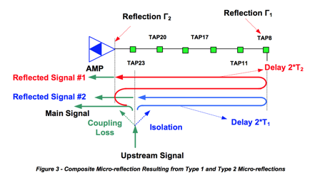

**5.3 Pre-equalization Mechanism Enabled through DOCSIS Ranging **

The upstream pre-equalization mechanism relies on the interactions of the
DOCSIS ranging process in order to determine and adjust the CM pre-
equalization coefficients. The intent is for the CM to use its

coefficients to predistort the upstream signal such that the predistortion
equals the approximate inverse of the upstream path distortion, so that as the
predistorted upstream signal travels through the network it is corrected and
arrives free of distortion at the upstream receiver at the CMTS.

The pre-equalization coefficients of the CM are the complex coefficients (F1
through F24) of the 24-tap linear transversal filter structure shown in Figure
5.

In this structure the blocks with z-1 label represents delay elements, each of
which in the DOCSIS 2.0 pre- equalizer is the symbol period T (in DOCSIS 1.1
it can also represent delays equal to T/2 and T/4).

In the ranging process the CM sends a ranging request message (RNG-REQ) to the
CMTS. The CMTS may use a known portion of this message, such as the preamble,
as well as other known messages to determine the quality of the received
signal, as well as to determine the adjustment the CM should make to its pre-
equalization coefficients to better compensate the upstream distortion. In
response to the RNG- REQ message, the CMTS sends a ranging response (RNG-RSP)
message with a set of 24 coefficients and a parameter that indicates whether
these coefficients are intended to result in a set or adjust operation by the
CM. In the case of a set command, the CM will replace its existing
coefficients with the ones sent by the CMTS. In the case of an adjust command,
the CM convolves its coefficients with the ones sent by the CMTS to achieve
the adjusted coefficients (Figure 6).

The CMTS may not be completely satisfied with the quality of the signal the CM
is sending after the initial try. This is an iterative process which may take
a few interactions before the coefficients are stable.

CMTS implementations use for the most part the transmit-equalization-adjust
option to convey information. Only after the initial ranging request, one may
see a CMTS send a transmit-equalization-set message to make sure that the CM
initializes properly. In principle the CMTS could use this message when it
needs to reset the coefficients.

A CMTS that is completely satisfied with the values of the pre-equalization
coefficients sends an adjust message where all coefficients are zero except
for the pre-equalizer’s main tap coefficients, which has maximum or nominal
value. This represents a Kronecker delta or impulse function, and any data set
convolved with an impulse results in the original data set, which in this case
is the CM pre-equalization coefficients, unchanged.

**5.3.1 Pre-equalization Enabling Messages **

As described previously, the two messages that are key in the ranging process
are the range response (RNG-RSP) and range request (RNG-REQ) messages. The
RNG-RSP message, which is generated by the CMTS in response to a RNG-REQ
message, carries timing, frequency, power level, and equalization adjustment
information as well as equalization set or load information and ranging
status. This information is encoded following what is known as type-length-
value (TLV) format. DOCSIS 1.1 pre- equalization coefficients are identified
by type 04 and DOCSIS 2.0 or 3.0 by type 09. The RNG-RSP messages that the
RNG-REQ messages correspond to are linked by the service ID or SID. SIDs
identify upstream service flows. It may be that a CM has several SIDs. In that
case a CM will get ranging information through each of the SIDs it has. For
example, if a CM has a SID that is used for telephony service and one that is
used for data service, there will be two parallel ranging processes within a
single CM. In addition to the SID, the RNG-RSP message payload also carries
the upstream channel ID. Figure 7 shows the structure of the RNG-RSP message.

The RNG-REQ message is generated by the CM and sent to the CMTS. The RNG-REQ
is used as the reference to determine whether the CM signal needs any
adjustment. These adjustments could be in frequency, power level, timing
offset, and distortion. Once the CMTS receives the RNG-REQ message it uses a
known portion of this message as the reference of what the signal should look
like. Typically that known portion of the message is the preamble. If the CM
is not finished implementing the changes the CMTS is asking for, the CM
includes in the RNG-REQ message a ranging status indicating whether or not the
ranging changes are still pending. This is the “pending till complete” field
in the RNG-REQ message payload. The RNG-REQ message also carries a downstream
channel ID that associates the upstream being used with a downstream channel.
Figure 8 shows the structure of the RNG-REQ message.

**5.3.2 CM and CMTS Equalization Information **

The pre-equalization coefficients are loaded into the adaptive pre-equalizer
in the CM, which is used to compensate for upstream linear distortion(s).
Hence the CM pre-equalization data indirectly describes the distortion in the
plant for which it compensates. The pre-equalizer response is approximately
the inverse or opposite response of the plant. The pre-equalization
coefficients provide detailed characteristics of the channel distortion,
although the coefficients do not directly indicate the level of micro-
reflections. Assuming negligible group delay distortion and a single micro-
reflection, a quick estimate of micro- reflection level can sometimes be
obtained using the energy in the adaptive equalizer’s non-main taps. In
general, an elaborate analysis is required to uniquely resolve micro-
reflection level/delay signature characteristics. An upstream channel that
exhibits no distortion has all the energy concentrated in the adaptive
equalizer main tap while one that exhibits distortion also has energy in taps
other than the main tap (Figure 9).

The pre-equalization data which the CMTS continues to send to the CM indicates
how successful a CM has been in compensating for the distortion by showing
what is left to compensate to achieve ideal reception. Ideally and typically,
the CM starts with no compensation and after a few ranging intervals, achieves
a steady state where the CM compensates for all the distortion. At that point
the CMTS pre-equalization data exhibits a flat response indicating that
further compensation is not required (Figure 10).

The upstream CM equalization data collected by the CMTS is analyzed to verify
that any plant distortion has been compensated. There is the possibility of a
distortion being so severe (e.g., a micro-reflection having a very long delay)
that the pre-equalization process would not be able to fully compensate for
it. These scenarios are rare in current HFC architectures, but if this does
occur, one must be aware that an impairment identification process using only
CM pre-equalization data will not yield accurate results.

**5.4 Upstream Pre-equalization in DOCSIS 1.0, DOCSIS 1.1 and DOCSIS 2.0 **

Upstream pre-equalization in DOCSIS 1.0 was left as optional and the
equalization process between CMTS and CM was not defined in sufficient detail.
An unexpected result occurred when DOCSIS 1.1 and 2.0 were introduced with a
well-defined process. A few 1.0 CMs that implemented pre-equalization
exhibited erratic behavior in the presence of downstream RNG-RSP messages that
were generated by 1.1 or 2.0 CMTSs. For quite some time operators have not
been motivated to turn pre-equalization on, in part because the demand for
capacity and spectrum availability have not been significant enough to warrant
the use of wider channels, higher order modulations, or frequencies near the
edges of the upstream spectrum where linear distortion occurs.

Some 1.0 CMs exhibiting the problem have been successfully upgraded with
firmware that corrects this issue. Unfortunately it has not been possible to
correct this issue on all affected CMs. To support reliable use of upstream
pre-equalization, operators have been replacing 1.0 CMs having known issues.

**5.4.1 DOCSIS 1.1 Pre-equalization Considerations **

The percentage of DOCSIS 1.1 CMs deployed is still significant enough not to
take advantage of the pre- equalization compensation. Nevertheless, based on
the percentage of 1.1 CM population and the rate at which 1.1 CM versions are
decreasing with time, it is important to determine at what point the
procedures described in this documentation will be worthwhile to implement.

**5.5 Limitations on Pre-equalization Compensation **

In a scenario of an upstream path that exhibits a micro-reflection, the
maximum delay compensation that can be achieved using pre-equalization is
limited by the amount of delay that can be generated within the pre-
equalization filter structure shown in Figure 5. The maximum delay that can be
generated is given by the delay between the adaptive equalizer’s main tap and
the last adaptive equalizer tap.

In DOCSIS 2.0 and 3.0, the delay or spacing between each adaptive equalizer
tap location is equal to the symbol period, because it always has a parameter
of adaptive equalizer taps/symbol equal to 1. Typical implementations in
DOCSIS 2.0 and 3.0 have the main equalizer tap in the eighth position out of a
24-tap delay line. Therefore the maximum delay that can be generated in that
filter structure is 16T (last tap position - main tap position) where T equals
the symbol period.

In DOCSIS 1.1 the delay between different adaptive equalizer tap locations can
be a fraction of a symbol period. That is, the number of equalizer taps/symbol
parameter is allowed to be 1, 2 or 4, resulting respectively in delay
differences between adaptive equalizer tap locations of T, T/2 and T/4. This
option has not been implemented in a CMTS. Therefore, in DOCSIS 1.1 CMTS
scenarios, the maximum delay that can be generated is equal to 4T (last tap
position - main tap position). Table 1 shows the maximum delays that are
generated in DOCSIS 1.1 and 2.0 or 3.0 filter structures at different symbol
rates using the typical equalizer main tap configurations (position 4 for
DOCSIS 1.1 and position 8 for DOCSIS 2.0 and 3.0).

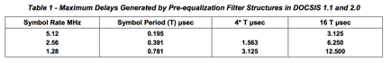

It cannot be assumed that a DOCSIS 2.0 filter structure can fully compensate
for a micro-reflection with a delay of 3.125 microseconds. Typically energy in
the neighboring equalizer taps help in the fine tuning of that compensation
and a micro-reflection that pushes the delay to the limit of the equalizer
won’t have longer delay equalizer taps available to help in the representation
of the exact value. This is especially true if the echo delay is not a
multiple of the symbol period, since the equalizer taps are then not spaced at
the exact intervals to efficiently cancel the echo, and more equalizer taps
are needed to provide effective cancellation. This will impact more severely
higher order modulation scenarios such as 64-QAM where the adjustment is more
critical.

In addition, in the case of strong micro-reflections, the equalizer may have a
decaying sequence of taps as described in Example 2. For proper cancellation
of the echo, taps at 2 or 3 times the echo delay may be needed. This implies
that the echo must be 2 or 3 times shorter than the equalizer length.

Here are some examples of a few micro-reflection scenarios in potential HFC
plant configurations. The first scenario is a micro-reflection that occurs
between an amplifier and a feeder tap that are separated by 75 feet (150 feet
round trip distance) and that have a return loss of 6 dB on each reflection
interface (interface where impedance mismatch occurred). The feeder cable
between these interfaces has a diameter of 0.625” and an attenuation of 1.2
dB/300 feet. This is considered a strong and short micro- reflection. Figure
11 shows the level and delay of the third transit and its subsequent multiple
transit echoes.

The second scenario is a micro-reflection that occurs between two amplifiers
and there are no feeder taps in between. They are separated by 1200 feet (2400
feet round trip distance) and that have a return loss of 8 dB on each
reflection interface (interface where impedance mismatch occurred). The feeder
cable between these interfaces has a diameter of 1.000” and an attenuation of
0.8 dB/300 feet. This is considered a strong and long-delay micro-reflection.
Figure 11 shows the level and delay of the third transit echo (top large blue
square). The fifth transit echo of this micro-reflection is too low in
amplitude to be noticeable.

The third scenario is a micro-reflection that occurs between two amplifiers
and with feeder taps in between. The amplifiers are separated by 1200 feet
(2400 feet round trip distance) and each has a return loss of 8 dB on each
reflection interface (interface where impedance mismatch occurred). The
aggregate insertion loss (also called through loss) in the feeder taps is
equal to 6 dB (12 dB round trip). The feeder cable between the interfaces has
a diameter of 1.000” and an attenuation of 0.8 dB/300 feet. This is considered
a mild and long-delay micro-reflection. Figure 11 shows the level and delay of
the third transit echo. The fifth transit echo of this micro-reflection is too
low in amplitude to be noticeable.

Figure 11 also indicates which scenarios can be compensated in the different
DOCSIS configurations. The scenarios that lie to the left of the vertical line
that corresponds to a given channel width /DOCSIS mode combination can be
compensated, while the ones that lie to the right of the line cannot be
properly compensated. It is also worth noting that in cases close to the
vertical line, higher order modulation may not be possible.

**_Figure 11 - Pre-equalization Compensation Capabilities under Short and Long Delay Micro-reflection Scenarios _**

The examples just discussed assumed 0.625” cable for the short time delay
reflection and 1” cable for the long time delay reflection. The short time
delay reflection scenario includes data points at 150’, 300’, and 600’ round
trip distances and the long time delay reflection includes data points at
2400’, 2700’, and 3000’.

**5.6 DOCSIS Pre-equalization MIBs **

DOCSIS pre-equalization coefficients indicate different things depending
whether the CMTS or the CM is being queried. The information that is available
through MIBs relate to what the CMTS and CM keep track of at the time the
respective devices are being queried. Through the ranging interaction
discussed in Section 5.3.1, the CMTS MIB (docsIfCmtsCmStatusEqualizationData)
provides the adjustment necessary to update the CM coefficients and achieve
upstream path distortion compensation. The CM MIB
(docsIfCmStatusEqualizationData) indicates the current predistortion that is
applied to the upstream signals.

The MIB format is as follows:

**5.6.1 DOCSIS 2.0 and 3.0 Pre-equalization MIBs **

Pre-equalization data is relevant in CM-CMTS channel combinations. In DOCSIS
2.0 the CM supports a single upstream channel, meaning the CM and CMTS reports
a single pre-equalization data value. In DOCSIS 3.0 the pre-equalization data
is measured for each of the upstream channels of the CM. To accommodate DOCSIS
3.0, the RFI management requirements were changed and DOCSIS 2.0 and 3.0 have
separate MIBs for pre-equalization measurements. An additional per channel
pre-equalization data measurement is also available and briefly discussed in
this section to avoid confusion on usage of the appropriate information.

**_5.6.1.1 Per CM Pre-equalization _**

Table 2 presents semantically identical management objects for CM and CMTS for
both DOCSIS 2.0 and 3.0.

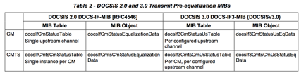

**_5.6.1.2 Per Interface Equalization _**

For the original RFI MIB requirements there is a per interface pre-
equalization data element that is common for DOCSIS 2.0 and 3.0, the
docsIfSigQEqualizationData from the docsIfSignalQualityTable.

For the CM, this data provides equalization information of the downstream
receiver at the CM. In the downstream direction, the CM does not rely on the
CMTS to generate equalization coefficients, but it is solely responsible for
this blind equalization process. Variability in downstream equalization
coefficients, over time, can be used to detect ingress and interference in the
downstream spectrum. The downstream equalization structure is not specified.
The implementer has the flexibility to differentiate in the type of equalizer
structure and design used. Traditional feed-forward structures or decision
feedback structures are implementation examples, although decision feedback
structures have likely been used. The current MIBs may not properly described
the state of the downstream equalizers implemented. A number of downstream
equalization MIB implementations are not reliable. In order to effectively
leverage information from the downstream equalizers, it is important to
introduce a specification update through the EC process.

For the CMTS this object was intended to report some type of aggregated
equalization value for the entire upstream channel. RFI MIB [RFC4546]
clarifies the CMTS does not need to report a value other than an empty string.

Note that this equalization data is not relevant to the scope of this
document.

**6 METHODOLOGY FOR PNM USING UPSTREAM EQUALIZATION **

**6.1 General Approach and Processes **

The proactive network maintenance methodology that is based on pre-
equalization coefficients can be described in terms of a few key general
components.

The first general component is the data collection process. It comprises
polling all CMs and CMTSs to obtain pre-equalization data from all configured
upstream channels. The gathered data is verified for format integrity and is
normalized to be useful for comparison. For scalability purposes, the data
collection process is conducted using a more frequent polling cycle for the
CMs that exhibited apparent distortion above a pre-determined level and a less
frequent cycle for all CMs.

The second general process incorporates the initial distortion assessment that
is conducted on all CMs that are monitored more frequently. This process uses
the non-main tap to total energy (NMTER) ratio to discriminate which CMs
should be examined in more detail and which should be left for evaluation in
the next coarse monitoring cycle.

The third component in this approach conducts the detail analysis that
includes the calibration process and the determination of the distortion
signatures from frequency domain and time domain analysis. These signatures
include group delay and micro-reflections. In case of multiple different
micro-reflections, the signatures are obtained after a discrimination process.

The fourth component takes the distortion signatures and evaluates whether
from a static perspective they should be classified as red which implies the
need for immediate action, or as yellow which indicates the CM should be
monitored more frequently and its distortion data be stored for observation
over time. The information describing which CMs have to be examined more
frequently is communicated to the data collection process. Green
classification indicates that no action is necessary.

The fifth process takes the CM signatures and identifies within a fiber node’s
service area which micro- reflections are common to several CMs. The next
process identifies by comparing historical data collected in the yellow
classified CMs whether intermittent issues or trending issues are of concern
and may require action.

The last process is the one that correlates the affected CM or CMs with the
outside plant topology and uses that information to determine fault location.
Figure 13 shows a diagram of the process just described.

**6.2 Format Verification, Normalization and Guidelines **

The structure of the pre-equalization information has been described in
Section 5.6. How the values within this structure are interpreted depends on
implementation. The first four byte-long elements in the header are to be
interpreted in HEX mode. For example, the number of adaptive equalizer taps
value of 18 in HEX is 24 in decimal (Figure 14). The rest of the equalizer
structure defined in two byte increments containing the real and imaginary
coefficients should be interpreted according to 2’s complement over the entire
two bytes or 4 nibbles describing the real or the imaginary coefficients. For
example, the 2’s complement of a 2 byte such as the fourth real coefficient is
FFFC which in 2’s complement is -4 (red circle).

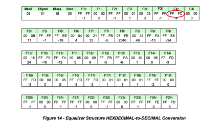

The representation of coefficients often differs among CM vendors. There are
variations in maximum amplitude as well as variations in the way the
coefficients are interpreted. Table 3 highlights the different interpretations
that exist for the most popular CMs deployed.

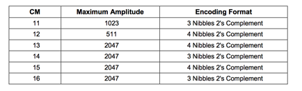

The CM vendors had two interpretations of how to decode the coefficients. One
is the four nibble 2’s complement interpretation and the other is the three
nibble 2’s complement interpretation. The four nibble 2’s complement
interpretation is the one assumed by the spec but there is a significant
number of CMs deployed with the three nibble 2’s complement interpretation.
Regarding maximum amplitude, CMs have maximum amplitude equal to 2047, 1023 or
511. If the coefficients are normalized, the difference in CMs’ maximum
coefficient amplitude turns into a difference in granularity. The difference
then becomes one of decoding interpretation of coefficients.

**6.2.1 Four Nibble 2’s Complement Pre-equalization Coefficient Representation **

In this real or imaginary coefficient representation the entire four nibbles
(two bytes) are used. This means that if the first bit is 0 the rest of the
bits represent a positive integer binary number. If the first bit is 1, it is
a negative 2’s complement number. The actual value can be calculated by
inverting the bits and adding 1, resulting in the negative of the number. Both
positive and negative examples have been included below.

a) 000D = 0000 0000 0000 1101 = 13

b) FFFE = 1111 1111 1111 1110after inverting it and adding 1 → 0000 0000 0000
0001 + 1 = 0000 0000 0000 0010 = 2 → The number is - 2

**6.2.2 Three Nibble 2’s Complement Pre-equalization Coefficient Representation **

In this real or imaginary coefficient representation the last three nibbles
out of the two coefficient bytes are used for the calculation. In this
interpretation the first nibble is 0 which could erroneously led one to
believe that all coefficients are positive. Only after eliminating the first
nibble one can tell if a number is positive or negative. This means that if
the fifth bit is 0 the rest of the bits represent a positive integer binary
number. If the fifth bit is 1, it is a negative 2’s complement number. The
actual value can be calculated by inverting the bits of the three nibbles and
adding 1. This is the negative of the number in question. Both positive and
negative examples have been included below.

a) 000D = 0000 0000 0000 1101 → eliminate the first nibble → 0000 0000 1101 =
13

b) 0FFE = 0000 1111 1111 1110 → eliminate the first nibble → 1111 1111 1110
afterinvertingitandadding1→ 000000000001+1=000000000010 =2→Thenumberis-2

**6.2.3 Universal Decoding **

Since in current implementations the maximum value that a coefficient can take
is always less than or equal 2047, the first nibble is never used and can be
removed to generate a universal decoder. After removing the first nibble, the
decoding process would be identical to the third nibble process.

**6.3 Key Metrics **

The real and imaginary complex coefficients of a DOCSIS 2.0 upstream pre-
equalizer defined as: F1R, F1I, F2R, F2I, F3R, F3I, F4R, F4I,. . . F23R, F23I,
F24R, F24I,
and will be used to define several key metrics that follow.

**6.3.1 Adaptive Equalizer Main Tap Energy **

The adaptive equalizer main tap in DOCSIS 2.0 is typically in tap position
eight although some CMTS implementations can have it in as low as the sixth
position. In DOCSIS 1.1 the main tap is in the fourth position. The equalizer
tap energy is given by the sum of the squares of the real and imaginary
components of the coefficient.

The main tap energy (MTE), assuming it in eighth position, is defined as:

**6.3.2 Main Tap Nominal Energy and Main Tap Nominal Amplitude **

The DOCSIS pre-equalization taps exhibit different nominal or maximum
amplitudes depending on CM implementations. The maximum of amplitude
implementations from CMs are 2047, 1023 or 511. This parameter is defined here
as the main tap nominal amplitude (MTNA). The square of the nominal amplitude
yields the nominal tap energy.

The main tap nominal energy (MTNE), assuming main tap is in the eighth
position, is defined as:

**6.3.3 Pre-Main Tap Energy**

The summation of the energy in all equalizer taps prior to the main tap
provides the pre-main tap energy

(PreMTE).
The pre-main tap energy assuming a main tap in the eighth position
is defined as:

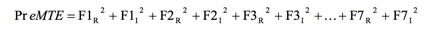

**6.3.4 Post-Main Tap Energy **

The summation of the energy in all equalizer taps after the main tap provides
the post-main tap energy (PostMTE).

The post-main tap energy assuming a main tap in the eighth position is defined
as:

**6.3.5 Total Tap Energy **

The summation of the energy in all equalizer taps provides the total tap
energy (TTE). The total tap energy is defined as:

**6.3.6 Main Tap Compression **

Adaptive equalizer main tap compression (MTC) at the CM is a good indicator of
the available margin for the continued reliance on the equalization
compensation process. An MTC ratio greater than 2 dB may suggest that
equalization compensation can no longer be successfully achieved. This metric
is given by the ratio of the energy in all taps to the main tap energy.

The main tap compression expressed in dB is defined as:

Main tap compression at the CM translates to a less RF power level delivered
to the CMTS. An MTC of 2 dB results in the CMTS receiving 2 dB less input
power.

Main tap compression at the CMTS is not expected under normal operating
conditions. Any level of main tap compression at the CMTS should raise an
alarm.

**6.3.7 Main Tap Ratio **

Adaptive equalizer main tap ratio (MTR), the ratio of energy in the main tap
to the energy in all other taps combined, is useful distortion metric to
determine the distortion level in the upstream path. MTR is approximately the
same as non-main tap to total energy ratio (NMTER, see Section 6.3.8), except
at extremely high distortion levels. In most cases MTR can be used instead of
NMTER.

**6.3.8 Non-Main Tap to Total Energy Ratio (Distortion Metric) **

The adaptive equalizer’s non-main tap to total energy ratio is another useful
“distortion metric” to determine the distortion level in the upstream path.
This parameter can be used as an initial assessment tool to determine which
CMs need to be examined further and more frequently. This distortion metric is
given as the ratio of the aggregate energy that exists in all but the main tap
to the energy in all of the adaptive equalizer’s taps.

The non-main tap to total energy ratio expressed in dB is defined as:

Notice that the main tap energy in the numerator is missing. The non-main tap
energy ratio is also a good estimation of the MER assuming that the signal is
not impacted by impairments that are not considered linear distortions, such
as burst noise and nonlinear impairments.

Non-main tap to total energy ratio at the CMTS is a good indicator of the type
of upstream performance the CM signals have based on the amount of linear
distortion present. If a 27 dB CNR is assumed for negligible errors with a
64-QAM signal, a NMTER target value of -27 dB can be assumed for comparable
performance. If a 30 dB CNR is the threshold where correctable errors are
beginning to appear, that would also correspond to a threshold of -30 dB NMTER
when correctable errors begin to appear. This CNR to NMTER relationships are
useful in determining thresholds from the NMTER values. An operator could
assume an immediate action (red) NMTER threshold of -27 dB for 64-QAM
operation and a monitor more frequently (yellow) NMTER threshold of -30 dB.

**6.3.9 Pre-Main Tap to Total Energy Ratio **

The adaptive equalizer’s pre-main tap to total energy ratio (PreMTTER) is a
useful parameter, along with the adaptive equalizer’s pre-post tap symmetry,
to determine the group delay level in the upstream path. This distortion
metric is the ratio of the pre-main tap energy to the energy in all taps.

The pre-main tap to total energy ratio expressed in dB is defined as:

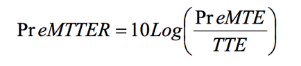

**6.3.10 Post-Main Tap to Total Energy Ratio **

The adaptive equalizer’s post-main tap to total energy ratio (PostMTTER) is a
useful parameter to assess micro-reflection impairment contribution. This
distortion metric is the ratio of the post-main tap energy to the energy in
all taps.

The post-main tap to total energy ratio expressed in dB is defined as:

**6.3.11 Pre-Post Energy Symmetry Ratio **

The pre-post energy symmetry ratio (PPESR), along with pre-main tap to total
energy ratio, is a useful parameter to indicate the presence of group delay in
the upstream path. This distortion metric is the ratio of the post to pre-main
tap energy ratios.

The pre-post energy symmetry ratio expressed in dB is defined as:

For practical purposes, the pre-post energy symmetry may be approximated using
only the two taps adjacent to the main tap, giving the pre-post tap symmetry
ratio (PPTSR):

**6.3.12 Group Delay Distortion **

Group delay distortion is a type of linear distortion that is also corrected
by the pre-equalization process. Figure 15 shows group delay increase with
frequency for increasing number of cascaded actives. This configuration does
not include the impact of chokes in the lower portion of the spectrum
(typically 5-10 MHz) and it does not assume additional in-line equalizers.

As observed in Figure 15, there is a variation in group delay of up to 300 ns
in a channel that is located at the band-edge. The pre-tap equalization
coefficient energy increases in the presence of group delay distortion.
Additional group delay details are discussed in the tutorial section (Appendix
I).

**_6.3.12.1 Group Delay Distortion at Band-Edge with No Micro-reflection _**

Table 4, Figure 16, and Table 5 relate to the scenario where the DOCSIS
channel is at the band-edge and there is no micro-reflection present. Table 4
shows the impact of group delay distortion on tap energy when the upstream
channel is at the band-edge and no micro-reflection is present.

Figure 16 shows how when operating at the band-edge, the pre-main tap energy
increases proportionally with increasing cascade depth. This is characteristic
of the group delay distortion impact on tap energy. The effect of group delay
distortion could be hidden just by looking at cascade depth in a plant
topology map. In-line equalizers which may not be obvious in a plant topology
diagram may contribute to distortion just as diplexers within amplifiers do.
In severe distortion cases, assessment of pre-main tap energy could be used to
determine whether certain CMs should be moved to lower distortion channels in
the middle of the upstream band.

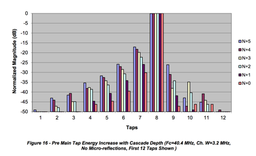

Key metrics worth highlighting in Table 5 are the PreMTTER that increases with
cascade depth while the PostMTTER shows low values as no micro-reflections are
present. The PPESR show high positive values since in this scenario the
dominant impairment is group delay distortion. The low values of MTC are
indicative that the pre-equalization compensation is effective.

**_6.3.12.2 Group Delay Distortion at Band-Edge with 0.5 μs Micro-reflection _**

Table 6, Figure 17, and Table 7 relate to the scenario where the DOCSIS
channel is at the band-edge but there is also a 0.5 μs micro-reflection
present. Table 6 shows the impact of group delay distortion on tap energy.

Figure 17 shows how when operating at the band-edge, the pre-main tap energy
increases with increasing cascade depth but not as noticeably as the scenario
without micro-reflections depicted in Figure 16. This is due to some pre-main
tap energy needed to compensate for the micro-reflection which adds to the
pre- main tap energy that is caused by group delay distortion. This leaking of
energy into the pre-main tap region is more prevalent with shorter micro-
reflections that use the taps closer to the main tap for compensation than the
longer micro-reflections that use the higher value taps.

Key metrics worth highlighting from Table 7
are the PreMTTER that increases with cascade depth. The PostMTTER shows a high
value indicative of the micro-reflection present. The PPESR show negative
values since in this scenario the dominant impairment is micro-reflection. The
combined group delay distortion and micro-reflection by themselves is properly
compensated through the pre-equalization process, although some increase in
MTC begins to show.

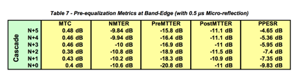

**_6.3.12.3 Distortion in Middle of Upstream Band with Micro-reflection _**

Table 8, Figure 18, and Table 9 relate to the scenario where the DOCSIS
channel is operating in the middle of the upstream band with a 0.5 μs micro-
reflection present. Table 8 shows the impact of distortion on tap energy.

Figure 18 shows how when operating in the middle of the band, there is no
increase in pre-main tap energy with increasing cascade depth as the group
delay is fairly flat. (See also Figure 15.) Figure 18 shows how post-main tap
energy is used in compensating for the micro-reflection. Figure 18 also
illustrates how a small amount of pre-main tap energy is used in compensating
for the fractional delay 0.5 μs micro- reflection. When the micro-reflection
delay doesn’t coincide with a tap delay, neighboring taps are used for
compensation. This explains why in Figure 17 the increase of pre-main tap
energy with increasing cascade depth is not as noticeable as in the “group
delay only” case depicted in Figure 16. The combined effect of group delay
distortion and a 0.5 μs micro-reflection of Figure 17 can be approximated to a
rough superposition of Figure 16 representing the “group delay only” case and
Figure 18 representing the “micro-reflection only” case.

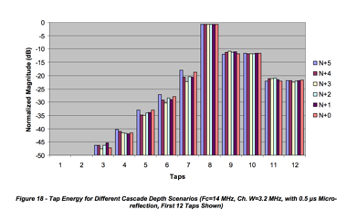

Some key metrics from Table 9 are worth highlighting. The low PreMTTER value
is indicative of negligible group delay distortion. The PostMTTER high value
is indicative of the strong micro-reflection present. The PPESR show negative
values since in this scenario the dominant impairment is the micro-reflection.
The MTC value is higher than the previous two scenarios which indicates that
the pre-equalizer may be beginning to lose its equalization compensation
effectiveness.

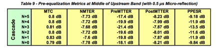

**6.4 DOCSIS Pre-equalization Coefficient Data Collection **

DOCSIS pre-equalization coefficient information is obtained by using simple
network management protocol (SNMP). The SNMP management information base (MIB)
describes information which is available in a standard manner across all
implementations that comply with the DOCSIS MIB definitions.

At a minimum, there are three data elements required to complete the
mathematical transformations described in this document. The three values are
the DOCSIS equalization coefficients, upstream center channel frequency, and
the RF bandwidth of the channel. The three data points are obtained from the
cable modem and the CMTS. Having the cable modem coefficients provides a view
of the inverted channel

response prior to equalization. The CMTS offers a post-equalization view of
the inverted channel response as it is received from the cable modem. This can
be helpful when evaluating the performance of the modems’ upstream pre-
equalizers. It can also help identify issues where the impairment is changing
frequently.

In addition to the three required data elements, there are other metrics which
can be used to help identify and localize areas of impairment. These other
elements may already be available as a result of pre-existing monitoring
systems. One should extend or reuse existing data as opposed to over-polling
the modems or CMTS.

**6.4.1 SNMP Implementation and Performance Considerations **

Large SNMP implementations can represent unique challenges when scale is
considered. First, assuming DOCSIS 2.0 pre-equalization coefficients and their
storage as characters, the minimum over-the-wire network impact is 614 bytes
per modem/CMTS pair. This is calculated using the PDU sizes of the minimum
required data elements. In this case, both the modem and CMTS coefficients are
299 bytes while the frequency and RF bandwidth together are 16. Assuming
binary representation the storage requirements are 100 bytes each (4 bytes
header + 96 bytes real and imaginary coefficients data) for CMTS and CM and 4
bytes each for upstream frequency and channel width totaling a minimum of 208
bytes.

Example:

**docsIfCmStatusEqualizationData **(299 bytes character storage, 100 bytes binary storage) 

08 01 18 00 00 04 ff fd ff fb ff fa ff fd ff fd 00 07 00 04 ff f8 00 00 00 17
ff ff ff d6 ff e8 07 f7 ff f9 ff 8a ff 94 ff f7 00 28 00 11 ff ec ff f7 00 19
00 06 ff f5 ff fc ff ff 00 0d ff fb 00 01 00 01 00 04 00 04 ff f6 00 07 00 07
ff fb 00 00 00 08 ff ff ff fe 00 00 00 04 ff fc ff ff 00 08 00 00

**docsIfCmtsCmStatusEqualizationData **(299 bytes character storage, 100 bytes binary storage) 

08 01 18 00 FF C8 FF F0 FF F8 FF E8 FF C0 00 20 FF F8 00 38 FF C8 FF D8 00 18
00 18 00 38 FF F0 3F 20 00 00 00 08 00 40 FF D8 FF E8 00 38 FF D0 FF D8 FF B8
00 08 FF D8 00 40 00 40 FF E8 00 00 00 00 FF C0 00 48 00 20 00 20 00 58 00 10
FF F0 00 00 FF E8 FF F0 FF D8 00 50 00 00 FF D8 FF F0 00 18 FF E8

**UpstreamFrequency **(8 bytes character storage, 4 bytes binary storage) 29300000
**UpstreamWidth **(8 bytes character storage, 4 bytes binary storage) 6400000 

A payload of 614 bytes with a million devices translates to nearly 600
megabytes. At 5 million devices, a single poll represents almost 3 gigabytes.
This traffic would be distributed between both the CMTS and the cable modems.
Careful consideration should be made regarding the impact on routers,
firewalls, traffic monitors, the CMTS, and other network elements.

In large implementations, heavily threaded/distributed SNMP processing will be
required to accommodate the large number of requests. Assuming 250
milliseconds round trip query latency, 1 million devices would require 70
hours of CPU time if executed serially. Given that most of the CPU time is
spent in wait state, a horizontally scaled execution can be very effective.
Specifically, “horizontal scale” can be achieved by adding additional CPUs or
polling nodes. When this same load is distributed across 1000 threads of
process, that time is reduced to sub five minutes.

If the network topology is well known at the time of polling, a geographically
sensitive polling approach might be considered. Also, market specific
maintenance windows may be among the factors to consider in polling cycle
timing.

**6.4.2 Data Collection Strategy **

Initially, three polling rates are discussed to accommodate different levels
of analysis. First, a low-rate cycle should be used to acquire a daily
baseline of data used for coarse grained analysis. This coarse grained
analysis will provide several metrics calculated from the raw coefficient data
prior to Fourier transformation. Analysis of the coarse metric will narrow the
scope of devices which qualify for medium- rate polling. This secondary
polling cycle will be used to drive further equalization analysis which
includes a Fourier transformation to the frequency domain. The intent of the
medium-rate polling is to insulate the data processing layer from
unnecessarily processing modems that are currently operating within acceptable
thresholds. Finally, the high-rate poll cycle will be used to provide low
latency visibility to a small subset of devices. Given the expense associated
with polling, storage and analysis, this stage should be reserved for only the
most critical or otherwise material-interest devices.

**_6.4.2.1 Low Rate (once daily, rotating across eight-hour time-shifts, adjustable) _**

Modem based pre-equalization coefficient data should be collected once per
day. It’s possible that certain plant problems might be specific to the time
of day. These scenarios might include weather patterns, watering systems and
other time-based anomalies. Assuming an eight-hour window to complete polling
(including accommodation for maintenance), a three shift pattern should work
well. This could be achieved by a single daily poll with a time offset of 32
hours. Likewise, the modem population could be divided by three and the load
distributed throughout the day. In the latter approach, it would be important
to rotate the three modem populations to correctly achieve the desired result
(Table 10 and Table 11).

CMTS based equalization coefficient data should be collected as close in time
to the modems as possible. Understanding that the SNMP process for gathering
data from the CMTS will be decoupled from the modems is important. The most
efficient way to obtain this data from the CMTS would be a bulk walk (SNMP) of
the docsIfCmtsCmStatusEqualizationData table. This will return a large swath
of data, while the modem collection threads are completely independent and
non-synchronized with the CMTS process.

Using the main tap compression and non-main tap to total energy ratio formulas
(see Key Metrics, Section 6.3), modems of interest are identified and promoted
to the medium-rate polling cycle. These will remain under medium-rate scrutiny
until the correct threshold is met for some predetermined time. Initially, 48
hours is recommended.

**_6.4.2.2 Medium - Rate (every four hours, adjustable) _**

The secondary level of analysis will require greater resources to gather,
store, and analyze, so sizing should be done based on preliminary results of
the initial low-rate poll. This poll will handle the subset devices of
interest. Devices may be promoted/demoted across low, medium and high rate
polling as described in the analysis section of this document. Table 12 and
Table 13 show medium rate polling examples.

High - Rate (ten minute, adjustable)

Only devices of the highest interest will be candidates for high-rate polling.
This will most often be the result of manual intervention to facilitate real-
time troubleshooting or field analysis. In general, there will be limits
placed on high-rate entries which automatically expire in a designated period
of time

**6.5 Calibration Mechanisms ****6.5.1 CMTS-CM Short Reference Plant **

Improved accuracy may be achieved by subtracting the contributions of the CMTS
and cable modem(s) from the end-to-end channel response, leaving just the
channel response signature of the cable network. Determining the channel
response distortion contributions of these two components can be done using a
short reference plant-sometimes called a six foot plant-which isolates the
CMTS and cable modem(s) from the cable network. Adaptive pre-equalization
coefficients can then be used to characterize the response signature of the
combined devices, much the same as is done to characterize end-to-end pre-
equalization signatures in an operating cable network. Once the CMTS and modem
response signatures are known, they can be subtracted from operational field
measurement results. It is recommended that this characterization be performed
for each make/model CMTS and cable modem combination in use.

The short reference plant illustrated in Figure 19 has been measured with a
vector network analyzer, and verified to provide optimum performance using the
parts listed in Table 14. Choose a diplex filter that has a frequency split
well above the normal operating upper frequency limit of the return path. This
will reduce the group delay contribution of the diplex filter. For example, a
5-42 MHz DOCSIS return should use at least the 65/85 MHz split diplex filter
in the short reference plant.

Interconnecting cables should be as short as practicable, and where it is
possible to eliminate cables altogether, one should use appropriate male-male
or female-female F-type splices. In any case, avoid exceeding the maximum
cable lengths shown in Figure 19\.

**6.5.2 Pre-equalization Calibration Approach **

The pre-equalization process between CMTS and CM compensates not only for the
distortion that occurs in the plant, but also for any existing distortion that
exists in the upstream path following the transmit equalizer within the CM up
to the baseband receiver inside the CMTS. This includes filters, modulators,
and amplifiers in the CM, the home network, combining network at the hub or
headend as well as the front-end components in the CMTS (Figure 20).

If there was a-priori knowledge of the distortion contributed by the CM and
CMTS, it could be calibrated out in order to have a more accurate
representation of the distortion in the field.

Generating a database with all the possible CM and CMTS model pairs is
feasible given that there are a limited number of CM and CMTS implementations.
A known short plant setup consisting of a CMTS-CM pair and a few fully
characterized components enables determining almost exclusively the
contribution of the CM and CMTS internal distortion. Section 6.5.1 describes
an example of a known short plant where the internal characteristics of the
CMTS and CM can be measured. The CMTS-CM internal distortion is obtained by
gathering the pre-equalization coefficients of the CM after allowing a few
maintenance intervals to elapse to achieve convergence of the coefficients.

Assuming that the real and imaginary values of the 24 CM pre-equalization
coefficients for a particular CMTS-CM model pair measured on a short
calibrated plant are given by:

For every ith real and imaginary coefficient, the resulting complex number is
obtained,

Resulting in the following complex coefficients

Similarly, assuming that the real and imaginary values of the 24 CM pre-
equalization coefficients obtained in the field, matching the CMTS-CM model
pair being analyzed, are given by:

The resulting complex coefficients are

Given 24 complex coefficients and assuming that the equalizer’s main tap is
located at tap position number 8, a 32 element fast Fourier transform can be
used to translate from the time domain into the frequency domain. Tap 8 would
coincide with FFT input element 16 to preserve the relative position of the
response in frequency.

The mapping of coefficients to FFT input parameters follows:

The mapping for the coefficients obtained using the short plant measurement
results in the following:

After calculating the 32 point FFT the following frequency response values are
obtained:

For calibration, the magnitude of the field coefficients are divided by the
magnitude of the short plant coefficients and the phase of the short plant
coefficients are subtracted from the phase of the field coefficients.

From the calculated magnitude and phase values, the corrected F’out frequency
response values are obtained

Additional granularity in the frequency response representation can be
obtained by inserting zeroes to a larger size FFT such as a 64, 128 or 256
FFT.

An example of the calibration process is illustrated next.

Figure 21 shows the distortion of a CMTS/CM pair in a short calibrated plant
versus the same CMTS/CM pair measured in the field. The pre-equalization
coefficients obtained from the CM MIBs are shown in Table 15.

The first four bytes 08 01 18 00 provide the main tap position “08”, the
number of taps per symbol “01”, the number of taps “18” (hex number for 24)
and a reserved byte. The rest of the information are the real and imaginary
coefficient data (2 bytes each) for the 24 taps.

The distortion in the short plant scenario is predominantly impacted by the
CMTS receiver and CM transmitter. Therefore, to calibrate out the impact of
the CMTS and CM, the frequency response of the short plant (micro-reflection
off) is subtracted from the frequency response of the micro-reflection on
scenario. This calibrated response is shown in blue in Figure 22.

Averaging ΔF and ΔA values is no longer necessary since the calibrated
response is fairly even across the frequency range under observation.

**6.6 Fault Localization **

The process of fault detection and localization relies on monitoring the
network for general plant-wide or neighborhood-localized problems as well as
for specific end devices. In this process it is assumed that there is detailed
knowledge of the node service area’s topology. It is also assumed that
distortion data (pre-equalizer coefficients and other applicable information)
has been collected from the CMs and analyzed to determine the distortion
signatures of the affected CM(s). Next, a process is described by which,
through correlation of topology with distortion signatures, the location of
faults can be determined.

In the example highlighted in Figure 23 is a group of CMs, identified in red,
that exhibit the same unique distortion. The CMs in green are CMs that don’t
share that specific distortion.

It is assumed that to obtain the distortion signatures, an analysis and
classification process of the impairments has already taken place.

If only information from one CM were available, the problem area could only be
isolated to somewhere along the path between the CM and the fiber node (dashed
line). The more interesting process is when the relationships of CMs that
share specific impairments (as well as those that do not) to upstream paths
are examined.

In order to estimate the impairment location, the common path shared by the
end devices showing the specific impairment is found. This path containing the
impairment is further constrained by excluding the path that is shared with
the end devices that operate properly.

Knowledge of the micro-reflection signature also helps localize the problem.
For example, in Figure 23 a triple transit reflection signature with delay
matching the distance between known devices on the plant, such as distance
between taps, length of drops, or distance between amplifiers, can point to
the likely cause or narrow down the possible set of causes of the problem.

After analysis and path manipulation of the end devices showing impairments
such as micro-reflections, a potential location of the problem is determined.
These areas are shown in purple on Figure 23. This mechanism maps the devices
that have the same unique micro-reflection attribute and pinpoints the portion
of the network that exhibits the impairment.

**6.6.1 Fault Localization Examples **

This section details basic examples of fault location based on micro-
reflection signatures. Data from a 6.4 MHz DOCSIS channel on a single fiber
node was used. A few limitations of the data set are worth noting. First, the
node was selected not for the diversity of problem scenarios but for the
availability of the digital maps. Therefore, the micro-reflections found were
not significant, and in most cases the scenarios detected corresponded issues
either near a line termination or impedance mismatches inside or near-the
home. Second, there was a relative low number of CMs in the 6.4 MHz channel in
this node which lead to few scenarios for evaluations as well as few
“monitoring probes/CMs” for accurate determination of the impairment location.
High penetration of CMs narrows the potential problem area where the leading
edge of the micro-reflection can be located.

**6.6.2 Determining Micro-reflection Signatures **

A micro-reflection signature consists of a pair of characterizing elements,
the relative level of the reflected signal compared to the main signal and its
delay. The level provides an indication of the severity of the micro-
reflection (see Section 6.7.4 for Severity Analysis Strategy for Intermittent
Issues considerations). The delay represents the extra distance traversed by
the reflected signal or echo and is represented in microseconds (see Section
5.2.1 for definitions of micro-reflections types).

Figure 24 shows the frequency response of several CMs sampled from a fiber
node. For clarity, only a few CMs are included in the figure. However, in the
field, if encompassing an entire fiber node, the technician will have to pay
close attention to the chart to distinguish and extract the common micro-
reflections (labeled as A and B in Figure 24 and Figure 25) from all the
micro-reflections present. Nonetheless, the intention of this section is to
explore systematic mechanisms where human intervention can be minimized as a
first pass at extracting the most relevant cases for analysis and
troubleshooting. In summary, the micro-reflection signature which provides a
two-dimensional characterization from which the selection of common frequency
responses as noted in Figure 25 is feasible.

As seen in Figure 25, the amplitude ripple of the frequency response is
sufficient to determine group the CMs with same micro-reflection. Some
amplitude variability margin must be allowed. Note that in a few cases, the
same ripple magnitude range could correspond to different micro-reflections.
In such cases the estimation of echo delay can provide an unambiguous answer.
For typical fiber node sizes the probability of uniqueness of a micro-
reflection is very high. In rare exceptions, the micro-reflection signature
pair will not be sufficient to determine the CM clusters (e.g., a sub-T echo
delay). In such cases, only the topology resolution will provide final
resolution of such conditions. Figure 26 shows the way that common signatures
of CMs are correlated. The delay is an approximation of the estimated maximum
delay and it is expressed as 2T where T is the inverse of the symbol period.
That means the distance between the two reflectors is calculated based on half
the delay. Delay below the "no action required" threshold is not relevant.

**6.6.3 Determining Micro-reflection Boundaries Edges **

For the relevant micro-reflections cases A and B, the next steps consist of
performing the localization within the HFC plant topology.

By considering the upstream direction and other CMs in the path that do not
present the same signature, the trailing edges of the micro-reflection is
determined as discussed at the beginning of this section.

Figure 27shows micro-reflection case A. This micro-reflection can be
considered as a composite of type 1 and 2. CM1 and CM2 are close to the Tap
reflecting the signal and CM 3 has an additional transit for the echo relative
to the distance to the reflecting tap. Hence the echo from CM3 (2.8T) is
longer than CM1 and CM2.

Figure 28 shows the case of a single sub-T echo. The two signatures come from
the same household, H1, and note the neighbor CMs: CM4, 5, 6, and 7 do not
register the same micro-reflection signature as the CMs in observation.

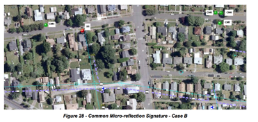

Note that limited data could lead to non-optimal location of the micro-
reflection. For example, fewer CMs reporting pre-equalization data or few
customers in the fiber node branch will reduce the possibility to accurately
estimating the location of the micro-reflection.

**6.6.4 Parabolic Interpolation **

In most cases the actual time delay of an echo does not land directly on the
delay of a tap in the pre- equalizer. Rather, the echo may occur at a delay
that lies somewhere between two taps. The purpose of the parabolic
interpolation algorithm is to improve the resolution of time delay estimation
to a fraction of a pre-equalizer tap.

Figure 29 below shows an example test case. Pre-equalizer taps 9, 10, and 11
have magnitudes 35 dB, 40 dB and 29 dB, respectively. We are not concerned
about other taps since the algorithm uses only a 3-point interpolator, so the
surrounding taps are plotted as zeros.

The algorithm inputs are the 3 taps around the (local) peak: (x0,y0), (x1,y1),
(x2,y2), where the middle sample (x1,y1) is the local peak of interest. The x
value is the pre-equalizer tap number (typically in the range from 1-24) and
the y value is the tap magnitude in dB. It has been found empirically that
using the dB values gives good results; it is not necessary to convert from dB
values to power ratios. Hence for our example we have the following inputs to
the algorithm:

x0 = 9

y0 = 35

x1 = 10

y1 = 40

x2 = 11

y2 = 29

The algorithm fits a parabola, shown in the figure as a dotted blue line, to
the 3 taps. We assume the equation for the parabola is y = a*x^2 + b*x + c.

The following code solves for the location of the peak of this parabola:

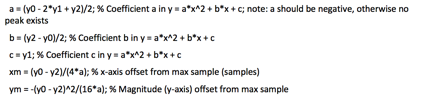

The output is (x_out,y_out). The x_out value generally lies between integer
tap numbers, giving fine time location information. The y_out value may also
be used if fine magnitude accuracy is desired. In our example we have the
following outputs:

**6.7 Severity Assessment **

The goal of any operator’s service department is to be invisible to its
customers’ experience. Too often leaders have reviewed post mortem reports
only to discover the failure was a slow degradation caused by water migration
and corrosion. In other words, there was an opportunity to resolve the
impairment before the customer had to alert the cable company to the failure
with a trouble call. This issue points squarely at the operator’s preventive
maintenance program or lack thereof. A plant inspection program such as system
sweep is a great idea but operators rarely have enough resources available to
inspect, locate and make repairs before a customer notices the failure.
Tracking the length of time it has been since an area has been inspected is
fine but it doesn’t solve the resource problem. Operators are left with
sweeping areas/nodes that are showing an increase in the number of trouble
calls or outages. This method is reactive, not proactive.

Planning an effective preventive maintenance program is based on historical
practices. When an operator uses statistics such as MER (SNR), FEC, T1-T4
timeouts, receive level and transmit power, which are all important variables
to track over time, data is being used that would be better served in an
active maintenance program. That being said, if the _MER _and _FEC _are bad
then the customer has already been influenced in a negative way. If the modem
is timing out on a range request or response, then the customer is being
affected. If the levels are fluctuating outside the expected range of the
design, then customers usually feel the pain. It turns out that adaptive pre-
equalization resolves a lot of plant impairments. Of course, there is a limit
to what can be compensated for using adaptive equalizers and for how long.
This is especially true when consideration is given to the fact that whatever
is already broken will continue to derade. The power of PNM lies in the
ability to be alerted to failure before MER and FEC and other statistics begin
to ring the alarm bells. If an operator is able to solve the problem within
the window that pre-equalization is saving the day, then trouble calls and
outages are being prevented and the customer’s experience is being preserved.

One of the first things an operator will need to determine is the MTR
threshold for what is good and bad. A good starting point would be to review
the original recommendations from CableLabs’ first document on PNM. The
following recommendations were included in that document: Thresholds will
determine which modems are green (no action required), yellow (high monitoring
frequency) and red (immediate action required). That information can then be
used for CMTS health. If the thresholds show most of the modems in red, then
that means that everything must be inspected. On the other hand, if the
thresholds are not reviewed regularly and updated, the operator could be
missing opportunities to improve. A few of the variables which the operator
should consider when selecting threshold include amplifier cascade, node size
and bandwidth utilization.

MTR severity should still be graded into three categories: immediate action
required (Red), high monitoring frequency (Yellow), and no action required
(Green).

From the original PNM document, the three severity assessment metrics that are
used for a single CM are defined as follows:

The first severity metric is a static classification conducted solely based on
the relative level of the MTR.

A second severity metric results from a trending analysis that is conducted so
that a network operator can identify an impairment degrading at a rate that
will result in immediate action in the near future (e.g., one week). This
method requires time stamping of the measurements gathered so that a history
of the impairment is obtained. Typically 3 dB of level change is worth
attention.

A third severity metric is generated from a historical comparison of the MTR
levels of the high frequency monitored CMs. This third metric measures
intermittent fluctuations that would be considered significant, but which did
not rise to the immediate action level. The measurements should be conducted
over multiple days. The comparison of the measurements is done at the same
time of the day. Again, 3 dB of level change should ring alarm bells.

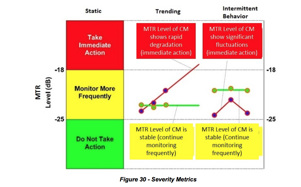

It is noteworthy to point out that this same approach can be applied to other
levels like _micro-reflection _or _group delay_. _Micro-reflection _levels can
be calculated by using the same formula for MTR while utilizing the equalizer
tap values that compensate for micro-reflections _Post-MTR _(usually taps 9
through 24). _Group delay _level is typically calculated using taps 1 through
7.

Operators that are new to the PNM process may want to use the following
metrics as a starting point for the first year or two. Explaining to a team of
technicians that 50% or better of their network is suddenly bad will not
inspire them to fully grasp a new idea. The metric in Table 16 will also
ensure that the most vulnerable parts of the network will receive attention
first.

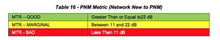

Systems that have short amplifier cascades may want to stick with the original
recommendation from CableLabs which is represented in Table 17. Amplifier
cascades that are fewer than four and have a well- established PNM team for
support would fall into this category. Plant Health index, which will be
explained later, that falls in the neighborhood of five would be well served
by this metric because there is room to improve.

Another point that operators should consider is when a modem starts using a
more robust modulation type such as _16-QAM _because of high noise, it is a
clear sign that something is broken and needs attention. However, if the
metric doesn’t change in pace with the less demanding modulation type, a
problem could be concealed.

It is valuable to know that a modem is compensating for impairments, but if
that was the limit of what could be ascertained, then it is unlikely PNM would
be a successful tool. The power of PNM is the comparison to and correlation
with other modems to identify clusters or groups that may be affected by the
same impairment. It is like turning all of the modems into mini-sweep meters
then comparing the response of those meters to identify problems. An operator
should keep track of the total number of groups and focus on reducing the
number over time.

CMTS or Plant Health is calculated by using the formulas on the next page.
This is an excellent way to take large numbers of modems’ MTR values and place
them on a scale from 1 to 10, with 10 being perfect. Since the desire is to
identify which node or upstream interface needs attention, a _Health Index _by
node doesn’t work well because it lacks clarity with so few modems. It is
better to flush out upstreams using an average level of MTR, micro-reflection
or group delay. The formulas are fairly simple in that they compare the number
of troubled modems or the total number of registered modems on the CMTS. Only
50% of the marginal/yellow modems are used in the formula since they are not
as damning as the critical/red modems. There are two basic spins on the
_Health Formula _which varies by the denominator. If a modem is unable to
produce an accurate MTR value, such as a legacy modem that doesn’t utilize
pre-equalization, then that modem should be excluded as shown in Formula 1. On
the other hand, if a significant number of green modems stop communicating
because of something outside the control of the operator, like commercial
power, than an operator could use Formula 2. Keep in mind the larger the total
number of modems that are being used in the formula, the better the index will
be. A well-operating system typically lives around the index of 7, but what is
more important is for an operator to have room to improve.

Customers care little about a cable operator’s measuring tools when it comes
to their ability to enjoy the service being provided.

CMTS/Plant Health Formula 1:

CMTS/Plant Health Formula 2:

The use of the trending or intermittent approach could be difficult since it
requires time stamping pre- equalization records and deploys an effective
filtering process that produces usable data without getting drowned by
information over- load. A good example would be the CableLabs-authored
SCTE/ISBE Cable- Tec Expo 2015 operational practice2. The authors were able to
show the ability to flush out noisy drops, which is traditionally a
painstaking activity, through the use of monitoring intermittent MTR activity.
Considering intermittent activity could be a tough sell if the plate is
already more than full with just trying to diminish the static opportunities.
However, every operator would benefit by building, early in their PNM tool
development, a methodology to time stamp and store data points. That data
would provide huge dividends as the outside plant performance improves. It is
also worth pointing out that tracking other metrics, which are easily recorded
and available, such as modems transmit or received power, could aid in the
initial identification of trouble-prone areas which could benefit from some
PNM support.

Using the pre-equalization mechanism defined in DOCSIS is efficient, resulting
in no performance degradation even in the presence of strong micro-
reflections. Pre-equalization may help decrease the urgency for plant repair,
but it should not be used to circumvent required plant maintenance. The
purpose of proactive network maintenance is to listen to important network
health metrics and take action before service is impacted.

Micro-reflection severity can be graded into three categories: immediate
action required (Red), high monitoring frequency (Yellow), and no action
required (Green).

The three severity assessment metrics that are considered for a single CM are
defined as follows:

The first severity metric is a static classification conducted solely based on
the relative level of the micro- reflection amplitude.

A second severity metric results from a trending analysis that is conducted so
that network operators can identify an impairment degrading at a rate that
will result in immediate action in the near future (e.g., one week). This
method requires time stamping of the measurements gathered so that a history
of the impairment is obtained.

A third severity metric is generated from historical comparison of the micro-
reflection levels of the high- frequency monitored CMs. This third metric
measures intermittent fluctuations that would be considered significant, but
which did not rise to the immediate action level. The measurements should be
conducted over multiple days. The comparison of the measurements is done at
the same time of the day.

Refer back to Figure 29 for an illustration of the severity assessment
metrics.

As seen from Figure 29, a single micro-reflection level of -18 dBc results in
an amplitude ripple of 2.2 dB and a -25 dBc micro-reflection results in an
amplitude ripple of 1 dB. See Micro-reflection Calculator in Appendix IV for
more information on converting ripple to relative micro-reflection levels.

**6.7.1 Initial CM Selection for Analysis **

It is assumed that the monitoring strategy combines a standard measurement
interval (MIntSTD) to monitor all CMs in the network with a frequent
measurement interval (MIntFREQ) for CMs that are deemed of interest for
further analysis. This initial assessment of which CMs need to be examined
further and more frequently can be done using the distortion metric MTR.

This distortion metric, expressed in dB, can quickly indicate which CMs have
to go through detailed signature analysis. These CMs of interest will also be
placed in the “monitor more frequently pool” to gather performance history and
detect signature trending and intermittent behavior.

Consider a scenario in which the threshold value of the distortion metric is
-25 dBc, as shown in 6.3. This means that any CM that exhibits a MTR > -25 dB
will undergo detailed coefficient analysis through which one or more micro-
reflection signatures will be determined. It is assumed for the analysis that
follows that the CM pre-equalization coefficients have already been analyzed
and manipulated, and distinct micro- reflection amplitude and delay signatures
have been obtained.

**6.7.2 Severity Analysis Strategy for Static or Single Data Point Scenario **

In a static environment where no change of pre-equalization data is assumed,
or when there is only one data point and not able to determine change, a
simple set of fixed thresholds can be used to determine severity categories.

For example, a total distortion energy amplitude of -25 dBc or lower may fall
into the category of “No Action Required,” while -18 dBc or greater may be
considered in the category of “Immediate Action Required.” Two thresholds
determine the three categories. In Figure 29, the values below -25 dBc belong
to the “No Action Required” category or green severity. The values above -18
dBc belong to “Immediate Action Required” category or red severity. The values
between -18 dBc and -25 dBc belong to the category “High Monitoring Frequency”
Category or yellow severity.

As additional data points are collected, time dependent analysis can be
conducted which is described in the next section. Since time dependent
analysis is conducted for CMs that are already in the yellow category from a
static perspective, the time dependent severity classifications only have to
define a red classification criteria.

**6.7.3 Severity Analysis Strategy for Trending **

If, for example, an analysis resulted in a single micro-reflection with a
signature of -22.2 dBc in amplitude and 0.5 μs delay, it would fall into the
yellow severity or “monitor more frequently” category. At the same time, a
second CM showing an initial signature of -19.2 dBc in amplitude and 1 μs
delay also falls into the yellow severity or “monitor more frequently”
category.

Assuming that the standard measurement interval (MIntSTD) is once a day and
the frequent measurement interval (MIntFREQ) is every four hours, the data
from these two CMs’ micro-reflection amplitudes tracked in time is detailed in
Table 19. The micro-reflection time delay is not used for comparison here and
is not shown. It is expected though that the changes in delay will be
negligible.

The time measurement reference parameter Tn_m is coded as follows; the first
number (n) indicates the number of days after the initial measurement date,
while the second number (m) corresponds to the approximate time of day when
measurement was taken. This means that measurement T0_16 was taken at 4:00
p.m. on the same day as the initial stored measurement, and measurement T2_12
was taken two days after the first measurement and at 12:00 p.m.

Figure 31 plots Table 19’s micro-reflection amplitude versus time, indicating
that in less than three days, CM#1 will be going from yellow to red according
to the static criteria while CM#2 stays in the yellow region. These trends
should be conducted using data points measured at the same time of the day so
that approximately equal temperature data points are obtained.

If CM#1 shows a delta of 1.8 dB between T0_0 (-22.2 dBc) and T1_0 (-20.4 dBc),
at that rate of change it will reach -18 dBc in less than three days with
respect to T1_0. The estimated level at T2_0 is -18.6 dBc and T3_0 would be
-16.8 dBc, crossing into the red region.

If delta amplitude per day is D, the last amplitude measured was MRLast and if
MRLast + 3 * D > Trending Red Threshold then it is classified as red for the
trending criteria.

3D is a variable subject to operator adjustment and is intended as a
recommendation.

In addition, another indicator of urgency is determined by the number of days
that the operator has until the micro-reflection amplitude reaches the red
region.

**6.7.4 Severity Analysis Strategy for Intermittent Issues **

Another time-related behavior of adaptive equalizer coefficients operators may
observe is the rapid change of micro-reflection amplitude. This intermittent
behavior may be hiding a problem that is on the verge of causing service
interruption and should be addressed promptly.

Table 20 shows two CMs that are monitored more frequently as they initially
were categorized in the yellow category but one of the CMs shows a behavior
that cannot be explained with daily temperature variations.

Figure 32 plots Table 20’s micro-reflection amplitude versus time showing CM#1
with significant micro- reflection amplitude swings. Both CMs remained in the
yellow region under the static severity criteria but CM#1 shows drastic
changes in micro-reflection amplitude which could be a loose connector or
something likely to break in the very near future.

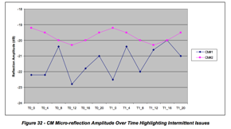

CM#2 shows gradual amplitude swings that could be attributed to daily
temperature variations. CM#1 shows significant variations in micro-reflection
amplitudes. A metric that could define the red classification criteria for
intermittent behavior is proposed as follows.

Intermittent Red Threshold = Avg 4 hour ∆ Ref. Amp / (Static Red Threshold -
Avg. Refl. Amp.) > 0.25 where the average four hour delta of the reflection
amplitude represents the average swing in dB over the four hour interval which
corresponds the monitoring granularity in time of the devices that were deemed
to need high-frequency monitoring and historical data tracking. The average
reflection amplitude is measured up to a fixed number of days (for instance,
four days). If this metric approaches 1 it indicates that the reflection
amplitude is varying with swings that approach the static threshold level. If
this metric is smaller than 0.1, for example, one can say that the reflection
amplitude swings occur at a safe margin below the static threshold.

The scenarios just discussed dealt with the quantification of the degree of
impairment of a single CM. It is assumed that a cable operator may add
weighting factors to indicate urgency in addressing these issues after the
previous information is correlated with the number of CMs affected by a
particular impairment. The analysis used to determine fault location can also
be used to determine how many users will be impacted.

**6.7.5 Grouping Similar Responses (Signature Matching) **

In many instances a single plant impairment will simultaneously affect
multiple cable modems. The affected modems will exhibit the same or similar
frequency response signatures. The following section describes how to identify
and group those responses, a process called signature matching. This technique
facilitates easier troubleshooting and repair of the problem. When locations
of modems affected by a common problem are overlaid on an outside plant map,
identification of where the common problem exists is simplified. Figure 33
shows an example of five groups of modems affected by five different plant
problems. The colored location markers on the left represent individual cable
modems, with each color corresponding to a group of modems affected by a
common plant impairment. The frequency response signatures on the right in the
figure are color-matched to their corresponding groups of modems. In other
words, the red modems are all affected by one particular plant problem common
to those modems; the purple modems are affected by a different plant problem,
and so forth.

**6.7.6 Upstream Equalizer Response Matching Procedure **

It is important to determine a number of cable modems in a node that are using
a same common echo solution to discover a location of a plant impairment that
caused a common solution. If an echo is created in hardline plant, it will
likely affect more than one home. If an echo is created inside a home or on a
home’s drop, it will probably affect just the one home.

However it is possible for two modems both to share a common impairment, but
one or the other can also have unique impairments. For example, an impedance
mismatch inside a home could create a non-shared impairment. Fortunately, most
unique echo tunnels are less than 50 meters, which affect only taps 9 and 10.

When working on a trouble call, a technician wants to know if an upstream
linear distortion impairment problem one customer is experiencing is shared by
multiple subscribers. Localizing the impairment will determine where the
repair truck should go and whether an installer or line technician is required
to fix the plant fault.

The equalization coefficient data may be extracted from a database, or
alternatively the data may be obtained real-time by polling.

Digital signal processing is performed by processing one CM’s equalizer data
with another CM’s equalizer data. Two methods are discussed. A first method
uses complex frequency domain division of coefficients, where a resulting flat
frequency response means a perfect match. A second method is simpler complex
time-domain coefficient subtraction, followed by a restoration of the main
tap.

**_6.7.6.1 Process: _**

Determine all the MAC addresses connected to a node. This can be done by
connectivity records, or by examining the MAC addresses that are connected to
an upstream interface.

For each MAC address, obtain CM coefficient data and eliminate invalid
responses. This results in a reduced node list, with all CMs having valid
coefficient data. It is now desirable to reduce the number of match
computations, because the number of match computations is proportional to the
number of CMs squared. (The number match calculation for a typical node’s
population, while not negligible, can be done in several seconds with modern
computers.)

CMs must also belong to the same logical channel, including the same center
frequency and same bandwidth. Optionally, eliminate CMs that have unimpaired
responses. That is, if the main tap to all other tap energy (MTR) is below
some threshold, such as 25dB, there is no serious echo. This results in a node
list with all CMs having echoes needing to be matched, if possible. (Note that
if a very low match threshold is used, CMs coming out of the same factory or
of the same design will match.)

Going round-robin fashion, process each CM’s coefficients with each of the
other CMs’ coefficients and compute a single match value for each match pair.
If a match value is above some threshold (such as 18dB), indicating the two
unit match, a match result of 1 is set. Otherwise a match result of 0 is set.
Match results may be stored in a square matrix. If a node’s list of CMs
needing to be processed is 100 CMs, 10,000 comparisons will need to be
computed, resulting in 10,000 match values. See Table 21 for an example 20 x
20 matrix created with a match threshold of 18 dB. Because every unit matches
perfectly with itself, a diagonal line of 1s is obtained. Note in Table 21 for
an example 20 x 20 matrix created with a match threshold of 18 dB. Because
every unit that units 0 and 1 match, units 3 and 9 match, and units 11 and 17
match. More on matching processes later.

Convert the matrix into a symmetrical triangular matrix by forcing all
matching pairs to agree. For example, if unit 11 matches with unit 17, unit 17
is forced to match with unit 11.

From the matrix form groups of CMs with matching coefficients, and plot them
on a GIS map. One group-forming strategy is to remove CMs from the pool once
they are in a group. Another strategy is to incorporate GIS data to prevent a
mismatch. That is, a distant CM probably found its way into a group
accidentally.

Create work tickets for line technicians for each matching group.

Create work tickets for service technicians (or installers) with single homes
having unmatched bad responses.

**_6.7.6.2 Frequency Domain Division Method to Determine If Two CMs’ Responses Match _**

One method that can be employed to see if two units have matching responses is
to just “look at” or “eyeball” a plot of the complex coefficients in either in
the time domain or in the frequency domain. This is complicated by the
coefficients being complex with both real and imaginary components, so a two-
dimensional plot can be hard to interpret. So despite the human eye being a
versatile instrument, it is difficult for the human eye to establish a single
number that quantifies a difference between two similar- looking responses.
Other less-effective methods that could be used are to numerically measure the
ripple of the responses, or use the frequencies of peaks and troughs in the
responses.

A simpler method is to perform a de-convolution with a frequency domain (FD)
division of one unit’s FD coefficients with the other unit’s FD coefficients.
If two responses are exactly the same, a resulting quotient frequency response
will be unity at all frequencies, with a flat phase response at zero degrees.
This method is essentially a calibration process, with the denominator unit
being used as a reference value. De-convolution is a standard Matlab function,
and is most efficiently performed in the FD.

**Example: **

Assume the 24 coefficients from the MIB (time values) are zero-padded out to
32 and converted with a FFT, giving 32 frequency domain points.

Figure 34 is a plot of a set of coefficients for cable modem A with about a 14
dB T-spaced echo. The main tap on the plot has been barrel-rotated (circular)
from index 8 to 0. The main tap has a value of approximately 1.0, but the
vertical scale has been compressed to 0.2 to enhance the values of the taps on
a linear scale. The ratio of the energy in the main tap to all other taps
combined is 14.09 dB for modem A.

The corresponding “correction” frequency response is shown is Figure 35. Note
that the frequency response of the physical channel will be approximately a
frequency domain inverse of the response shown in Figure 35.

Figure 36 and Figure 37 are the corresponding frequency responses of Figure 34
and Figure 36 look alike in the time domain, and responses of Figure 35 and
Figure 37 look alike in the frequency domain. The ratio of the energy in the
main tap to all other taps combined is 15.3 dB for modem B.

Figure 38 is a quotient frequency set obtained by dividing each coefficient in
Figure 35 by a same- frequency coefficient in Figure 37. Thus, if a frequency
domain coefficient in Figure 35 is .55 at an angle of 130 degrees, and the
corresponding same-frequency coefficient in Figure 37 is 0.57 at 120 degrees,
a resulting coefficient in Figure 38 is 0.9065 (.55/.57) at an angle of 10
(130-120) degrees. If the coefficients in CM A and CM B were identical, Figure
38 would have a response of 1.0 at zero degrees at all frequencies.

At this point, a 32-point IFFT is employed to find an impulse response (time
domain) associated with the frequency-domain quotient response associated with
Figure 38, and a resulting time plot is shown in Figure 39 If the two
responses are absolutely identical, the impulse response would be 1.0 real and
0.0 imag at index 0 and 0.0 real and 0.0 imag (MTR) at every other time index.
The units are matched if the ratio of energy in the main tap to the energy in
all other taps is below some threshold, such as 25 dB. (In general, it is good
to make the threshold level adjustable.)

Experience has shown that some CMs that are experiencing a common hard-line
echo may also be experiencing a unique in-home echo. The presence of an in-
home echo may cause the matching process to fail for this house. This problem
can be mathematically remedied by zeroing-out the “close-in” taps on either
side of the main tap, thereby eliminating the energy of the house echo. This
method only works well when the hard-line echo is of a relatively long
duration.

In digital signal processing, equivalent processing can be done in either the
time domain or frequency domain. Time domain convolution is functionally
equivalent to frequency domain multiplication.

Matching code is available in the CableLabs’ member-accessible code
repository.

Main tap is 1.0, but vertical axis is clipped at 0.2 to enhance other taps on
linear vertical scale. MTR = 15.3 dB

Main tap is 1.0, but vertical axis is clipped at 0.2 to enhance other taps on
linear vertical scale. MTR = 14.09 dB

**NOTE: **Because CM A and CM B are experiencing the same echo, the quotient set is relatively flat. 

Main tap is 1.0, but vertical axis is clipped at 0.2 to enhance other taps on
linear vertical scale. MTR = 27.3 dB, so the match is excellent and both
modems are seeing the same echo.

**_6.7.6.3 Method 2: Time Domain Subtraction Method to Determine If Two CMs’ Responses Match _**

This method is conceptually simpler than the frequency domain division method,
but produces similar results.

Take the 24 time domain coefficients from two CMs and normalizing the
responses by scaling. For example, if the main tap target is 2048, divide all
complex coefficients by 2048 to make a unity (approximately) main tap.

Then perform a complex subtraction of each time domain coefficient. Make one
response the subtrahend and the other response the minuend. This will normally
cancel the main tap, which must be restored.

Restore the main tap. There are a number of approaches to restore the main
tap. A first method is simply to make it 1.0 real and 0.0 imaginary. Another
is to use the main tap of the subtrahend or the main tap of the minuend.
Another method is to use a conservation of energy approach, and subtract a sum
of all other taps energy from unity. This yields a residual energy, and the
main tap is the square root of the residual energy, which should be a value
just under 1.0.

Compute the MTR of the difference with a restored main tap.

**Use Case Examples for Adaptive Equalizer Coefficients **

The following four listed states describe the condition of the plant and the
performance of the measurement devices for different scenarios operators may
encounter in the field.

State 1. Adaptive equalizer tool is working properly and plant is within
acceptable limits.
State 2. Adaptive equalizer tool is working properly, and
plant exhibits severe linear distortion.

Plant is stable

Plant is unstable (intermittent or trending)
State 3. Adaptive equalizer tool
is working properly, but CMTS/CM is reacting badly

Transmission characteristics in channel have resulted in no solution for CM
coefficients (e.g., a deep suck-out or echo is too long or too severe)

Upstream impulsive noise is causing wrong or unstable adaption.

CM needs to be replaced
State 4. Adaptive equalizer tool is not working
correctly because of equipment design or configuration.

CMs are giving wrong MIB data, but working properly.
CMs are giving wrong/no
MIB data and not working properly. Wrong configuration of CMs or CMTS.

The CMTS is not configured for adaptive pre-equalization in the upstream

CM includes DOCSIS capable devices STBs and MTAs

Distortion red = static or trending or intermittent

**6.8.1 Use Cases **

The following use cases describe how tools are used. Examples are provided in
the following subsections.

**_6.8.1.1 Use Case 1: In or Near Home Problem Identification _**

**Description **

Support User detects possible service problem by monitoring (proactive) or
trouble call (reactive). Analysis tool is used to interrogate the customer’s
modem and CMTS for performance information. The performance data is analyzed
for radio-frequency reflections to determine approximate problem location.
Location information is used to instruct Support User or dispatch a repair
technician to resolve the problem.

**Level: **User Goal **Primary Actor **

Maintenance User or Support User

**Supporting Actors **

Customer, Repair Technician, Dispatch Personnel, Customer Modem, CMTS

**Stakeholders and Interests **

Customer - may be unaware of service trouble in proactive scenario.
Plant
Maintenance - non-critical repair may be scheduled during routine maintenance.
Billing Personnel - billing system accounts may need to be reconciled.

**Pre-Conditions **

Support User must have specific knowledge of a possible service problem.
Customer’s modem must be online.
CMTS and customer modem must both support
Adaptive Equalization. Analysis tool must be available to the Support User.

User must have sufficient access and knowledge of using the tool and
interpreting the data.

Impairments to the customer’s signal must be such that the modem can still
respond correctly.

**Post Conditions **

Success end condition

Reactively, the problem was identified and repaired to the satisfaction of the
customer. Proactively, the problem was identified and repaired before the
customer perceived a problem. Customer’s modem and entire node show improved
performance.

Failure end condition

Modem fails to demonstrate any actionable performance metrics. No remediation
of problem, customer may experience recurrence or deterioration of service.

**Trigger **

Proactive alert identifies possible service affecting problem OR reactive
alert, customer calls with trouble.

**Main Success Scenario **

1\. Customer calls with service trouble.

Support User initiates analysis tool, providing customer identification.

Customer identification is used to obtain the modem MAC address and CMTS for
the customer.

MAC address is used to query both the modem and CMTS for performance
information.

Reference SD-PNM200 for software sequence (Appendix VI).

Performance data is analyzed to obtain reflection information if available,
used for distance 
calculations.

Support User is presented with customer’s service address and an estimate of
problem distance 
from home.

Support User evaluates distance information to determine “in or near home”
problem, escalates 
to Dispatch Personnel.

Dispatch Personnel evaluates trouble call information and approves a repair
call.

Repair Technician is provided with analysis and dispatched to the customer
premise.

Repair Technician locates trouble and resolves issue.

**Extensions **

4a. in Step 4, the customer information is not located.
• Trouble is escalated
to billing department for account reconciliation.

4b. in Step 4, the modem or CMTS do not support equalization analysis. •
Trouble resolution reverts to conventional process.

5a. in Step 5, analysis data shows no trouble present.

• Customer account is noted for future reference 2. Proactive monitoring is
escalated to a higher rate

5b. in Step 5, customer has multiple devices at premises.

1\. All devices are analyzed for similar distortion characteristics
1a.
multiple devices share distortion - common fault is noted in analysis
1b.
Single device demonstrates distortion - scope of analysis is narrowed to “in
home”

5c. in Step 5, adjacent homes may also be analyzed

1\. All devices within a specified radius are analyzed for similar distortion
characteristics
1a. multiple customer devices share distortion - common fault
is likely to be at or above the tap. 1b. single customer devices demonstrate
distortion - fault is more likely to between the tap and something in the
customer’s home.

**Variations **

1a. in Step 1, proactive monitoring may provide use case trigger.
1b. in Step
1, automations such as an interactive telephone system may provide use case
trigger. 2a. in Step 2, the Support User role may be implemented as an
automated telephone system. 3a. in Step 3, the customer identification may be
any one of MAC, telephone number or account number.

**Frequency **

Use case is executed per each trouble call, day of install or subject to the
frequency of proactive monitoring.

**Assumptions **

Users of the system must have basic knowledge of troubleshooting cable service
problems.
Users must have required access and training of the analysis tools.
**Special Requirements
**All systems must support authentication and
encryption pursuant to corporate security standards. **Issues **

Distance calculations are preliminary, subject to market specific conditions
and trial findings.

Distance estimates actually describe the distance between two impedance
mismatches 
(reflectors). In the case of in or near home, the assumption is
made that one of the reflections is within the subscriber’s home. This may not
always be the case however the majority of the time, this holds correct. There
will be some cases where an outside plant issue may be incorrectly
characterized as “in or near home” problem.

**To do **

Validate use case in arid climates with less water ingress and corrosion.

Track distance estimates with actual problems found to identify opportunities
of improvement in

the distance calculations.

**6.8.2 Use Case: Upstream Ingress or Noise Detection **

**Description **

Support User detects possible service problem by monitoring (proactive) or
trouble call (reactive). Analysis tool is used to interrogate the customer’s
modem and CMTS for performance information. The performance data is analyzed
for additive influence in the modem transmission.

**Level: **User Goal **Primary Actor **

Maintenance User or Support User

**Supporting Actors **

Customer, Repair Technician, Dispatch Personnel, Customer Modem, CMTS

**Stakeholders and Interests **

Customer - may be unaware of service trouble in proactive scenario.
Plant
Maintenance - non-critical repair may be scheduled during routine maintenance.
Billing Personnel - billing system accounts may need to be reconciled.

**Pre-Conditions **

Support User must have specific knowledge of a possible service problem.
CMTS
and customer modem must both support Adaptive Equalization.
Analysis tool must
be available to the Support User.
Support User must have sufficient access and
knowledge of using the tool and interpreting the data.

**Post Conditions **

Success end condition

Reactively, the problem was identified and repaired to the satisfaction of the
customer. Proactively, the problem was identified and repaired before the
customer perceived a problem. Customer’s modem and entire node show improved
performance.

Failure end condition

Intermittent ingress such as impulse may no longer be present. Modem fails to
demonstrate any actionable performance metrics. No remediation of problem,
customer may experience recurrence or deterioration of service.

**Trigger **

Proactive alert identifies possible service affecting problem OR reactive
alert, customer calls with trouble.

**Main Success Scenario **

Customer calls with service trouble.

Support User initiates analysis tool, providing customer identification.

Customer identification is used to obtain the modem MAC address and CMTS for
the customer.

MAC address is used to query both the modem and CMTS for performance
information. 
• Reference SD-PNM200 for software sequence. (Appendix VI)

Performance data is analyzed to obtain the distortion present at the CMTS
after equalization.

Support User evaluates performance of all modems on the same node.

Support User determines that only the single customer demonstrates a noisy
response.

Customer is asked to tighten connectors and remove extra cable or splitters.

Support User rescans device for performance information and perceives that the
problem has been resolved.

Extensions
4a. in Step 4, the customer information is not located.

2\. Trouble is escalated to billing department for account reconciliation. 4b.
in Step 4, the modem or CMTS do not support equalization analysis.

2\. Trouble resolution reverts to conventional process. 5a. in Step 5,
analysis data shows no trouble present.

Customer account is noted for future reference

Proactive monitoring is escalated to a higher rate

6a. in Step 6, modems on same node may also be analyzed

2\. All devices sharing the common upstream interface are analyzed
1a.
multiple customer devices share ingress - one or more points of ingress need
to be resolved.

a. Trouble is escalated to Dispatch for maintenance scheduling
1b. single
customer device demonstrates noisy response - likely impedance problem caused
by

loose, damaged or corroded connectors or cable.

**Variations **

1a. in Step 1, proactive monitoring may provide use case trigger.
1b. in Step
1, automations such as an interactive telephone system may provide use case
trigger.
2a. in Step 2, the Support User role may be implemented as an
automated telephone system.
3a. in Step 3, the customer identification may be
any one of MAC, telephone number or account number. **Frequency **

Use case is executed per each trouble call, day of install or subject to the
frequency of proactive monitoring.

**Assumptions **

Users of the system must have basic knowledge of troubleshooting cable service
problems.
Users must have required access and training of the analysis tools.
**Special Requirements
**All systems must support authentication and
encryption pursuant to corporate security standards. **Issues **

3\. Magnitude of equalized response ripples from the CMTS need to be
correlated to concrete BER / MER values. Pending lab work.

**To do **

3\. Better correlate the perception of “noise” with unstable equalizer
operation. This is reproducible with corrosion.

**6.8.3 Use Cases 3-11 **

**_Figure 45 - Effects of Ingress When Mapped _**

Plant technician trying to solve a frequency response problem with the
upstream or augment system upstream sweeping. State 2. 
Actors: Technician,
NOC 
External Event: Distortion red, other indicators yellow/green or plant
sweep shows problem/anomaly 
Proactive/High distortion detected Group of CMs
Expected Outcome: Distortion removed

Tech Supervisor: To deploy technicians. Verify technicians got the upstream
frequency response issues resolved. State 2 becoming State 1. 
Actors: Tech
Supervisor, Technician External Event: Close out trouble ticket Reactive and
Proactive

Group of CMs

Expected Outcome: Resolved Issue (non-main adaptive equalizer tap or
coefficient energy reduced)

CMTS having issues due to equalization. Unable to compensate for channel.
Micro-reflection too long or no inverse solution, e.g., notch in channel.
Upstream burst noise interfering with the correct ranging of CMs’
coefficients. State 3. 
Actors: Technician, NOC, CSR, HE Tech
External Event:
Distortion red, other indicators yellow or red Reactive/High distortion
detected
Group of CMs
Expected Outcome: Fix cause of impairment

QA for accessing a node health score. Goes along with upstream MER (on a per
CMTS port or per CM basis). States 1 and 2. 
Actors: Technician, NOC (QA)
External Event: Periodic scan and alarms - Distortion red, other indicators
red/yellow/green Reactive and Proactive/High distortion detected
Group of CMs
Expected Outcome: Distortion removed

Identification or location of faults. Combine location technique with GPS data
or plant connectivity data. Accurate micro-reflection time delay is important.
Condition 2. (Subset)

Qualifying an upstream for a wider channel RF bandwidth or higher order
modulation. Qualification can also be done to verify a service level agreement
(SLA). States 1 and 2. 
Actors: Initially NOC, then technicians
External
Event: Distortion red, other indicators yellow/green
Use higher order
modulation and wide bandwidth channel as reference Generally Proactive/High
distortion detected
Group of CMs
Expected Outcome: Node qualified

9 CSR quick check. See if something abnormal is going on, and if the neighbors
have the same problem. All Conditions

Actors: CSR, Technician
External Event: Customer complaint
Reactive/High
distortion detected
1 device possible others
Expected Outcome: Trouble ticket
or no distortion problem, service call avoided

Trend and Intermittent Issues Tracking. State 1 becoming State 2 Actors: NOC
External Event: Distortion turning red within predetermined period,
significant delta distortion within short time period, other indicators
yellow/green 
Proactive/Change in distortion detected
Group of CMs
Expected
Outcome: Problem identified and located, trouble ticket generated

Resolving flapping problems and unstable equalization solutions. State 3 or
State 4. Actors: NOC 
External Event: CMTS not compensating or improperly
compensating for distortion, high uncorrectable FEC statistics, high impulse
noise scenario 
Reactive/CMTS change in distortion detected
Group of CMs (if
distortion generated), all CMs in node (if impulse generated) Expected
Outcome: Problem identified, located and resolved

**6.9 Post-equalization **

As its name indicates, post-equalization is the process of distortion
compensation after the signal has been received. In the cable environment,
post-equalization has been used mostly in the downstream direction where a CPE
device always receives a continuous signal coming from one location, usually
the headend. That fixed location signal source simplified downstream
distortion compensation implementation using adaptive equalization at the
receiver. In the upstream direction the upstream signals come from multiple
sources. Transmission is bursty and one burst may have suffered a different
distortion from the next because the upstream paths traversed may be
different. A post-equalization approach would require the receiver to
compensate for distortion on a per burst basis. Early in DOCSIS, it was deemed
that a post- equalization approach would be a significant processing burden on
the CMTS, which led to the implementation of the upstream pre-equalization
approach covered in this document. Processing capabilities improvements have
enabled the implementation of per burst equalization which is now common in
CMTSs. The advantages and disadvantages of pre- versus post-equalization are
discussed next.

**6.9.1 Advantages of Pre-equalization **

Reliable diagnostic transmission analysis is enabled by the regular complex
coefficient updates the CMTS equalizer provides to individual cable modems
when adaptive pre-equalization is enabled. The repeated convolution of
coefficients effectively generates a time averaged response of the upstream
channel, which leads to the following advantages:

Reasonably stable per modem equalized MER as reported by either the CMTS or
SNMP Polling

Ability to view all of the linear transmission path characteristics unique to
the individual cable modem due to the complex coefficient impulse response
reported via SNMP MIB query. From the SNMP MIB query one can also compute the
effective unequalized MER in addition to amplitude and group delay
characteristics, as well as enable analysis of micro-reflection conditions for
any given cable modem.

Superior equalized MER capability compared to that provided by post-
equalization when the channel is at the upper edge of the return path
spectrum. The superiority is also a function of the depth of the return path
amplifier cascade

Another advantage of pre-equalization over post-equalization is that
throughput is somewhat higher when pre-equalization is used because there is
no need to equalize the data transmission burst. This is related to the
difference in the length of the data burst preamble.

Pre-equalization is beneficial to virtually all DOCSIS 2.0 and DOCSIS 3.0
services. In some cases there would appear to be some instability or
inconsistency in the metrics being reported when using pre-equalization. Some
causes for such behavior are discussed next.

**6.9.2 Disadvantages of Pre-equalization **

Pre-equalization disadvantages are worth mentioning although they can be
considered minor compared to the advantages.

**Memory **

Operation of pre-equalization has memory associated with the function, and
that memory lives in the convolution of the equalizer updates in the cable
modem. As stated previously there are many benefits to having this function
exist in the cable modem, but there are a few deficiencies as well.

For example, if there is suddenly a major impulse noise event or a change in
ingress characteristics during a station maintenance transmission, when the
CMTS is assessing the equalized impulse response update to send back to any
given modem, there is the possibility that the station maintenance will be
corrupted. That would cause the CMTS equalized impulse update to become
corrupted, and the corrupted update would be transmitted to the cable modem.
The cable modem will convolve the corrupted update, so now that particular
cable modem’s equalized impulse response will no longer be valid for a period
of time.

One weakness of pre-equalization is that the CMTS must be assumed to be
responsible as the final arbiter as to which equalized updates are sent and
which updates are potentially corrupted, and compensate for those differences
in one manner or another. There are indeed many options available to the CMTS
to deal with equalizer corruptions, but that topic is beyond the scope of this
document.

**CM TX Level Increased **

One unfortunate but direct consequence of the transmit pre-equalization
process occurs when there is significant amplitude roll-off present on a given
channel such as at the very end of the cascade, and on the highest available
carrier frequency. A primary function of pre-equalization is to eliminate the
post equalization noise enhancement that occurs when raising the signal power
over a specific portion of the spectrum and thereby raising the flat noise
floor of the receiver right along with it.

Equalizer noise enhancement elimination is the single biggest improvement that
pre-equalization provides over post-equalization, especially when operating
near the upper band edge. Transmit pre-equalization eliminates post-
equalization noise enhancement by hitting the receiver with an ideally flat
spectrum. This happens even as the equalization process compensates for other
impairments such as group delay distortion.

The very act of updating the cable modem to increase the transmit power in the
heavily attenuated or rolloff portion of the spectrum at the expense of
lowering the power in the less attenuated portion of the spectrum eventually
ends up with a perfectly flat response at the input to the CMTS receiver. The
final amount the cable modem may be instructed to increase the transmit level
over the original non pre- equalized transmit signal power is a function of
how much amplitude roll off exists on the channel.

If there is sufficient headroom for the cable modem to increase its upstream
transmit level, then there is no penalty for the significantly improved
performance. If the cable modem does not have sufficient margin to increase
its transmit level to the correct amount then the CMTS will only allow as much
low input signal level to exist as was defined in the CMTS’s operating
configuration.

**6.9.3 Advantages of Post-equalization **

The following summarizes some of the benefits of post-equalization.

**No Memory **

Since post-equalization operation starts off every new data burst from
scratch, there are no pre-stored conditions required. As such, there is no
memory condition to become corrupted from any given error condition.

In other words, while any given post-equalized burst can be corrupted, all
that is lost during that corruption period is that particular burst, and not,
say, multiple bursts until a station maintenance can correct the corrupted
update from the CMTS.

Because the post-equalization process possesses no memory in the operation,
one might argue that the post-equalization mode of operation is potentially
more stable, or the simplicity of the post-equalization process results in a
more stable performance loop over all. This is particularly true in the below
20 MHz frequency range where both ingress and impulse noise are common.

**Lower Cable Modem Transmit Levels **

At the upper end of the return path spectrum there is generally no mechanism
that will result in the post- equalization process requesting more cable modem
transmit level, at least as a result of the equalization process itself. This
is because the post-equalization process requires absolutely no cooperation on
behalf of the cable modem. That is, there is no pre-equalization function
being convolved in the cable modem for post-equalization to work.

A reasonably strong case can be argued for using post-equalization only when
in TDMA or A-TDMA mode below 30 MHz, and definitely below 20 MHz.

**6.9.4 Disadvantages of Post-equalization **

The following summarizes several disadvantages of post-equalization.

Lower throughput than pre-equalization operation due to longer data preamble -
the throughput loss is mostly a small amount compared to FEC correction
capabilities variations, but nonetheless it is measurable.

Poorer equalized MER performance compared to pre-equalization because of the
convergence time required, versus a data preamble length most operators would
be willing to suffer with to attain better equalized MER performance per
burst. Also, given the possibility of multiple impairments being present
during any given data burst, there can be a significant variation regarding
the equalized MER estimate from burst to burst.

Vastly poorer micro-reflection analysis capabilities in part because of
convergence time and in part because of any impairment present during the data
burst.

Equalizer noise enhancement phenomena are unavoidable at the diplex filter
band-edge, and the phenomena become increasingly worse as the amplifier
cascade increases. In other words, in an N \+ 1 or perhaps even up to an N + 3
cascade depth, the equalizer noise enhancement penalty is perhaps a minor
point that could be forgotten. However, as the cascade depth increases to N +
6 or higher, the

equalizer noise enhancement penalty becomes more significant to the point that
the post-equalization mode of operation total available or usable bandwidth on
a given return path becomes much less than when using pre-equalization.

• Generally speaking, much poorer estimate for both amplitude roll-off and
group delay distortion when attempting to extract the information from a
single equalized data burst for any given cable modem.

**7 PNM USING FULL BAND CAPTURE **

**7.1 Technical Description of Process **

This section focuses on downstream FBC.

Spectrum analyzers are specialized instruments that provide a graphical
display of amplitude versus frequency. Figure 46 shows a typical spectrum
analyzer display.

Spectrum analyzers have been used by cable operators for decades for routine
maintenance and troubleshooting. However, spectrum analyzers are expensive
instruments, so they have not typically been widely available to field
personnel. Technicians could only imagine having a spectrum analyzer in every
home.

FBC is a relatively new concept that takes advantage of low-cost discrete
Fourier transform (DFT) and fast Fourier transform (FFT) technology to support
spectrum analyzer-like functionality in customer premises equipment such as
cable modems.

Integrated spectrum analyzer-like functionality is supported by the latest
Broadcom and MaxLinear CPE silicon. The CPE’s spectrum data can be accessed
remotely using simple network management protocol (SNMP) or similar, allowing
a cable operator to see where ingress or other impairments might be
problematic. Figure 47 shows an example of FBC, in which FM and LTE ingress
are visible.

**7.1.1 What Does FBC Do For Operators? **

FBC can be used to remotely troubleshoot a variety of headend, outside plant,
and subscriber drop problems. Since the spectrum analyzer-like functionality
is integrated in the cable modem or other device, it’s much like having a
spectrum analyzer in every home that has FBC-equipped CPE. Figure 48 shows
examples of impairments that can be identified using FBC.

Problems can be identified by evaluating the RF spectrum _without rolling a
truck_. If a sufficient number of FBC-equipped devices are available in
subscribers’ homes, it may be possible to determine the approximate location
of the source of a given impairment. A technician can be dispatched directly
to the suspected problem area, simplifying troubleshooting and saving time.

**7.1.2 How FBC Works **

As mentioned previously, a spectrum analyzer is a device which measures the
frequency content of an input signal. Fortunately, this is precisely what DFT
does. Multiplying by the DFT matrix measures the correlation of the input
signal with each row in the DFT matrix, and each row is a sine/cosine of a
particular frequency. Thus, each output bin represents the power of the input
signal at that frequency.

Figure 49 shows a block diagram of a digital spectrum analyzer which may
reside in a cable modem or CMTS. The input signal enters at the left of the
diagram; this signal is the full upstream or downstream band of the cable
plant. An analog front end amplifies the signal and provides RF gain control.
A high- speed analog-to-digital converter (ADC), typically 2.5 giga-samples
per second (Gsps) or higher, provides digital samples of the signal. A digital
tuner, consisting of a digital oscillator and lowpass filter, selects the
desired analysis band around a specified center frequency. The signal from the
selected band is applied to the FFT, which multiplies the signal by the DFT
matrix. Each bin of the FFT output comprises a complex value consisting of two
numbers, real (I) and imaginary (Q), giving the correlation of the input
signal with the particular frequency corresponding to a single row of the DFT
matrix. Typically a spectrum analyzer is only concerned with the magnitude,
not the phase, of the FFT output. So, the power (magnitude-squared) of each
bin is computed, that is, I2 \+ Q2 for each bin. If spectrum smoothing is to
be applied, the previously-described process is repeated with a fresh set of
data from the same band, and the power values from several captures are
averaged at each bin location. The smoothed bins are converted to decibels by
taking 10*log10 of each bin power value. These decibel values, one for each
frequency bin, are displayed as the spectrum of the input signal.

Note that if the entire band is able to be processed as a single analysis
band, the tuner shown in Figure 49 is not necessary. However, if the band is
being analyzed in segments, then the tuner is used to step through a sequence
of analysis segments of the band, and the individual spectrum segments are
spliced together to produce the overall wideband spectrum.

**7.2 Field examples and screen shots **

This section includes several examples of FBC screen shots as “seen” at the
cable modem. The horizontal axis in each figure is frequency in MHz, and the
vertical axis is in dB. Images are courtesy of Comcast.

**7.2.1 Ingress **

Technicians can look at a captured spectrum display for indications of the
presence of downstream ingress (and in some cases, direct pickup). If a
sufficient number of FBC capable devices are available, it may be possible to
roughly isolate the area of plant where the ingress is entering the network.
Figure 50 shows an example of visible ingress in the FM band (left edge of
figure) as well as in the LTE band (near the right end of the figure).

**7.2.2 Multiple problems **

Figure 51 shows a FBC from one modem, in which multiple downstream impairments
can be seen

The most serious problem is the suckout (notch) visible between 697 MHz and
731 MHz. The suckout, which is about 18 dB deep, affects a half dozen QAM
channels. Another problem evident in the display is called adjacency, where a
group of eight channels in the roughly 600 MHz to 650 MHz range are several dB
higher than other channels in that part of the spectrum, likely caused by
incorrect narrowcast injection levels. A third problem is a QAM channel near
563 MHz that is a few dB lower than the adjacent channels. A fourth problem
also is level-related, in the vicinity of 250 MHz.

**7.2.3 Displaying Multiple Modems **

It is possible to simultaneously display an overlay of spectrum data from
multiple cable modems - say, modems in the same neighborhood. Figure 52
illustrates this.

Standing waves, also known as amplitude ripple, are caused by impedance
mismatches in the RF signal path. Standing waves are usually easy to see in a
FBC display. Figure 53 shows several examples of standing waves. Of particular
interest is the combination of two standing waves in the lower right screen
shot.

**7.2.4 Presence of filters **

Figure 54 includes two examples where filters are present in subscriber drops.
The upper trace in the figure shows the effects of a bandstop filter (an
adjacency problem is visible at two locations in the

**7.2.5 Rolloff **

Rolloff is a non-flat loss of signal level-versus-frequency at or near the
lower or upper end of the RF spectrum. When rolloff occurs at the upper end of
the downstream spectrum, the cause can be active device misalignment, active
or passive device damage, presence of older cable or equipment in the network
designed for a lower upper frequency limit than the network’s existing
operating frequency range, and so on. Figure 55 shows examples of rolloff at
the upper end of the downstream spectrum.

**7.2.6 Tilt **

**_Figure 55 - Rolloff at the Upper End of the Downstream Spectrum _**

Tilt describes the condition where signal levels vary from low to high in a
more or less linear manner as frequency increases (positive tilt), or from
high to low in a linear manner as frequency increases (negative tilt).
Depending on the location in the plant, tilt may be desirable - for example,
at the output of an amplifier. Ideally the frequency response at the input to
CPE should be flat, but in some cases the response may be tilted excessively
for a variety of reasons. Figure 56 shows examples of negative and positive
tilt.

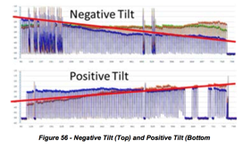

**7.2.7 Resonant Peaking **

Resonant peaking affects a relatively narrow frequency range, typically no
more than a handful of channels. The peaking can exist anywhere in the
spectrum, and typically occurs in an active or passive device. Vibration and
temperature changes may affect the nature of the peak: The response peak can
be intermittent, change in level and/or shape, and move around in frequency.
Examples of causes include defective components, cold solder joints, loose
modules (or module covers), loose or missing screws, and so forth. Figure 57
highlights examples of resonant peaking.

**7.2.8 Making It Work **

**_7.2.8.1 How to Capture Data from Devices Equipped with FBC Functionality _**

_7.2.8.1.1 Design Considerations _

Capturing spectrum information requires SNMP read/write access to the cable
modems, which generally are on RFC 1918 address space. This means that direct
access from a workstation is unlikely. In general, implementations will
consist of a server (or servers) that has access to the non-routable IP
addresses used by the modems, and has an external IP address or a static
network address translation (NAT) that allows external clients access to it so
that the server can make the SNMP requests on behalf of the clients. The
clients could be web based, mobile, or desktop software. An operator likely
will already have one or more OSS servers that fits these requirements, but
the existing servers may or may not have sufficient capacity for the
additional load. Additionally, the implementation of FBC will be done for a
somewhat different operational group - and in many cases a different
department -- than the primary OSS users, since field technicians are going to
be much more likely to use this data than some of the other normal OSS tools.
A good exercise is taking a look at how field technicians currently use their
hand held meters, as well as thinking about other uses for a remote spectrum
display that aren't practical today.

There are several considerations that development teams need to understand
before getting started. Security is a large issue for this kind of system,
because it is necessary to perform SNMP SET operations to enable the capture,
and have access to parts of the network that aren't normally reachable. Some
sort of server side authentication system should be used to ensure that only
authorized users can access and use the server. In some cases the FBC requests
will be coming from devices over untrusted networks, such as field technicians
using tablets or smart phones. This could be resolved by requiring virtual
private network (VPN) connections before allowing usage, or with strong
authentication coupled with transport layer security (TLS) or other
encryption. Locking and session management are also needed, because having
multiple users trying to perform a capture on the same device can cause issues
for that device. Other multiple user issues could occur if the device changes
frequency or some other variable in response to one user while another is
trying to interpret results for a different setting. An important
consideration is how to deal with the data. In general, a maximum granularity
capture across the widest window will generate a 10-20 kbps stream of data. By
itself this isn't a large data stream, but it does mean that it's not
practical for most organizations to collect this data for all modems and then
store the information in a database for analysis the way that is typically
done for OSS functions. If a user is only going to work on a real time display
then this consideration isn't particularly problematic, but if the data is for
proactive analytics then it's a large challenge.

**7.3 Method to Find a Time Response from an IFFT when Phase Data is Not Available **

The FBC is used by cable modems and set-top boxes to provide magnitude-only
spectral data about RF path conditions in a remote location, such as a home.
In some cases, the downstream channels being monitored are digital channels,
such as 64- or 256-QAM. In other cases the signals are analog signals or noise
and ingress.

This method applies to blocks of QAM signals to identify the existence of an
echo tunnel that causes ripple in the frequency response. See `

**7.3.1 Method: **

Pick a block of averaged (smoothed) contiguous digital signals, as many as
possible. For example, each 7.5 MHz block of frequency domain data may have
256 spectral components, and multiple blocks are pasted together to make a
wide spectral response.

Extract samples from the lower band edge of the lowest QAM signal to the upper
band edge of the highest QAM signal, and convert the values into linear
values. Use these values as I (in-phase) components.

Use zeroes for all Q (quadrature) values.

If necessary zero-pad the values to fill out a 2^n IFFT transform, such as
16,384 or 4096.

Optionally, a window should be applied to the data.

A frequency region with another signal, such as an analog RF carrier, or
vacant band can be filled 
in with a straight line connecting the channel just
above the vacant band to the channel just below 
the vacant band.

Perform an IFFT to put the data into the time domain.

Transformed data will be symmetrical due to not providing quadrature values.
You can discard the 
image.

A DC term will be present. Comb teeth will be present every 166.67 ns due to
the notch between 6 
MHz channels.

If there is an echo in the frequency response, there will be a ripple in the
frequency domain. The 
ripple will linearly transform to an impulse located
among the comb teeth. If the echo is an exact multiple of 166.67 ns, it cannot
as easily be observed. The delay between the main impulse and echo is the
round trip time of an echo tunnel, corrected for velocity of prorogation
velocity of cable. Since you know the shape of the teeth on the comb, they can
be removed by subtraction.

This method is valuable because the wide bandwidth of the multiple QAM signals
makes for exceedingly accurate time resolution, so the cable operator makes a
hole to repair a buried cable, not a trench.

Another anticipated method to remove effect of the notches between carriers is
to interpolate over the notches. Yet another method to reduce the effect of
the notches is to equalize the magnitude response, but equalization cannot go
all the way to zero due to negligible energy in the notch.

This method could also work with analog spectrum analyzers, for example, using
GPIB or other interface technology supported by the analyzer to extract the
magnitude data.

Note that it should not work to detect group delay problems, since there is no
phase information available.

The code to do this is in the CableLabs Spectrum Impairment Detector (SID)
which is in the PNM repository.

