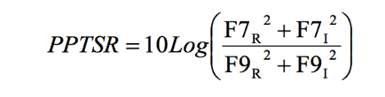
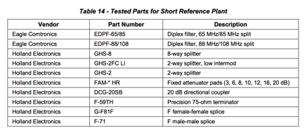
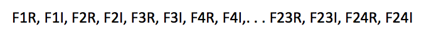
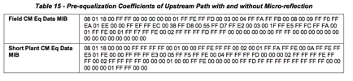
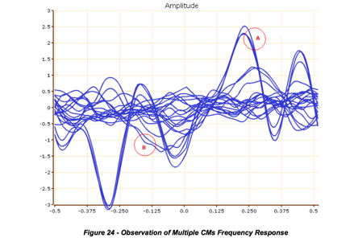
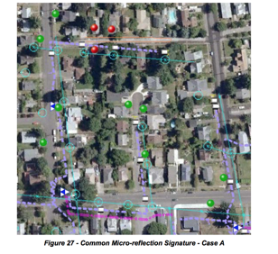
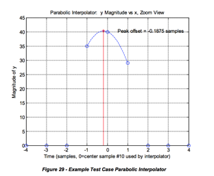
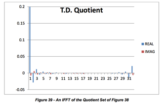
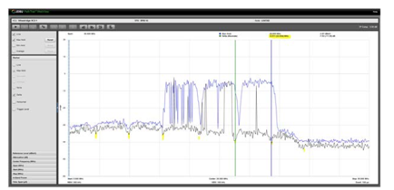
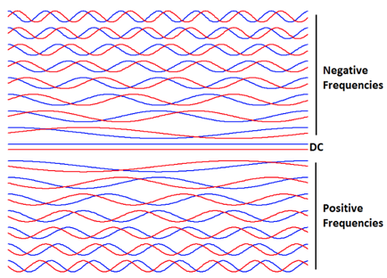

**1****范围**

**1.1****介绍与目的**

随着有线网络的发展，电话，数据，视频，业务和高级服务（如远程医疗，远程教育，家庭监控）等多种服务在网络上传播，维护高可靠性的需求服务增加。
为了达到如此高的可靠性，运营商应在解决问题之前对服务产生任何影响。

一些通常跟踪的电缆调制解调器（CM）和电缆调制解调器终端系统（CMTS）度量包括CM状态; 上行传输级; CMTS上游接收等级;
上行调制误差比（MER，也称为上行信噪比或SNR）; 上行码字错误率（CER）; 下游接收水平; 下行MER / SNR; 和下游CER或误码率（BER）。
虽然这些指标是存在问题的良好指标，但并不总是揭示出这些问题的原因。

智能终端设备越来越多地部署在电缆网络中，终端设备和监控仪器安装在头端（HE）和集线器中。 诸如数字机顶盒（STB），多媒体终端适配器（MTA）和嵌入式MTA
，混合监控系统甚至高端电视机等运营商部署的新设备都具有DOCSIS功能，导致DOCSIS无所不在。
在服务领域，保守的场景中，假设DOCsIS普遍存在，STB机顶盒的60％渗透率，CM的35％，eMTA的15％，DOCSIS都能实现。

随着DOCSIS设备的发展和配备精心设计的监控工具，将其用于工厂监控工作变得务实。 通过使用这些设备作为网络探测器，有线运营商可以收集设备和网络参数。
结合数据分析以及网络拓扑和设备位置，可以隔离问题的根源。 可以使用此信息开发主动维护计划。

本文档介绍依靠DOCSIS上游预均衡系数和频谱捕获的主动网络维护机制的准则和最佳做法。
这里描述的过程将有助于电缆运营商和行业供应商实施智能监控工具，改进维护实践，更好地了解网络问题，并提高网络可靠性等等。

即使开发主动网络维护策略的重点是通过使用预均衡系数，其目的是为了在未来扩大这一努力，以包括可帮助识别和解决工厂问题的其他工厂指标。

这一努力的主要结果是减少故障排除和解决问题的时间，从而降低运营成本。
此外，网络可靠性的提高可以引入需要SLA（服务级别协议）的业务和高级服务，从而产生新的收入。
这种机制增加了在影响客户服务之前检测和解决问题的能力，这有助于减少流失。

PNMP准则文件的V03修订版已更新为使用全频段捕获的DOCSIS 3.0。

即使开发主动网络维护策略的重点是通过使用预均衡系数，其目的是为了在未来扩大这一努力，以包括可帮助识别和解决工厂问题的其他工厂指标。

传统上用于评估性能的有价值的指标包括下行和上行SNR和MER，码字误差统计以及发送和接收电平。 这些指标本身不会促进植物问题源的位置。
然而，当这些指标与均衡器响应和频谱捕获相关联时，这些指标的值增加，因为它们为问题的存在提供了额外的证据。

这一努力的主要结果是减少故障排除和解决问题的时间，从而降低运营成本。
此外，网络可靠性的提高可以引入需要SLA（服务级别协议）的业务和高级服务，从而产生新的收入。
这种机制增加了在影响客户服务之前检测和解决问题的能力，这有助于减少流失。

**1.2 PNM****背景与历史**

运营商多年依赖的八大传统DOCSIS服务指标是CM状态，上行发送级别，上行接收级别，上行信噪比（MER），上行码字错误率，下行接收级别，下行SNR（MER）
和DS码字错误率。 出现的一个问题是为什么需要额外的信息？ 答案是这些指标虽然很有价值，但在回答“究竟出了什么问题”或“服务不佳的根本原因”的问题上却很差。
另一方面，上游均衡和全频带捕获数据对于根本原因更为清楚，尽管仍然需要一些口译技巧。 这是本文档的原因之一。

大多数RF通信系统（包括DOCSIS系统）都使用各种技术来调整和补偿时间，频率，发射功率电平和线性失真的变化。
已经认识到相当长一段时间，有用的植物健康信息可以从描述所发生的补偿和调整的参数中得出。
通过在整个HFC覆盖区域作为网络探测器运行的DOCSIS设备的普及，增强了这种网络监控优势。

提供对DOCSIS上行传输信道特性的深入了解的一些设备参数是预均衡系数。 预均衡技术用于补偿上游信道中的线性失真。
线性失真的例子包括微反射，振幅纹波，倾斜和组延迟失真。 在大多数情况下，预均衡能够完全补偿线性失真问题，而不会使客户感觉到对性能的影响。
这提供了操作者在发生任何服务降级之前解决问题的时间，从而便于主动的网络维护策略。

在电缆领域，预先标准的电缆数据系统供应商，LANcity在其一些产品中具有均衡功能。
然而，由于电缆行业转变为标准的DOCSIS技术，这一专有协议功能并没有被利用。

即使在DOCSIS系统中，由于DOCSIS 1.1规范版本，预均衡是强制性的，因此预均衡数据仅在2005年左右通过部署DOCSIS
2.0兼容设备开始使用。DOCSIS系统具有多种通道宽度和调制顺序配置选项。 运营商较早使用较窄带宽信道（主要为1.6
MHz）和低阶调制（例如QPSK）不需要使用预均衡。 此外，由于某些DOCSIS 1.0 CMs在预均衡化开启时的行为不正当，有些经营者不愿开启预均衡。
在需要增加上游峰值速率和运输鲁棒性的情况下，需要转向均衡。 对更高峰值速率和更高容量的需求导致迁移到3.2 MHz和6.4
MHz带宽通道以及使用高阶调制（如64-QAM）。

DOCSIS 1.0中的均衡是可选的，未指定。 DOCSIS 1.1中的均衡不仅被准确定义，而且对于高达3.2 MHz的信道也是强制性的。 DOCSIS
1.1中预均衡的强制性质以及正确识别和隔离不良行为的CM使电缆运营商能够启用预均衡。

几年后，在DOCSIS 2.0规范发布之后，预均衡MIB也成为可能。 该事件使得可以使用预均衡信息进行网络管理。

Holtzman，Inc.，摩托罗拉和CableLabs的早期工作强调了理解线性失真，加性损伤及其对服务性能的影响的价值。

2005年，CableLabs和Charter Communications收集了科罗拉多州Estes Park的多个节点的均衡前数据。
所收集的数据的一部分容易阅读，但数据的子集显示出明显的相关性。 这是均衡系数解码和归一化努力的开始。
有线电视运营商现在可以开始了解失真签名以及它们与现场问题的关系。

2006年在CableLabs的一系列内部报告和费城SCTE Cable-Tec Expo
2008中描述了使用DOCSIS预均衡系数以及工厂拓扑信息来确定网络中的问题[1]。 这个提出的方法依赖于以下步骤：

1）从预均衡系数推导频率响应特征

2）从频率响应数据中识别和分组线性失真3）影响CM与拓扑信息的相关性，以确定问题的原因。

由CableLabs主办的主动网络维护（PNM）工作组于2009年成立，以利用DOCSIS设备获取的信息并对工厂进行故障排除。
该组织包括有线电视运营商，CableLabs和硅，CM，CMTS和仪器供应商。 PNM工作组的任务包括制定将均衡前签字与现场问题相关联的技术。
北美有线电视运营商康卡斯特的PNM工作组参与不仅有助于大量现场数据的使用来了解预均衡系数信息，而且还提供了与什么失真特征相关的损害的有价值的现场信息。
PNM工作组的一个关键成果是2010年发布的“使用前置均衡的主动网络维护的最佳做法和指导原则”[2]。

原始的PNM工作组输出也导致运营商实施基于PNM的工具。 运营商开发的均衡分析工具的第一个实现是Comcast的Scout Flux工具。
该工具在2009年实施和发布。康卡斯特的技术人员在确定各种植物损伤情景及其签名方面发挥了不可或缺的作用。 Charter的Node Slayer
PNM工具以及其他有线电视运营商的工具。

虽然PNM工作组最初专注于上游预均衡，但还讨论了其他主题。 这些主题包括下游均衡，仍然缺乏MIB解释的合规性和差异性。 上游频谱分析在DOCSIS
3.0中为单通道所需，但由众多CMTS供应商在整个上行频谱中以专有方式支持。 思科系统负责评估LTE入口对性能的影响。 DOCSIS
3.0中引入多个绑定通道导致高采样率接收器实现。
行业领先企业如Broadcom利用CPE频谱捕获或全频段捕获（FBC）1功能，Comcast在其可用性不久之后将其引入其网络管理系统。

FBC使运营商能够在现有DOCSIS 3.0 CM部署的地方进行频谱分析功能。
这使得操作员能够在客户驻地进行远程频谱捕获，而不必携带昂贵的频谱分析仪，而不需要访问订户的家庭。 FBC产生了显着的运营优势，更不用说运营成本节省。
随着部署的DOCSIS 3.0 CM数量的增加，这些频谱分析探测器已经收集到临界质量，并且能够将来自相邻CM的频谱签名相关联，以排除和定位问题。
频谱的宽度（全频带）允许操作者在通过均衡分析单个通道时，检测到非常短的微反射。 FBC还能够验证通道级对齐和入侵检测。
激活前后CM签名的相关性使得能够检测放大器的非线性问题。 正在实施自动频谱签名分析和减值检测，以便将分析扩展到使用此功能部署的数百万个CM。

FBC的扩展能力是CM的上行频谱捕获。
虽然较低频率的上行信号在双向滤波器的下游接收器端口被衰减，但在许多情况下，足够的能量通过以允许检测用户驻地处的脉冲噪声。
这是一个非常有前景的技术，可以通过CM设计来增强，包括例如双工滤波器旁路。

最近，利用Comcast，Armstrong Cable和Suddenlink
Communications收集的现场数据，CableLabs已经证明了均衡系数变异性与MER变化与脉冲噪声之间的相关性。
这为解决某些类型噪声的入口定位问题打开了大门。 入口定位是在HFC设备故障排除中征服的其余挑战之一。

PNM工作组的工作对于将PNM工具纳入DOCSIS 3.1规范至关重要。 在Broadcom的领导下，DOCSIS
3.1在规范中纳入了允许系统仿真频谱分析仪，矢量网络分析仪，矢量信号分析仪和其他工具的钩子。

在PNM文件初次发表五年之后，本文件将提供更新版本。 已经讨论了主动网络维护领域的不同创新，但没有记录。
本文件的目标是在上一次出版物之后纳入PNM领域的所有相关主题。

**2****参考******** 2.1信息参考**

[DOCSIS OSSIv2.0] [DOCSIS OSSIv3.0] [DOCSIS PHYv3.0] [DOCSIS RFIv2.0]
[RFC4546]

有线电视实验室有限公司CM-SP-OSSIv2.0-C01-081104 2008年11月4日的操作支持系统接口规范

有线电视实验室有限公司CM-SP-OSSIv3.0-I28-151210，2015年12月10日的操作支持系统接口规范

物理层规范，CM-SP-PHYv3.0-I12-150305，2015年3月5日，Cable Television Laboratories，Inc.

无线电频率接口规范，CM-SP-RFIv2.0-C02-090422，2009年4月22日，有线电视实验室公司

IETF RFC 4546，射频（RF）接口管理信息库，用于通过有线电视业务接口规范（DOCSIS）2.0兼容RF接口，2006年6月。

**2.2****参考获取**

有线电视实验室有限公司，858 Coal Creek Circle，Louisville，CO 80027; 电话\+ 1-303-661-9100;
传真\+ 1-303-661-9199; [http://www.cablelabs.com](https://translate.googleuserco
ntent.com/translate_c?depth=1&hl=zh-
CN&rurl=translate.google.com.hk&sl=en&sp=nmt4&tl=zh-
CN&u=http://www.cablelabs.com/&usg=ALkJrhiN4XIYtubB0G20L4Hpv77G_ANhBA)

**3****条款和定义**

**4****缩略语和缩略语**

**5 PNM****使用****UPSTREAM****均衡**

**5.1****反向与主动网络维护**

在本文中，无线网络维护的定义是一个严格的定义，在多媒体业务和高级服务的时代，也许是电缆行业应该遵循的。
反应性网络维护包括由显示服务性能受到影响的度量启动的网络维护实践。 根据这个定义，不要求客户反馈/网络维护要求被反应。
只要检测到诸如FEC统计，功率不足，CPD，窄带干扰，激光削波，脉冲噪声和其他服务影响症状的条件，则对此的响应是无效的。
在通过预均衡完全纠正的失真的情况下，不会对性能产生影响，因此这些损害发现产生的维护动作被认为是主动的。
如果有性能影响条件与通过均衡检测到的失真相结合的症状，其产生的维护仍被认为是反应性的。

导致网络维护被归类为无效的损害可能会被更高优先级解决，因为它们已经在影响性能。

在大多数情况下，上游预均衡机制可以完全补偿网络中的某些问题，并且在FEC统计信息或其他度量标准中没有检测到任何症状。
事实上，均衡可以完全补偿网络线性失真，可以在运营商解决问题之前，先获取运营商的时间，从而实现主动网络维护策略。

**5.2****线性损伤**

在CATV网络的上游部分有不同类型的损伤。 这些可以基于这些损伤对信号作为线性以及非线性损伤的影响进行分类。
在“线性”损害的情况下，对信号的影响将由原始信号的幅度和相位的变化给出。
在“非线性损伤”的情况下，信号产生包括原始信号的谐波的失真分量，或将原始信号与返回频带中存在的其他能量相乘。
例如，在线性失真的情况下，通过上行信道的发送信息将导致给定频率点的振幅和相位偏差。
类似于无线多路径信号的微反射可能是由于具有阻抗失配的两个接口之间的信号的来回反弹而产生的信号的幅度和相位失真作为时间延迟信号的和复制 \-
反射或回波结合所需信号。 线性失真的第二个例子出现在双重滤波器滚降中，标注42MHz左右的上行频谱的上边缘。
在这种滚降频率下，振幅和相位会产生相当大的失真。 特别地，相位失真在到达带边缘之前是明显的。 当表示为组延迟时，该相位失真更容易显示，其定义为：

_GroupDelay_ = - _dφdω_

其中φ是以弧度表示的相位，ω是以弧度/秒为单位的频率，组延迟以秒为单位。 群体延迟在感兴趣的乐队中是理想的恒定的。 已知群体在整个频段的延迟变化

作为组延迟失真。 关于线性损伤的其他讨论可以在附录一的教程材料中找到。

要记住的一件事是，即使被认为是“非线性”的损伤，例如公共路径失真（CPD）也可能具有相关的线性失真元件。
例如，产生混频器效应的中心导体的腐蚀也会导致阻抗失配，从而产生明显的微反射。

非线性损伤的例子包括前面提到的CPD，以及复合二阶（CSO）和复合三拍（CTB）失真，交叉调制和激光削波。
入射和脉冲噪声被认为是附加损伤，但是如果诸如脉冲噪声的损伤足够高以致导致激光削波，那么也可以将其视为非线性的。

**5.2.1****微反射型**

以下部分描述了在HFC网络内可能产生微观反射的多种情况。 微反射示例1描述了具有低回波损耗（R）值对微反射源有贡献的HFC分量的情况。
微反射实施例2描述了其隔离性能和阻抗失配对微反射源有贡献的HFC成分的情况。 最后，微反射实施例3描述了微反射损伤代表前两种情况的组合的情况。
微反射源不限于此处提供的示例。 有关微反射的更多信息，请参阅本文档的教程部分。

**_5.2.1.1_****_微反射示例_****_1_**

当上游信号在其到CMTS的上行路径中的某处遇到阻抗失配时，出现这种常见的微反射，导致信号的一部分能量重定向到CM。
一旦重新定向的信号变得入射到另一阻抗失配上，则其被引导回CMTS。 图1示出了起始于两个反射点Γ1和Γ2之间的电缆上标有上行信号＃2的上行信号。
然而，上游信号可以起始于图1所示的第一反射点Γ1的下游，即上行信号＃1。 上游信号的大部分通过阻抗失配并继续朝向CMTS，并在图中标记为主信号。
上游信号的一部分在Γ1被反射回信号源。 该反射信号遇到第二反射点Γ2，其将反射信号能量的一部分反射回原始信号的方向，表示为图1中的反射信号。

这种一般情况描述了通过两个反射器的信号，它们都不是CM本身。 确定CM是否是反射器之一的一种技术是在CM端口（上游输出）处添加一个3 dB的内联衰减器。
如果微反射幅度减小6dB以上，由于反射信号通过衰减器两次，所以CM确实是反射器之一。 如果微反射幅度没有明显的变化，那么这对反射器就位于CM位置。
这种增加衰减的技术将同样适用于隔离网络中其他地方的反射，但是在线路无源器件之间安装衰减要困难得多。

来自Γ2的反射信号向上游进行，并且再次遇到反射点Γ1。 这又引起了下游的反射，而且这个过程是无休止的。
（它类似于在镜子中看到一个反射镜，当后面有另一个镜子时，会有无尽的图像序列，每个图像逐渐变小）。Γ1和Γ2之间的每个通道称为中转。
主要的微反射回声来自于三重传送，上/下/上。 下一个回声来自于5阶转移向上/向下/向上/向下/向上，等等。
这种类型的反应，永远是被称为无限脉冲响应（IIR）。
它由一系列回波组成，由相等延迟（等于点Γ1和Γ2之间的传播延迟的两倍）分开，每个回波值小于最后一个（通过相同的比率Γ1Γ2或dB差异10 logΓ1 +
10logΓ2）。 在通过微反射源进行两次或三次跳闸之后，衰减的微反射可能会在噪声底层中迅速丧失。

相反地 ，自适应均衡器响应大约是信道响应的倒数，在这种情况下在主抽头之后将只有一个点击。

尽管图1中的反射器示例是进料器抽头，但是应该注意的是，许多器件可以产生类似的结果，包括损坏的电缆或腐蚀的接头，这往往是微反射的原因。

注意，回波之间的延迟等于两个反射点Γ1和Γ2之间的传播延迟的两倍，因此两个反射器之间的距离是已知的。
然而，这并不表示这两个反射器的植物距离多远，即植物受损的位置。 要确定故障的位置，需要附加信息，如第6.6节“故障定位”中所述。

**_5.2.1.2_****_微反射示例_****_2_**

第二种类型的微反射可能发生在网络中的任何地方，但其幅度在位于最高值馈线分接头之外的CM中最为显着。 图2描述了从CM发送其上行信号到23
dB馈线分接头端口的上行信号流。 工厂设计的目的是上游信号流的主要路径朝向页面左侧，朝向CMTS。
一些信号能量可以从放大器反射到23dB馈线分接头的左侧，但由于放大器的良好的阻抗匹配，这种能量通常是无关紧要的。

23 dB馈线分接头是定向耦合器和分离器的组合，意味着其在上游方向引导上行信号。 进料龙头的方向性不完美。 来自CM的一些能量可能向输出连接器泄漏。
这是隔离进料龙头的功能。 隔离指定所有端口终止，电缆行业现场实践经常不遵守终止未使用的馈线端口。 此外，进料龙头的腐蚀会降低其隔离性能。

如果一个23 dB的馈线分接头具有仅38 dB的抽头端口到输出端口隔离，则会产生两个信号路径，一个具有23 dB衰减，一个附加信号沿着另一个方向，只有38
dB的衰减。 如果这个附加信号与23馈线抽头下游的反射器相遇，则附加信号将被反射回上游信号的方向，并且将与起始的23 dB馈线分接头处的主信号相结合。
在这种情况下，在第一馈电抽头，23 dB馈线分接头和带有开放式端接的低值馈线分接头之间的电缆长距离无间隙的情况下，可以很容易地观察到这种微反射。
所有这些未端接的进料器抽头端口都产生自己的微反射。 这种情况通常会产生多次微反射，并且由于在11 dB馈电龙头处有一个开放端口，另一个在8
dB馈线分接头处，将有两个不同的电缆长度，从而产生两种不同的微反射延迟特性。

这种情况是重要的，因为反射器Γ1不在CM和CMTS之间的设备的树中，而是包括在CM馈线分接位置下游的设备。
如上所述，这种现象在高价值馈线分接头上更为显着，因为当馈线抽头值减小时，期望信号和微反射之间的幅度差增大。 如果23 dB馈线分接头和11
dB馈线分接头都具有35 dB抽头端口到输出端口隔离，则期望和微反射信号之间的隔离度将 增加12 dB。 此外，23
dB馈线分接头位置靠近放大器，其后是长度较长的电缆，其中11 dB馈线分接头位于电缆末端附近，因此11 dB馈线分接头的电缆长度较短，反射延迟特性相应减少。

这种类型的微反射不具有无限的IIR响应，因为来自Tap 8的反射能量通过Tap 23相对不受阻碍并继续上游。
这种在单次回波之后停止的响应称为有限脉冲响应（FIR）。 签名将显示单个主回波，而没有拖尾回波。

相反地 ，自适应均衡器响应大约是信道响应的倒数，对于这种情况将具有一个较小和较小抽头的序列。
这是因为均衡器在内部生成额外的回波，因为它消除了信号中的原始回波。 当它产生回声时，它必须使用另一个水龙头取消新的回声。
该过程继续进行，直到达到均衡器抽头延迟线的结束。 在这一点之后任何剩余的回波能量都没有补偿，并导致RxMER的减少。

总而言之，多路传输回波场景（示例1）在信道响应中具有不间断的衰减回波序列，并且相应的自适应均衡器响应具有单个回波。
单反射场景（示例2）在其信道响应中具有单个回波，并且相应的自适应均衡器响应具有继续到均衡器抽头延迟线结束的衰减的回波序列。

**_5.2.1.3_****_微反射示例_****_3_**

图3表示在微反射例1和微反射例2中描述的先前情况的叠加的情况。如果放大器的回波损耗差，则存在反射点。 所需信号的一小部分被放大器的输出Γ1反射，并在下游传播
到线路末端的开放式连接或开放的馈线分接头Γ2，其中反向朝向放大器的方向并重新加入原始信号在馈线分接位置。

如果放大器和馈线分接头位于一起或非常靠近在一起，则前述微反射示例1和微反射示例2之间的微反射延迟特性几乎没有差别。实际上，它们可以增加或取消彼此出来

然而，如果放大器是距离馈线分接头的极距或更远，则可能会为单个未端接的馈线分接头产生两个不同的不同的微反射。 这些微观反射通常是低度的;
比入射信号低30dB或更多，但是它们在单个放大器到终端间隔中可以是众多的。

可以想到，通过包括微反射源的HFC组件的连续多次通过可以发出多次微反射。
仅存在单一微反射的情况可能仅限于微反射损伤的实验室模拟，并且在HFC网络中可能不会实际遇到。

电缆行业倾向于“封顶”未使用的馈线端口，而不是端接端口。 一些运营商将保卫这一职位，因为它声称会减少潜在的入口来源。
实际上它是工艺完整性和良好的阻抗匹配实践之间的权衡，这对上游自适应均衡器造成更多的压力。

**_5.2.1.4_****_微反射实施例_****_4_**

图4示出了从图中的大“X”行进到单个反射，该反射被认为具有高的回波损耗，该反射从图中的大的“X”行进到源（图中的水龙头或者除了图的左边缘之外的一些其他装置）
，导致非常低的振幅反射到原始的反射点。 事件和反射能量的相互作用产生驻波（振幅波动）。
然而，净效应是CM在下游看到一个平坦的频率响应，而CMTS看到一个平坦的上行频率响应。 不幸的是，一些能量损失，所以接收信号水平将会很低。
（注意：丢失的RF能量有时表示信号泄漏。）如预期的那样，这种类型的损伤很难检测。
检测这个问题的一种方法是通过现场的驻波测量，这需要用高阻抗探头（如Trilithic
I-Stop）探测线路，如图4所示。请注意，如果系统具有回波隧道造成的两个植物缺陷，修复缺陷之一将导致回波隧道消失，但其他缺陷仍然存在。
有关这种检测类型的讨论，请参见附录八。

**5.3****通过****DOCSIS****测距启用预均衡机制**

上游预均衡机制依赖于DOCSIS测距过程的相互作用，以便确定和调整CM预均衡系数。 意图是让CM使用它

系数来预测上游信号，使得预失真等于上游路径失真的近似反向，使得当预失真的上行信号通过网络时，其被校正并在CMTS的上游接收机处到达失真。

CM的预均衡系数是图5所示的24抽头线性横向滤波器结构的复系数（F1到F24）。

在这种结构中，具有z-1标签的块表示延迟元件，DOCSIS 2.0预均衡器中的每一个都是符号周期T（在DOCSIS 1.1中，它也可以表示等于T / 2和T
/ 4的延迟）。

在测距过程中，CM向CMTS发送测距请求消息（RNG-REQ）。
CMTS可以使用该消息的已知部分，例如前导码，以及其他已知消息来确定接收信号的质量，以及确定CM应对其预均衡系数进行调整以更好地补偿上游失真。
响应于RNG-REQ消息，CMTS发送具有一组24个系数的测距响应（RNG-RSP）消息，以及指示这些系数是否旨在导致CM的设置或调整操作的参数。
在设置命令的情况下，CM将使用CMTS发送的系数替换其现有系数。 在调整命令的情况下，CM将其系数与CMTS发送的系数进行卷积，以实现调整后的系数（图6）。

CMTS可能不完全满足CM在初次尝试后发送的信号的质量。 这是一个迭代过程，在系数稳定之前可能需要几次交互。

CMTS实现大部分使用传输均衡调整选项来传达信息。 只有在初始测距请求之后，可以看到CMTS发送发送均衡集消息，以确保CM正确初始化。
原则上，当CMTS需要重置系数时，CMTS可以使用该消息。

完全满足预均衡系数的值的CMTS发送调整消息，其中所有系数都为零，除了具有最大值或标称值的预均衡器的主抽头系数之外。 这表示Kronecker
delta或脉冲函数，并且随着脉冲卷积的任何数据集都会导致原始数据集，在这种情况下，这是原始数据集，在这种情况下，CM预均衡系数不变。

**5.3.1****均衡使能消息**

如前所述，在测距过程中关键的两个消息是范围响应（RNG-RSP）和范围请求（RNG-REQ）消息。 由CMTS响应于RNG-REQ消息生成的RNG-
RSP消息携带定时，频率，功率电平和均衡调整信息以及均衡集或负载信息和测距状态。 该信息按照所谓的类型长度值（TLV）格式进行编码。 DOCSIS
1.1预均衡系数由类型04和DOCSIS 2.0或3.0按类型09标识.RNG-REQ消息对应的RNG-RSP消息由服务ID或SID链接。
SID识别上游服务流。 可能是CM有几个SID。 在这种情况下，CM将通过其拥有的每个SID获取测距信息。
例如，如果CM具有用于电话服务的SID和用于数据服务的SID，则在单个CM内将存在两个并行测距过程。 除了SID之外，RNG-
RSP消息有效载荷还携带上行信道ID。 图7显示了RNG-RSP消息的结构。

RNG-REQ消息由CM生成并发送给CMTS。 使用RNG-REQ作为参考，以确定CM信号是否需要任何调整。 这些调整可能在频率，功率电平，定时偏移和失真。
一旦CMTS接收到RNG-REQ消息，它将使用该消息的已知部分作为信号应该是什么样的参考。 通常，消息的已知部分是前导码。
如果CM没有完成CMTS要求的改变，CM在RNG-REQ消息中包括一个测距状态，指示测距改变是否仍在等待。 这是RNG-
REQ消息有效载荷中的“待处理到完成”字段。 RNG-REQ消息还携带下游信道ID，其将正在使用的上游与下行信道相关联。 图8显示了RNG-
REQ消息的结构。

**5.3.2 CM****和****CMTS****均衡信息**

预均衡系数被加载到CM中的自适应预均衡器中，其用于补偿上游线性失真。 因此，CM预均衡数据间接描述了其补偿的工厂中的失真。
预均衡器响应大约是工厂的反向或相反的响应。 预均衡系数提供了信道失真的详细特征，尽管系数不直接指示微反射的水平。
假设可忽略的群延迟失真和单个微反射，有时可以使用自适应均衡器的非主要抽头中的能量来获得微反射水平的快速估计。
一般来说，需要进行精细的分析，以独特地解决微反射级/延迟特征。
没有变形的上游通道将所有能量集中在自适应均衡器主抽头中，而呈现失真的能量在主抽头以外的抽头中也具有能量（图9）。

CMTS继续发送到CM的预均衡数据指示CM通过显示剩余的补偿来实现理想接收，使CM成功地补偿失真。
理想地和典型地，CM从无补偿开始，并且在几个测距间隔之后，达到CM补偿所有失真的稳定状态。
此时，CMTS预均衡数据呈现平坦的响应，表明不需要进一步的补偿（图10）。

分析由CMTS收集的上游CM均衡数据，以验证是否已经补偿了任何工厂失真。
存在失真如此严重（例如，具有非常长的延迟的微反射）的可能性，即预均衡处理将不能完全补偿它。
这些情况在当前的HFC架构中是罕见的，但是如果确实发生这种情况，则必须意识到仅使用CM预均衡数据的损害识别过程将不会产生准确的结果。

**5.4 DOCSIS 1.0****，****DOCSIS 1.1****和****DOCSIS 2.0****中的上游预均衡**

DOCSIS 1.0中的上游预均衡被保留为可选的，CMTS和CM之间的均衡过程没有被充分详细地定义。 当DOCSIS
1.1和2.0引入了明确的过程时，出现了意想不到的结果。 在由1.1或2.0 CMTS产生的下游RNG-RSP消息的存在下，实现预均衡的几个1.0
CM表现出不稳定的行为。
在相当长的一段时间内，运营商没有动力去预均衡，部分是因为对容量和频谱可用性的需求不足以保证使用更广泛的频道，高阶调制或靠近边缘的频率出现线性失真的上行频谱。

出现此问题的1.0个CM已经使用固件进行了成功的升级，可以解决这个问题。 不幸的是，无法在所有受影响的CM上纠正此问题。
为了支持上游预均衡的可靠使用，运营商已经取代了已知问题的1.0 CM。

**5.4.1 DOCSIS 1.1****预均衡注意事项**

部署DOCSIS 1.1 CM的百分比仍然足够大，不能利用预均衡补偿。 然而，根据1.1 CM人口的百分比和1.1
CM版本随时间减少的速度，重要的是确定本文档中描述的程序在何时将值得实施。

**5.5****均衡前补偿的限制**

在呈现微反射的上行路径的情况下，使用预均衡可以实现的最大延迟补偿受到图5所示的均衡前滤波器结构内可产生的延迟量的限制。可以产生的最大延迟由自适应均衡器的主抽
头和最后的自适应均衡器抽头之间的延迟给出。

在DOCSIS 2.0和3.0中，每个自适应均衡器抽头位置之间的延迟或间距等于符号周期，因为它始终具有自适应均衡器抽头/符号等于1的参数。DOCSIS
2.0和3.0中的典型实现具有主均衡器从第24个抽头延迟线中抽出第8个位置。 因此，在该滤波器结构中可以产生的最大延迟为16T（最后一个抽头位置 \-
主抽头位置），其中T等于符号周期。

在DOCSIS 1.1中，不同自适应均衡器抽头位置之间的延迟可以是符号周期的一小部分。
也就是说，均衡器抽头/符号参数的数量被允许为1,2或4，分别导致T，T / 2和T / 4的自适应均衡器抽头位置之间的延迟差。 此选项在CMTS中尚未实现。
因此，在DOCSIS 1.1 CMTS情景中，可产生的最大延迟等于4T（最后一个分接位置 \- 主抽头位置）。
表1显示了使用典型均衡器主抽头配置（DOCSIS 1.1的第4位和DOCSIS 2.0和3.0的位置8），DOCSIS
1.1和2.0或3.0滤波器结构在不同符号率下生成的最大延迟。

不能假设DOCSIS 2.0滤波器结构可以完全补偿3.125微秒的微反射。
通常相邻均衡器抽头中的能量有助于微调该补偿，并且将延迟推到均衡器的极限的微反射将不具有更长的延迟均衡器抽头以帮助表示精确值。
如果回波延迟不是符号周期的倍数，这是特别真实的，因为均衡器抽头然后不以精确的间隔间隔以有效地消除回波，并且需要更多的均衡器抽头来提供有效的消除。
这将影响更严格的高阶调制场景，如64-QAM，调整更为重要。

另外，在强微反射的情况下，如实施例2所述，均衡器可以具有抽头的衰减序列。为了适当地消除回波，可能需要2或3倍回波延迟的抽头。
这意味着回波必须比均衡器长度短2或3倍。

以下是潜在HFC工厂配置中的几个微反射场景的示例。 第一种情况是在放大器和馈线抽头之间发生的微反射，该放大器和馈线抽头之间的距离为75英尺（150英尺往返距
离），并且在每个反射界面（阻抗失配发生的接口）上具有6 dB的回波损耗。 。 这些接口之间的馈线电缆直径为0.625“，衰减为1.2 dB / 300英尺。
这被认为是强而短的微观反射。 图11显示了第三个过境及其随后的多个过境回波的水平和延迟。

第二种情况是在两个放大器之间发生的微反射，两者之间没有馈线分接头。
它们分开1200英尺（2400英尺往返距离），并且在每个反射界面（阻抗失配发生的接口）上的回波损耗为8 dB。
这些接口之间的馈线电缆直径为1.000“，衰减为0.8 dB / 300英尺。 这被认为是一种强而长时间的微观反射。
图11显示了第三个中转回波（顶部大的蓝色方块）的水平和延迟。 这种微反射的第五个传递回波的幅度太小，值得注意。

第三种情况是在两个放大器之间发生的微反射和两者之间的馈线分接头。
放大器由1200英尺（2400英尺往返距离）分开，每个反射接口（发生阻抗失配的接口）的回波损耗为8 dB。 给料器抽头中的总插入损耗（也称为损耗）等于6
dB（12 dB往返）。 接口之间的馈线电缆直径为1.000“，衰减为0.8 dB / 300英尺。 这被认为是一种轻度和长时间延迟的微反射。
图11显示了第三次传输回波的电平和延迟。 这种微反射的第五个传递回波的幅度太小，值得注意。

图11还指出了可以在不同的DOCSIS配置中补偿哪些场景。 位于垂直线左侧的对应于给定通道宽度/
DOCSIS模式组合的场景可以被补偿，而位于行右侧的场景不能被适当补偿。 还值得注意的是，在靠近垂直线的情况下，高阶调制可能是不可能的。

**_图_****_11 - _****_短时间和长时间微反射情景下的均衡前均衡补偿能力_**

这些例子刚刚讨论了长时延反射的0.625“电缆用于短时间延迟反射和1”电缆。
短时间延迟反射场景包括150'，300'和600'往返距离的数据点，长时间延迟反射包括2400'，2700'和3000'的数据点。

**5.6 DOCSIS****预均衡****MIB**

DOCSIS预均衡系数根据CMTS或CM是否被查询来指示不同的事物。 这可通过MIB中的信息涉及到什么CMTS和CM跟踪在被查询各设备的时间。
通过第5.3.1节讨论的测距交互，CMTS
MIB（docsIfCmtsCmStatusEqualizationData）提供了更新CM系数所需的调整，并实现了上行路径失真补偿。 CM
MIB（docsIfCmStatusEqualizationData）指示应用于上游信号的当前预失真。

MIB格式如下：

**5.6.1 DOCSIS 2.0****和****3.0****预均衡****MIB**

预均衡数据在CM-CMTS信道组合中是相关的。 在DOCSIS 2.0的CM支持单个上行信道，这意味着CM和CMTS报告的单个预均衡的数据值。
在DOCSIS 3.0中，针对CM的每个上游信道测量预均衡数据。 为了适应DOCSIS 3.0中，RFI管理要求被改变和DOCSIS
2.0和3.0具有用于预均衡测量单独的MIB。 每信道预均衡数据测量的附加也可以和在本节简要讨论，以避免对的相应的信息使用的混乱。

**_5.6.1.1_****_每_****_CM_****_预均衡_**

表2显示了用于DOCSIS 2.0和3.0的CM和CMTS的语义相同的管理对象。

**_5.6.1.2_****_每个接口均衡_**

对于原始的RFI MIB要求，对于DOCSIS
2.0和3.0，DOCSIfSignalQualityTable中的docsIfSigQEqualizationData是一个每个接口预均衡数据元素。

对于CM，该数据提供CM处的下游接收机的均衡信息。 在下行方向，CM不依赖CMTS生成均衡系数，但它是这种盲目均衡过程负责。
随着时间的推移，下游均衡系数的变化可用于检测下游频谱中的入射和干扰。 未规定下游均衡结构。 实现者具有区分均衡器结构类型和使用的设计的灵活性。
传统的前馈结构或决策反馈结构是实现示例，尽管可能使用了决策反馈结构。 当前的MIB可能未正确描述实现的下游均衡器的状态。 许多下游均衡MIB实现不可靠。
为了有效利用来自下游均衡器的信息，重要的是通过EC过程引入规范更新。

对于CMTS，该对象旨在报告整个上行信道的某种类型的聚合均衡值。 RFI MIB [RFC4546]阐明了CMTS不需要报告一个空字符串以外的值。

请注意，该均衡数据与本文档的范围无关。

**6****采用上游平衡的****PNM****方法**

**6.1****一般方法和流程**

基于预均衡系数的主动网络维护方法可以通过几个关键的一般组件来描述。

第一个通用组件是数据收集过程。 它包括轮询所有CM和CMTS以从所有配置的上行信道获得预均衡数据。
对收集的数据进行格式完整性验证，并将其归一化为对比较有用。
为了可扩展性目的，数据收集过程使用更频繁的轮询周期来进行，所述轮询周期表现出高于所有CM的预定水平和较不频繁周期的明显失真。

第二个一般过程包括对所监视的所有CM进行的初始失真评估。
该过程使用非主抽头对总能量（NMTER）比率来区分哪些CM应该更详细地检查，并且应该在下一个粗略的监测周期中进行评估。

该方法的第三个组成部分进行了详细的分析，包括校准过程和从频域和时域分析中失真特征的确定。 这些签名包括组延迟和微观反射。
在多个不同的微反射的情况下，在鉴别过程之后获得签名。

第四个组件采用失真特征，并评估是否从静态角度将其归为红色，这意味着需要立即采取行动，或者指示应该更频繁地监测CM的黄色，并且其失真数据被存储以供随时间观察。
将更多频繁地检查哪些CM的信息传递给数据收集处理。 绿色分类表明不需要采取任何行动。

第五个过程采用CM签名，并在光纤节点的服务区域内识别几个CM共同的微观反射。
下一个过程通过比较黄色分类CM中收集的历史数据来确定间歇性问题或趋势性问题是否令人担忧，并可能需要采取行动。

最后一个过程是将受影响的CM或CM与外部工厂拓扑相关联，并使用该信息来确定故障位置。 图13示出了刚刚描述的过程的图。

**6.2****格式验证，规范化和指导**

预均衡信息的结构已在第5.6节中进行了描述。 如何解释此结构中的值取决于实现。 标头中的前四个字节长的元素将以十六进制模式解释。
例如，十进制中自适应均衡器抽头值为18的数量为24（图14）。
在包含实数和虚数系数的两个字节增量中定义的均衡器结构的其余部分应根据描述实数或虚数系数的整个两个字节或4个半字节的二进制补码进行解释。
例如，2字节的2的补码，如第4实数系数是FFFC，其中2的补码是-4（红色圆圈）。

系数的表示在CM供应商之间往往不同。 最大幅度有变化，以及系数解释方式的变化。 表3突出显示了部署最受欢迎的CM所存在的不同解释。

CM供应商对如何解码系数有两个解释。 一个是四个半字节2的补码解释，另一个是三个半字节2的补码解释。
四个半字节2的补码解释是规范假设的，但是有三个半字节2的补码解释部署了大量的CM。 关于最大幅度，CM的最大幅度等于2047,1023或

1  如果系数被归一化，则CM的最大系数幅度的差异变成粒度差。 差异成为系数的解码解释之一。

**6.2.1****四位半字节****2****的补码预均衡系数表示法**

在该实数或虚数系数表示中，使用整个四个半字节（两个字节）。 这意味着如果第一位为0，则其余位表示正整数二进制数。 如果第一位为1，则为负2的补码。
实际值可以通过反相位和加1来计算，导致数字的负数。 正面和负面的例子都包括在下面。

a）000D = 0000 0000 0000 1101 = 13

b）FFFE = 1111 1111 1111 1110反相后加1→0000 0000 0000 0001 + 1 = 0000 0000 0000
0010 = 2→数字为 \- 2

**6.2.2****三个半字节****2****的补码预均衡系数表示**

在该实数或虚数系数表示中，两个系数字节中的最后三个半字节用于计算。 在这个解释中，第一个半字节是0，这可能会错误地导致一个人认为所有的系数是正的。
只有在消除了第一个半字节之后，才能判断一个数字是正数还是负数。 这意味着如果第五位为0，则其余位表示正整数二进制数。 如果第五位为1，则为负2的补数。
可以通过反转三个半字节的位并加1来计算实际值。这是有问题的数字的负数。 正面和负面的例子都包括在下面。

a）000D = 0000 0000 0000 1101→消除第一个半字节→0000 0000 1101 = 13

b）0FFE = 0000 1111 1111 1110→消除第一个半字节→1111 1111 1110之后，反向和加载1→000000000001 + 1
= 000000000010 = 2→Thenumberis-2

**6.2.3****通用解码**

因为在当前实现中，系数可以采取的最大值总是小于或等于2047，所以第一个半字节从不被使用，并且可以被去除以产生通用解码器。
在去除第一个半字节之后，解码过程将与第三个半字节处理相同。

**6.3****主要指标**

DOCSIS 2.0上游预均衡器的实数和虚拟复系数定义为：F1R，F1I，F2R，F2I，F3R，F3I，F4R，F4I。 。 。
F23R，F23I，F24R，F24I，并将用于定义以下几个关键指标。

**6.3.1****自适应均衡器主抽头能量**

DOCSIS 2.0中的自适应均衡器主抽头通常在抽头位置8，尽管一些CMTS实现可以使其低至第六位置。 在DOCSIS 1.1中，主抽头位于第四位置。
均衡器抽头能量由系数的实部和虚部的平方和之和给出。

假设第八位的主抽头能量（MTE）被定义为：

**6.3.2****主抽头额定功率和主抽头额定幅度**

根据CM实现，DOCSIS预均衡抽头具有不同的标称或最大幅度。
CM的幅度实现的最大值是2047,1023或511.这个参数在这里被定义为主抽头额定幅度（MTNA）。 标称振幅的平方得到标称的抽头能量。

主抽头额定能量（MTNE），假设主抽头位于第八位置，定义为：

**6.3.3****主水龙头能量**

在主抽头之前的所有均衡器抽头中的能量的总和提供了主要的抽头能量

（PreMTE）。 假设第八个位置的主抽头的预主抽头能量定义为：

**6.3.4****主塔后能量**

在主抽头之后的所有均衡器抽头中的能量的总和提供了后主 抽头能量（PostMTE）。

假设在第八位置的主抽头的后主抽头能量定义为：

**6.3.5****总开关能量**

所有均衡器抽头中的能量总和提供总抽头能量（TTE）。 总抽头能量定义为：

**6.3.6****主抽头压缩**

CM的自适应均衡器主抽头压缩（MTC）是继续依赖均衡补偿过程的可用余量的良好指标。 大于2dB的MTC比可能表明不能成功地实现均衡补偿。
该度量由所有抽头中的能量与主抽头能量的比率给出。

以dB表示的主抽头压缩定义为：

CM的主抽头压缩转换为传送到CMTS的较低RF功率电平。 2 dB的MTC导致CMTS接收到的输入功率降低了2 dB。

在正常工作条件下，CMTS的主抽头压缩是不可预期的。 CMTS的主抽头压缩任何级别都会引起警报。

**6.3.7****主分流比**

自适应均衡器主抽头比（MTR），主抽头中的能量与所有其他抽头组合的能量之比是有用的失真度量，用于确定上游路径中的失真水平。
地铁与非主要抽头与总能量比大致相同（NMTER，见第6.3.8节），除非是非常高的失真水平。 在大多数情况下，可以使用地铁来代替NMTER。

**6.3.8****非主龙头到总能量比（失真度）**

自适应均衡器的非主要抽头对总能量比是另一个有用的“失真度量”来确定上游路径中的失真水平。 该参数可用作初始评估工具，以确定需要进一步更频繁地检查哪些CM。
该失真度量被给定为在所有自适应均衡器的抽头中存在于主抽头中的总能量与能量之间的总能量的比率。

以dB表示的非主要抽头与总能量比定义为：

请注意，分子中的主要抽头能量缺失。 非主要抽头能量比也是MER的良好估计，假设信号不受不被认为是线性失真的损伤的影响，例如突发噪声和非线性损伤。

基于CMTS信号的线性失真量，CM信号具有的上行性能类型是CMTS的非主要抽头对总能量比的一个很好的指标。
如果使用64-QAM信号假设可忽略不计的误差为27 dB CNR，则对于可比较的性能，可以假设NMTER目标值为-27 dB。 如果30 dB
CNR是出现可校正错误的阈值，那么当可校正错误开始出现时，也将对应于-30 dB NMTER阈值。
这个CNR与NMTER关系可以用于从NMTER值确定阈值。 操作者可以为64-QAM操作立即采取-27dB的NMTER阈值（红色），更频繁（黄色
）NMTER阈值为-30dB。

**6.3.9****前主点击总能量比**

自适应均衡器的预先抽头与总能量比（PreMTTER）是一个有用的参数，以及自适应均衡器的前后抽头对称，以确定上游路径中的组延迟水平。
该失真度量是所有抽头中的主主要抽头能量与能量的比率。

以dB为单位的预主要抽头与总能量比定义为：

**6.3.10****后主点击总能量比**

自适应均衡器的主要抽头与总能量比（PostMTTER）是评估微反射损伤贡献的有用参数。 该失真度量是所有抽头之后的主抽头能量与能量的比率。

以dB表示的后主抽头与总能量比定义为：

**6.3.11****前后能量对称比**

前后能量对称比（PPESR）以及预先抽头与总能量比是用于指示上游路径中群延迟的存在的有用参数。 该失真度量是柱子与主要主抽头能量比的比率。

以dB表示的前后能量对称率定义为：

为了实际的目的，可以仅使用与主抽头相邻的两个抽头来近似预柱前能量对称，给出了柱前抽头对称比（PPTSR）：

**6.3.12****组延迟失真**

组延迟失真是一种线性失真，也可以通过预均衡处理来校正。 图15显示了增加级联活性物质的群体延迟增加频率。
该配置不包括扼流圈在频谱的较低部分（通常为5-10MHz）的影响，并且不考虑附加的在线均衡器。

如图15所示，在位于带边缘的通道中，组延迟高达300 ns的变化。 在存在组延迟失真的情况下，预抽头均衡系数能量增加。
教程部分（附录I）将讨论更多的组延迟细节。

**_6.3.12.1_****_无微距反射带边缘组群延迟失真_**

表4，图16和表5涉及DOCSIS信道处于带边并且没有微反射存在的场景。 表4显示了当上游通道处于带边缘时，组延迟失真对抽头能量的影响，并且不存在微反射。

图16显示了如何在带边缘进行操作时，预先主抽头能量随着级联深度的增加而成比例地增加。 这是群体延迟失真对自来水能量的影响的特征。
通过观察植物拓扑图中的级联深度，可以隐藏组延迟失真的影响。 在工厂拓扑图中可能不明显的在线均衡器可能像放大器内的双工器一样有助于失真。
在严重失真情况下，可以使用前主抽头能量的评估来确定某些CM是否应该移动到上游频带中间的较低失真信道。

表5中值得强调的关键指标是PreMTTER随着级联深度而增加，而PostMTTER显示低值，因为没有微观反射。
PPESR显示高正值，因为在这种情况下，主要损害是群延迟失真。 MTC的低值表示预均衡补偿有效。

**_6.3.12.2_****_具有_****_0.5μs_****_微带反射的带边缘的组延迟失真_**

表6，图17和表7涉及DOCSIS信道处于带边缘但还存在0.5μs微反射的场景。 表6显示了组延迟失真对抽头能量的影响。

图17显示了当在带边缘工作时，如果在图16中描绘的没有微反射的情况下，预主要抽头能量随着级联深度的增加而增加，而不是显着地增加。这是由于需要一些预主要的抽头
能量以补偿由组延迟失真引起的预先抽头能量的微反射。
通过使用更靠近主水龙头的水龙头进行补偿的较短的微反射比使用较高值水龙头的较长的微反射，能量泄漏到预主水龙头区域更为普遍。

 表7中值得强调的主要指标是级联深度增加的PreMTTER。
PostMTTER显示了一个高值，表明存在微反射。 PPESR显示负值，因为在这种情况下，主要的损害是微观反映。
组合群延迟失真和微反射本身通过预均衡过程得到适当的补偿，尽管MTC的一些增加开始显现。

**_6.3.12.3_****_上游带中微波反射失真_**

表8，图18和表9涉及DOCSIS信道在0.5微秒的微反射存在的上游频带的中间运行的场景。 表8显示了失真对自来水能量的影响。

图18显示了当在频带中间操作时，如果组延迟相当平坦，那么随着级联深度的增加，预主抽头能量没有增加。
（参见图15.）图18显示了补偿微反射后主抽头能量的使用方式。 图18还说明了如何使用少量的预主抽头能量来补偿分数延迟0.5微秒的微反射。
当微反射延迟与抽头延迟不一致时，使用相邻的抽头进行补偿。 这就解释了为什么在图17中，增加级联深度的主主要抽头能量的增加并不如图16所示的“组延迟”情况那么
明显。组延迟失真和0.5微秒微反射的组合效应可以近似于表示“仅组”延迟的情况的图16的粗略叠加，而图18表示“只有微反射”的情况。

表9中的一些关键指标值得强调。 低的PreMTTER值表示可忽略的组延迟失真。 PostMTTER高值表示存在强烈的微反射。
PPESR显示负值，因为在这种情况下，主要的损害是微观反映。 MTC值高于前两种情况，表明预均衡器可能开始失去其均衡补偿的有效性。

**6.4 DOCSIS****预均衡系数数据收集**

通过使用简单的网络管理协议（SNMP）获得DOCSIS预均衡系数信息。 SNMP管理信息库（MIB）描述了在符合DOCSIS
MIB定义的所有实现中以标准方式可用的信息。

至少有三个数据元素需要完成本文档中描述的数学变换。 这三个值是DOCSIS均衡系数，上游中心信道频率和信道的RF带宽。
三个数据点从电缆调制解调器和CMTS获得。 具有电缆调制解调器系数提供反向信道的视图

均衡前的响应。 CMTS提供从电缆调制解调器接收的反向信道响应的均衡后视图。 这在评估调制解调器的上游预均衡器的性能时可能会有帮助。
它还可以帮助确定损伤发生频繁变化的问题。

除了三个必需的数据元素之外，还有其他指标可用于帮助识别和本地化损伤区域。 由于预先存在的监控系统，这些其他元素可能已经可用。
应该扩展或重用现有数据，而不是过度轮询调制解调器或CMTS。

**6.4.1 SNMP****实现和性能注意事项**

考虑到规模时，大型SNMP实现可以代表独特的挑战。 首先，假设DOCSIS 2.0预均衡系数及其存储为字符，最小的线上网络影响是每个调制解调器/
CMTS对的614字节。 这是使用最小所需数据元素的PDU大小来计算的。
在这种情况下，调制解调器和CMTS系数都是299字节，而频率和RF带宽一起为16.假设二进制表示存储要求是CMTS和CM的每个字节（4字节头部\+
96字节实数和虚数系数数据）每个字节分别用于上行频率和信道宽度，最小为208字节。

例：

**docsIfCmStatusEqualizationData** （299字节字符存储，100字节二进制存储）

08 01 18 00 00 04 ff ff ff fb ff ff fd ff fd 00 07 00 04 ff f8 00 00 00 17 ff
ff ff ff e8 07 f7 ff f9 ff 8a ff 94 ff f7 00 28 00 11 ff ec ff f7 00 19 00 06
ff f5 ff fc ff ff 00 0d ff fb 00 01 00 01 00 04 00 04 ff f6 00 07 00 07 ff fb
00 00 00 08 ff ff f 00 00 00 04 ff fc ff ff 00 08 00 00

**docsIfCmtsCmStatusEqualizationData** （299字节字符存储，100字节二进制存储）

08 01 18 00 FF C8 FF F0 FF F8 FF E8 FF C0 00 20 FF F8 00 38 FF C8 FF D8 00 18
00 18 00 38 FF F0 3F 20 00 00 00 08 00 40 FF D8 FF E8 00 38 FF D0 FF D8 FF B8
00 08 FF D8 00 40 00 40 FF E8 00 00 00 00 FF C0 00 48 00 20 00 20 00 58 00 10
FF F0 00 00 FF E8 FF F0 FF D8 00 50 00 00 FF D8 FF F0 00 18 FF E8

**UpstreamFrequency** （8字节字符存储，4字节二进制存储）29300000 **UpstreamWidth** （8字节字符存储，4字节二进制存储）6400000

具有一百万个设备的614字节的有效载荷翻译成近600兆字节。 在500万台设备上，单个投票表示几乎3千兆字节。
这种流量将分布在CMTS和电缆调制解调器之间。 应仔细考虑对路由器，防火墙，流量监视器，CMTS和其他网络元素的影响。

在大型实施中，将需要大量线程/分布式SNMP处理来满足大量请求。 假设250毫秒往返查询延迟，如果连续执行，100万个设备将需要70个小时的CPU时间。
考虑到大部分CPU时间花费在等待状态，水平扩展的执行可能非常有效。 具体来说，可以通过添加附加的CPU或轮询节点来实现“水平刻度”。
当这个相同的负载分布在1000个进程线程上时，那个时间减少到五分钟。

如果网络拓扑在轮询时是众所周知的，则可以考虑地理上敏感的轮询方法。 此外，市场具体的维护窗口可能是轮询周期时间考虑的因素之一。

**6.4.2****数据收集策略**

最初讨论了三个轮询率，以适应不同层次的分析。 首先，应采用低利率周期来获取用于粗粒度分析的数据的每日基线。
这种粗粒度分析将提供在傅立叶变换之前从原始系数数据计算的几个度量。 粗略度量的分析将缩小有资格进行中等速度投票的设备的范围。
这个二次轮询周期将用于驱动进一步的均衡分析，其包括对频域的傅里叶变换。 中速率轮询的目的是使数据处理层不必要地处理当前在可接受的阈值内操作的调制解调器。
最后，高速率轮询周期将用于为一小部分设备提供低延迟的可见性。 鉴于与投票，存储和分析相关的费用，此阶段应仅保留给最关键或其他物料利益的设备。

**_6.4.2.1_****_低速率（每天一次，可在八小时班次内旋转，可调）_**

基于调制解调器的预均衡系数数据应每天收集一次。 某些植物问题有可能是特定于一天的时间。 这些情景可能包括天气模式，浇水系统和其他基于时间的异常。
假设一个8小时的窗口完成投票（包括维修住宿），三个转变模式应该很好。 这可以通过单次每日投票获得，时间偏移为32小时。
同样地，调制解调器的人口可以除以三，负载分布在整个一天。 在后一种方法中，重要的是旋转三个调制解调器群以正确实现所需的结果（表10和表11）。

基于CMTS的均衡系数数据应尽可能接近于调制解调器收集。 了解从CMTS收集数据的SNMP进程将与调制解调器解耦非常重要。
从CMTS获取此数据的最有效的方式是docsIfCmtsCmStatusEqualizationData表的散步（SNMP）。
这将返回一大堆数据，而调制解调器收集线程是完全独立的，并且与CMTS进程不同步。

使用主抽头压缩和非主抽头对总能量比公式（参见Key Metrics，第6.3节），感兴趣的调制解调器被识别并提升到中速率轮询周期。
这些将保持中等程度的审查，直到达到正确的阈值达某一预定时间。 最初，建议48小时。

**_6.4.2.2_****_中速（每四小时可调）_**

第二级分析需要更多的资源进行收集，存储和分析，因此应根据初步低调率的初步结果进行调整。 此投票将处理感兴趣的子集设备。
可以通过本文档分析部分所述的低，中，高速率轮询来升级/降级设备。 表12和表13示出了中速率轮询示例。

高价（10分钟，可调）

只有具有最高利益的设备将成为高速率投票的候选人。 这通常是手动干预的结果，以便于实时故障排除或现场分析。
一般来说，将在指定的时间段内自动过期的高速率条目将受到限制

**6.5****校准机制******** 6.5.1 CMTS-CM简短参考工厂**

可以通过从端到端信道响应中减去CMTS和电缆调制解调器的贡献来实现改进的准确性，仅留下有线网络的信道响应签名。
确定这两个组件的通道响应失真贡献可以使用简短的参考设备（有时称为六脚厂）来完成，该工厂将CMTS和电缆调制解调器与电缆网络隔离。
然后可以使用自适应预均衡系数来表征组合设备的响应签名，与在操作电缆网络中表征端到端预均衡签名所做的相同。
一旦CMTS和调制解调器响应签名已知，就可以从操作现场测量结果中减去它们。 建议对使用中的每个制造/型号CMTS和电缆调制解调器组合执行此特性。

图19所示的简短参考设备已经用矢量网络分析仪测量，并使用表14中列出的部件进行验证，以提供最佳性能。选择一个双工滤波器，其频率分辨率远高于正常工作频率上限返
回路径。 这将减少双工滤波器的群延迟贡献。 例如，5-42 MHz DOCSIS返回应至少在短参考设备中使用65/85 MHz分离双工滤波器。

互连电缆应尽可能短，并且可以完全消除电缆的情况下，应使用适当的公公或雌女F型接头。 在任何情况下，避免超过图19所示的最大电缆长度。

**6.5.2****预均衡校准方法**

CMTS和CM之间的预均衡过程不仅补偿在工厂中发生的失真，而且还补偿存在于CM内的发送均衡器之前的上游路径中的直到CMTS内的基带接收机之间的任何现有失真。
这包括CM中的滤波器，调制器和放大器，家庭网络，集线器或前端的组合网络以及CMTS中的前端组件（图20）。

如果存在对由CM和CMTS贡献的失真的先验知识，则可以对其进行校准，以便更准确地表示现场的失真。

鉴于有限数量的CM和CMTS实现，生成具有所有可能的CM和CMTS模型对的数据库是可行的。 由CMTS-
CM对和几个完全表征的组件组成的已知的短工厂设置几乎可以确定CM和CMTS内部失真的贡献。
6.5.1节描述了可以测量CMTS和CM的内部特性的已知短期工厂的示例。 CMTS-
CM内部失真通过在允许经过几个维护间隔以实现系数收敛之后收集CM的预均衡系数来获得。

假设在短校准工厂测量的特定CMTS-CM模型对的24 CM预均衡系数的实数和虚数值由下式给出：

对于每个第i个实数和虚数系数，得到所得到的复数，

导致以下复系数

类似地，假设在现场获得的24 CM预均衡系数的实数和虚数值与正在分析的CMTS-CM模型对匹配，由下式给出：

得到的复数系数为

给定24个复系数，并且假定均衡器的主抽头位于抽头位置号8处，则可以使用32元快速傅立叶变换来从时域转换到频域。
抽头8将与FFT输入元件16重合，以保持响应在频率上的相对位置。

系数映射到FFT输入参数如下：

使用短设备测量获得的系数的映射结果如下：

在计算32点FFT之后，获得以下频率响应值：

对于校准，场系数的大小除以短植物系数的大小，并且从场系数的相位中减去短植物系数的相位。

从计算出的幅度和相位值得到校正后的F'out频率响应值

通过将零插入更大尺寸的FFT（例如64,128或256 FFT）可以获得频率响应表示中的附加粒度。

接下来示出校准过程的示例。

图21示出了在现场测量的相同CMTS / CM对中的短校准工厂中的CMTS / CM对的失真。 从CM MIB获得的预均衡系数如表15所示。

前四个字节0 8 01 18 00提供主抽头位置“08”，每个符号“01”的抽头数，抽头数“18”（十六进制数为24）和保留字节。
其余信息是24个抽头的实数和虚数系数数据（每个2个字节）。

短时间场景中的失真主要受到CMTS接收机和CM发射机的影响。
因此，为了校正CMTS和CM的影响，从微观反射场景的频率响应中减去短期工厂的频率响应（微反射关闭）。 图22中的校准响应显示为蓝色。

平均ΔF和ΔA值不再需要，因为校准后的响应在观察的频率范围内相当均匀。

**6.6****故障定位**

故障检测和定位的过程依赖于对整个工厂范围或邻近局部化问题以及针对特定终端设备的网络进行监控。 在这个过程中，假设有详细的节点服务区拓扑的知识。
还假设已经从CM收集失真数据（预均衡器系数和其他适用信息）并进行分析以确定受影响的CM的失真特征。
接下来，描述通过拓扑与失真特征的相关性来确定故障位置的过程。

在图23中突出显示的示例中，以红色标识的一组CM表现出相同的唯一失真。 绿色的CM是不共享特定失真的CM。

假设为了获得失真特征，已经发生了损伤的分析和分类过程。

如果只有一个CM的信息可用，则问题区域只能被隔离到CM和光纤节点之间的路径（虚线）。
当检查与上游路径共享特定损伤（以及不那些）的CM的关系时，更有趣的过程是。

为了估计损伤位置，发现终端设备共享的显示特定损伤的公用路径。 包含损害的此路径通过排除与正常运行的终端设备共享的路径进一步受到限制。

知识的微反射签名也有助于本地化问题。 例如，在图23中，延迟匹配工厂上已知装置之间的距离（例如抽头之间的距离，下降距离或放大器之间的距离）的三重转接反射签名
可以指向可能的原因或缩小可能的集合的原因的问题。

在显示诸如微观反射之类的损伤的终端设备的分析和路径操纵之后，确定问题的潜在位置。
这些区域在图23中以紫色显示。该机制映射具有相同独特微反射属性的设备，并精确定位展示损伤的网络部分。

**6.6.1****故障定位示例**

本节详细介绍了基于微反射签名的故障定位的基本实例。 使用单个光纤节点上的6.4 MHz DOCSIS通道的数据。 数据集的一些限制值得注意。
首先，选择节点不是针对问题场景的多样性，而是选择数字地图的可用性。
因此，发现的微反射并不显着，在大多数情况下，情景检测到在线路终端附近的问题或家庭内部或附近的阻抗失配。
其次，这个节点的6.4MHz信道中的CM数量相对较少，导致了很少的评估场景以及很少的“监测探测器/ CM”，用于准确确定损伤位置。
CM的高渗透性缩小了微反射前缘所在的潜在问题区域。

**6.6.2****确定微反射特征**

微反射特征由一对特征元素组成，与主信号相比，反射信号的相对电平及其延迟。
该级别提供了微反射严重性的指示（有关间歇性问题的严重性分析策略，请参见第6.7.4节）。
延迟表示反射信号或回波所经过的额外距离，以微秒为单位表示（见第5.2.1节微反射类型的定义）。

图24显示了从光纤节点采样的几个CM的频率响应。 为了清楚起见，图中仅包括几个CM。
然而，在现场，如果包含整个光纤节点，技术人员将必须密切注意图表，以区分并提取普通微反射（图24和图25中标记为A和B），从所有微型 \- 反射存在。
尽管如此，本节的目的是探索系统的机制，人为干预可以最小化，作为首选，以提取最相关的案例进行分析和故障排除。
总之，提供如图25所示的共同频率响应的选择的二维表征的微反射签名是可行的。

如图25所示，频率响应的振幅纹波足以确定具有相同微反射的CM组。 必须允许一些振幅变化幅度。
请注意，在少数情况下，相同的纹波幅度范围可以对应于不同的微反射。 在这种情况下，回波延迟的估计可以提供一个明确的答案。
对于典型的光纤节点尺寸，微反射的唯一性的概率非常高。 在罕见的例外情况下，微反射签名对不足以确定CM簇（例如，亚T回波延迟）。
在这种情况下，只有拓扑解析将提供这种条件的最终解析。 图26显示了CM的常见签名相关的方式。
延迟是估计的最大延迟的近似值，它表示为2T，其中T是符号周期的倒数。 这意味着两个反射器之间的距离是基于延迟的一半来计算的。
延迟低于“无需采取行动”的门槛是不相关的。

**6.6.3****确定微反射边界边缘**

对于相关微反射情况A和B，接下来的步骤包括在HFC工厂拓扑中执行本地化。

通过考虑不存在相同签名的路径中的上行方向和其他CM，如本节开头所述确定微反射的后沿。

图27显示了微反射情况A.该微反射可以被认为是类型1和2的组合.CM1和CM2接近于反射信号的分接头，并且CM
3具有相对于距离的距离的回波的额外传输反射水龙头。 因此，CM3（2.8T）的回波长于CM1和CM2。

图28示出了单个子T回波的情况。 两个签名来自同一家庭H1，并注意邻居CM：CM4,5,6和7在注册中不注册与CM相同的微反射签名。

请注意，有限的数据可能导致微反射的非最佳位置。 例如，报告预均衡数据的较少的CM或光纤节点分支中的几个客户将减少准确估计微反射位置的可能性。

**6.6.4****抛物线插值**

在大多数情况下，回波的实际时间延迟不直接落在预均衡器中的水龙头的延迟上。 相反，回波可能发生在位于两个水龙头之间的延迟。
抛物线插值算法的目的是将时间延迟估计的分辨率提高到预均衡器抽头的一小部分。

下面的图29显示了一个示例测试用例。 预均衡器抽头9,10和11分别具有35dB，40dB和29dB的幅度。
我们不关心其他水龙头，因为算法只使用3点内插器，所以周围的水龙头被绘制为零。

算法输入是（局部）峰值周围的3个抽头：（x0，y0），（x1，y1），（x2，y2），其中中间样本（x1，y1）是感兴趣的局部峰值。
x值是预均衡器抽头号（通常在1-24的范围内），y值是以dB为单位的抽头幅度。 经验发现，使用dB值给出了很好的结果; 不需要将dB值转换为功率比。
因此，对于我们的例子，我们对算法有以下输入：

x0 = 9

y0 = 35

x1 = 10

y1 = 40

x2 = 11

y2 = 29

该算法将抛物线（如图中虚线所示）拟合到3个水龙头上。 我们假设抛物线的方程为y = a _x ^ 2 + b_ x + c。

以下代码解决了该抛物线的高峰位置：

输出为（x_out，y_out）。 x_out值通常位于整数抽头数之间，给出精确的时间位置信息。 如果需要精确的幅度精度，也可以使用y_out值。
在我们的例子中，我们有以下输出：

**6.7****严重性评估**

任何运营商服务部门的目标是不可见其客户的经验。 领导人经常检查后验证报告，只是发现失败是水迁移和腐蚀引起的缓慢退化。
换句话说，有一个机会在客户不得不通过电话询问有线电视公司失败之前解决这种损害。 这个问题正好在运营商的预防性维护计划或缺乏维护计划上。
系统扫描等工厂检查计划是一个好主意，但运营商很少有足够的资源来检查，定位和进行维修，然后客户注意到故障。
跟踪区域进行检查后的时间长短，但并不能解决资源问题。 操作员留下的扫描区域/节点显示了故障呼叫或停机次数的增加。 这种方法是反应性的，而不是主动的。

规划有效的预防性维护计划是基于历史实践。 当运营商使用诸如MER（SNR），FEC，T1-T4超时，接收电平和发射功率的统计信息时，这些都是随时间跟踪的重要
变量，正在使用将在主动维护程序中更好地服务的数据。 话虽如此，如果_MER _和_FEC _不好，那么客户已经以负面的方式受到影响。
如果调制解调器在范围请求或响应中超时，那么客户将受到影响。 如果水平在设计的预期范围之外波动，那么客户通常会感到痛苦。
事实证明，自适应预均衡解决了很多植物损伤。 当然，使用自适应均衡器可以补偿多少时间。 特别是当考虑到已经被破坏的事情将继续贬低的事实时尤其如此。
PNM的力量在于能够在MER和FEC之前被警告故障，而其他统计数据开始响起警铃。
如果操作员能够在窗口内解决预均衡节省日期的问题，则可以防止故障呼叫和中断，并保护客户的体验。

运营商需要确定的首要事项之一是地铁门槛是什么是好和坏。 一个好的起点是审查CableLabs关于PNM的第一份文件的原始建议。
该文件中包括以下建议：阈值将决定哪些调制解调器为绿色（无需执行任何操作），黄色（高监视频率）和红色（需要立即采取行动）。 然后可以将该信息用于CMTS健康。
如果阈值显示红色的大多数调制解调器，那意味着必须检查所有调制解调器。 另一方面，如果没有定期检查门槛并更新，运营商可能会缺少改进的机会。
选择阈值时运营商应考虑的几个变量包括放大器级联，节点大小和带宽利用率。

地铁的严重性仍应分为三类：立即采取行动（红色），高监测频率（黄色），无需采取行动（绿色）。

从原始PNM文档中，用于单个CM的三个严重性评估指标定义如下：

第一个严重性度量是一种仅基于地铁相对水平进行的静态分类。

第二个严重性度量来自进行的趋势分析，以便网络运营商可以以将导致在不久的将来立即采取行动（例如一周）的速率识别减值。
该方法需要对收集的测量进行时间戳，以便获得损伤的历史。 通常3 dB的电平变化值得关注。

从高频监测CM的MTR电平的历史比较中产生第三严重性度量。 第三个指标衡量间断性波动，这将被认为是重大的，但没有达到即时行动水平。 测量应在多天内进行。
测量的比较在一天的同一时间进行。 再次，3 dB的电平变化应响起警铃。

值得注意的是，同样的方法可以应用于其他级别，如_微反射_____或______延迟_ 。 _通过对__MTR__使用相同的公式可以计算出微反射水平
，同时利用补偿微反射___Post-MTR_ （通常为9到24） _的均衡器抽头值_ 。 _Group delay _level通常使用抽头1到7计算。

PNM流程新手的运营商可能希望使用以下指标作为第一年或第二年的起点。
向一群技术人员解释说，他们网络的50％或更好的突发性不好将不会激励他们全面掌握一个新的想法。 表16中的指标还将确保网络中最脆弱的部分首先受到关注。

具有短放大器级联的系统可能希望坚持来自CableLabs的原始建议，其表示在表17中。小于4的放大器级联和具有完善的PNM支持团队将属于该类别。
随后将解释的植物健康指数将在5个附近得到很好的解决，因为有改善的空间。

运营商应该考虑的另一点是当调制解调器开始使用更强大的调制类型（例如_16-QAM），因为高噪声，这是一个明确的迹象，表明某些东西被破坏，需要注意。
然而，如果度量不按照要求较低的调制类型而改变，则可能会隐藏一个问题。

知道调制解调器正在补偿损伤是有价值的，但如果这是可以确定的限制，则PNM不太可能是一个成功的工具。
PNM的功能是与其他调制解调器的比较和相关性，以识别可能受同一损害影响的群集或群组。
就像把所有的调制解调器变成微型扫描仪，然后比较这些仪表的响应来识别问题。 操作员应该跟踪组的总数，并专注于随着时间的推移减少数量。

CMTS或植物健康通过使用下一页的公式计算。 这是一个非常好的方式来采取大量调制解调器的地铁价值观，并将它们放在1到10的范围内，10个是完美的。
由于希望确定哪个节点或上游接口需要注意，因此，健康指数_by节点不能很好地工作，因为这么少的调制解调器缺乏清晰度。
最好使用平均水平的地铁，微反射或群延迟来冲洗上游。 这些公式相当简单，因为它们比较了故障调制解调器的数量或CMTS上的已注册调制解调器总数。
在公式中只使用了50％的边际/黄色调制解调器，因为它们并不像关键/红色调制解调器那么严重。 _Health Formula
_有两种基本的旋转方式，它们由分母变化。 如果调制解调器不能产生准确的MTR值，例如不使用预均衡的传统调制解调器，则应该排除该调制解调器，如公式1所示。另一
方面，如果大量的绿色调制解调器停止通信，因为运营商无法控制的东西，如商业电力，而不是运营商可以使用公式2.请记住，公式中使用的调制解调器总数越大，索引越好。
一个运作良好的系统通常在7的指数周围，但更重要的是让运营商有改进的空间。

当涉及到提供服务的能力时，客户对电缆操作员的测量工具很少关心。

CMTS /植物健康公式1：

CMTS /植物健康公式2：

使用趋势或间歇性方法可能是困难的，因为它需要时间戳预均衡记录，并部署有效的过滤过程，生成可用数据，而不会被信息过载淹没。
一个很好的例子是CableLabs编写的SCTE / ISBE Cable-Tec世博会2015年业务实践2。
作者通过使用监测间歇性地铁活动，显示出能够清除嘈杂的水滴，这通常是一种艰苦的活动。
考虑到间歇性活动可能是一个艰难的销售，如果板块已经不够充分，只是想减少静态机会。
然而，每个运营商都将通过在PNM工具开发早期建立一种时间戳和存储数据点的方法来获益。 随着外部设备性能的提高，这些数据将提供巨大的收益。
还值得指出的是，跟踪容易记录和可用的其他指标（如调制解调器传输或接收电力）可能有助于初步识别易受伤害的区域，这些区域可能受益于一些PNM支持。

使用DOCSIS中定义的预均衡机制是有效的，即使存在强烈的微反射也不会导致性能下降。 预均衡可能有助于降低工厂维修的紧急性，但不应用于规避所需的设备维护。
主动网络维护的目的是听取重要的网络健康指标，并在服务受到影响之前采取行动。

微反射严重性可以分为三类：即时行动（红色），高监视频率（黄色），无需动作（绿色）。

对于单个CM考虑的三个严重性评估指标定义如下：

第一个严重性度量是仅基于微反射幅度的相对水平进行的静态分类。

进行趋势分析的第二个严重性度量来自于进行的趋势分析，以便网络运营商可以以将导致在不久的将来立即采取行动（例如一周）的速率来识别损害退化。
该方法需要对收集的测量进行时间戳，以便获得损伤的历史。

第三个严重性度量是通过高频监测CM的微反射水平的历史比较产生的。 第三个指标衡量间断性波动，这将被认为是重大的，但没有达到即时行动水平。
测量应在多天内进行。 测量的比较在一天的同一时间进行。

有关严重性评估指标的说明，请参见图29。

从图29可以看出，-18dBc的单个微反射电平导致2.2dB的振幅纹波和-25dBc微反射导致1dB的振幅纹波。
有关将纹波转换为相对微反射级别的更多信息，请参见附录IV中的微反射计算器。

**6.7.1****分析初始****CM****选择**

假设监测策略将标准测量间隔（MIntSTD）组合在一起，监控网络中的所有CM，频繁测量间隔（MIntFREQ），被认为有意进一步分析。
可以使用失真度量MTR，对哪些CM需要进一步更频繁地进行初步评估。

这个以dB表示的失真度量可以快速表明哪些CM必须经过详细的签名分析。
这些感兴趣的CM也将被放置在“监视更频繁的池”中以收集性能历史并检测签名趋势和间歇性行为。

考虑失真度量的阈值为-25 dBc的场景，如6.3所示。 这意味着任何显示MTR> -25
dB的CM将进行详细的系数分析，通过该系数分析确定一个或多个微反射签名。
假设分析之后，CM预均衡系数已经被分析和操纵，并且已经获得了不同的微反射幅度和延迟签名。

**6.7.2****静态或单个数据点场景的严重性分析策略**

在假设没有改变预均衡数据的静态环境中，或者只有一个数据点并且无法确定变化时，可以使用一组简单的固定阈值来确定严重性类别。

例如，-25 dBc或更低的总失真能量幅度可能属于“无需采取行动”的类别，而“立即采取行动”的类别中可考虑-18 dBc或更大。两个阈值决定了三个类别。
在图29中，-25 dBc以下的值属于“不需要动作”类别或绿色严重性。 -18 dBc以上的值属于“立即行动需要”类别或红色严重性。 -18 dBc和-25
dBc之间的值属于“高监控频率”类别或黄色严重性。

随着附加数据点的收集，可以进行时间相关分析，这将在下一节中进行描述。
由于从静态角度对已经处于黄色类别的CM进行了时间依赖性分析，所以与时间相关的严重性分类只需要定义红色分类标准。

**6.7.3****趋势严重性分析策略**

例如，如果分析导致幅度为-22.2dBc的签名和0.5μs延迟的单个微反射，则它将落入黄色严重性或“监视更频繁”类别。
同时，在幅度和1μs延迟中显示-19.2dBc的初始签名的第二CM还落入黄色严重性或“监视更频繁”类别。

假设标准测量间隔（MIntSTD）为每天一次，频率测量间隔（MIntFREQ）为每四小时一次，则这两个CM的微反射幅度的时间跟踪数据详见表19.微反射时间延
迟不用于比较，未显示。 尽管延迟的变化可以忽略不计。

时间测量参考参数Tn_m如下编码; 第一个数字（n）表示初始测量日期之后的天数，而第二个数字（m）对应于测量时的大致时间。
这意味着测量T0_16是在初始存储测量的同一天的下午4点进行的，测量T2_12是在第一次测量两天后和中午12:00

图31绘制了表19的微反射幅度对时间，表明在不到三天的时间内，CM＃1将根据静态标准从黄色变为红色，而CM＃2停留在黄色区域。
这些趋势应使用在一天中同一时间测量的数据点进行，以便获得大致相等的温度数据点。

如果CM＃1在T0_0（-22.2 dBc）和T1_0（-20.4 dBc）之间显示1.8 dB的增量，则在该变化率下，相对于T1_0，在三天内将达到-18
dBc。 T2_0的估计电平为-18.6 dBc，T3_0为-16.8 dBc，穿过红色区域。

如果每天的δ幅度为D，则测量的最后幅度为MRLast，如果MRLast + 3 * D>趋势红色阈值，则趋势标准被归类为红色。

3D是一个变量，需要操作员调整，并作为推荐。

另外，另一个紧急指标由操作员直到微反射幅度达到红色区域的天数确定。

**6.7.4****间歇性问题的严重性分析策略**

自适应均衡器系数算子的另一个时间相关行为可以观察到微反射幅度的快速变化。 这种间歇性行为可能会隐藏一个正在导致服务中断的问题，应该及时处理。

表20显示了两个CM被更频繁地监视，因为它们最初被分类在黄色类别中，但是一个CM显示出不能用日常温度变化来解释的行为。

图32绘制了表20的微反射幅度对时间，显示CM＃1具有显着的微反射幅度摆动。
两个CM在静态严重性标准下都保持在黄色区域，但是CM＃1显示出微反射幅度的剧烈变化，这可能是一个松散的连接器或在不久的将来有可能破裂的东西。

CM＃2显示可能归因于日常温度变化的逐渐幅度摆动。 CM＃1显示微反射振幅的显着变化。 可以定义可以定义间歇行为的红色分类标准的度量标准如下。

间歇性红色阈值=平均4小时Δ参考 Amp /（静态红色阈值 \- 平均反射率）>
0.25，其中反射幅度的平均四小时Δt表示在四小时间隔内以dB为单位的平均摆幅，这对应于被认为是设备的时间的监视粒度需要高频监测和历史数据跟踪。
测量平均反射幅度达固定天数（例如四天）。 如果该度量值接近1，则表示反射幅度随接近静态阈值电平的波动而变化。
例如，如果该度量小于0.1，可以说反射幅度摆动发生在低于静态阈值的安全边界。

刚刚讨论的情景涉及单个CM的损害程度的量化。 假设电缆运营商可以在先前信息与受特定损害影响的CM的数量相关联之后添加加权因子以指示在解决这些问题时的紧急性。
用于确定故障位置的分析也可用于确定受影响的用户数量。

**6.7.5****分类相似回应（签名匹配）**

在许多情况下，单个植物损伤将同时影响多个电缆调制解调器。 受影响的调制解调器将显示相同或相似的频率响应签名。
以下部分描述了如何识别和分组这些响应，称为签名匹配过程。 该技术便于故障排除和修复。
当由共同问题影响的调制解调器的位置重叠在外部工厂地图上时，简化了存在常见问题的位置的识别。 图33显示了受五个不同植物问题影响的五组调制解调器的示例。
左侧的彩色位置标记表示各种电缆调制解调器，每种颜色对应于受普通植物损伤影响的一组调制解调器。 图中右侧的频率响应特征与其对应的调制解调器组进行颜色匹配。
换句话说，红色调制解调器都受到这些调制解调器通用的一个特定工厂问题的影响; 紫色调制解调器受到不同植物问题的影响，等等。

**6.7.6****上游均衡器响应匹配程序**

确定一个节点中使用相同公共回波解决方案的多个有线调制解调器来发现导致一个常见解决方案的植物损伤的位置很重要。
如果在硬线植物中产生回声，则可能会影响多于一个家庭。 如果在家庭或家庭的下降中创建回声，则可能会影响到一个家庭。

然而，两个调制解调器可能共享共同的损害，但是一个或另一个也可以具有独特的损伤。 例如，家庭内部的阻抗不匹配可能会造成非共享损害。
幸运的是，最独特的回波隧道不到50米，这只影响了9和10的水龙头。

当进行故障呼叫时，技术人员想知道一个客户正在经历的上游线性失真损害问题是否被多个用户共享。
本地化损伤将确定维修车辆应该在哪里，以及是否需要安装人员或线路技术人员来解决工厂故障。

可以从数据库中提取均衡系数数据，或者可以通过轮询来实时获取数据。

通过用另一个CM的均衡器数据处理一个CM的均衡器数据来执行数字信号处理。 讨论两种方法。
第一种方法使用系数的复杂频域划分，其中产生的平坦频率响应意味着完美匹配。 第二种方法是更简单的复杂时域系数减法，随后是主抽头的恢复。

**_6.7.6.1_****_过程：_**

确定连接到节点的所有MAC地址。 这可以通过连接记录或通过检查连接到上游接口的MAC地址来完成。

对于每个MAC地址，获取CM系数数据并消除无效响应。 这导致减少的节点列表，所有CM具有有效的系数数据。
现在希望减少匹配计算的数量，因为匹配计算的数量与CM的平方数成正比。 （典型节点的人口数量匹配计算虽然不可忽略，但可以在几秒钟内用现代计算机完成）。

CM也必须属于相同的逻辑信道，包括相同的中心频率和相同的带宽。 可选地，消除具有未受损的响应的CM。
也就是说，如果所有其他抽头能量（MTR）的主抽头低于某个阈值，例如25dB，则没有严重的回波。 如果可能，这导致具有所有需要匹配的回波的所有CM的节点列表。
（请注意，如果使用非常低的匹配阈值，则从同一工厂或相同设计出来的CM将匹配。）

以循环方式，处理每个CM的系数与每个其他CM的系数，并计算每个匹配对的单个匹配值。
如果匹配值高于某个阈值（例如18dB），则表示两个单元匹配，则匹配结果为1。 否则设置0的匹配结果。 匹配结果可以存储在方阵中。
如果需要处理的节点的CM列表为100 CM，则需要计算10,000次比较，从而得到10,000个匹配值。 参见表21，为20×20矩阵创建，匹配阈值为18
dB。 因为每个单元与其自身完美匹配，所以获得1s的对角线。 注意在表21中，以匹配阈值为18 dB创建的示例20 x 20矩阵。
因为单位0和1匹配的单位，单位3和9匹配，单位11和17匹配。 稍后更多的匹配过程。

通过强制所有匹配对来同意，将矩阵转换为对称三角矩阵。 例如，如果单元11与单元17匹配，则单元17被强制与单元11匹配。

从具有匹配系数的矩阵形式的CM组中，并将其绘制在GIS地图上。 一个组成策略是一旦组合起来，从池中移除CM。
另一个策略是将GIS数据整合到一起，以防止不匹配。 也就是说，一个遥远的CM可能意外地陷入了一个组织。

为每个匹配组创建线技术人员的工单。

为具有无与伦比的不良反应的单一家庭的维修技术人员（或安装人员）创建工作单。

**_6.7.6.2_****_确定两个_****_CM_****_的响应匹配的频域划分方法_**

可以用来看两个单元是否具有匹配响应的一种方法是仅在时域或频域中“复查”或“眼球”绘制复系数。 这是因为系数与实部和虚部都复杂，因此二维图可能难以解释。
所以尽管人眼是一个多才多艺的手段，人眼很难建立一个数字，量化两个相似的反应之间的差异。
可以使用的其他不太有效的方法是数值测量响应的波动，或者使用响应中的峰和谷的频率。

更简单的方法是用一个单位的FD系数与另一单位的FD系数的频域（FD）除法执行解卷积。如果两个反应是完全一样的，所得到的商数的频率响应会在所有频率统一，以在零
度的平坦的相位响应。此方法实质上是一种校准过程中，随着分母单元被用作参考值。去卷积是一个标准的Matlab的功能，并且最有效地在FD进行。

**例：**

假定从MIB（时间值）的24个系数是零填充出到32，并转换与FFT，得到32频域分。

图34是用约14dB的T间隔回波的一组电缆调制解调器甲系数的曲线图。在图上的主抽头一直筒旋转（圆形）从索引8到0的主抽头具有大约1.0的值，但垂直刻度已被压
缩到0.2，以提高上的线性标尺的抽头的值。的能量在主抽头到所有其它抽头合并的比率为调制解调器A.14.09分贝

相应的“校正”频率响应如图35所示。注意，物理信道的频率响应将近似为图35所示响应的频域倒数。

图36和图37是图34和图36在时域中看起来相似的频率响应，图35和图37的响应在频域中看起来相似。 主抽头的能量与所有其他水龙头组合的能量比为15.3
dB。

图38是通过将图35中的每个系数除以图37中的相同频率系数而获得的商频率集。因此，如果图35中的频域系数以130度的角度为.55，图37中的频率系数在120
度处为0.57，图38中的所得系数为10（130-120）度的角度为0.9065（.55 / .57）。 如果CM A和CM
B中的系数相同，则图38将在所有频率的零度处具有1.0的响应。

在这一点上，使用32点IFFT来找到与图38相关联的频域商响应的脉冲响应（时域），并且所得时间图如图39所示。如果两个响应是绝对相同的，其他时间指标的冲击响
应为1.0实数，0.0指数为0.0，实数为0.0，实际值为0.0（MTR）。 如果主抽头中的能量与所有其他水龙头中的能量的比例低于某个阈值，例如25
dB，则单位匹配。 （一般来说，使阈值水平可调。

经验表明，一些正在经历普通硬线回声的CM也可能会经历独特的家庭内回声。 住宅回声的存在可能导致该房屋的匹配过程失败。
这个问题可以在数学上通过清除主水龙头两侧的“接近”水龙头来消除房子回波的能量。 这种方法只有在硬线回波持续时间较长的时候才有效。

在数字信号处理中，可以在时域或频域中进行等效处理。 时域卷积在功能上等同于频域乘法。

CableLabs成员可访问的代码库中提供了匹配代码。

主水龙头为1.0，但垂直轴为0.2，以提高线性垂直刻度上的其他水龙头。 地铁= 15.3分贝

主水龙头为1.0，但垂直轴为0.2，以提高线性垂直刻度上的其他水龙头。 地铁= 14.09 dB

**注意：**因为CM A和CM B正在经历相同的回波，商集相对平坦。

主水龙头为1.0，但垂直轴为0.2，以提高线性垂直刻度上的其他水龙头。 MTR = 27.3 dB，所以匹配是非常好的，两个调制解调器都看到相同的回波。

**_6.7.6.3_****_方法_****_2_****_：确定两个_****_CM_****_的响应匹配的时域减法方法_**

这种方法在概念上比频域划分方法简单，但产生类似的结果。

从两个CM获取24个时域系数，并通过缩放对响应进行归一化。 例如，如果主抽头目标是2048，则将所有复系数除以2048，以形成一个（大概）的主抽头。

然后执行每个时域系数的复数减法。 做出一个回应的减法和另一个回应minuend。 这通常会取消主要的水龙头，必须恢复。

恢复主要点击。 有许多方法来恢复主要的水龙头。 第一种方法是简单地使它成为1.0的真实和0.0想象。 另一个是使用受精的主要水龙头或主要水龙头。
另一种方法是使用能量守恒方法，并将所有其他水龙头能量的总和从统一中减去。 这产生剩余能量，主抽头是剩余能量的平方根，其应该是刚刚低于1.0的值。

用恢复的主水龙头计算差距的地铁。

**自适应均衡器系数的用例示例**

以下四个列出的状态描述了工厂的状况以及操作人员可能在现场可能遇到的不同场景的测量设备的性能。

状态1.自适应均衡器工具正常工作，工厂在可接受的范围内。 状态2.自适应均衡器工作正常，植物表现出严重的线性失真。

植物稳定

工厂不稳定（间歇或趋势）状态3.自适应均衡器工作正常，但CMTS / CM反应不好

通道中的传输特性导致CM系数无法解决（例如，深吸收或回波太长或太严重）

上游脉冲噪声引起错误或不稳定的适应。

CM需要更换状态4.由于设备设计或配置，自适应均衡器工具无法正常工作。

CM提供错误的MIB数据，但正常工作。 CM发送错误/没有MIB数据，不能正常工作。 CM或CMTS配置错误。

CMTS不配置为上游的自适应预均衡

CM包括具有DOCSIS功能的设备STB和MTA

变形红色=静态或趋势或间歇性

**6.8.1****使用案例**

以下用例描述了如何使用工具。 示例在以下小节中提供。

**_6.8.1.1_****_使用案例_****_1_****_：家庭问题识别中或附近_**

**描述**

支持用户通过监视（主动）或故障调用（无效）来检测可能的服务问题。 分析工具用于询问客户的调制解调器和CMTS的性能信息。
对性能数据进行射频反射分析，以确定近似问题位置。 位置信息用于指示支持用户或派遣维修技术人员解决问题。

**级别：**用户目标**主要演员**

维护用户或支持用户

**支持演员**

客户，维修技术员，派遣人员，客户调制解调器，CMTS

**利益相关者和利益**

客户 \- 在主动场景中可能不知道服务问题。 可在日常维护期间安排工厂维护 \- 非关键维修。 帐单人员 \- 计费系统帐户可能需要对帐。

**先决条件**

支持用户必须具备可能的服务问题的具体知识。 客户的调制解调器必须在线。 CMTS和客户调制解调器都必须支持自适应均衡。 分析工具必须可用于支持用户。

用户必须具有足够的访问和使用该工具的知识并解释数据。

对客户信号的损害必须使得调制解调器仍然可以正确响应。

**邮政条件**

成功终结条件

事实上，这个问题已被确认和修复，以使客户满意。 主动地，在客户感到问题之前，确定并修复了这个问题。 客户的调制解调器和整个节点显示出更好的性能。

故障结束条件

调制解调器无法演示任何可操作的性能指标。 无法解决问题，客户可能会再次出现服务或退化。

**触发**

主动警报标识可能的服务影响问题或无效警报，客户呼叫有问题。

**主要成功案例**

客户电话服务有问题。

支持用户启动分析工具，提供客户识别。

客户识别用于为客户获取调制解调器MAC地址和CMTS。

MAC地址用于查询调制解调器和CMTS的性能信息。

参考SD-PNM200软件顺序（附录六）。

分析性能数据以获得可用的反射信息，用于距离计算。

支持用户提供客户的服务地址和对家庭问题距离的估计。

支持用户评估距离信息以确定“在家中或附近”问题，升级为派遣人员。

派遣人员评估故障呼叫信息并批准维修呼叫。

维修技术人员提供分析并发送给客户的前提。

维修技术员找到问题并解决问题。

**扩展**

4A。 在步骤4中，不存在客户信息。 •故障升级到计费部门进行帐户对帐。

4B。 在步骤4中，调制解调器或CMTS不支持均衡分析。 •故障解决恢复常规流程。

5A。 在步骤5中，分析数据显示无故障。

•客户帐户被注明为将来参考2.主动监控升级到更高的速度

5B。 在步骤5中，客户在场所有多个设备。

分析所有器件的类似失真特性1a。 多个设备共享失真 \- 分析1b中注意到常见故障。 单机显示失真 \- 分析范围缩小到“在家”

5C。 在步骤5中，也可以分析相邻家庭

分析指定半径内的所有器件的类似失真特性1a。 多个客户设备共享失真 \- 常见故障可能在水龙头或以上。 1B。 单个客户设备显示失真 \-
故障更可能在客户家中的水龙头和某些东西之间。

**变化**

1A。 在步骤1中，主动监控可以提供用例触发。 1B。 在步骤1中，诸如交互式电话系统的自动化可以提供用例触发。 2A。
在步骤2中，支持用户角色可以被实现为自动电话系统。 3A。 在步骤3中，客户识别可以是MAC，电话号码或帐号中的任何一个。

**频率**

每个故障呼叫，安装日或主动监控频率执行用例。

**假设**

系统用户必须具备解决有线服务问题的基本知识。 用户必须具有对分析工具的访问和培训。 **特殊要求**所有系统必须根据企业安全标准支持认证和加密。
**问题**

距离计算是初步的，根据市场具体情况和试验结果。

距离估计实际上描述了两个阻抗不匹配（反射器）之间的距离。 在家中或附近的情况下，假设其中一个反射在用户家中。 这可能并不总是如此，但大多数时候，这是正确的。
在某些情况下，外部植物问题可能被错误地表征为“在家中或附近”问题。

**去做**

在干旱气候下验证使用情况，减少进水和腐蚀。

跟踪距离估计与实际发现的问题，以确定改进的机会

距离计算。

**6.8.2****用例：上行入口或噪声检测**

**描述**

支持用户通过监视（主动）或故障调用（无效）来检测可能的服务问题。 分析工具用于询问客户的调制解调器和CMTS的性能信息。
分析性能数据在调制解调器传输中的附加影响。

**级别：**用户目标**主要演员**

维护用户或支持用户

**支持演员**

客户，维修技术员，派遣人员，客户调制解调器，CMTS

**利益相关者和利益**

客户 \- 在主动场景中可能不知道服务问题。 可在日常维护期间安排工厂维护 \- 非关键维修。 帐单人员 \- 计费系统帐户可能需要对帐。

**先决条件**

支持用户必须具备可能的服务问题的具体知识。 CMTS和客户调制解调器都必须支持自适应均衡。 分析工具必须可用于支持用户。
支持用户必须具有使用该工具和解释数据的足够的访问和知识。

**邮政条件**

成功终结条件

事实上，这个问题已被确认和修复，以使客户满意。 主动地，在客户感到问题之前，确定并修复了这个问题。 客户的调制解调器和整个节点显示出更好的性能。

故障结束条件

可能不再存在脉冲等间歇入侵。 调制解调器无法演示任何可操作的性能指标。 无法解决问题，客户可能会再次出现服务或退化。

**触发**

主动警报标识可能的服务影响问题或无效警报，客户呼叫有问题。

**主要成功案例**

客户电话服务有问题。

支持用户启动分析工具，提供客户识别。

客户识别用于为客户获取调制解调器MAC地址和CMTS。

MAC地址用于查询调制解调器和CMTS的性能信息。 •参考SD-PNM200软件顺序。 （附录六）

分析性能数据以获得均衡后在CMTS处存在的失真。

支持用户评估同一节点上所有调制解调器的性能。

支持用户确定只有单个客户演示嘈杂的响应。

客户被要求拧紧连接器，并移除额外的电缆或分离器。

支持用户rescans设备的性能信息，并察觉到问题已经解决。

扩展件4a。 在步骤4中，不存在客户信息。

2.故障升级到帐单对帐单的帐单部门。 4B。 在步骤4中，调制解调器或CMTS不支持均衡分析。

故障解决恢复常规过程。 5A。 在步骤5中，分析数据显示无故障。

注意客户帐户以备将来参考

主动监控升级到更高的速度

6A。 在步骤6中，也可以分析同一节点上的调制解调器

分享所有共享上游接口的设备。 多个客户设备共享入口 \- 一个或多个入口点需要解决。

一个。 故障升级到调度维护计划1b。 单个客户设备显示出嘈杂的响应 \- 可能导致的阻抗问题

松动，损坏或腐蚀的连接器或电缆。

**变化**

1A。 在步骤1中，主动监控可以提供用例触发。 1B。 在步骤1中，诸如交互式电话系统的自动化可以提供用例触发。 2A。
在步骤2中，支持用户角色可以被实现为自动电话系统。 3A。 在步骤3中，客户识别可以是MAC，电话号码或帐号中的任何一个。 **频率**

每个故障呼叫，安装日或主动监控频率执行用例。

**假设**

系统的用户必须具备解决有线服务问题的基本知识。 用户必须具有对分析工具的访问和培训。 **特殊要求**所有系统必须根据企业安全标准支持认证和加密。
**问题**

来自CMTS的均衡响应波动的幅度需要与具体的BER / MER值相关。 待实验室工作。

**去做**

更好地将“噪音”的感知与不均衡器的操作相关联。 这是可重复的腐蚀。

**6.8.3****使用案例****3-11**

**_图_****_45 - _****_映射时入口的影响_**

工厂技术人员试图解决上游或增加系统上游扫频的频率响应问题。
状态2.演员：技术员，NOC外部事件：变形红色，其他指示灯黄色/绿色或植物扫描显示问题/异常主动/高失真检测CM组预期结果：失真消除

技术主管：部署技术人员。 验证技术人员得到了上游频率响应问题的解决。 国家2成为国家1.演员：技术主管，技术员外部事件：关闭故障单反应和主动

集团集团

预期成果：已解决问题（非主要自适应均衡器抽头或系数能量减少）

CMTS由于均衡而有问题。 无法补偿频道。 微反射太长或没有逆解，例如通道中的凹口。 干扰CMs系数正确范围的上行脉冲串噪声。
国家3.演员：技术员，NOC，CSR，HE Tech对外事件：变形红色，其他指标黄色或红色检测到反应/高失真组CMs预期成果：确定损伤原因

QA用于访问节点健康状况分数。 与上游MER（每个CMTS端口或每CM基础）一起。 国家1和2.演员：技术员，NOC（QA）外部事件：定期扫描和报警 \-
变形红色，其他指示灯红色/黄色/绿色反应和主动/高失真检测CM组预期结果：失真消除

识别或定位故障。 将定位技术与GPS数据或工厂连接数据相结合。 精确的微反射时间延迟很重要。 条件2.（子集）

为更广泛的频道射频带宽或更高阶调制定位上游。 还可以通过资格来验证服务级别协议（SLA）。
国家1和2.演员：最初NOC，技术人员外部事件：变形红色，其他指示灯黄色/绿色使用高阶调制和宽带宽通道作为参考一般主动/高失真检测组CM预期成果：节点合格

9 CSR快速检查。 看看是否有异常发生，如果邻居有同样的问题。 所有条件

演员：CSR，技术员外部事件：客户投诉无效/高失真检测1设备可能其他预期结果：故障单或无失真问题，服务呼叫被避免

趋势和间歇性问题跟踪。 状态1成为状态2演员：NOC外部事件：在预定时间段内扭曲变红，短时间内出现明显的三角形失真，其他指标黄/绿主动/发现变形检测组CM预
期成果：识别和找到问题，故障单产生

解决摇摆问题和不稳定的均衡解决方案。
状态3或状态4.演员：NOC外部事件：CMTS不补偿或不正确补偿失真，高不可纠正的FEC统计，高脉冲噪声场景检测到的失真中的无效/
CMTS变化CM（如果失真产生），节点中的所有CM （如果产生冲动）预期成果：找到并解决问题

**6.9****均衡后**

正如其名称所示，后均衡是在接收到信号之后的失真补偿的过程。 在电缆环境中，后置均衡主要用于CPE设备总是从一个位置（通常是前端）接收到连续信号的下游方向。
该固定位置信号源简化了在接收机处使用自适应均衡的下游失真补偿实现。 在上游方向，上游信号来自多个来源。
传输是突发的，并且一个突发可能遭受与下一个不同的失真，因为穿过的上游路径可能不同。 后均衡方法将要求接收机在每个突发的基础上补偿失真。
在DOCSIS早期，被认为是均衡后的方法将是CMTS的重大处理负担，从而导致本文件所涵盖的上游预均衡方法的实施。
处理能力的改进已经实现了每个突发均衡，这在CMTS中现在是常见的。 下一步讨论前后均衡的优缺点。

**6.9.1****预均衡的优点**

当启用自适应预均衡时，通过CMTS均衡器提供给单个电缆调制解调器的常规复系数更新来实现可靠的诊断传输分析。
系数的重复卷积有效地产生上游通道的时间平均响应，这导致以下优点：

按照CMTS或SNMP轮询报告，每个调制解调器合理稳定均衡MER

由于通过SNMP MIB查询报告的复杂系数脉冲响应，能够查看单个电缆调制解调器所特有的所有线性传输路径特性。 从SNMP
MIB查询，除了振幅和群延迟特性之外，还可以计算出有效的无与伦比的MER，并且可以为任何给定的电缆调制解调器分析微反射条件。

当通道位于返回路径光谱的上边缘时，与均衡后提供的功能相比，具有优异的均衡MER能力。 优点也是返回路径放大器级联深度的函数

预均衡与后均衡的另一个优点是，当使用预均衡时，吞吐量稍高，因为不需要均衡数据传输突发。 这与数据脉冲串前导码的长度的差异有关。

预均衡有利于几乎所有的DOCSIS 2.0和DOCSIS 3.0服务。 在某些情况下，当使用预均衡时，在报告的指标中似乎有一些不稳定或不一致。
下面讨论这种行为的一些原因。

**6.9.2****预均衡的缺点**

前置均衡的缺点值得一提，尽管与优势相比，它们可以被认为是次要的。

**记忆**

预均衡的操作具有与该功能相关联的存储器，并且存储器存在于电缆调制解调器中的均衡器更新的卷积。
如前所述，在电缆调制解调器中存在这种功能有许多好处，但也有一些缺陷。

例如，如果在站维护传输期间突然出现主要的脉冲噪声事件或入口特性的变化，则当CMTS正在评估均衡的脉冲响应更新以发回到任何给定的调制解调器时，存在站维护会被破
坏 这将导致CMTS均衡的脉冲更新被破坏，并且损坏的更新将被传送到电缆调制解调器。
电缆调制解调器将卷积已损坏的更新，因此现在特定的电缆调制解调器的均衡脉冲响应在一段时间内将不再有效。

预均衡的一个缺点是，必须假定CMTS对最终仲裁者负责哪些均衡的更新被发送，哪些更新可能被破坏，并且以一种或另一种方式补偿这些差异。
CMTS确实有许多可用于处理均衡器损坏的选项，但该主题超出了本文档的范围。

**CM TX****级别增加**

发射预均衡处理的一个不幸的但直接的后果是发生在给定信道上存在明显的幅度滚降，例如在级联的最后，以及在最高的可用载波频率上。
预均衡的主要功能是消除在频谱的特定部分上提高信号功率并由此使接收机的平坦本底噪声随之升高时发生的后均衡噪声增强。

均衡器噪声增强消除是预均衡为后均衡提供的最大的改进，特别是当在上边带附近操作时。 发射预均衡通过理想平坦频谱击中接收器来消除均衡后噪声增强。
即使均衡过程补偿其他损伤，例如组延迟失真，也会发生这种情况。

更新电缆调制解调器以增加频谱的大衰减或衰落部分中的发射功率的行为，代价是降低频谱的衰减较小部分的功率，最终在输入端到达完全平坦的响应CMTS接收机。
可以指示电缆调制解调器在原始非均衡发送信号功率上增加发送电平的最终量是在信道上存在多少幅度滚降的函数。

如果电缆调制解调器有足够的余量来增加其上行传输电平，则对性能的显着提高没有任何惩罚。
如果电缆调制解调器没有足够的余量将其发送电平增加到正确的数量，则CMTS将仅允许存在如CMTS的操作配置中定义的低的输入信号电平。

**6.9.3****均衡后的优点**

以下总结了后均衡的一些好处。

**没有记忆**

由于后期均衡操作从头开始每个新的数据突发，因此不需要预先存储的条件。 因此，没有内存条件从任何给定的错误条件中损坏。

换句话说，虽然任何给定的后均衡突发可能被破坏，但是在该损坏期间丢失的所有突发都是该突发，而不是说多个突发，直到站维护可以从CMTS更正损坏的更新。

由于后均衡过程在操作中不具有存储器，所以可能认为后均衡模式的操作可能更稳定，或者后均衡过程的简单性导致了更稳定的性能循环。 在20
MHz频率范围内尤其如此，入射和脉冲噪声都是常见的。

**下电缆调制解调器发送电平**

在返回路径频谱的上端，通常不会导致后均衡过程请求更多电缆调制解调器发送电平的机制，至少作为均衡处理本身的结果。
这是因为后期均衡过程不需要代表电缆调制解调器的合作。 也就是说，在电缆调制解调器中没有卷积预均衡功能用于后均衡工作。

只有在TDMA或A-TDMA模式低于30 MHz，绝对低于20 MHz时，才可以争论使用均衡后的均衡性。

**6.9.4****均衡后的缺点**

以下总结了后均衡的几个缺点。

由于较长的数据前导码，吞吐量低于预均衡操作 \- 与FEC校正能力变化相比，吞吐量损失大部分是少量的，但仍然是可测量的。

与预均衡相比，由于所需的收敛时间，与大多数运营商愿意遭受的数据前导码长度相比，较差的MER性能与每个突发获得更好的均衡MER性能相比较。
此外，鉴于在任何给定数据脉冲串期间存在多个损伤的可能性，关于从突发到突发的均衡MER估计可能存在显着变化。

微观反射分析能力较差，部分原因在于收敛时间，部分原因是在数据突发期间存在任何损害。

均衡器噪声增强现象在双工滤波器带边缘是不可避免的，随着放大器级联增加，现象越来越严重。 换句话说，在N + 1或甚至达到N +
3级联深度的情况下，均衡器噪声增强惩罚可能是可能被遗忘的一小部分。 然而，随着级联深度增加到N + 6或更高，

均衡器噪声增强惩罚对于给定返回路径上的后均衡模式总可用或可用带宽变得远远小于使用预均衡的程度而言变得更加显着。

•一般来说，对于任何给定的电缆调制解调器尝试从单个均衡的数据突发中提取信息时，对振幅滚降和组延迟失真的估计要差很多。

**7 PNM****使用全带拍摄**

**7.1****工艺技术说明**

本节重点介绍下游FBC。

频谱分析仪是提供幅度与频率的图形显示的专用仪器。 图46显示了一个典型的频谱分析仪显示。

频谱分析仪已被电缆运营商用于数十年，用于日常维护和故障排除。 然而，频谱分析仪是昂贵的仪器，因此它们通常不能被现场人员广泛使用。
技术人员只能想象每个家庭都有一个频谱分析仪。

FBC是一种相对较新的概念，利用低成本离散傅里叶变换（DFT）和快速傅里叶变换（FFT）技术，支持客户端设备（如电缆调制解调器）中的频谱分析仪功能。

集成的频谱分析仪功能由最新的Broadcom和MaxLinear CPE芯片支持。
可以使用简单的网络管理协议（SNMP）或类似的方式远程访问CPE的频谱数据，从而允许电缆操作员查看入口或其他损伤是否有问题。
图47示出了FBC的示例，其中FM和LTE入口是可见的。

**7.1.1 FBC****为运营商做了什么？**

FBC可用于远程排除各种头端，外部工厂和用户丢失问题。
由于频谱分析仪功能集成在电缆调制解调器或其他设备中，因此在每个拥有FBC设备的CPE的家庭中都有一个频谱分析仪。 图48显示可以使用FBC鉴定的损伤的实例。

可以通过在_不滚动卡车的情况下_评估RF频谱来识别问题。 如果在订户家庭中有足够数量的装有FBC的设备可用，则可以确定给定损害源的大致位置。
技术人员可以直接发送到可疑问题区域，简化故障排除并节省时间。

**7.1.2 FBC****如何工作**

如前所述，频谱分析仪是测量输入信号的频率含量的装置。 幸运的是，这正是DFT所做的。
乘以DFT矩阵测量输入信号与DFT矩阵中的每一行的相关性，每行是特定频率的正弦/余弦。 因此，每个输出槽表示该频率处的输入信号的功率。

图49示出了可以驻留在电缆调制解调器或CMTS中的数字频谱分析仪的框图。 输入信号在图的左侧进入; 该信号是电缆厂的完整上游或下游带。
模拟前端放大信号并提供RF增益控制。 高速模数转换器（ADC）（通常为每秒2.5 giga）（Gsps）或更高，可提供信号的数字采样。
由数字振荡器和低通滤波器组成的数字调谐器在指定的中心频率周围选择所需的分析频带。 来自所选频带的信号被施加到FFT，其将信号乘以DFT矩阵。
FFT输出的每个二进制包括由两个数字（I）和虚数（Q）组成的复数值，给出输入信号与对应于DFT矩阵的单行的特定频率的相关性。
通常，频谱分析仪只涉及FFT输出的幅度而不是相位。 因此，计算每个仓的功率（幅度平方），即每个仓的I2 + Q2。
如果要应用频谱平滑，则使用来自相同频带的一组新数据重复前述的处理，并且在每个仓位置对来自几个捕获的功率值进行平均。 通过取每个功能值的10 *
log10，将平滑的仓转换为分贝。 这些分贝值，每个频率仓一个，显示为输入信号的频谱。

注意，如果整个频带能够被处理为单个分析频带，则图49中所示的调谐器不是必需的。
然而，如果频段被分段分段，则调谐器被用于逐步通过频带的分析段的序列，并且将各个频谱段拼接在一起以产生整个宽带频谱。

**7.2****场地示例和屏幕截图**

本节包括电缆调制解调器“看到”的FBC屏幕截图的几个示例。 每个图中的横轴为MHz，频率为MHz，垂直轴为dB。 图片由Comcast提供。

**7.2.1****入口**

技术人员可以查看捕获的光谱显示，以显示下游入口的存在（在某些情况下，直接拾取）。
如果足够数量的具有FBC功能的设备可用，则可能粗略地隔离进入网络的设备的区域。
图50示出了在FM频带（图的左边缘）以及在LTE频带（图中右侧附近）的可见入射的示例。

**7.2.2****多个问题**

图51显示了来自一个调制解调器的FBC，其中可以看到多个下游损伤

最严重的问题是在697 MHz和731 MHz之间可以看到的吸气（凹口）。 大约18分贝的吸吮影响了六打QAM通道。 在显示器中显而易见的另一个问题是称为邻
接，其中在大约600MHz至650MHz范围内的一组八个信道比该频谱部分中的其它信道高几dB，这可能是由窄的注射级别引起的。
第三个问题是靠近563MHz的QAM信道比相邻信道低几dB。 第四个问题也是在250 MHz附近的水平相关。

**7.2.3****显示多个调制解调器**

可以同时显示来自多个电缆调制解调器的频谱数据的叠加 \- 例如在同一个邻域的调制解调器。 图52说明了这一点。

驻波也称振幅纹波是由RF信号路径中的阻抗失配引起的。 FBC显示屏中通常容易看到驻波。 图53显示了驻波的几个例子。
特别令人感兴趣的是两个驻波在右下方的屏幕截图中的组合。

**7.2.4****过滤器的存在**

图54包括两个示例，其中过滤器存在于用户滴。 图中的上部轨迹显示了带阻滤波器的影响（邻接问题在两个位置可见

**7.2.5****滚动**

滚动是在RF频谱的下端或上端处或附近的信号电平对频率的非平坦损耗。
当在下游频谱的上端发生滚降时，原因可能是有源设备未对准，主动或被动设备损坏，网络中存在较旧的电缆或设备设计的频率低于网络现有工作频率范围，等等。
图55示出了在下游频谱的上端滚降的示例。

**7.2.6****倾斜**

**_图_****_55 - _****_下游频谱上端的滚动_**

倾斜描述了当频率增加（正倾斜）时或多或少以线性方式从低到高的信号电平变化的情况，或者随着频率增加（负倾斜）以线性方式从高到低。
根据工厂中的位置，可能需要倾斜 \- 例如在放大器的输出端。
理想情况下，输入CPE的频率响应应该是平坦的，但是在某些情况下，由于各种原因，响应可能会过度倾斜。 图56示出了负和正倾斜的示例。

**7.2.7****共振峰值**

共振峰值影响相对较窄的频率范围，通常不超过少数通道。 峰值可以存在于频谱的任何地方，并且通常发生在主动或被动设备中。
振动和温度变化可能会影响峰值的性质：响应峰值可以是间歇性的，水平和/或形状的变化，并在频率上移动。
原因的例子包括有缺陷的部件，冷焊接点，松散的模块（或模块盖），松动或缺失的螺钉等。 图57突出了共振峰值的示例。

**7.2.8****使其工作**

**_7.2.8.1_****_如何从配备_****_FBC_****_功能的设备中捕获数据_**

_7.2.8.1.1__设计注意事项_

捕获频谱信息需要对电缆调制解调器进行SNMP读/写访问，这些调制解调器通常在RFC 1918地址空间上。 这意味着从工作站的直接访问是不可能的。 一般来说，
实现将包括访问调制解调器使用的不可路由IP地址的服务器（或服务器），并具有允许外部客户端访问的外部IP地址或静态网络地址转换（NAT）以便服务器可以代表客户
端发出SNMP请求。 客户可以是基于网络的，移动的或桌面的软件。
运营商可能已经有一个或多个符合这些要求的OSS服务器，但现有的服务器可能具有或可能没有足够的额外负载容量。 此外，FBC的实施将针对主要的OSS用户在一个稍
微不同的运营组（在许多情况下是不同的部门）中进行，因为现场技术人员将比其他一些操作组更有可能使用这些数据正常的OSS工具。
一个很好的练习是看现场技术人员如何使用他们的手持式仪表，以及考虑今天不实用的远程频谱显示的其他用途。

开始团队需要了解的几个注意事项。 安全性对于这种系统来说是一个很大的问题，因为有必要执行SNMP SET操作来启用捕获，并且访问网络中通常不可访问的部分。
应使用某种服务器端认证系统，以确保只有授权用户可以访问和使用服务器。
在某些情况下，FBC请求将来自不可信网络的设备，例如使用平板电脑或智能手机的现场技术人员。
这可以通过在允许使用之前要求虚拟专用网（VPN）连接，或者通过强大的认证加上传输层安全（TLS）或其他加密来解决。
还需要锁定和会话管理，因为尝试在同一设备上执行捕获的多个用户可能会导致该设备出现问题。
如果设备响应于一个用户更改频率或其他一些变量，而另一个尝试为不同设置解释结果，则可能会发生其他多个用户问题。 一个重要的考虑因素是如何处理数据。
通常，跨最宽窗口的最大粒度捕获将产生10-20 kbps的数据流。
这本身并不是一个大数据流，但这并不意味着大多数组织为所有调制解调器收集这些数据是不现实的，然后将信息存储在数据库中，以便分析通常用于OSS功能的方式。
如果一个用户只能在实时显示中工作，那么这个考虑不是特别有问题的，但是如果数据是主动分析的话，那就是一个很大的挑战。

**7.3****当相位数据不可用时，从****IFFT****找到时间响应的方法**

FBC由电缆调制解调器和机顶盒使用，以提供关于远程位置（如家庭）中的RF路径条件的仅数量级的频谱数据。
在某些情况下，被监控的下行信道是数字信道，例如64-或256-QAM。 在其他情况下，信号是模拟信号或噪声和入射。

该方法适用于QAM信号块，以识别在频率响应中引起纹波的回波隧道的存在。 见`

**7.3.1****方法：**

选择一个平均（平滑）连续的数字信号块，尽可能多。 例如，每个7.5MHz的频域数据块可以具有256个频谱分量，并且多个块被粘贴在一起以产生宽的频谱响应。

将最低QAM信号的较低频带边缘的采样提取到最高QAM信号的上边沿，并将这些值转换成线性值。 将这些值用作I（同相）组件。

对所有Q（正交）值使用零。

如果必要的话，填零这个值来填充一个2 ^ n的IFFT变换，比如16,384或4096。

可选地，应将窗口应用于数据。

具有另一信号的频率区域，例如模拟RF载波，或空闲频带，可以用刚好在空闲频带上方的频道的直线连接到正好位于空白频带正下方的频道。

执行IFFT将数据放入时域。

由于不提供正交值，变换后的数据将是对称的。 你可以丢弃图像。

将会有一个DC项目。 由于6 MHz信道之间的缺口，梳齿将每166.67 ns存在一次。

如果在频率响应中有回波，频域会有波纹。 纹波将线性变换为位于梳齿之间的脉冲。 如果回波是166.67ns的精确倍数，则不能很容易地观察到。
主脉冲和回波之间的延迟是回波隧道的往返时间，对电缆的调速速度进行校正。 由于你知道梳子上牙齿的形状，所以可以通过减法去除它们。

这种方法是有价值的，因为多个QAM信号的宽带宽使得非常精确的时间分辨率，因此电缆操作员创建一个孔来修复埋地电缆而不是沟槽。

消除载体之间凹口的影响的另一预期方法是在凹口上插值。 降低缺口效应的另一种方法是均衡幅度响应，但由于缺口中的能量可忽略不计，均衡不能全部归零。

该方法也可以与模拟频谱分析仪一起使用，例如使用分析仪支持的GPIB或其他接口技术来提取幅度数据。

请注意，由于没有相位信息可用，因此不应该检测群延迟问题。

执行此操作的代码是在PNM存储库中的CableLabs频谱损伤检测器（SID）中。

**8 CPD****检测**

**8.1.1****公共路径失真检测**

**_8.1.1.1 CPD_****_描述_**

公共路径失真（CPD）是上游RF频谱中最常观察到的一类非线性失真。 电缆信号彼此混合产生的干扰产生差频，并且可以由模拟和数字信号两者或其任何组合引起。
下行信号和上行信号都可以参与混频过程，但是在当前的5 MHz到42 MHz的上行信号中，返回路径的贡献远远小于正向信号的贡献。
CPD通常产生腐蚀，其行为类似二极管或半导体PN结，位于传输路径中的正向和返回路径共同的某处，因此称为“公共路径失真”。第4节定义CPD如下：

公共路径失真（CPD） \- 在二极管状非线性中产生的二阶和三阶失真节拍的集群，例如下游和上游通用信号路径中的腐蚀连接器。 节拍往往在上游频谱中普遍存在。
当主RF信号是数字调制信号而不是模拟电视信道时，失真是噪声而不是离散节拍群。

在具有全模拟通道阵列的下游，或至少大量模拟电视信号中，CPD的节拍式混合产品看起来有点像模拟电视信号的视觉或听觉载体。
由于频率不稳定和混合本身的作用，单个节拍比原始载波宽。 它们基于下游信道计划的间隔和中心频率形成节拍分布。
一些节拍可以被分组成由航空频带所需的频率偏移导致的12.5kHz或25kHz间隔的簇。
在全数字有线网络中，CPD看起来像升高的本底噪声，其结构取决于非线性行为的类型，即偶数或奇数阶混合产品，与二极管类腐蚀特性相关。
在本节中，讨论了具有数字信号的有线网络（包括QAM和OFDM类型）中CPD的更新视图，以及使用PNM技术检测和表征全数字网络中CPD的挑战和潜在方法。

导致PN结或“二极管状”行为的腐蚀可以发生在信号路径上的不连续性，无论是有意的还是无意的。 无意中断包括松鼠咀嚼物，身体伤害等。
有意的不连续性包括同轴电缆硬鞭连接到RF放大器或抽头，或者甚至在放大器电路内的位置。 腐蚀可能是湿气进入连接点的结果。
在一些非常早期的设备设计中，两种不同类型的金属用于接触，导致两种金属之间的电化学反应，从而促进腐蚀。 在任一情况下，氧化物层 \- 其可能只有几个分子厚
\- 在接触点处形成，并且表现得有点像二极管。 在二极管状的基于腐蚀的“混合器”处存在下游信号导致产生各种二次和更高阶的失真。
由于这些混合产物是差频，它们通常在返回谱中观察到，但是它们也可以在下游频谱中观察到，以使各个通道之间的足够大的频率差异。

首先考虑具有所有模拟下行信号的电缆系统中的CPD形式。
在具有大量模拟NTSC电视信号的有线网络中，CPD的二阶节拍簇源自下行信道的视觉载波之间的差异，以及来自下行信道的听觉载波之间的差异。
在北美等地区，下游通道间隔6 MHz，混合产品每6 MHz：6,12,18,24,30,32 MHz等。 在欧洲和其他地区使用8
MHz信道间隔，混合产品每8 MHz出现一次：8,16,24 MHz等等。
三阶失真导致由一个载波频率和另一个载波频率的两倍之间的差异形成的其他频率，从而在9,15,21,27,33和39 MHz频段产生一个北美或其他系统的节拍6
MHz下行信道间隔[Howard NCTA]。 由于听觉和视觉载体的混合，在6 MHz间隔二阶失真节拍的任一侧可能会出现1.25 MHz的额外节拍。

图60显示了CPD的低分辨率频谱分析仪显示，每6 MHz有二次和三次跳动。
每组节拍有三个组成部分：二组节拍是每组中间（通常较高）的节拍群组，三次节拍是二次节拍的两侧节奏较短的节拍。
CPD在有线网络的上行频谱中的实际出现取决于产生节拍的二极管状结点的性质。
在某些情况下，仅出现二阶节拍，有时只显示三阶节拍，有时两种类型都可见，如图60所示。

可以使用频谱分析仪或具有适当窄分辨率带宽的其他监测技术或通过数字采样示波器或实时FFT分析仪捕获上游来生成更高分辨率的视图。 这些捕获在CPD中显示出更多的
结构，其原因不仅在于视觉载体，听觉载体或其组合之间的差异频率，而且还包括由航空频带操作的频率偏移引起的节拍群，甚至下游载波频率的变化。
图61和图62显示了这个详细的CPD结构。

**_图_****_61 - _****_显示_****_24 MHz_****_节拍周围差异频率的_****_CPD_****_捕获的详细结构_**

**_图_****_62 - CPD_****_捕获的详细结构显示由于_****_12.5_****_和_****_25 KHz FAA_****_偏移量导致航空波段操作的差异频率_** _3_

请注意，由于QAM非线性产品可能会有一个提高的本底噪声，下面将会看到。

在具有全数字下行的有线网络中，由于模拟信号缺乏CPD的窄带结构，因此可能难以检测CPD。
使用数字下行信号，混合产品的功率谱密度较低，并展开并形成一个升高的类似噪声的地板，但仍具有可在上游RF频谱捕获中看到的一些结构。
因此，来自模拟下行信号的CPD因此是窄带和已知结构，并且可以使用上行RF频谱捕获容易地检测并观察已知由CPD产生的特定拍频。
当下游频谱具有模拟和数字信号时，仍然可以使用这种方法检测CPD，因为模拟载波将继续产生同样的误解，即在大多数或全数字网络中，CPD消失;
然而，它不会消失，它只是采取不同的外观。 数字下行信号引起的CPD的一个例子如图63所示。

为了从数字信号中了解CPD的结构如何，使用傅立叶分析的卷积定理开发频域中的CPD结构是最简单的，因此时域中的乘法可以表示为频域中的卷积，而副反之亦然。
因此，二阶CPD非线性意味着信号在时域中被自身乘以或平方，这就像将其频谱本身卷入频域。
将QAM干草堆与其自身产生的三角形结果光谱是原始QAM干草堆带宽的两倍。

**_图_****_3._****_具有模拟和数字下行信号的网络中的_****_CPD_****_。_** **_黄色标记显示每个_****_QAM_****_信号样节拍之间的间隙。_** **_图片由维亚维提供_**

**_解决方案（原_****_JDSU_****_）_**

**_图_****_63 - _****_具有模拟和数字下行信号的网络中的_****_CPD_****_。_** **_黄色标记显示每个_****_QAM_****_信号样节拍之间的差距。_** **_图片由_****_Viavi Solutions_****_（原名_****_JDSU_****_）提供_**

实际的QAM下行频谱是它们之间的间隙小的QAM干草堆序列。 在这种情况下，两个QAM'列的谱的卷积产生对应于QAM干草堆排列的差异频率的峰的周期性CPD谱。
图64显示了全数字下游的预期CPD行为。 请注意6,12,18,24,36,36和42 MHz的峰。

**_图_****_64 - _****_来自全数字下游的二阶建模_****_CPD_****_行为（未缩放。_**

当存在模拟和数字下行信号时，模拟载波在卷积过程中有效地采样QAM干草堆，从而以二阶CPD谱再现它们。
这导致在CPD频谱中重现QAM干草堆本身以及它们每6MHz的间隙，如图63所示。

作为将全频段RF捕获能力与基于光谱卷积的CPD模型组合的示例，图65示出了使用PNM技术在节点中的示例性RF频谱捕获

这被怀疑有非线性行为。 图65仅示出了该捕获的上行RF频带，其突出了上游RF频带的结构。

**_图_****_65 - _****_具有可疑非线性，全频谱的示例节点的全频带_****_RF_****_捕获_**

**_图_****_66 - _****_来自示例节点的_****_RF_****_捕获，仅上行带_**

图67是通过拍摄RF捕获并与其卷积自己进行卷积，然后与第一次卷积进行卷积，以以Howard [NCTA 2001 paper]中描述的方式产生3阶CPD谱。
图67中的总体结构通过使用PNM技术的全频带RF捕获数据的CPD的卷积模型很好地再现。

**_图_****_67 - _****_来自示例节点的模拟三阶_****_CPD_****_非线性（未缩放）_**

**_8.1.1.2_****_检测_****_CPD_**

电缆运营商用于检测CPD存在的最常用方法是使用频谱分析仪或返回路径频谱监测工具。 如果CMTS配备了上行频谱分析功能，则可用于检测CPD的存在。 到目前为止
，PNM工具不支持CPD的自动检测和识别，但是对于这些工具的潜在开发正在进行讨论，而以前的建模结果指出了PNM技术的潜力，特别是全频段RF捕获技术，用于CP
D检测。

检测CPD的一种方法是当它来自下游的CW样载体的差异频率时。 例如，ANSI / SCTE 109 2010“公共路径失真（CPD）的测试程序”详细介绍了实
验室设置中测量CPD的方法.4也可以通过注入来调整用于操作电缆网络的测试程序两个下行CW载波处于已知的频率间隔处，其将在上行频谱中产生等于两个下游测试载波的
频率间隔的二阶差分节拍。 如果在下游已经有一个现有的CW载波，例如泄漏监测，则只需要注入一个附加的CW载波。

这种方法的一个挑战可能是为两个测试载波找到可用的下行频谱，使得差频落在上游频谱的未使用部分中，然而有几种方法可以实现这一点。
首先，在下游可能存在CW载波已经在泄漏监测。 例如，如果存在139.25MHz的现有CW载波（用于监测甚高频航空频段内或附近的泄漏），并且FM波段是清晰的，
则可以在FM频带中注入第二载波以测试在FM波段中的CPD拍频产品上游。
或者，如果在例如859.25MHz处存在信号电平参考载波，则如果高于或低于其40MHz处的频谱具有间隙，其中第二载波的注入将是非干扰的。

该程序在活电厂进行，其中在818.75MHz的视觉载波电平处注入附加的CW载波（由于该频率恰好为空），以与已经存在于859.25MHz的另一个CW载波一起使
用。 载波在工厂中混合并产生40.5MHz的二阶CPD差分频率。 图68显示了从这种双音非线性失真在40.5MHz的结果CPD混合产物。

**_图_****_68 - _****_有源_****_CPD_****_测量技术，其中使用注入载体来产生_** **_40.5 MHz_** **_的_****_2_**** **** _nd_ **** ****_阶差分频率_**

最后，为了确定工厂中CPD的实际位置，可以采用两种方法。 首先，可从至少一个供应商处获取第三方CPD检测和故障排除工具

工具产生与到减值来源的往返距离相关联的高度精确的时间延迟，从而能够确定CPD损伤的实际位置。
它通过使用无源雷达类型方法和相关联的相关过程来检测CPD并确定到损伤源的距离。

这是如何工作的：测试设备连接到网络测试点，随着QAM通道通过网络传播并通过连接点，“雷达”捕获QAM通道的样本，并将样品呈现给内置CPD模拟器，使得在时间=
0的连接点处创建CPD参考签名.QAM信号继续通过网络传播，并且当它们通过CPD源时，将在许多频率上产生互调产物。
一些互调产物将通过返回路径返回，并且重要的是，互调信号的频谱特性将与在连接点产生的参考信号相同。
然后，被动雷达在通过连接点时查看返回信号，并执行相关处理，由此参考信号被时移几千次，并与返回信号进行比较。
在某些时间延迟时，两个信号在统计学上是相同的（相关的），并且肯定地，CPD的来源将位于该时间延迟距离的一半。
时间距离很容易转换成线性距离，并且识别与源的距离。

由于相关过程基本上对时间信号进行了积分（类似于频谱分析仪上的视频平均），所以测量的本底噪声明显低于有线网络本底噪声。
因此，返回频谱分析仪以升高的本底噪声（数字CPD）或重复的6 MHz或8 MHz尖峰（模拟CPD）的形式可能尚不可见的损伤是可识别的，可以被定位和减轻。
图69中的第一个屏幕截图显示了一个尚未影响网络性能的CPD示例，第二个屏幕截图仅在两个小时后显示相同的源，其中CPD电平增加了26
dB，从而影响网络性能并且正在恶化返回通道MER。

由于CPD的来源通常也会产生阻抗失配，所以在某些情况下，可以使用PNM技术来定位损伤，这是由CPD源产生的回波腔和另一个阻抗失配。

**_图_****_69 - _****_雷达相关_****_CPD_****_检测（由_****_Arcom Digital_****_提供）_**

有线电视技术人员继续关注CPD，其原因有二：一是继续发生，严重时可能会影响整个上游，降低性能。 第二，由于考虑到更高的上游调制次序，特别是在部署DOCSIS
3.1时，过去可接受的CPD数量在未来可能是不可接受的。 这在全数字化工厂中更重要，因为即使是DOCSIS
3.1的OFDMA技术，CPD的宽带噪声状态也无法轻松减轻。
好消息是，有规模的部署PNM技术的有线电视运营商大力修复了PNM技术发现的工厂问题，报告说CPD现在不太受关注。
通过在网络中发现微观反应并主动修复，严重CPD的发生率似乎在下降。

有关CPD原因的更多信息及其在模拟工厂中的描述，请参阅Barry Patel 6的“公共路径失真的表征”，以及CPD的详细结构及其建模

“使用高级TDMA的高容量上游的RF损伤的检测和分类”，Daniel Howard

**9****结论**

这个最佳实践和准则文件涵盖了依赖于上游预均衡的网络维护的不同方面，而FBC主动维护CATV网络。 尽管这一努力的最初目的是实施能够在服务受到影响之前采取纠正
措施的网络维护策略，但这一努力的结果也被证明在实施和优化大量“反应式”维护任务方面非常强大日常运营。
在这里定义的反应性维护是由任何可察觉的服务性能恶化引发的维护。

已经详细讨论了包括两种类型的微反射和群延迟失真的线性失真，以及CMTS和CM通过声音上行信道并计算均衡系数的测距过程。
从这些参数，CM信息指示上行路径中的估计失真，而CMTS指示CM的上行路径的失真补偿的程度已经完成。

已经提供了CM / CMTS MIB数据的解释，包括翻译所有已知的CM MIB解释的通用解码器的实现细节。

本文档描述了如何利用时域和频域之间的均衡前分析。 此处涵盖的其他主题包括可扩展的数据收集方法; DOCSIS预均衡的失真补偿能力;
预均衡校准技术，其中包括一个简短的参考设备的细节; 静态，趋势和间歇性失真环境的严重性评估; 关键均衡度量的定义; 相邻信道系数的外推;
并使用FBC来排除工厂问题。

其他支持信息可在附录中找到。

这一努力的主要成果是故障定位过程，以确定问题位置，从而减少平均修复时间和提高可靠性。
这是通过CATV网络拓扑与从CM预均衡数据导出的损伤唯一特性的相关来获得的。

已经利用这些积累的知识来实施描述指导原则的用例，以解决主动以及反应性操作，工程和维护问题。

即使这里的重点是利用预均衡，并入额外的指标和指标之间的相关性将提高故障排除网络问题的功效。

**附录****I****教程******** I.1非线性变形**

诸如放大器和光电子的有源器件是不完全线性运行的器件。 例如，完美放大器的输出端的RF信号将与输入信号相同，但处于较高的功率电平。
实际放大器的输出端的RF信号增加到更高的功率电平，并且几乎与输入信号相同，但由放大器的非线性稍微失真。
放大器中的非线性运算是由有源器件的半导体中的小信号非线性引起的，并且由于较高的RF输出电平达到放大器的饱和点而发生信号压缩。
所有这一切意味着真实世界放大器的输出包括放大的信号和失真。
由于放大器的RF输出电平增加到更高的幅度，所以失真会变得更糟（考虑到立体声会在音量变得过高时扭曲声音）。

设备制造商和电缆运营商最感兴趣的非线性失真包括偶数阶失真，如复合二阶（CSO），奇数阶失真，如复合三重拍（CTB）和交叉调制（XMOD）。
人们可能会认为，放大器的RF输出电平变化为1分贝（dB）时，失真的幅度也会变化1 dB。 但他们没有。

放大器输出电平每1 dB变化时，CSO失真幅度变化2 dB，而CTB失真幅度每放大器输出电平1 dB变化则变化3 dB。非线性失真的名称部分归因于“非线性”
1：2和1：3信号到失真的关系，以及失真是有源器件固有的非线性运算的函数。
随着RF输出电平接近或达到有源器件的饱和阈值，失真幅度可能会以预期的1：2或1：3以外的比率开始变化。

趋势是想到主要来自有源器件的非线性失真，其输出电平太高，正如刚才所讨论的那样。
公共路径失真（CPD）是非常有趣的一类非线性失真，因为它通常在传输路径中的二极管状结点中产生，这对于正向和反向都是共同的，因此称为公共路径失真。
歹徒通常是某种腐蚀，其中腐蚀的氧化物层本身（可能只有几个分子厚）表现得有点像二极管。 如您所知，二极管用于制造电子混频器电路。
在二极管状的基于腐蚀的“混合器”处存在下游信号导致产生各种二次和三阶失真。 许多这些扭曲出现在回归谱中。
例如，在NTSC网络中，CPD的二阶节拍簇可以每6MHz出现：6,12,18,24,30,36MHz等等。
在6MHz间隔二阶失真的任一侧，三阶失真可能出现1.25MHz。
有时只有二阶失真存在，有时只有三阶失真存在，有时两者都存在，有时CPD表现为升高的本底噪声。

在某些情况下，产生CPD的机制也可能是产生微反射的明显的阻抗失配。

可以在有线网络的无源设备中产生非线性失真，与创建CPD的机制分开。
一个例子是无源器件互调，这是在过分的RF电平使铁氧体材料饱和的情况下发生的，例如，分流器环形变压器（铁氧体材料通常必须存在一些剩余磁性）。
较新的被动设计将无源器件互调最小化。 非线性失真在新频率下产生频率分量，谐波就是一个例子。

**I.2****线性变形**

线性失真包括_微观反射_ ， _振幅纹波__/__倾斜_和_组延迟_等_损伤_ 。 线性失真包括从一般角度维持线性信号与失真幅度关系的一类损伤。
例如，如果阻抗失配产生微反射，则相对于入射信号的反射幅度随入射信号的幅度变化而保持恒定。
也就是说，如果入射信号的幅度变化1dB，则反射的幅度也将改变1dB。 这与非线性失真相反，其中1dB信号变化导致2或3dB的失真幅度变化。
线性失真不能在新频率下产生频率分量。

本教程的其他部分将讨论振幅纹波/倾斜，群延迟，阻抗失配和微反射。

**I.3****频率响应**

电缆行业的技术人员几十年来一直使用宽带扫描设备，包括一个扫描发射器和扫描接收器，以对准和维护外部设备的主动设备。
在其最简单的配置中，扫描发射器传输具有恒定幅度对频率的测试信号。 发射信号的频率在感兴趣的频率范围内变化，例如54-870 MHz的下行范围。
扫描接收器恢复发射的扫描信号，并在接收机显示屏上绘制扫描信号的幅度对频率。 后者显示了有线网络频率响应的图示。
重要的是要注意，频率响应是一个复杂的数量，它具有两个组成部分：振幅（幅度） \- 频率 \- 和频率 \- 相对频率。
宽带扫频设备仅显示幅度对频率，后者更通常称为电缆工业中的频率响应。

理想情况下，幅度对频率响应应该是平坦的，相位与频率响应应随频率线性变化。

当幅度与频率偏离理想值时会发生什么？ 结果可能是振幅波动（驻波），振幅倾斜（斜率）或两者的某种组合。 当相位与频率偏离理想值时，结果是群延迟。
有关详细信息，请参阅幅度纹波，幅度倾斜和组延迟教程部分。

**I.4****组延迟**

考虑由NTSC模拟电视频道或数字调制信号，5-42MHz上行频谱或任何指定带宽或通带等效于带通滤波器所占用的6 MHz频谱。
信号需要一定的时间才能通过过滤器。 信号通过滤波器所需的有限时间，或者是任何器件的延迟。 绝对延迟是信号在某个参考频率下经过设备的延迟。

在许多情况下，通过滤波器的延迟随频率而变化，也就是说，滤波器通带的中心处的延迟可能较小，但在滤波器的频带边缘附近较大。
实际上，如果通过滤波器的延迟绘制在频率（x轴） \- 时间延迟（y轴）的曲线图上，则该曲线通常具有抛物线或浴缸状的形状，如图I-1所示。
低端的组延迟（例如5 MHz）通常由雷电保护滤波器引起，而高端的组延迟（例如40或42 MHz）通常由双工滤波器的低通部分引起。

**_图_****_I-1 - _****_滤波器的时间延迟与频率曲线通常具有浴缸形状_**

如果通过设备的传播或传播时间在所有频率上相同，则相位相对于频率成比例地变化。
如果相位与频率成比例变化，则输出信号将与输入信号相同，只是由于通过器件的均匀延迟，它将具有时间偏移。
如果通过器件的传播时间或传播时间在不同频率上不同，则结果是延迟偏移或非线性相移。 如果相位不与频率成比例变化，则输出信号将失真。

延迟失真（也称为相位失真）通常以相对于参考频率的时间单位：毫秒（ms），微秒（μs）或纳秒（ns）表示。

相位失真与相位延迟相关，并使用称为包络延迟失真或组延迟失真的参数进行测量。

根据_IEEE__电气和电子术语标准术语_ ，组延迟是“弧度相位相对于弧度频率的[负]导数。
它等于理想非色散延迟器件的相位延迟，但在相位与频率特性之间存在纹波的实际器件中可能会有很大不同。“9

群体延迟在数学上表示为

_GD_ = - dφdω

其中_GD_is__组以秒_ _为单位_ _延迟，_ φ _是以弧度表示的相位，_ ω_以每秒弧度为单位的频率。

翻译？ 如果相位与频率响应不与频率成比例变化，则存在组延迟。
在没有组延迟变化或组延迟失真的系统，网络，设备或组件中，所有频率都以相同的时间延迟通过系统，网络，设备或组件在相同的时间量内传输。
如果存在组延迟失真，某些频率的信号比其他频率的信号传播更快。

如果相对频率偏离理想，则存在组延迟失真。 但这是什么意思？
例如，使用100英尺的.500供电电缆，用于馈线应用的电缆网络中安装的硬线同轴电缆具有约87％的传播速度（参考有关传播速度的教程部分了解更多信息）。
自由空间或真空中的光速为299,792,458米/秒，约为1.02毫秒，即每秒1脚983,571,056.43英尺。

在传播速度为87％的同轴电缆中，电磁信号的速度等于光速自由空间值的87％。
每秒可能达到260,819,438.46米/秒，即每秒1.35毫秒的855,706,819.09英尺/秒-1英尺。

因此，电磁信号将在101.67ns的真空中行进100英尺，并在116.86ns内通过100英尺的同轴电缆。

波长（λ）是以赫兹（Hz）除以其频率（f）的电磁信号的传播速度。
它进一步被定义为在电磁信号的一个周期中的波或者波的形状重复的距离，波在某个介质中传播的距离。 电磁信号的周期（T）（以秒为单位）= 1 /
f，即电磁信号频率的倒数为赫兹。 在真空中，以英尺（λft）= 983,571,056.43 / fHz的波长，与λft= 983.57 / fMHz相同。
在具有87％传播速度的同轴电缆中，λft= 855,706,819.09 / fHz或λft= 855.71 / fMHz。

例如，10MHz正弦波的周期为1 / 10,000,000Hz = 1×10-7秒或0.1μs。 这意味着10
MHz信号需要0.1μs才能完成一个周期，或1秒钟完成10,000,000个周期。 在真空中，电磁信号以0.1μs行进98.36英尺。
该距离是10MHz信号的真空中的一个波长。 在传播同轴电缆的87％速度下，10MHz信号以0.1μs行进85.57英尺。 这个距离是10
MHz信号同轴电缆的一个波长。

通过以英尺计算给定频率的波长，可以说，在同一频率下，100英尺的.500同轴电缆相当于一定数量的波长！
从前面的例子可以看出，100英尺长的同轴电缆相当于10MHz的一个波长。
也就是说，同轴电缆的10MHz信号的85.57英尺长的波长只是同轴电缆的整个100英尺长的长度。

使用以前的公式，在真空中和在我们的100英尺长的同轴电缆中考虑几英里的波长。 由于电缆的传播速度，电缆中的每个频率的波长将比真空中的波长稍小。波长的数量也可
以为在100英尺片同轴电缆的每个频率计算出。最后，知道一个正弦波的一个波长（周期）等于360度的相位，度的相位总数100英尺片电缆的表示在可以计算每个频率。
所有这一切都总结在下表中。

**_表_****_I-1 - _****_频率，波长，和相位关系在_****_100_****_英尺同轴电缆_**

接着，绘制100英尺件式电缆的相位对频率的对的曲线图。在图I-2的实例中，线是倾斜的直线，也就是说，相位成比例地频率而变化。

**_图_****_I-2 - _****_相位对频率对于_****_100_****_英尺同轴电缆_**

最后，通过100英尺绘制针对每个频率的延迟时间。一根电缆。在图I-3的线是弧度相位的相对于角频率的负导数。这是一个平坦的直线;
由于延迟是在所有频率相同，没有群时延变化！

**_图_****_I-3 - _****_延时_****_ \- _****_频率为_****_100_****_英尺同轴电缆_**

看待这个另一种方式是说，传播电缆的速度在所有频率一样！换句话说，每一个频率取116.86
ns至从100英尺片电缆的另一端的一个端部行进。但是，如果有信号路径会导致某些频率比其他频率旅行慢一点，会发生什么？

看一下图I-4的相位对频率跟踪（锯齿形波形）。在相位不随频率 \-
即，这里的倾斜线不是直的群组延迟变异存在成比例地改变。该图中的底部浴盆状迹线是群延迟，绘制为水平轴对时间频率（100 ns
/格）在垂直轴上。群延迟跟踪显示在40兆赫的信号需要大约300纳秒长在20MHz通过网络比信号行进。

**_图_****_I-4 - _****_复杂的频率响应在返回路径_**

在有线网络的群延迟的常见来源包括：AC功率线圈/扼流圈（影响在上游5～10 MHz）的

节点和放大器双工滤波器（影响双工滤波器截止区域附近的频率中的上游和下游，通常上部返回光谱的端，而下游频谱的下端）

频带边缘和滚降区的高通滤波器，仅数据过滤器，步进衰减器，馈线抽头或在线均衡器引起的阻抗失配相关的微反射和幅度纹波滤波器群延迟纹波

修复？

使用自适应预均衡可以在DOCSIS 1.1，2.0和3.0调制解调器（一般不支持DOCSIS 1.0调制解调器）

如果可能，避免频率处双工滤波器相关的群延迟是常见

扫正向和反向，以确保幅度 \- 频率响应是平坦的（设置扫描设备可用的最高分辨率，并使用电阻测试点或探针发作螺钉看振幅波动）

识别和修复阻抗引起微反射不匹配

使用专门的测试设备来表征并解决群延迟（即使当幅度 \- 频率响应是平坦的可以存在的群延迟）

**I.5****阻抗不匹配**

所有传输线及其组分具有已知为特性阻抗的特性，用欧姆表示。同轴电缆的特性阻抗是与中心导体和屏蔽罩的内表面上，和所述介电材料的介电常数的直径。在数学上，这种关系
是

哪里：

Z0 =同轴电缆的特性阻抗D =内屏蔽直径d =中心导体的外径率εr=介电常数

考虑6系列同轴电缆，在电缆用户引入应用中常用的。为6系列订户引入电缆的典型标称阻抗规格为75欧姆±3欧姆，与传播的标称85％的速度。假设中心导体是18AWG
（英寸直径0.040），和屏蔽罩的内径是0.180英寸。传播的电缆的85％的速度转化为的1.3841的介电常数（见传播速度的教程节）。使用前面的公式，在本例
中的6系列电缆的计算得到的阻抗Z0为76.6欧姆，内指定的75欧姆±3欧姆范围很好。

传输线通常基本面是基于包括，如图一个简化的模型

图I-5-A信号源_小号_，一个无损耗传输线_Ť_，以及终端阻抗，其包括某种负载或终止_大号_。的假设是，所有三个分量具有相同的特性阻抗_Ž_，使得在从所述
源发射的入射波的所有功率被负载吸收。

**_图_****_I-5 - _****_理想的传输线模型_**

在现实世界中的信号源，传输线，以及负载很少有在所有的频率相同的阻抗。以及，所述传输线具有衰减从而减少通过其的信号（S）的RF功率。时，比方说阻抗，负载_大号
___is__从所述传输介质的___T__不同_（见图I-6），这是说，阻抗失配是否存在。阻抗失配导致一些或将反射所有入射波向后朝向source10。的反射
，以入射的电压的比率被称为反射系数Γ，在数学上描述为Γ= E- / E +，其中E-是反射波的电压，并且E +是入射波的voltage11。

**_图_****_I-6 - _****_真实世界传输线模型_**

反射波与入射波相互作用以产生驻波，也称为幅度波动。阻抗不匹配到处存在于我们的有线网络。实际上，虽然一个同轴电缆网络及其组件的标称阻抗被说成是75欧姆，每连接
器，放大器，节点，分路器，耦合器，功率插入器，馈线抽头，终止子，甚至是电缆本身表示的阻抗失配某种。现在的问题是多么严重的是那些阻抗不匹配？有几种方法来表征阻
抗失配的严重程度。一个被称为电压驻波比（VSWR），定义为驻波的最大电压的Emax到沿传输线其最小电压额敏的比率：

VSWR =的Emax /额敏

VSWR还涉及反射系数Γ：

VSWR =（1+ |Γ|）/（1- |Γ|）

表征的阻抗失配的严重程度的另一种方法是回波损耗（R），这是在入射功率PI到反射功率PR的分贝比

R = 10log10（PI / PR）

考虑这样一种情形，其中，入射功率为20瓦，以及阻抗不匹配导致的反射功率为5瓦。回波损耗是10log10（20瓦/5瓦特）=6.02分贝。VSWR和R之间的关
系由VSWR =（10R / 20 + 1）/给定的（10R / 20 - 1）和R（分贝）= 20log10 [（VSWR +
1）/（VSWR-1）]。在这个例子中，6.02 dB回波损耗等于3.0：1的VSWR。需要注意的是回波损耗总是正数，因为它是在入射和反射信号的功率量之间的
分贝数。一些引用（和测试设备！）显示回波损耗为负数，而这是不正确。

最坏的情况下的阻抗失配是一个短路，开路，或纯电抗，所有这些都反映了入射光的100％波回光源。在这三种情况下R = 0分贝。当完美阻抗匹配exists-
即当ZT = ZL-所有入射波被负载吸收和R为无穷大（∞）。虽然也有例外，最现实世界的阻抗不匹配而导致回波损耗是某处在0 dB和∞之间，由于阻抗不匹配很少是
纯短路或开路，和一个真正完美的阻抗匹配具有无限回波损耗更多的是一种数学结构的。从实践的角度，在电缆网络组件的典型的回波损耗值从几分贝到30分贝或以上。

当多个阻抗失配在传输介质中，一个示例存在可能有两个水损坏馈线抽头在通过馈电电缆，多次反射的跨距分离的外部设备发生！图I-7示出了其中一个31
dBmV的入射信号行进有权通过一个百英尺从第一水损坏馈线抽头（图的右侧）的上游输出左。电缆的跨度损耗为1dB的示例。当现在+30
dBmV的入射信号达到第二水损坏馈线抽头（左图的一侧） \- 即具有7分贝回波损耗的阻抗失配，所述上游输入出现在第一反射。甲23 dBmV的反射被创建（30
dBmV的入射信号 \- 7分贝回波损耗= 23 dBmV的反射），其行进向后朝向第一馈抽头也具有7分贝回波损耗。现在22
dBmV的反射是在在所述第一进给器抽头的的15 dBmV的水平（22 dBmV的反射再反射

•   7分贝回波损耗= 15 dBmV的第二反射），其行进回朝向第二进给器抽头，并在14 dBmV的到达那里。 等等。

**_图_****_I-7 - _****_在有线网络的馈线植物思考的创作_**

在图I-7的情况下可以如图I-8用图形表示。

**_图_****_I-8 - _****_入射信号和第二反射的图形展示_**

高大垂直线标记30表示dBmV的在上游输入到馈电抽头上的图I-7的左侧入射信号。第二，稍短垂直线标记14表示dBmV的

第二反射，也是在输入到第一馈线抽头上的图I-7的左侧。在两条垂直线之间的水平分离代表30 dBmV的入射信号和14 dBmV的反射之间的时间延迟。假设电缆的
百英尺跨度具有87％传播的速度，RF在大约1.17毫微秒行进通过同轴电缆的每个脚。由于用于反射的往返距离是百英尺+100英尺=
200英尺，第二反射的时间延迟为200英尺×1.17纳秒= 234纳秒。

**I.5.1****反射或微反射？**

当阻抗失配引起的一些或全部的入射波被反射回光源，反射波被简称为反射或回声。在通过电缆网络的高速数据通信的世界中，术语微反射被频繁使用。甲微反射仍然是一个反射
或回声。“微反射”通常表示小于一个符号周期，以可能是几个码元周期具有短的时间延迟，也就是说，一个近距离反射相对其时间延迟与入射信号的范围是从一个反射。

正如前面在本教程指出的，反射（和微反射）由阻抗不匹配引起的。一些的阻抗不匹配的更典型的原因和在有线网络所得到的微反射包括：

损坏或丢失结束行终止

损坏或定向耦合器，分路器，或多个输出放大器未使用的端口缺少底盘终止子

松散中心导体扣押螺丝

未使用进料器抽头端口没有终止;
这是在较低的值供料器抽头特别关键的，但所有未使用的供给器抽头端口应与75欧姆终端（锁定而不电阻或顶杆终止不终止馈线抽头端口）被终止

分路器，馈线接头，以及定向耦合器不使用的客户端分离器和定向耦合器的端口隔离差不终止

所谓的自行终止的馈线使用水龙头在两端的行; 这些分离器的等价的，不正确的终止馈线电缆，除非所有馈线分路端口被终止

扭结或损坏的电缆（包括裂化电缆，这导致的反射和入口）

缺陷或损坏的活性物质或无源器件（水渍，充水，虚焊，腐蚀，松散电路板螺钉等）

有线就绪直接连接到电视机下降和VCR（回波损耗在大多数有线就绪设备差）

一些陷阱和过滤器已被发现有上游回波损耗差，尤其是那些仅用于数据服务

**一****.6****幅度波动**

如“阻抗不匹配”教程部分所述，反射波与入射波相互作用产生驻波（振幅波动）。 相同教程部分的双重反射示例如图I-9所示，将用于说明振幅波动形式。

**_图_****_I-9 - _****_将用于说明振幅波纹形成的反射示例_**

首先，使用公式mV = 10（dBmV / 20）将事件和反射信号从dBmV转换为毫伏（mV）。 这导致+30 dBmV = 31.62 mV和+14
dBmV = 5.01 mV。 接下来看看事件的相量视图和反射信号，每个表示为vector12。
每个矢量的长度对应于以毫伏为单位的信号幅度，方向矢量点是相位。
在这个例子中，事件信号的向量（长箭头）固定，而反射矢量（短箭头）绕入射信号向量的末端逆时针旋转。 两个向量的向量和将绘制在得到振幅纹波的图上。 在图I-
10中，入射和反射信号处于同相状态，由端对端串联放置的两个箭头表示。 在这种情况下，矢量和简单为31.62 mV + 5.01 mV = 36.63 mV。

**_图_****_I-10 - _****_事件信号矢量（长箭头）和反射矢量（短箭头）的相量视图_**

图I-11显示了从其原始位置逆时针旋转45度的反射矢量。 实际上，反射矢量在入射信号矢量的末端连续旋转; 它不以45度的增量移动。 后者是为了说明的目的。
入射和反射矢量的矢量和为35.34 mV（细虚线箭头），使用基本几何计算。

**_图_****_I-11 - _****_反射矢量从原始位置旋转_****_45_****_度_**

图I-12示出了反射矢量从其原始位置逆时针旋转90度。 入射和反射矢量的矢量和为32.01 mV（细虚线箭头）。

**_图_****_I-12 - _****_反射矢量从原始位置旋转_****_90_****_度_**

图I-13示出了从其原始位置逆时针旋转135度的反射矢量。 入射和反射矢量的矢量和为28.3 mV（细虚线箭头）。

**_图_****_I-13 - _****_反射矢量从原始位置旋转_****_135_****_度_**

图I-14示出了从其原始位置逆时针旋转180度的反射矢量。 由于入射和反射矢量异相，矢量和为31.62 mV - 5.01 mV = 26.61 mV。

**_图_****_I-14 - _****_反射矢量从原始位置旋转_****_180_****_度_**

下图显示了45度增量的反射矢量相位，直到达到360度（0度），逆时针旋转将持续。

**_图_****_I-15 - _****_反射矢量从原始位置旋转_****_225_****_度_**

**_图_****_I-16 - _****_反射矢量从原始位置旋转_****_270_****_度_**

**_图_****_I-17 - _****_反射矢量从原始位置旋转_****_315_****_度_**

**_图_****_I-18 - _****_旋转_****_360_****_度后反射矢量返回到原始位置_**

下一步是绘制幅度 \- 相位（时间）图上的矢量和向量 \- 细虚线箭头 \- 如图I-19所示。
注意，沿着绘制的向量和矢量的顶部“连接点”描绘出由反射引起的振幅波动！

**_图_****_I-19 - _****_相量矢量和向量的幅度_****_ \- _****_相位图_**

现在已经绘制了振幅纹波的大小，可以从响应中得出感兴趣的其他细节。 峰值 \- 谷值振幅波动幅度为20log10（EP /
EN），其中EP为纹波峰值电压，EN为波纹零电压，或者，对于图I-19中的例子，20log10（36.63 mV / 26.61 mV）= 2.78dB。
通过已经知道入射信号幅度为\+ 30dBmV，反射幅度为+14dBmV（16dB差），可以验证来自振幅波纹图的入射和反射信号之间的相对幅度差。
这是使用公式20log10 [（EP-EN）/（EP + EN）]或20log10 [（36.63-26.61）/（36.63 + 26.61）] =
-16 dBc完成的。

这里讨论的幅度波动示例的频率是反射的234ns时间延迟的倒数：1 / 0.000000234秒= 4,273,504Hz或4.27MHz。
这等于相邻纹波峰值或空值之间的频率间隔。 两个阻抗失配之间的距离_（_英尺）为492 _（__V / FMHz__），其中__V__为同轴电缆的速度因子（传
播速度以十进制形式而不是百分比表示），__FMHz__为相邻峰值之间的频率间隔（__MHz__）空值。_
_假设__0.87__速度因子（传播速度为__87__％）和相邻峰值或零点之间的约__4.27 MHz__频率间隔，距离为__492_ （0.87 /
4.27） _≈100_英尺。

**I.7****幅度倾斜**

非平坦振幅对频率响应的一个表现是振幅倾斜。 也就是说，通道或工作频谱的幅度 \- 频率特性在指定的频率范围内倾斜或倾斜。 图I-
20示出了平坦的幅度对频率响应，其中每个频率具有由水平虚线指示的相同幅度。

**_图_****_I-20 - _****_平坦幅度_****_ \- _****_频率响应示例_**

图I-21显示了由斜线虚线表示的振幅倾斜。

**_图_****_I-21 - _****_倾斜或倾斜的幅度对频率响应的示例_**

图I-22和图I-23显示了两个上行的6.4MHz 64-QAM信号，一个具有显着的通道内倾斜，一个大部分是平坦的。

**_图_****_I-22 - _****_上行_****_64-QAM_****_信号示例，具有大量的通道内倾斜_**

**_图_****_I-23 - _****_自适应均衡后_****_64-QAM_****_信号的示例消除了大多数信道内倾斜_**

幅度倾斜的原因之一是有源或无源器件，以及有源器件未对准。
请注意，许多有线网络分布活动部分经常设置为有意倾斜的输出部分，以补偿有源器件之后的同轴电缆的衰减对频率特性。

幅度倾斜的其他原因包括频谱边缘或频谱（或滤波器）的滚降区域的操作，其中振幅对频率可能不平坦。
同样，短时间延迟反射将导致宽幅度的振幅波动，这可能倾斜波纹的倾斜部分中的信号的幅度 \- 频率响应。 图I-
24示出了在两个垂直虚线之间存在幅度倾斜的后一种情况的示例。

**_图_****_I-24 - _****_宽幅幅度波纹斜坡部分的信号将显示通道内倾斜_**

**I.8****调制误差比**

当测量数字调制信号的性能时，调制误差比（MER）是大多数QAM（正交幅度调制）分析仪报告的参数。 在图I-25和图I-
26中可以看出QAM分析仪屏幕截图显示了具有良好（36.3dB）和差（23.2dB）MER的64-QAM信号。
数字机顶盒和电缆调制解调器报告信噪比（SNR） \- 实际MER -
用于设备调谐到的下行QAM信号，电缆调制解调器终端系统（CMTS）报告上行信噪比（MER）。 但是什么是MER？

**_图_****_I-25 - 64-QAM_****_信号良好（_****_36.3 dB_****_）_****_MER_**

**_图_****_I-26 - 64-QAM_****_信号差（_****_23.2 dB_****_）_****_MER_**

可能有助于澄清MER概念的一个类比是目标拍摄。 在该范围内使用的典型目标包括印在一张纸上的一组同心圆。 目标的中心被称为牛眼，其具有最高点值。
距离公牛越远，分配点越低。 理想情况下，人们总是会击中公牛，并获得最大的分数。 在现实世界中，这很少发生。
相反，一到两枪可能会击中或靠近牛眼，而其余大部分击中目标周围圆圈的某处。
对于一个体面射击的人来说，一轮目标射击通常会导致在公牛眼中和周围出现一个相当统一的“模糊云”洞。 这颗云的直径越小，距离牛眼越近，得分越高。

各种因素影响到投篮面积接近的牛眼。 其中一些因素包括枪支的质量和准确性，使用的弹药类型，室外天气条件，环境照明，目标距离，目标稳定性，呼吸控制等。

现在可以在QAM分析仪上显示星座图（参见图I-25和图I-26）。 星座上的每个符号着陆可以被认为是一种目标。
例如，64-QAM星座具有排列在8×8个方形网格中的64个目标。
理想情况下，当64个符号被传输时，它们应该在星座显示中精确地落在其各自的目标“公牛眼睛”上。 实际上，符号在星座的目标中心周围和周围形成一个模糊云。
测量MER实际上是测量那些云的模糊性。 模糊云越小，MER越高。 像目标射击的高分，MER越高越好。

调制误差比是数字复基带SNR - 事实上，在数据世界中，术语“SNR”和“MER”通常可互换使用，增加了有时存在于SNR的混淆，特别是考虑到在电信世界中，术
语“载波噪声比（CNR）”和“SNR”通常可互换使用。

为什么要使用MER来表征数据信号？ 调制误差率是调制质量的直接测量，与误码率有关。 调制误差率通常以分贝表示，因此是电缆工程师和技术人员熟悉的测量。
这是衡量网络端到端健康状况的有用指标，尽管本身，MER对于存在的损伤类型几乎没有提供任何见解。

图27示出了16-QAM星座。 一个完美的，未受损的16-QAM数字调制信号将使其所有符号在星座上随着时间完全相同的16点。
现实世界的障碍导致大多数符号着陆点从理想的符号着陆点有些扩散。
如果星座图用于绘制给定符号随着时间的着陆点，如前所述，所得到的显示器形成符号着陆点的小“云”，而不是单个点。

图27显示了目标符号的矢量 \- 要传输的理想符号。 由于一个或多个损伤，所发送的符号向量（或接收到的符号向量）与理想的稍微不同。
调制误差是理想目标符号向量与传输符号向量之间的向量差。 那是，

**_显示目标符号，传输（或接收）符号和调制误差向量的图_****_I-27 - 16-QAM_****_星座_**

调制误差率是平均符号功率与平均误码功率之比（分贝）：MER（dB）= 10log（平均符号功率/平均误码功率）。 从这一点可以看出，模糊的符号云 \-
换句话说，平均误差功率越大 \- MER越低。 参见图I-28。

**_图_****_I-28 - MER_****_是平均符号功率与平均误码功率的比值_**

在数学上，MER的更准确的定义是：

其中_I ___和___ _ ___是每个采样的理想目标符号向量_的实际（同相）和虚数（正交）部分，δI _和_
δQ_是每个调制误差向量的实数（同相）和虚数（正交）部分。 该定义假设采用足够长的采样，使得所有星座符号同样可能发生。
有关如何计算MER的更多信息，请参阅附录I.9教程部分中的RxMER Measurement。

MER在数字调制信号的传输路径中几乎受到影响：传输相位噪声; 载波比; 非线性失真（复合三拍，复合二阶，交叉调制，公共路径失真）;
线性失真（微反射，幅度倾斜/纹波，群延迟）; 通道内入口 激光裁剪; 数据冲突; 甚至次优调制曲线。
其中一些可以控制得相当好，但无论做什么，数字调制信号将会受到影响，因为它通过有线网络。 损伤越严重，星座着陆越模糊。 星座着陆越模糊，MER越低。

因此，星座的符号着陆将永远不会是完美的小点。 他们将永远分散至少一点，其范围由MER描述。
本身，一个低测量的MER值不能确定什么导致它是低的首先，只有它是低的。 载波噪声比差？ 频道内入侵？ 群延迟？ 微反射？
很难说，直到使用测试设备（如QAM分析仪）进行额外诊断。

**I.9****数字接收机中的****RxMER****测量** 13

本教程将讨论如何实现数字接收机，以及如何测量RxMER。 图I-29是数字QAM接收机的概括框图。
接收机可以驻留在CMTS中，在这种情况下，它接收时分多址（TDMA）或同步码分多址（S-CDMA）上行脉冲串;
或者它可以驻留在电缆调制解调器或机顶盒（STB）中，在这种情况下，它接收下游数字数据的连续流。
来自电缆设备的RF信号进入图的左侧，并由执行调谐，自动增益控制，通道选择，模数转换和相关功能的模拟和数字前端组件进行处理。
平方根奈奎斯特滤波器具有与符号或S-CDMA芯片“匹配”的响应（“芯片”是在S-CDMA中使用的伪随机扩展码中的位）。
自适应均衡器补偿信道响应效应，包括组延迟变化，振幅倾斜或纹波和微反射。 入侵消除器通常包括在CMTS突发接收器中以去除信道内窄带干扰。
采集和跟踪循环提供频率，相位和符号定时的估计，允许接收机锁定输入信号。 在CMTS突发接收机中，使用前导符号作为参考，以帮助每个上行脉冲串的采集和跟踪。
在S-CDMA的情况下，芯片被解扩。 接收的QAM符号或“软判决”被传递给切片器，该切片器从QAM星座中选择最近的理想符号或“硬判决”。
这些决定被传递给网格解码器，解扰器，解交织器，里德 \- 所罗门（RS）FEC解码器和MPEG解帧器，并且传送到MAC层，其将接收到的分组汇集并输出给用户。

**_图_****_I-29 - QAM_****_接收机框图_**

数字QAM接收器中的块内部是什么？

_Analog和数字前端：_Analog和数字前端组件执行调谐，自动增益控制，通道选择，模数转换和相关功能。 它们的目的是预处理信号，使得各个QAM
RF信道可用于进一步的数字处理。

_Matched filter：_平方根奈奎斯特滤波器具有与符号或S-CDMA芯片匹配的响应。 相同的过滤器位于变送器中;
这种“匹配滤波器”布置给出了白噪声中的最佳接收SNR。 发射和接收平方根滤波器的级联给出了具有“奈奎斯特属性”的响应。在时域中表示的该属性导致理想地为零的I
SI，即使当符号在时间上如此接近地一起发送时，它们的响应显着交叠。

_自适应均衡器：_This元素补偿通道效应，包括组延迟变化，幅度斜率或倾斜以及微观反射。 它将其滤波器系数适应于动态变化的信道响应，以便最大化接收MER。
实际上，自适应均衡器产生具有受损通道的相反响应的数字滤波器。

_入口消除器：_入口消除器通常包括在CMTS突发接收器中以消除窄带干扰（包括CB，火腿和短波无线电信号等）。
它通过动态地检测和测量干扰来操作，并适应其系数以取消干扰。

_获取和跟踪循环：_Tracking循环提供频率，相位和符号定时的估计，允许接收器锁定到输入信号。
采集是指接收机首次通电或更改通道时发生的初始化和引入过程。

_解扩器：（_仅S-CDMA上游）解扩包括将复合接收信号乘以给定的码序列，并对代码中的所有128个码片求和。 有128个解码器，每个代码一个。
解扩器的输出是软符号决定。

_切片机：_____切片机从__QAM__星座中选择最近的理想符号，称为硬判决。_ __Trellis__解码器：（_下行和一些S-
CDMA上行模式）网格解码器使用维特比

算法选择最可能的符号序列，从而抑制噪声。

_Descrambler：_解扰器向接收的数据位添加一个伪随机比特序列，反转发射机执行的加扰操作。
加扰的目的是随机化发送的数据，以便在星座上提供QAM符号的均匀分布。

_Deinterleaver：_解交织器对接收到的比特组进行伪随机重排序，反转发射机执行的交织操作。 去交织的目的是打破长时间的噪声，使得Reed-
Solomon解码器可以校正错误位。

_Reed-Solomon_ （RS）FEC解码器：该设备使用伽罗瓦域算术对代码字中排列的位组（7位或8位符号）进行处理。
通过对包含冗余奇偶校验符号的接收码字进行处理，可以发现和校正接收符号错误，每两个冗余RS奇偶校验符号最多可以校正一个RS符号。

_MPEG_ deframer：下行DOCSIS信号被分组为188字节的MPEG传输数据包，允许在公共物理层上复用视频和数据。 MPEG
deframer消除了MPEG传输开销，以恢复传送到MAC层的字节。

_MAC：媒体访问控制（MAC）层控制物理层（PHY）层，是PHY数据的源和宿。 MAC层处理由DOCSIS头部描绘的数据帧。
在上游，MAC层管理电缆调制解调器如何通过请求或授权机制共享信道。

限幅器的输入和输出是复数或向量，每一个由两个分量表示：幅度和相位，或者相当于实部（相位或“I”）和虚数（正交或“Q”）部分，如图I-30。
在理想的零噪声零ISI条件下，软判决完全在一个星座点上，它们之间的误差幅度将为零。
在现实世界接收机中，从软判决向量中减去硬判决向量，给出每个符号时间的误差或噪声向量。 隐含的假设是存在低符号错误率 \-
也就是说，很少的决策是不正确的，确保来自最近符号的“决策导向”误差矢量几乎总是等于来自正确参考符号的真实误差向量。

**_图_****_I-30 - _****_每个向量具有实数（同相或_****_I_****_）和虚构（正交或_****_Q_****_）分量_**

对于RxMER，关注的是误差向量的平均功率，其通过采用误差向量的复大幅度平方并且在给定数量的符号_N__上_累积或平均来计算。
该过程给出了切片器处的误差向量功率（或噪声功率）。
为了获得信噪比，将平均信号功率（每个星座的已知常数，如64-QAM或256-QAM）除以平均误差向量功率。
然后将对数转换为分贝，给出以dB为单位的RxMER。 总之：RxMER只是平均符号功率与平均切片误差功率的比值，以dB表示。

**自适应均衡**

数字通信系统被设计为通过频带限制信道（例如，6 MHz带宽下行信道或3.2 MHz带宽上行信道）传输高速数据。
在绝大多数情况下，数字调制信号必须通过易受各种失真影响的通道传输。 信道中存在失真会导致称为符号间干扰（ISI）的东西，这可能导致数据传输错误。
补偿或减少ISI的一种方法是将均衡器并入接收器或发射器。 如果信道特性是已知的并且不随时间改变，则固定值均衡器是一种可能的解决方案。
然而，在典型的有线网络中，头端和每个电缆调制解调器（或数字机顶盒）之间的信号路径是唯一的，所以一个适合所有的固定值均衡器是不切实际的。
此外，引起ISI的失真通常会随时间而变化，因此均衡器必须以某种方式进行调整，以补偿通道状况的变化。 自适应均衡器最常用于此目的。

无论是数字机顶盒，电缆调制解调器，QAM分析仪，还是电缆调制解调器终端系统（CMTS）的上游接收器，所有的QAM接收机都将称为自适应均衡器的电路。
在数据传输中使用自适应均衡来补偿降低数字信号质量的某些信道内损伤。 关于自适应均衡的大多数讨论都充满了复杂的数学和难以理解的概念。
本教程提供了什么是自适应均衡是什么以及如何工作的高级概述，而没有gnarly方程式和Ph.D.级技术。
包括一个简单的四抽头自适应均衡器可以用来减少由严重的微反射引起的通道内损伤的逐步示例。

从有线电视分销网络的角度，首先考虑均衡的概念。 应当理解，在给定长度的同轴电缆中，较高频率比较低频率衰减更多。
例如，如果在54-870MHz频谱中的所有下行信号在放大器的输出端具有相同的幅度，那么在整个频率响应（技术上讲，振幅（或幅度））的频率响应是平坦的。 对于以
下示例，假设放大器输出端没有斜率（放大器没有内部斜率或倾斜），而等振幅信号离开第一个放大器的输出，并通过1000英尺直径为0.500英寸的同轴电缆第二个放大
器。

由于0.500英寸直径配电电缆的衰减在54 MHz时为约0.5 dB / 100 ft，在870 MHz时为2.3 dB / 100
ft，我们假设的1000英尺跨距的同轴电缆在54 MHz和23 dB时总共有5 dB的衰减870 MHz衰减dB。 54-870
MHz频谱将在第二个放大器的输入端倾斜一束！ 目标是在频谱上看到一个平坦的幅度 \- 频率响应，所以有必要在第二个放大器上安装一个固定值的插入均衡器。
均衡器是一个小型无源电路，具有与放大器之前的1,000英尺同轴电缆相反的幅度对频率响应。
均衡器实际上是宽带滤波器，其从54到870MHz“取消”倾斜响应，导致在第二放大器的内部增益级处的平坦的幅度 \- 频率频谱。

自适应均衡执行类似于电缆放大器固定值插入均衡器的功能。 而不是将整个54-870 MHz下行或5-42 MHz上行RF频谱均衡，它只处理一个通道。
自适应意味着当信道条件改变时，均衡器可以改变其特性。

自适应均衡器是补偿数字调制信号的信道内复频率响应损伤的数字电路。 电缆行业长期以来一直使用术语频率响应来描述频率（或幅度） \- 频率 \-
即在用于扫描设备外的测试设备的显示器上看到的内容。 真正的频率响应是一个复杂的实体，它具有两个分量：幅度对频率和相位对频率。
自适应均衡器可以补偿信道内幅度和相位对频率损伤。

自适应均衡器使用复杂的算法“即时”导出均衡器解决方案的系数，从而产生基本上与受损信道相反的复频率响应的数字滤波器。
因为自适应均衡器的复杂频率响应在理论上是受损信道的复频率响应的镜像，所以自适应均衡器消除影响数字信号的大部分或全部降低的信道内频率响应 \-
在自适应范围内当然，均衡器的功能。

重要的是要注意，在高信噪比（ES / N0）下，自适应均衡器将合成信道的相反响应。 在较低的信噪比下，这样做将导致噪声增强，因此导出了折中解决方案。

理想的自适应均衡器系数通过在均衡器能力（自适应均衡器抽头数量等）的范围内最小化包括符号间干扰（ISI）在内的总损伤来产生最大调制误差比（MER）。

如果信道内损伤突然改变或消失，则自适应均衡器将使信号失真，至少直到导出当前信道条件的新均衡器系数并且均衡器的操作被更新。
此适应过程非常快，通常以毫秒为单位完成。

**_图_****_I-31 - _****_无与伦比的_****_64-QAM_****_星座_**

**_图_****_I-32 - _****_均衡的_****_64-QAM_****_星座_**

图I-31所示的测试设备屏幕显示了无与伦比的64-QAM星座。 请注意，星座的64个符号着陆是由模糊失真引起的，是模糊的。 实际上，无与伦比的MER约为25
dB，仅比64-QAM的较低ES / N0阈值高出几dB.14

图I-32中的屏幕截图显示了自适应均衡后的相同64-QAM信号。 64个符号着陆很小，几乎是点状。 均衡的MER> 40 dB。
自适应均衡器已经有效地补偿了信道内响应损伤，但均衡的MER和星座不提供确定信号真实接近故障阈值的方法。

通过评估不平等和均衡的MER，可以确定可用的MER净空，并且还可以看到自适应均衡如何能够改善信号。

为了使自适应均衡器的算法开始导出将被用于创建复频率响应与信道复频率响应相反的“滤波器”的系数的过程，均衡器以适配源开始。
适应源可以是传输的训练序列，也可以是信号本身。

**传输训练序列** ：在常规的迫零或最小均方误差（MSE）均衡器中，已知的训练序列被发送到接收机，以便初始地调整自适应均衡器系数。 在DOCSIS上游预均衡过程（在自适应预均衡教程部分中讨论）中，来自所有电缆调制解调器的数据传输在每个突发的开始包括前导码。 前导码用作电缆调制解调器终端系统（CMTS）自适应均衡器的训练信号。

**信号本身** ：不依赖于用于系数的初始调整的传输训练序列的自适应均衡器被称为自恢复或盲自适应均衡器。 DOCSIS电缆调制解调器（或数字机顶盒）的下游接收器中的自适应均衡器是盲自适应均衡器。 在电缆调制解调器的情况下，DOCSIS没有在下游信号中指定训练序列。

在数据传输中使用了几种类型的自适应均衡方法。 例如，一种方法是基于最大似然（ML）序列检测; 另一个使用具有可调系数的线性滤波器。
包括前馈和反馈滤波器的组合的判决反馈均衡使用先前检测到的符号来抑制正被检测的当前符号中的符号间干扰。 常用的自适应均衡类型是决策反馈和前馈均衡器的组合。

使用强大的算法来自动调整自适应均衡器系数以实现最佳性能，并快速适应不断变化的信道特性。
定义最佳性能的一般标准包括最小化均衡器输出处的峰值失真或最小化均衡器输出端的MSE。
换句话说，该算法“即时”调整均衡器系数以收敛于最佳地减少（例如MSE）的解决方案。

零强制和最小均方（LMS）是自适应均衡器中使用的算法之一。 分数间隔均衡器（FSE）可以使用LMS算法或抽头泄漏算法。

如果在均衡器中需要更快的收敛，则通常必须使用更复杂的算法。 例子包括递归最小二乘法（Kalman）算法。
盲均衡器可以使用随机梯度算法，例如戈达德，佐藤，本尼维斯特 \- 古尔萨特，或停止。

_数字通信，__ _**_第_**_ 4__版_ ，由John G. Proakis（McGraw-Hill，2001，ISBN
0-07-232111-3），包括对这里提到的自适应均衡器和算法类型的深入解释。

自适应均衡器中的一个重要参数是其跨度，以数学方式定义为**（均衡器抽头数****-1****）****x****均衡器抽头间距** 。
这个特定的定义假设均衡器的第一个水龙头是主水龙头。 自适应均衡器抽头间距是每个均衡器抽头的时间延迟量。
自适应均衡器的跨度与可以补偿的微反射中的最大时间延迟量直接相关。

一个DOCSIS 2.0电缆调制解调器的上游预均衡器的自适应均衡器抽头间隔抽头被称为T-
间隔开，或符号间隔。符号间隔是指每自适应均衡器抽头的时间延迟等于符号周期，这是符号率 \- 即，1 /
T的倒数。例如，如果上游数字调制信号的符号速率是每秒（Msym
/秒）5.12兆符号，自适应均衡器抽头间隔为每抽头0.1953125微秒（μS）：1/5120000 = 1.953125×10
-7秒，或0.1953125微秒。

由于DOCSIS 2.0规定在上游24抽头T间隔预均衡，对于5.12 Msym /秒信号的自适应均衡器的最大跨度为（24 - 1）×0.1953125微秒=
4.49微秒。计算此值的另一种方法是（24 - 1）/5.12 = 4.49微秒。

目前可用的CMTS突发的接收器，其包括DOCSIS 2.0和更高的24抽头自适应均衡，支持通过的2主抽头位置

1  自适应均衡器的抽头位置8通常是默认设置。这如何影响最大可用均衡器跨度，当涉及到处理微反射？假设自适应均衡器抽头＃8是主抽头，其导致（24 -
8）可使用的跨度X 0.1953125微秒= 3.13微秒。如果自适应均衡器主抽头被改变成＃10，可使用的跨度为（24-10）×0.1953125 =
2.73微秒，如果自适应均衡器主抽头被改变为＃2的可用跨度变为（24-2）×0.1953125 = 4.3微秒。

T-间隔均衡器是最常用的。如先前所讨论的，T间隔意味着所述均衡器抽头以符号速率的倒数隔开。

阿_基于至少一样快采样输入信号作为___Nyquist__速率分数间隔均衡器___is_。（维基百科：“奈奎斯特速率以避免混叠采样为连续信号时所需的最小采样
率换句话说，奈奎斯特速率是允许从它的样品限带连续信号的明确的重建所需的最小采样率。如果输入信号是实部和带限制，奈奎斯特速率是简单地两次包含在信号内的最高频率
。”）

甲1/2T间隔（也写作“T / 2间隔开的”）均衡器被用在需要FSE许多应用中使用。其它应用可以使用1/4T间隔（T / 4间隔）均衡器，等等。

为什么使用FSE？它们往往比在符号时钟定时误差的存在T-间隔均衡器有更好的表现，因为FSEs对定时相位较不敏感。尽管他们更好的性能，FSEs是不常见的
，因为计算复杂性和收敛性能T-间隔均衡。

DOCSIS支持上游预均衡在下列条件下T间隔和分数间隔均衡器，在DOCSIS 2.0射频接口规范中定义：“
_有一个__CM__的预均衡器的两种操作模式：__DOCISIS 1.1__模式，和__DOCSIS 2.0__模式。在__DOCSIS
1.1__模式中，__CM__必须支持具有__8__个抽头的（__T__）__-spaced__均衡器结构__;
__前置均衡器可以具有每符号__1__，__2__或__4__个样本，具有抽头长度大于__8__个符号长。在__DOCSIS
1.1__模式，用于向后兼容性，__CMTS__可以分数支持间隔均衡器格式（__T / 2__及__T / 4__）。在__DOCSIS
2.0__模式中，预均衡器必须支持的符号（__T__）__-spaced__均衡器结构__24__个抽头__“__。_

如果信道响应包含反射（引起的阻抗失配），其进一步是列于延迟比所述自适应均衡器的跨度，自适应均衡器不能补偿的反射。

例如，如果从一个SAW滤波器的三转移ISI的显著量，这ISI相当于反射在大延迟，超出均衡器的抽头跨度，那么均衡器仍然会尽自己的最佳其他损伤。但是，这不能够取
消三转移的思考，因为它们超出了自适应均衡器的能力，在这种情况下，均衡器范围的限制。

图I-33示出了通用自适应均衡器。顶行与盒标记Z-1可以作为一个抽头延迟线被认为。每个框标记Z-1是一个_延迟元件_，具有时间延迟的每“盒子”的量等于在T间
隔均衡器的码元速率的倒数。延迟元件通常被称为抽头，但自适应均衡器抽头也可以被认为是延迟元件，其中某些信号被“分接”关闭点，以及乘法器的组合。标记的B-2，B
-1，B0等的盒，是与为每个自适应均衡器抽头增益系数乘法器。该算法调整该设置每个乘法器的增益的均衡系数。圆圈标记Σ是求和或组合电路。

一个自适应均衡器抽头被称为主抽头（第二Z-1的延迟元件到乘法器B0和以红色突出显示在图中）。主抽头具有为1的增益，并通过在其原始幅度的输入信号。其它自适应均
衡器抽头表示无论是“过去”或“未来”相对于主分接头，并根据需要改变通过它们各自的信号的振幅。

虽然自适应均衡器是一个数字电路，一个能想到其操作的作为功能上类似于结合不同的幅度和输入波形的相位，以实现期望的输出波形的模拟电路。

为了更好地理解一个简单的自适应均衡器是如何工作的，考虑其阻抗失配导致严重的微反射的场景。假定入射信号具有1的振幅，以及所造成的阻抗不匹配的回波（反射微）具有
-0.5的振幅，并通过1微秒的时间偏移。减号指示回波具有入射信号的相位相反。图I- 34示出了入射信号和幅度 \- 时间方面图形回声。

**_图_****_I-34 - _****_幅度对时间绘图的入射信号和微反射的_**

图I-35显示了由从图I-34的1微秒微反射幅度（或幅度）物抗频率响应。当入射和反射微载体是同相的，它们增加了创建其总和为1.5的矢量;
当两个矢量是异相的，所得的矢量和是0.5。这使得扇形正弦波的峰 \- 峰振幅变化从0.5至1.5，其中，以分贝为单位，是20log（1.5 /
0.5）=9.54分贝。连续峰之间的频率间隔为1/1微秒，或1兆赫。

**_图_****_I-35 - _****_幅度_****_ \- _****_频率响应_**

图I-36显示了由图I-34的微反射所得到的相位对频率响应。当矢量和矢量是正切于入射和反射矢量的相量图表示的圆圈出现的最大相位偏移。形成右三角形_边__c_
-the斜边-等于1.0（入射信号矢量长度）; _边__b_ -the相反侧-等于0.5（反射矢量长度），并且_侧的_
-the相邻侧等于0.886（矢量和长度）。三角学可用于计算峰值相位偏移，其等于右三角形的角度B：**SINB = OPP /
HYP**，或**角****B =****反正弦（****OPP / HYP****）：**反正弦（0.5 / 1）= 30°。

**_图_****_I-36 - _****_相位_****_ \- _****_频率响应_**

为了消除回波并获得平坦的响应，一个自适应均衡器与相对的振幅（大小）物抗频率和需要相位物抗频率响应。图I-34

图I-37显示了所需的幅度和相位响应来取消-0.5振幅1微秒回声。

**_图_****_I-37 - _****_必需幅度和相位对频率响应取消回波_**

为什么是必要的相对振幅对频率响应0.667至2.0，而不是原来的0.5～1.5的峰 \- 峰线性幅度？

时不变系统，如过滤器可以通过它的脉冲响应来表征_ħ_（_吨_）或通过其频率响应_^
h_（_˚F_），其包含所谓的傅立叶变换对。时，会发生平坦响应_ħ_（_˚F_）乘以1 /
_ħ_（_˚F_）等于1.00。如果_ħ_（_˚F_）为0.5，则1 / _ħ_（_˚F_）为2.0; 同样地，如果_ħ_（_˚F_）为1.5，则1 /
_ħ_（_˚F_）是0.667。在该图的例子中，0.5×2 = 1.00和1.5×0.667 = 1.00。

对于这个例子，使用一个简单的4抽头自适应均衡器，以补偿所引起的振幅-0.5
1微秒呼应受损频率响应。第一自适应均衡器抽头将是主要的抽头，所以B0将有1。注意，不存在延迟元件进给第一均衡器抽头增益。

**_图_****_I-38 - _****_自适应均衡器，将在实施例中该文本中使用_**

假设算法已经收敛于该派生以下系数的溶液：B0 = 1.0，B1 = 0.5，B2 = 0.25和b3 = 0.125，并且每个延迟元件Z-1等于1μs.15

模拟等价怎么在这里上的是一样的东西如下：每一个Z-1延迟元件相当于约1,000脚“无损”的同轴电缆（1英尺长的电缆具有约1纳秒的延迟，所以1,000英尺由大
约1000纳秒或1微秒）哄时延的信号。每个乘法器相当于一个可变衰减器。衰减器b0被调整没有衰减（单位增益），b1被调整了一半，b2的的因子由一个1/4的因子
来衰减信号，依此类推。每个Σ求和电路可以被认为是向后双向分离器充当组合，除了这些，也同样被认为是“无损”的这个例子。请记住，这个模拟等效值仅仅是-
等效。现实世界中的自适应均衡器实际上是一个数字电路。

图I-39示出了自适应均衡器的第一抽头，在该示例中也是主要的抽头的操作。非均衡输入信号（1.0振幅入射信号和-0.5振幅1微秒回声）不通过一个延迟元件，但并
通过乘法器B0。由于B0的系数为1时，B0的输出是相同的输入。未改变的事件信号和其回声被路由到所述第一加法电路的一个输入端。

**_图_****_I-39 - _****_自适应均衡器的第一次轻触的操作_**

图I-40显示了第二次敲击的操作。非均衡输入信号通过第一延迟元件Z-1，其由1微秒延迟入射信号和回声。延时的入射信号和回声通过乘法器B1，其具有0.5的系数
下一遍。延时的入射信号和回声是由0.5，这降低了入射信号的从1.0至0.5的幅度，以及从-0.5至-0.25回波相乘。延迟和衰减入射信号和回波被路由到所述第
一加法电路的所述第二输入端。

**_图_****_I-40 - _****_自适应均衡器的第二次敲击的操作_**

第一加法电路结合了原来的未延迟，未衰减入射从第二抽头信号以及它与延迟和衰减的入射信号的回波和回声 。第一加法电路的输出，其被连接到所述第二加法电路的输入端，
具有振幅1.0原始入射信号，和残余-0.25振幅2微秒回声。原-0.5振幅1微秒回声被取消（-0.5 + 0.5 = 0）。这在图I-41所示。

**_图_****_I-41 - _****_总结自适应均衡器的第一和第二接头的输出_**

图I-42显示了自适应均衡器的第三个水龙头的操作。 不平等的输入信号通过第一和第二延迟元件，它们一起将入射信号和回波延迟了2μs。
延迟的入射信号和回波接下来通过乘数b2，其系数为+0.25。
两次延迟的入射信号和回波乘以+0.25，将入射信号的幅度从1.0减小到0.25，回波从-0.5降低到-0.125。
延迟和衰减的入射信号和回波被路由到第二求和电路的第二输入端。

**_图_****_I-42 - _****_自适应均衡器第三个分接头的操作_**

参考图I-43，来自第一求和电路的组合信号（1.0振幅入射信号和-0.25振幅2μs回波）和来自自适应均衡器的第三抽头（0.25振幅入射信号和-0.125幅
度回波）的延迟和衰减信号）组合在第二求和电路中。
连接到第三求和电路的输入端的第二求和电路的输出具有幅度为1.0的原始入射信号，以及残差-0.125幅度3μs回波。 \-
0.25振幅2μs回波被消除（-0.25 + 0.25 = 0）。

**_图_****_I-43 - _****_使用先前累积的第一和第二抽头求和自适应均衡器的第三个抽头的输出_**

图I-44显示了第四个水龙头的操作。 不平等的输入信号通过第一，第二和第三延迟元件，它们一起将入射信号和回波延迟总共3μs。
延迟的入射信号和回波接下来通过乘数b3，其系数为+0.125。
延迟的入射信号和回波乘以+0.125，将入射信号的振幅从1.0降低到0.125，回波从-0.5降低到-0.0625。
延迟和衰减的入射信号和回波被路由到第三求和电路的第二输入端。

**_图_****_I-44 - _****_自适应均衡器第四个分接头的操作_**

来自第二加法电路的组合信号（1.0振幅入射信号和-0.125振幅3μs回波）和来自第四抽头（0.125幅度入射信号和-0.0625振幅回波）的延迟和衰减信号
在第三求和电路中组合。 第三求和电路的输出是均衡的输出信号，其具有幅度为1.0的原始入射信号，以及残余-0.0625振幅4μs回波。
-0.125振幅3μs回波被消除（-0.125 + 0.125 = 0）。 见图I-45。

**_图_****_I-45 - _****_最终求和过程提供均衡输出_**

原来的-0.5振幅回波减小到-0.0625的幅度，或18dB的改善：20log（-0.5 / -0.0625）= 18.06dB。
回波也从原来的1μs时间（延迟）移位到4μs。

图I-46示出了在4抽头均衡器已经补偿了原始-0.5幅度1μs回波之后的结果幅度对频率和相位对频率响应。
残余回波在4μs时为-0.0625的振幅，这导致了图中所示的响应。 与原始的9.54 dB相比，振幅（或幅度） \- 频率响应现在为1.87 dB。
相对于原始±30度，相位与频率响应现在为±3.58度。 请注意，之前1 MHz的幅度和相位纹波现在为250 kHz。

**_图_****_I-46 - _****_自适应均衡后的最终幅度和相位对频率响应_**

**I.11****自适应预均衡**

如自适应均衡教程部分所述，所有QAM接收机 \-
无论是在数字机顶盒，电缆调制解调器，QAM分析仪，甚至是电缆调制解调器终端系统（CMTS）的上游接收机），都会将称为自适应均衡器。
自适应均衡器的目的是通过产生与发送QAM信号的信道的相反响应相等的数字滤波器来补偿信道响应损伤。
它被称为“适应性”，因为平衡器可以随时改变其特征，如果通道响应条件由于某种原因而改变。

电缆调制解调器或数字机顶盒在设备的下游QAM接收机中使用盲自适应均衡器。 DOCSIS 1.1,2.0及更高版本的电缆调制解调器能够均衡或更准确地预均衡
\- 传输的上行信号以补偿信道响应损害。 DOCSIS 1.1支持8抽头上游预均衡，DOCSIS 2.0支持24抽头上游预均衡

由于电缆调制解调器本质上是一个哑铃，它无法知道上行信道响应是什么！ 因此，调制解调器发送的测距和站维护突发由CMTS进行评估。
CMTS上游接收机具有自己的自适应均衡器，从而导出传输到每个调制解调器的均衡器系数。
调制解调器依次使用这些均衡器系数来配置其内部自适应预均衡器以具有上行信道的相反响应。 然后由调制解调器发送“预失真”信号，理论上CMTS不受损害。

你可能会问为什么甚至打扰预均衡？ 为什么不让CMTS均衡每个收到的信号？
那么，CMTS可以做到这一点（实际上是这样的），但是预均衡可以让调制解调器做大部分自适应均衡过程。

这是一个例子。 由于外部工厂的一些问题，来自给定调制解调器的上行QAM信号具有几dB的信道内倾斜。
CMTS“看到”倾斜并给予该调制解调器适当的系数，使得调制解调器可以在OPPOSITE方向上预先均衡或倾斜其发送的QAM信号大致相同的量。
当CMTS接收到该预均衡QAM信号时，现在应该是平坦的。 参见图I-47，其显示了在CMTS处接收到的上行6.4MHz带宽64-QAM信号。
注意预均衡之前的实质的通道内倾斜，以及相同的信号 \- 现在几乎平坦的预均衡之后。

**_图_****_I-47 - _****_上行预均衡可以补偿通道内倾斜_**

**I.12****传播速度**

电磁波以每秒299,792,458米（983,571,056英尺/秒）的速度行进在真空中。 这被称为光速的自由空间值。
由于无线电波是电磁频谱的一部分，它们也以光速行进。 但是当无线电波通过同轴电缆时会发生什么？ 他们的速度比真空中的速度慢一些！
实际上，无线电波以干线和馈线型同轴电缆的速度大约为光速自由空间值的87％，即260,819,438米/秒（855,706,819英尺每秒）。
看另一种方式，无线电波在1.02纳秒（ns）的真空中行进1英尺，并在1.17 ns内通过1英尺的同轴电缆。

为什么无线电波通过同轴电缆比通过真空传播更慢？ 首先，同轴电缆中使用的导线不完美。
这些导体的损耗稍微减慢了波长，但是对于有线网络使用的频率，效果几乎可以忽略不计。 更重要的是分离同轴电缆的中心导体和屏蔽的介电材料的作用。
实际上，真空或空气以外的电介质的存在使电磁波的速度降低10％至20％以上。

电磁波的速度 \- 特别是真空中所谓的横向电磁（TEM）模式波的速度与电介质材料νTEM（真空）/νTEM（电介质）中的速度的比值等于所谓的指数的折射率17
速度因子是折射率的倒数。

电介质的磁导率（以符号μ表示，以赫德/米表示）和介电常数（由符号ε表示，以法拉/米表示）是确定同轴电缆中电磁波速度的两个关键特性。
ε（介电）/ε（真空）的比率是介电常数εr。
电介质中电磁波的速度等于其在真空中的速度与介电常数的平方根的比值：νTEM（电介质）=νTEM（真空）/√εr。
用后一个方程进行小数处理，定义折射率的比例为1 /√εr=速度因子。

第一段实例中同轴电缆的介电常数εr约为1.32，因此速度因子为1 /√1.32= 0.87。 传播速度是以百分比表示的速度因子。
因此，0.87的速度因子是传播速度的87％，这意味着无线电波通过同轴电缆以光速的自由空间值为87％。

理解传播速度的一个应用是计算电缆网络中的传播延迟或传输延迟，即电磁波从一个点传播到另一个点所需的时间。

数据有线服务接口规范（DOCSIS®） _射频接口规范__ \- __包括假设的电缆网络的下行和上行__RF__信道传输特性。_
_其中假设的特征是先前提及的运输延误。_ _例如，从前端到最远的客户的传输延迟被假定为小于或等于__0.800__毫秒（__ms__）_ 。
_注意0.800 ms（800微秒）是单向规格。 相同的假设传输延迟也适用于上行方向。

如果知道前端或集线器和节点之间的光纤链路的长度以及从节点到最远的客户的分配网络同轴电缆的长度，则可以计算近似的下游或上游传输延迟。 使用光纤的折射率 \-
其速度因子的倒数，然后将其转换为传播速度和同轴电缆的传播速度来进行计算。 单模光纤在1310
nm处的近似折射率为1.46，其速度因子为0.68，传播速度为68％。 换句话说，光以真空中的光速的68％的速度传播通过光纤。
常用硬线分布式同轴电缆的典型传播速度是先前讨论的87％。

由于真空中的光线速度为299,792,458米/秒，其中68％为203,858,871米/秒。 因此，光将在一秒钟内传播203,858,871米光纤。
对于传播速度为87％的同轴电缆，RF将在一秒内传播260,819,438米的同轴电缆。

示例：假设光纤链路从头端到节点长30公里（长）。 连接到节点的同轴电缆分配网络具有延伸超过节点2公里的同轴电缆运行。
从头端到最遥远的客户的大致运输延迟是多少？不包括主动和被动设备的延迟？

解决方案：光在1.47 x 10-4秒（30,000米/ 203,858,871.44米/秒=
0.00014716秒）内传播30公里（30,000米）的光纤。 RF在7.6681×10-6秒（2,000米/ 260,819,438.46米/秒=
0.00000076681秒）内传播2公里（2,000米）的同轴电缆。 组合这两个数字产生1.55×10-4秒，或0.155ms。
这在DOCSIS单程传输延迟规范中是0.800 ms。

表I-2总结了传播延迟，以ns-per-foot和ns-per-meter为传播速度的几个值。
真空的速度因子为1.0，其传播速度为100％，因为电磁信号以光速的自由空间值行进。

干燥空气在一个大气压和23℃温度下的介电常数为1.00068，速度因子为1 /√1.00068= 0.999660173，传播速度为99.966％。
除了最重要的应用之外，真空和空气的值通常被认为是相同的，因为它们之间的差异可以忽略不计。

**_表_****_I-2 - _****_传播速度与传输延迟_**

电缆工业使用的现代泡沫电介质同轴电缆的典型传播速度对于液滴型电缆为84-85％，硬线干线和馈线电缆为87-88％。
盘式和空气电介质设计的发布价值高达93％。 如前所述，单模光纤在1310nm处的典型传播速度约为68％。

**傅立叶变换****FFT****和****DFT**

本节提供了DFT和FFT的非数学解释。 它强调了DOCSIS 3.1 OFDM，但它也提供了一般的解释，包括使用FFT的频谱分析，调制和解调。

**什么是****FFT****？** 快速傅立叶变换（FFT）是计算离散傅里叶变换（DFT）的快速方法。 FFT比DOCSIS 3.1块长度4096或8192的DFT的直接计算快约600或1200倍。 通常，缩写词FFT和DFT几乎可互换使用。

**什么是****DFT****？** DFT是以正弦波表示任何波形的方式。 DFT将信号分解成许多正弦波。 它用于DOCSIS 3.1 OFDM接收机，其中单个DFT实现4096或8192解调器。 它还用于CM或CMTS的频谱分析，其中DFT计算电缆设备信号的频率含量。 反向DFT（IDFT）反过来：它将很多正弦波相加以构成一个信号。 它用于DOCSIS 3.1 OFDM发射机，其中单个DFT实现4096或8192调制器及其组合网络。

**DFT****计算如何工作？** 将DFT应用于乘以矩阵。 乘以该矩阵在时域和频域之间进行转换，并执行调制，解调和频谱分析。

**DFT****矩阵是什么样的？** DFT矩阵简单地包含正弦和余弦波的行，如图I-48所示，N = 16行。 矩阵中只有一半如图所示。 每列具有比上一行稍高的频率（包含一个更多的整周期）。 图中的第一行代表DC，即零周期; 下一行一个完整周期，接下来两个全周期等，最多七个完整周期。

**_图_****_I-48 - DFT_****_矩阵（仅显示一半）包含正弦（红色）和余弦（蓝色）波的行_**

为了更完整，图I-49示出了N = 16的完整DFT矩阵。在第9行中显示DC信号（对应于RF的中心频率）。
DC以下的行具有正弦前导余弦，并且DC上方的行具有正弦滞后余弦。 这允许DFT区分正和负频率，即频率大于或小于RF中心频率。

**_图_****_I-49 - N = 16_****_的全_****_DFT_****_矩阵_**

IDFT矩阵是什么样的？ IDFT矩阵与其正弦的DFT矩阵相同，并且通常具有不同的比例因子。

DOCSIS 3.1 OFDM的DFT矩阵有多大？ 图I-49中的简单示例显示了N = 16行的DFT矩阵。 在DOCSIS
3.1中，DFT矩阵大得多，包含N = 4096或8192行正弦和余弦波。 为了给出DOCSIS 3.1 DFT的大小的一些想法，图I-50显示了N =
64的DFT矩阵。这接近图中可以清楚地显示的限制。 图I-51示出了N = 256的DFT矩阵，并且太密集以至于清楚地看到，但是对于DOCSIS
3.1，仍然比N = 4096或8192小得多。

**_图_****_I-50 - N = 64_****_的_****_DFT_****_矩阵是关于最大的_****_DFT_****_矩阵，我们可以在小图中清楚地显示_**

**_图_****_I-51 - _****_对于_****_DOCSIS 3.1_****_，_****_N = 256_****_的_****_DFT_****_矩阵仍然在_****_N = 4096_****_或_****_8192_****_附近_**

**DOCSIS 3.1 OFDM****发射机如何使用****IFFT****？** 我们从4096或8192-QAM符号开始。 乘以IDFT矩阵; 实际上使用速度为600到1200倍的IFFT来给出与IDFT相同的答案。 这相当于4096或8192-QAM调制器相加在一起，如图I-52所示 \- 非常强大！ 我们通过有线通道发送此求和信号。 保护间隔（也称为循环前缀）通常被添加到信号中以改善回波容限。 保护间隔只不过是从波形前面复制并附加到波形末尾的多个时间样本。 理想情况下，通道中最长的回波短于保护间隔的长度。

**_图_****_I-52 - OFDM_****_发射机：单个_****_IDFT_****_等效于_****_4096_****_或_****_8192-QAM_****_调制器及其求和网络_**

**DOCSIS 3.1 OFDM****接收机如何使用****FFT****？** 我们从有线频道收到的4096或8192个样本开始。 使用FFT的倍数乘以DFT矩阵，速度是600到1200倍。 这给出等效的4096或8192-QAM解调器，如图I-53所示。 所得到的4096或8192- QAM软判决被发送到去交织器和FEC进行纠错，然后发送到MAC。

**_图_****_I-53 - OFDM_****_接收机：单个_****_DFT_****_等效于_****_4096_****_或_****_8192-QAM_****_解调器_**

**与****DFT****相比，****FFT****如何保存这么多的计算？** FFT使用分治策略。 假设我们要乘以N = 4096的DFT矩阵。这需要4096 _4096 = 1600__万个复乘法，因为输入向量必须乘以矩阵的每一行，有__N__行，每行都有__N__个元素。_ _诀窍是将__DFT__分解成两个__DFT__，每个__DFT__分别为半个大小，或每个__2048__行，并且将两个__DFT__组合以获得原始的__DFT__。_ 上半年为20482048次，下半年为2048×2048次，总计达800万次，加上实际上小到不能忽视的组合。 所以，我们通过将DFT打破一半，几乎获得了2x的因子。 如果这样做很好，为什么不再做一次，又有另外两个改进因素呢？ 实际上，我们不断地将4096除以2（超过12次，即log2（4096）），直到我们得到长度为1的4096个微不足道的DFT，并且数字的1点DFT只是数字本身。 上面的描述有点简化; 与DFT的直接计算相比，FFT的实际操作次数通常被计算为（N / 2）log2（N）。 表I-3显示了两个DOCSIS 3.1变换长度的实际数字。

**_表_****_I-3 - _****_对于_****_DOCSIS 3.1 OFDM_****_变换，_****_FFT_****_比_****_DFT_****_快_****_600_****_到_****_1200_****_倍_**

**解释矩阵乘法有两种基本的方法？** 回想一下，DFT或IDFT将输入向量乘以DFT或IDFT矩阵。 这种矩阵乘法可以通过以下两种方式之一来看待：

（1）一系列点积（2）矩阵行的加权和

点阵产品解释可以用于使用DFT进行解调或光谱分析。 加权和解释对于使用IDFT进行调制是很自然的。
回想一下，DFT和IDFT基本上是相同的矩阵（除了IDFT具有正弦和否定的比例因子），所以在DFT和IDFT的计算之间没有根本的区别。

**我们如何将矩阵乘法解释为一系列点积？** 输入向量乘以DFT矩阵可以被认为是输入向量与矩阵的每一行的“积积分”。 两个向量的点积是向量元素的个体成对乘积的总和。 作为N = 4的简单示例，两个向量[1,2,3,4]和[5,6,7,8]的点积是

1 _5 + 2_ 6 + 3 _7 + 4_ 8 = 70

点产品的两个输入向量各有N个元素，点积给出单个数作为其输出。 对于N =
4096的DFT矩阵，DFT输出向量的第一个元素是输入向量与DFT矩阵的第一行的积积。 DFT输出向量的第二个元素是输入向量与DFT矩阵的第二行的积积。
等等; DFT输出向量的第4096个元素是输入向量与DFT矩阵的第4096行的积积。 在上述表示OFDM接收机的图I-
53中，每个单独的“QAM接收机”块是输入与对应于一个子载波的单个矩阵行的点积。

**DFT****如何进行解调？** 解调利用点产品作为相关器的事实。 相关性是两个信号的比较，看看它们是相似的。 如果输入信号与特定的DFT正弦/余弦行紧密匹配，则其行的点积将具有较大的幅度。 相反，如果输入信号与正弦/余弦波不匹配，则点积将小。 因此，通过将DFT矩阵的每个正弦/余弦行的输入向量的积积，我们提出了问题：“输入向量如何与每行相关，即每个频率？”每个单独的点产品或相关性可以是正或负。 我们得到输入与DFT余弦波（I）和正弦波（Q）的单独相关。 当我们在x和y轴上绘制点积的I和Q分量时，我们得到一个软判决，即接收到的QAM星座图上的一个点，并不一定正好落在一个星座符号上。 正确地确定发射机发送的哪个星座点给出了用于输出到FEC的数据位。

**我们如何将矩阵乘法解释为行的加权和呢？** 而不是将DFT矩阵乘法解释为具有输入向量的一系列点积，我们可以采用完全相同的计算，并将其解释为IDFT矩阵的行的加权和，其中权重是QAM符号。 为此，我们将输入向量的每个元素解释为QAM符号。 我们将IDFT矩阵的每一行解释为特定频率的载波; 这很容易看出上面的图I-53，它显示了矩阵行中的正弦和余弦波。

**DFT****如何进行调制？** 目标是将输入QAM符号调制到相应的载波上。 我们取IDFT矩阵的第一行，并将该行的每个元素乘以第一个QAM符号。 这将第一个QAM符号调制到第一行的载波频率。 取第一行IDFT矩阵，并将该行的每个元素乘以第二个QAM符号。 这将第二个QAM符号调制到第二行的载波频率。 所有运营商也是如此。 这给了我们4096或8192-QAM调制器。 然后，我们总结所有这些调制器输出以获得单个复合信号。 这种与大型RF组合网络类似的求和作为矩阵乘法的一部分可以免费使用。 因此，IDFT矩阵的乘法相当于4096或8192-QAM调制器及其组合网络。 在上图中示出了OFDM发射机，每个单独的“QAM调制器”块是与一个子载波对应的矩阵的单行的输入QAM符号的乘积。

**复杂算术呢？** DFT使用复数乘法，其中每个复数由一对实数组成：实数或I（同相）分量以及虚数或Q（正交）分量。 同样地，在极性形式中，每个复数由相对于RF中心频率的振幅和相位组成。 两个复数的乘法需要4个实数乘法和两个实数加法。 在本教程中，我们没有强调这个数学细节，但网络搜索将为感兴趣的读者提供有关复杂算术的进一步信息。

**用于频谱分析的****DFT / FFT****如何？**频谱分析仪是测量的输入信号的频率内容的设备。幸运的是，这是DFT做正是。由DFT矩阵乘以测量与DFT矩阵的每一行输入信号的相关性（点积），并且每个行是一个特定频率的正弦/余弦值。因此，每个输出箱给出在该频率的频率内容。

图I-54示出了可以存在于CM或CMTS数字频谱分析仪的方块图。 输入信号在图的左侧进入;
该信号是电缆厂的完整上游或下游带。模拟前端放大该信号并提供RF增益控制。甲高速模拟 \- 数字转换器（ADC），通常为2.5 GSPS或更高，提供了信号的数
字采样。数字调谐器，其由数字振荡器和低通滤波器的，选择围绕指定的中心频率的期望分析频带，并输出复合物（I和Q）的采样值。从所选择的频带的信号被施加到FFT，
这如在前面部分描述由DFT矩阵的相乘信号。FFT输出的每个区间包含由两个数字，实部（I）和虚部（Q）的一个复数值，给对应于DFT矩阵的单个行的特定频率的输入
信号的相关性。通常，频谱分析仪只涉及FFT输出的幅度而不是相位。所以，每个区间的功率（幅度平方）计算，也就是，I ^ 2 + Q ^ 2每个箱。如果要应用频
谱平滑（时间平均），则重复上述过程与来自同一频带的新的数据集，以及从几个捕获的功率值在每个仓位置进行平均。平滑仓通过取每频段功率值的10
*日志10转换为分贝。这些分贝值，一个用于每个频率仓，被显示为输入信号的频谱。

**_图_****_I-54 - _****_数字频谱分析仪的框图_**

请注意，如果频谱分析仪能够在一杆作为单个分析频带处理整个信号，调谐器是不必要的。调谐器是提供一种可选择的频谱分析中心频率和跨度，即，放大到带的用于详细分析的
特定部分的能力是有用的。如果选择了一个窄跨度，输出的采样率可以根据采样定理被减小。采样定理指出，比信号带宽的两倍实际样品更大，或复杂的采样速率（I和Q）样本
比信号带宽更大的采样速率，足以代表信号，而不丢失信息。如果带在片被分析时，则调谐器被用于步骤通过对应于所述带的多个分析段的中心频率的一个序列，并且各个频谱段
被拼接在一起以产生整体的宽带频谱。

图I-55示出了如在CM观察的全频带的频谱。水平轴是以MHz，并且垂直轴是单位为dB。这个频谱是从大约100分析段，每个宽度7.5兆赫的拼接在一起。约16捕
获时间平均来平滑频谱图。

**_图_****_I-55 - _****_全频段频谱在_****_CM_****_看到_**

**什么是窗口？**回想一下，图I-48的DFT矩阵包括正弦和余弦的行，用含有周期的整数的每一行。如果输入信号正好是一个正弦波（CW）与正好等于DFT矩阵的行中的一个的频率，它将与该行完全相关，并与其它行的相关性为零。然而，如果输入信号的频率的两个DFT行，或“关斌”介于某处发生了什么？（其实，这是最有可能的情况下）。在这种情况下，信号将与所有的DFT行略有关联。这将导致所谓的“频谱泄漏”，其中的偏离仓CW信号，而不是在频谱产生单个尖峰，产生大量的尖峰。

为了解决频谱泄漏问题，通常使用一个数据锥形窗口。窗是在在由所述输入信号相乘之前的信号由DFT矩阵相乘的边缘逐渐降低的序列。它的目的是逐渐变细的输入信号矢量的
端部，在两端提供平滑过渡到零。锥形减少频谱泄漏，并且使一个CW信号，以产生一个紧凑的频谱尖峰，因为我们使用利用模拟频谱分析仪时的情况。有一个陷阱;
用于与窗口的CW信号的频谱尖峰是稍宽于这将是不加窗，这意味着略微窗降低了光谱测量的分辨率。图I-56示出了一些典型的窗口功能。一种流行的窗口的一个例子是汉宁
窗，其中有一个升余弦形状，在两端零和平稳上升到一个在中心。汉宁窗的分辨带宽是FFT元间隔的1.5倍，在分辨率由于窗口的减少的一个例子。

**_图_****_I-56 - _****_典型的数据锥形窗口功能_**

**附录****II SNMP****常规收集方法**

SNMP协议的基本要求是：

网络接入（UDP / IP，端口161），每个电缆调制解调器的社区字符串IP地址和/或CMTS正确格式的对象标识符（OID），包括正确的索引

如果仅调制解调器数据正被考虑用于分析的初始CMTS步骤可以被排除在外。否则，从与电缆调制解调器和CMTS的IP地址的MAC地址，调制解调器索引的指针必须得到
解决。这是通过由docsIfCmtsCmPtr MIB的方式传递十进制格式的MAC地址给CMTS实现。

例如：MAC = AA：BB：CC：00：11：22，转换为十进制将170.187.204.0.17.34

该SNMP命令的形成可能是这样的：SNMPGET -v2c -C $ $社区CMTS_IP
1.3.6.1.2.1.10.127.1.3.7.1.2。170.187.204.0.17.34

将所得的值将是从CMTS到获得的IP地址，需要的系数的调制解调器索引和其他上行信息。随后的查询到docsIfCmtsCmStatusTable将要求该调制解
调器指数。为了获得来自CMTS调制解调器IP和均衡数据，单个SNMP查询可以通过请求docsIfCmtsCmStatusIpAddress和docsIfCm
tsCmStatusEqualizationData制成。这两个OID的需要预先获得的调制解调器指数。例：

SNMPGET -v2c -C $ $社区CMTS_IP 1.3.6.1.2.1.10.127.1.3.3.1.3。$ INDEX
1.3.6.1.2.1.10.127.1.3.3.1.8。$ INDEX

将所得的值将是电缆调制解调器的IP地址，也可以作为由CMTS观察的上游预均衡系数。

具有调制解调器的IP地址，这三个要求的值可以通过查询UpstreamFrequency，UpstreamWidth和docsIfCmStatusEquali
zationData获得。此命令形成一个例子是：

SNMPGET -v2c -C $ $社区MODEM_IP 1.3.6.1.2.1.10.127.1.1.2.1.2.4
1.3.6.1.2.1.10.127.1.1.2.1.3.4 1.3.6.1.2.1.10.127.1.2.2.1.17.2

**附录****III SNMP MIB****用于均衡****PNM**

须MODEM：

1.3.6.1.2.1.10.127.1.1.2.1.2.4 UpStreamFrequency

1.3.6.1.2.1.10.127.1.1.2.1.3.4 UpStreamWidth

1.3.6.1.2.1.10.127.1.2.2.1.17.2 docsIfCmStatusEqualizationData

可选FROM MODEM：

1.3.6.1.2.1.1.1 sysDescr

1.3.6.1.2.1.1.2的sysObjectID

1.3.6.1.2.1.1.3的sysUpTime

1.3.6.1.2.1.10.127.1.1.4.1.2.3 docsIfSigQUnerroreds

1.3.6.1.2.1.10.127.1.1.4.1.3.3 docsIfSigQCorrecteds

1.3.6.1.2.1.10.127.1.1.4.1.4.3 docsIfSigQUncorrectables

1.3.6.1.2.1.10.127.1.2.2.1.12.2 docsIfCmStatusT3Timeouts

1.3.6.1.2.1.10.127.1.2.2.1.13.2 docsIfCmStatusT4Timeouts

1.3.6.1.2.1.10.127.1.2.2.1.4.2 docsIfCmStatusResets

1.3.6.1.2.1.10.127.1.2.2.1.5.2 docsIfCmStatusLostSyncs

1.3.6.1.2.1.10.127.1.1.4.1.5.3 docsIfSigQSignalNoise

1.3.6.1.2.1.10.127.1.1.5.0 docsIfDocsisBaseCapability

1.3.6.1.2.1.10.127.1.1.1.1.2.3 docsIfDownChannelFrequency

1.3.6.1.2.1.10.127.1.2.2.1.3.2 docsIfCmStatusTxPower

1.3.6.1.2.1.10.127.1.1.1.1.3.3 DownStreamWidth

1.3.6.1.2.1.10.127.1.1.1.1.4.3 docsIfDownChannelModulation

1.3.6.1.2.1.10.127.1.1.2.1.4.4 docsIfUpChannelModulationProfile

1.3.6.1.2.1.10.127.1.1.1.1.6.3 docsIfDownChannelPower

1.3.6.1.2.1.10.127.1.1.2.1.6.4 docsIfUpChannelTxTimingOffset

须CMTS：

1.3.6.1.2.1.10.127.1.3.7.1.2 docsIfCmtsCmPtr

1.3.6.1.2.1.10.127.1.3.3.1.3 docsIfCmtsCmStatusIpAddress

1.3.6.1.2.1.10.127.1.3.3.1.8 docsIfCmtsCmStatusEqualizationData

可选FROM CMTS：

1.3.6.1.2.1.10.127.1.3.3.1.6 docsIfCmtsCmStatusRxPower

1.3.6.1.2.1.10.127.1.3.3.1.9 docsIfCmtsCmStatusValue

1.3.6.1.2.1.10.127.1.3.3.1.13 docsIfCmtsCmStatusSignalNoise

1.3.6.1.2.1.10.127.1.3.3.1.7 docsIfCmtsCmStatusTimingOffset

可选FROM CMTS美国：

1.3.6.1.2.1.2.2.1.2 ifDescr

1.3.6.1.2.1.10.127.1.1.2.1.19 docsIfUpChannelPreEqEnable

可选FROM CMTS美国（供应商特定）：

1.3.6.1.4.1.4998.1.1.15.3.2.1.7绥棱特定上游填充

1.3.6.1.4.1.9.9.116.1.4.1.1.6思科特定上游填充（除以10）

1.3.6.1.4.1.4981.2.1.2.1.1摩托罗拉/ RDN特定上游填充（除以10）

**附录****IV****微反射计算器**

一个简单的微反射计算器以导出振幅波动和反射波电平在此示出的关系。

为了简化的目的，假设该干涉图案由具有单一反射波合并的入射信号的。对于这一点，利用电压驻波比（VSWR）的定义和其他人已经到位。

等效反射系数由下式定义

其中Z0是传输线的特性阻抗，在这种情况下75欧姆，和ZE是反射波，增加了与入射信号干扰的等效阻抗。

因为它包含了反射的针对两种不匹配的接口这两个接口之间的冲击以及往返衰减和延迟（参见图IV-1）它被认为是等效的阻抗。

**_图_****_IV-1 - _****_等效反射系数_****_γE_**

的VSWR，这是的Emax和额敏之间的比率，揭示了纹波幅度。在反射系数方面的VSWR由下式给出：

由于VSWR是电压的比率，以获得等效峰 \- 谷功率比或以dB，波纹（分贝）= 10log10纹波（VSWR2）

或者该过程可以由前面的公式来获得求解γE逆转：

等效反射系数γE提供在下面的表达式微反射电平用dB微反射电平（dB）= 10log10（γE2）

**回音附录五两种类型**

本附录部分先前发布的2010年一二月_CED _magazine网上的文章。这篇文章的一个增强版本包括在这里与作者的许可。

_上游电缆回声有两种形式_

托马斯·H·威廉斯，ARRIS集团阿尔贝托·坎普斯，CableLabs的布鲁斯·柯里文，博通查尔斯·穆尔，摩托罗拉

**V 0.1****背景**

有线电视实验室已经建立了一个“DOCSIS网络主动维护”工作组，利用基于DOCSIS的通信系统中的数据，以提高工厂运营的目标。该组的第一个任务是，以产生推荐
的做法文件，使有线运营商从电缆调制解调器的（CM）上游的自适应均衡器开采预失真系数。

电缆线路通常具有许多小回波，所谓的微反射，这会扰乱数字传输如果不是取消。这对于具有较高阶调制的高速上行信号尤其如此，如64-QAM，或具有更宽的带宽，例如6
.4兆赫。通过DOCSIS选择的系统使用预失真（或预均衡），其中一个脉冲串传输之前传输失真，并在电缆调制解调器终端系统（CMTS）接收机与植物的失真取消到达
。我们的想法是，通过使用网络管理系统读取CM的预失真系数，技术人员可以告诉CM是补偿什么植物减损费用，然后计算了可能是错误的电缆厂。通过从众多的CM读取数据
，你可以使用本地化地图或连接数据的问题。

编程在CM的预失真系数的过程中，周期性测距过程，这是由CMTS控制的处理。

该小组的名字，“DOCSIS主动的网络维护”，在一定程度上限制，因为正在制定秀的技术来加速时间对修复的反应能力。该技术的效用是，它可以减少昂贵truck-辊
，无论是反应性或积极。

**V.2****两个回波的类型**

如在DOCSIS主动网络维护面到面的会议和从聚集在实验的数据呈现的数据的结果，似乎上游线缆植物具有两种明显不同类型的具有不同的数学特性的回波。第一种类型被称
为多递归，并且由电缆内的两个或更多的阻抗不连续性产生。这种类型的回波的具有主信号，随后几个回波的特性的脉冲响应，使用具有更小的振幅每个后续回波。（脉冲响应是
无非如何信号路径会向窄电压尖峰作出响应时间的曲线图更。）第二种类型的称为单递归，其中所创建的回波上游找到两个不同的路线。这种类型的回波的具有主信号，随后的单
个回波的特性的脉冲响应。可喜的是，现有的上游自适应均衡器自动校正两者。此外，如果回声不强，只有第一个递归是在两种情况下显著。例如，的-20
dBc的回波第二递归是-40 dBc的，这通常是低于噪声阈值。

**V.3****多重回声递归**

在这种情况的回声，上游传输被反弹来回两个阻抗的不连续性之间。多个递归回声可以在状况来创建诸如图V-1的顶部被示出。的上行信号由右行进通过一个放大器，电缆的具
有抽头的跨度，和另一个放大器到左。有两个的阻抗失配，标记的反射点，导致上游信号的一部分，以反映来回直到反射最终消失。图V-
1的底部示出了上行信道的脉冲响应。请注意，有一个主信号，然后由多个递归，每个所引起的再反射。在这个例子中，回波非常强，所以有很多显著递归。

多个递归场景也已经在引入电缆，其中，在一端有一个过滤器具有上游坏的回波损耗被观察到，并且房子上的另一端也有由于未封端的分路器坏的回波损耗。离房子CM的传输拿
起多个递归。

**_图_****_V-1 - _****_的多递归回声_**

**V.4****多递归实验室回声**

多重回波递归情况可以在实验室环境中与图V-2的顶部示出的图来创建。一对定向耦合器的选择与选定的调整回波的强度的抽头值。电缆长度被选择以得到所希望的回声延迟。
每个定向耦合器的抽头腿保持打开以创建反射。假设双向分离器与插入损耗的3.5分贝用在每个腿，和电缆损耗2分贝，第一递归回波强度被计算为：

主路径分贝 \- 回声路径分贝=（3.5 + 2.0 + 3.5） \- （3.5 + 2.0 + 3.5 + 3.5 + 2.0

•   3.5 + 3.5 + 2.0 + 3.5）= 9.0 - 25.0 = 16分贝。

**_图_****_V-2 - _****_接线图制造回声在实验室_**

**V.5****单递归回声**

在这种情况的回声，发送发现上游两个不同的路径。此回声情况的一个场景图V-
3的顶部示出。的信号被从房屋发射到28分贝抽头。不幸的是这个自来水已经只有35分贝的端口到输出隔离。该CM的信号行进上游由抽头的值（28 dB）的衰减，但是
也信号行进通过下游仅35分贝衰减。当信号到达线的末端遇到未终止的双向分离器。缺乏终止导致信号反射回上游，其中重新加入，一段时间延迟之后，主信号。因为放大器和
28分贝抽头的输入回波损耗是优异的，有回声没有进一步递归。将得到的脉冲响应被示出在图V-3的底部。

**_图_****_V-3 - _****_单个递归回声实施例_**

**V.5.1****创建单一递归回声**

单个递归回声可以用在图V-2的底部的接线图被创建。的信号由左侧的第一分路器。左分离器的一条腿连接到一段短电缆，而另一个连接到一根长电缆。两根电缆的端部结合在
一起，使在正确的组合器的输出信号。的衰减器（未示出）可以被放置在线路与长片电缆与回波进一步衰减到所希望的幅度。

**V.5.2****回声消除与单个和多个递归回声**

大家都通过数字信号处理的工程师已知的是，单个递归回波可以通过用足够的抽头来处理所有在均衡器中创建的显著递归的，自适应均衡器和可能需要的几个递归取消强回声取消
。多个递归是必要取消单个回波因为自适应均衡器总结具有延迟回声损坏的副本回声破坏的接收的信号。均衡器消除回声的第一递归，但在经延迟的信号回波没有被取消。所以还
需要另一个递归取出回波信号中的用于消除均衡器，等等，无休止地重复。

人们怀疑（和由初步现场和实验室数据证实），其在适当的条件下，多递归回波可以通过预失真的信号只用一个递归取消。这是如何工作的图V-44进行了说明。该图是在时间
上的快照。在该时间点所示，主信号的脉冲已经已经传播上游过去点A.在反射点A创建的反射已经向后传播，现在是在点C处的CM已经发送的逆第一递归，在点D示出当在反
射点B，从点C和点D满足传播的信号他们加在一起并取消。回波的结束，周期。没有更多的递归。

**_图_****_V-4 - _****_如何多递归回声可以用预失真取消_**

**V.5.3****数学运算**

一种多递归回波可以被建模为：

1+ _一个_ \+ _a_2 + _a_3 + _a_4 + .....

反射点一

反射点B

其中1.0是主信号的振幅和“a”是第一回波的线性项振幅。也就是说，对于一个-3 dBc的回波A = 0.707。的“A2”，“A3”，“A4”部件等分别表示
重复第二，第三，第四和更高次回波的振幅。在基带信道“A”是真实的，但在一个RF信道“A”可能是复杂的。为了更准确，

_一个_ = _阂_ \- _j_2π_fT_

其中A是回波的振幅，f是载波频率（MHz），而T是回波（微秒）的延迟。然而，该公式是更加容易通过简单地使用“A”来呈现。

因此，它的解决方案，这意味着必须施加用于上行路径失真补偿的逆失真，可以被计算为：

这表明无限递归回波可以通过单个递归消除。 因此，您应该能够使用只有两个水龙头的自适应均衡器取消多次递归回波 \- 一个用于主信号，另一个用于回波。
准确地说，这个例子适用于回波延迟T等于符号周期的倍数的理想情况，对于5.12 Msym / sec DOCSIS上行符号速率为Ts = 195ns的倍数。
因此，如果单个回波具有延迟T =
195ns，390ns或585ns等，则预均衡器可以用单次抽头精确地消除回波。如果回波位于这些倍数之间，则均衡器将激活附加的抽头提供插值。
在这种情况下，会更难看出单个主要递归的模式。

单个递归回波可以由1 + a建模，其中1.0是主信号幅度，'a'是线性方式的回波幅度。

均衡器解决方案是单次递归回波是：

所以结果是预期的....无限递归。 第一项“1”表示均衡器的主要抽头。 第二个术语“-a”通过减去它来取消回声。
然而，在这样做时，它在响应中产生另一个较小的回波。 这个较小的回音需要第三个术语来取消它。
这产生另一个更小的回波，这需要第四个术语来取消它，等等，直到达到均衡器延迟线的结束。
之后，任何剩余的回波能量（希望非常小）不被取消，并且在接收机中显示为RxMER（接收调制误差比），基本上是本底噪声。

如果'a'是比较大的数字，例如0.707（-3dBc），并且回波的延迟T是几个符号周期，则在获得准确的解之前，抽头可能会在预均衡器中耗尽。 DOCSIS
2.0和更高版本的均衡器有24个抽头，7个抽头通常分配在主抽头之前，留下16个抽头来取消回波。 对于较小的“a”值，如0.1（-20
dBc），具有短的回波延迟，16个抽头通常足以以最小的剩余能量消除回波。

请注意，前一等式中的递归具有交替符号。 要检查此效果，请检查均衡器抽头的实部和虚部。 如果响应是符号交替的，这是一种提示，这种解决方案可能存在。

**_图_****_V-5 - _****_信号路径脉冲响应与自适应均衡器编程的比较_**

图V-5总结了在自适应均衡器中可以找到的回波类型和结果编程，以消除回波。

**五****.5****结论**

上游电缆厂可以有两种明显不同的回波类型，但如果回波相对较弱，则差异可能不显着。 如果回声较强，则可以利用差异来帮助有线技术人员诊断和解决强回声的原因。

**附录****VI DOCSIS****预均衡器系数分析**** \- ****软件序列图**

**VI.1****软件序列图****SD-PNM200**

**_图_****_VI-1 - _****_软件序列图_****_SD-PNM200_**

**VI.2****软件序列图****SD-PNM201**

**_图_****_VI-2 - _****_软件序列图_****_SD-PNM201_**

**附录****VII CableLabs****回声隧道模拟器软件******** VII.1培训工具（回声隧道模拟器**

回声隧道模拟器Java软件是一种培训工具，可帮助工程师和技术人员对与损坏的传输线相关的复杂数学进行定量的了解。 该软件可免费提供给CableLabs会员。
参见图VII-1的图，其示出了具有两个损伤点的同轴馈线的上游拉伸，其表示为Γ1和Γ2，其引起反射。
（Γ是希腊字母gamma，传输线工程师通常用于表示复数反射系数的符号）上游方向在左侧。 当信号达到Γ2时，一些射频能量将通过，一些百分比将向右反射。
右边的反射能量将前进到Γ1，再次有一些比例将反过来反映出来，再次向原来的方向发展。 该过程无限发生，并且可以观察到，直到反射信号降低到背景噪声以下。
通过知道时间延迟T和电缆的传播速度，可以计算出LENGTH。 Γ1和Γ2之间的这个空间称为回波隧道。
技术人员真的不知道回波隧道所在的上游路径在哪里，但他可以知道隧道的严重性和长度。 注意，Γ1和Γ2都被表示为具有幅度和相位角的复数集合。
看到这种情况有点类似于一个站在峡谷的人，大声喊叫“你好”，然后听到“你好”一遍又一遍的反复，每次都是少量的。 峡谷的两面墙也形成回波隧道。

该软件旨在大致描述电缆上游工厂，通常在北美的5至42 MHz之间运行。 使用DOCSIS上行载波，公共上行带宽为6.4 MHz宽，通常位于5至42
MHz之间的任何地方。 DOCSIS上行使用预均衡（也称为预失真）校正，其中传输被预均衡或具有线性失真预失真，使得信号到达轮毂或头端未受损。
这种情况与使用眼镜预变形图像的人不同，以至于图像以锐利的焦点到达他或她的视网膜。 通过阅读眼镜的处方，眼科医生可以了解眼睛的损伤情况。
同样，通过从CM中读出预均衡系数，可以知道关于线性失真的细节，其中还可能包括组延迟，倾斜以及可能的回波隧道。

图VII-2是模拟器软件的屏幕截图。 它由5个图形组成，右侧的控件表示为A，B和C.A部分控制了两个反射Γ1和Γ2的幅度和相位角。
B节控制传输线的长度及其损耗，C节控制6.4 MHz测试带宽的RF中心频率。

回波（延迟信号）的存在将导致频率响应中的纹波。 这在图1,2和3中示出，它们是频率响应幅度对频率的曲线图。
在图1中示出了0-50MHz全频带的幅度。然而，CM仅使用全频带的6.4MHz部分，并且该部分在图2中示出。注意，图中的区域C用于修改中心频率。
图3仅仅是图2所示的6.4MHz频带的扩展。

波纹峰值之间的频率差表示与回波相关的时间延迟。

图4是示出主信号和回波的时间图。 如果使反射Γ1和Γ2更加反射，则回波将变大。 如果长度增大，回波的延时将会增加。
对数刻度按钮将图4的线性垂直刻度转换为对数刻度。

图5有点更加有趣（而且很复杂）。 请记住，频率响应具有幅度和相位。 图1-3仅显示幅度部分。 图5显示了频率在6.4 MHz频带上改变的幅度和相位。
大小是从原点（0,0）到绘图上任意一点的距离。 相位是从原点（0,0）到曲线上任意点的线的角度（弧度）。
观察到回波在曲线上形成一个圆，反射越大，圆的直径越大。 同样，长度越大，圆周随着频率的变化而旋转越快。
（输送相位信息的另一种方式是相位与频率曲线，也可以使用不同的颜色和垂直尺度放在图形3上）。

软件的反转按钮可以反转频率响应。 所以如果这个幅度在一定的频率上升，那么倒数就会下降。 这说明了CM将如何编程到频率。

**建议实验：**

在该领域发生的有趣条件之一是反向发送信号的情况。 但是后面的反思从未见过（下游的CM或上游的CMTS）。
如果仅有一个阻抗不匹配，则可能会发生这种情况，但是发射放大器具有良好的输出回波损耗并吸收反射能量。

使Γ1= 0.8和Γ2= 0，并观察波纹消失。 这有效打开回波隧道的一端，使波纹消失。
然而，在图2中注意到，峰值振幅不再是1.0，由于反射的信号的大百分比，它已经下降。 这真的发生在电缆厂，可能是信号水平低的原因。

将电缆类型更改为有损耗类型，并观察图1的效果。电缆损耗会抑制反射。

减小长度，直到图1上只有几个波纹。现在在图2中注意到，根据中心频率，不能真正观察到波纹，而只是倾斜或平坦的衰减。 这个短的长度可以指示回声隧道在家里面。

**_图_****_VII-1 - _****_上游进料器腿带有一对由_****_LENGTH_****_分隔的伤害点。_** **_反射点形成回波隧道_**

**_图_****_VII-2 - _****_显示图_****_1-5_****_和右侧控件的软件的屏幕截图_**

**附录****VIII CableLabs****时域反射计（****TDR****）******** VIII.1 CableLabs TDR（时域反射计） **** 18**

随着电缆厂的老化，腐蚀，动物咀嚼物或应力断裂等植物损害会导致阻抗失配，降低信号质量。
如果存在两个阻抗不匹配，则将形成一个可以在集线器站点上观察上游信号的回波隧道，或在下行信号的电缆调制解调器处。
然而，如果只有一个反射，它被重新吸收，并且在任一端都不能被观察到，尽管信号劣化。 见图VIII-1。
然而，如果高阻抗探针连接到同轴电缆的中心导体，下游数字频率响应中的波纹可能会显示出问题。
CableLabs已经显示了如何利用软件定义的无线电（SDR）捕获具有驻波的下行信号，随后进行信号处理以形成TDR。
由于TDR的被动性，TDR是非服务中断，并且由于宽带宽捕获，因此可以进行非常准确的距离测量。

CableLabs使用逆傅立叶变换将幅度频率响应（图VIII-2）转换为时间响应（图VIII-3）。
他们使用数学技巧，将相位值放入（虚假）零度，允许执行逆变换。

这种想法的效用由许多数据源数据增强，包括全频段捕获电缆调制解调器芯片，模拟频谱分析仪，SDR（图八至图4），已部署的现场仪表，甚至是随机噪声发生器。

**_图_****_VIII-1 - _****_显示单反射检测图_**

**_图_****_VIII-2 - _****_通过快速恢复_****_SDR_****_捕获的数字电缆信号。_** **_驻波表示反射信号存在_**

**_图_****_VIII-3 - _****_显示_****_6 MHz_****_干草堆在带边缘滚降引起的单反射，加和谐的加工信号_**

**_图_****_VIII-4 - _****_在现场进行_****_TDR_****_测量的_****_Cablelabs_****_工程师。_** **_SDR_****_在他的背包里_**

**附录九****MIBS**

CableLabs DOCS-IF3-MIB定义了SNMP调用和响应，将用于设置捕获的变量，打开它，接收和解释数据，然后最终关闭捕获。
当前版本的MIB在这里：
[http](https://translate.googleusercontent.com/translate_c?depth=1&hl=zh-
CN&rurl=translate.google.com.hk&sl=en&sp=nmt4&tl=zh-
CN&u=http://mibs.cablelabs.com/MIBs/&usg=ALkJrhi_a_EQrG5i0g7tG4GDoXuvANYRJg) :
[//mibs.cablelabs.com/MIBs/](https://translate.googleusercontent.com/translate
_c?depth=1&hl=zh-CN&rurl=translate.google.com.hk&sl=en&sp=nmt4&tl=zh-
CN&u=http://mibs.cablelabs.com/MIBs/&usg=ALkJrhi_a_EQrG5i0g7tG4GDoXuvANYRJg)

要设置捕获的参数：

示例代码

III。 IV。

**IX.1**

创建频谱显示导出频谱显示

1.MIB等

2.创建频谱显示

3.出口频谱显示

一个。 还有什么？

**调制解调器频谱分析****MIBS**

根据调制解调器的品牌/型号/年龄，它可能有三个版本的SA mib支持。

1）DocsIf3

1  2）较新的Broadcom，具有控制对象允许段调整

2  3）旧的Broadcom，具有固定的段宽度和bin数

1和2在功能上是等效的，但我会使用1，因为它也是由英特尔调制解调器支持。 1和2可以共存在同一个调制解调器上。
2和3将不会共存，因为2是3的超集。1和3通常不会在同一个调制解调器上共存

**IX.2 DocsIF3**

这在DOCS-IF3-MIB中有很详细的描述，但这里是一个概述。

**IX.2.1 docsIf3CmSpectrumAnalysisCtrlCmd**

这些mibs控制开始/停止频率，段宽度和bin计数

1.3.6.1.4.1.4491.2.1.20.1.34.1 = mib启用

1.3.6.1.4.1.4491.2.1.20.1.34.2 = mib不活动超时

1.3.6.1.4.1.4491.2.1.20.1.34.3 =第一段中心频率

1.3.6.1.4.1.4491.2.1.20.1.34.4 =最后一段中心频率

1.3.6.1.4.1.4491.2.1.20.1.34.5 =段频率跨度

1.3.6.1.4.1.4491.2.1.20.1.34.6 =每个段的箱数

1.3.6.1.4.1.4491.2.1.20.1.34.7 =等效噪声带宽

1.3.6.1.4.1.4491.2.1.20.1.34.8 =窗口函数（参见下面的树中的选项）

1.3.6.1.4.1.4491.2.1.20.1.34.9 =平均数注意：通常只支持1

**IX.2.2 docsIf3CmSpectrumAnalysisMeasTable**

这是找到实际频谱数据的表格。

1.3.6.1.4.1.4491.2.1.20.1.35 =表

1.3.6.1.4.1.4491.2.1.20.1.35.1 = TableEntry

1.3.6.1.4.1.4491.2.1.20.1.35.1.1 =中心频率

1.3.6.1.4.1.4491.2.1.20.1.35.1.2 =振幅数据（十六进制字符串）

1.3.6.1.4.1.4491.2.1.20.1.35.1.3 =段功率

\+ - docsIf3CmSpectrumAnalysisMeasTable（35）

|

\+ - docsIf3CmSpectrumAnalysisMeasEntry（1）

| Index: docsIf3CmSpectrumAnalysisMeasFrequency | +-- ---- Integer32
docsIf3CmSpectrumAnalysisMeasFrequency(1) +-- -R-- String
docsIf3CmSpectrumAnalysisMeasAmplitudeData(2) | Textual Convention:
AmplitudeData | Size: 0 | 2..4116 +-- -R-- Integer32
docsIf3CmSpectrumAnalysisMeasTotalSegmentPower(3)

**九****.3**

**IX.3.1**

  Textual Convention: TenthdB

**Broadcom Mib **** cmSpectrumAnalysisCtrlCmd **

这相当于docsIf3CmSpectrumAnalysisCtrlCmd对象。 但是，（docsIf3不同）

mib）某些版本需要在这些对象的其余部分可设置之前启用mib。

1.3.6.1.4.1.4413.2.2.2.1.2.5.2 = SA mib启用[cmSpectrumAnalysisEnable]

1.3.6.1.4.1.4413.2.2.2.1.2.5.3 = mib超时（以秒为单位）0永远不会关闭

[cmSpectrumAnalysisInactivityTimeout]

**IX.3.2 cmSpectrumAnalysisEnabledCtrlCmd**

这些是前面提到的其他对象，可能需要启用mib。 如果调制解调器具有旧版本的Broadcom mib，这些可能不存在，并且必须使用默认设置。

1.3.6.1.4.1.4413.2.2.2.1.2.5.5 =第一段中心频率

[cmSpectrumAnalysisFirstSegmentCenterFrequency]

1.3.6.1.4.1.4413.2.2.2.1.2.5.6 =最后一段中心频率

[cmSpectrumAnalysisLastSegmentCenterFrequency]

1.3.6.1.4.1.4413.2.2.2.1.2.5.7 =段宽[cmSpectrumAnalysisSegmentFrequencySpan]

1.3.6.1.4.1.4413.2.2.2.1.2.5.8 =每个段的箱数

[cmSpectrumAnalysisBinsPerSegment]

1.3.6.1.4.1.4413.2.2.2.1.2.5.9 =窗口函数（与docsIf3 mib相同的值）[

cmSpectrumAnalysisWindowFunction]

1.3.6.1.4.1.4413.2.2.2.1.2.5.10 =等效噪声带宽

[cmSpectrumAnalysisEquivalentNoiseBandwidth

**IX.3.3****厘米光谱分析测量表**

这相当于docsIf3CmSpectrumAnalysisMeasTable

1.3.6.1.4.1.4413.2.2.2.1.2.5.1 = BCSpectrumAnalysisMeasTable

[cmSpectrumAnalysisMeasurementTable]

1.3.6.1.4.1.4413.2.2.2.1.2.5.1.1 = BCSpectrumAnalysisMeasEntry

[cmSpectrumAnalysisMeasurementEntry]

1.3.6.1.4.1.4413.2.2.2.1.2.5.1.1.1 =索引：中心频率

[cmSpectrumAnalysisFrequency]

1.3.6.1.4.1.4413.2.2.2.1.2.5.1.1.2 =频谱幅度数据

[cmSpectrumAnalysisAmplitudeData]

**IX.4 Broadcom**

Broadcom的名称是非官方的。

公约是将它们与我们拥有mib的docsIf3版本相关联。

**IX.4.1 BCSpectrumCtrlCmd**

这相当于docsIf3CmSpectrumAnalysisCtrlCmd对象。 然而，（与docsIf3
mib不同）某些版本需要在这些对象的其余部分可设置之前启用mib。

1.3.6.1.4.1.4413.2.2.2.1.2.5.2 = SA mib启用

1.3.6.1.4.1.4413.2.2.2.1.2.5.3 = mib超时（以秒为单位）0永远不会关闭

**IX.4.2 BCSpectrumEnabledCtrlCmd**

这些是前面提到的其他对象，可能需要启用mib。 如果调制解调器具有旧版本的Broadcom mib，则这些可能不存在，并且必须使用默认设置。

1.3.6.1.4.1.4413.2.2.2.1.2.5.5 =第一段中心频率

1.3.6.1.4.1.4413.2.2.2.1.2.5.6 =最后一段中心频率

1.3.6.1.4.1.4413.2.2.2.1.2.5.7 =段宽度

1.3.6.1.4.1.4413.2.2.2.1.2.5.8 =每个段的箱数

1.3.6.1.4.1.4413.2.2.2.1.2.5.9 =窗口函数（与docsIf3 mib相同的值）

1.3.6.1.4.1.4413.2.2.2.1.2.5.10 =等效噪声带宽

**IX.4.3 BCSpectrumAnalysisMeasTable**

这相当于docsIf3CmSpectrumAnalysisMeasTable

1.3.6.1.4.1.4413.2.2.2.1.2.5.1 = BCSpectrumAnalysisMeasTable

1.3.6.1.4.1.4413.2.2.2.1.2.5.1.1 = BCSpectrumAnalysisMeasEntry

1.3.6.1.4.1.4413.2.2.2.1.2.5.1.1.1 =索引：中心频率

1.3.6.1.4.1.4413.2.2.2.1.2.5.1.1.2 =频谱幅度数据软件示例程序

**附录****X **** PNM工具目录**

这些是CableLabs成员免费提供的工具。

**_表_****_X-1 - PNM_****_工具目录_**

**附录十一致谢**

CableLabs代表电缆行业和我们的成员和供应商公司，感谢为本文档开发作出贡献的众多人士。 特别是要对以下主动网络维护工作组成员表示诚挚的感谢和感谢。

**贡献者**

亚历山大·亚当斯

Ayham Al-Banna，Rohini Telukutla

Thomas Clack，Bruce Currivan，Roger Fish

肯·马丁

罗伯特·克里克施克

Alberto Campos，Eduardo Cardona，Kevin Kershaw，Bill Kostka，Dustin Tracy，Ryan
Vail，Tom Williams

Todd J. Gingrass Ron Hranac Pradeep Anand，Will Berger，Kirk Erichsen Phillip
Chang，Robert Gonsalves，Spondon Hazarika，Larry Wolcott Jeff Finkelstein，Mark
Geiger，Christopher Reyes，Jason Sailor，Huy Tran John Moran Patricio Latini
Walter Miller Charles Moore，Jack Moran ，罗伯特·汤普森詹姆斯·梅德洛克吉姆·刘，迈克尔·特朗大卫·亨特·尼恩·丹，丹
尼尔·霍华德，迪恩·斯蒂伯特史蒂夫·桑德斯杰里·格林·罗伯·理查兹·安东尼奥·博尼奇，亚历克斯·加西亚·布雷迪·沃尔普·斯科特·赫尔姆斯

**公司所属**

亚当斯咨询Arris国际Broadcom公司Buckeye CableSystem Cablevision

有线电视实验室有限公司

CCI系统思科系统宪章通信Comcast Cable。 Cox Communications华为Intraway
JDSU摩托罗拉公司Ponderosa系统Rogers Scrub Jay Communications SCTE圣淘沙科技日出电讯VeEX，Inc.
Videotron Volpe公司Zcorum

我们特别要感谢摩托罗拉的Robert Thompson和思科的Ron Hranac作为主动网络维护工作组编辑的承诺和领导; Alberto Campos
of CableLabs竭尽全力为工作组负责; CableLabs的Eduardo Cardona领导参考实施开发工作;
以及向工作组提供投入的所有其他参与者。

我们真诚感谢运营商成员，他们支持这一努力，提供反馈和促进现场数据; 特别是“宪章”的尼克·塞古拉（Nick
Segura），时代华纳有限公司的克里斯·尼尔森（Chris Nelson），康卡斯特（Comcast）的威尔·科隆，康乃狄克的杰克森（Joey
Jensen），阿克斯特朗（Armstrong）的麦克·吉比（Armstrong），来自Cablevision的鲍勃·克里克斯肯（Chris
Crigickshank）和罗杰斯的乔治·哈特（George Hart） 特别感谢Comcast的Todd Szuter和Scott
Johnston对损伤情景的现场验证，以及CableLabs的Anupama Purohit，用于微反射和组延迟情景的实验室验证。

