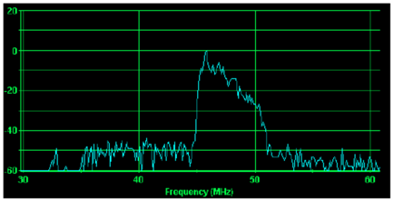
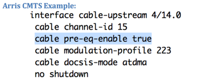
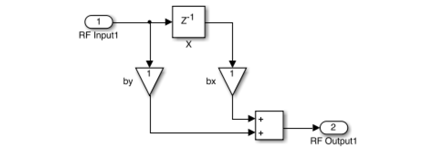
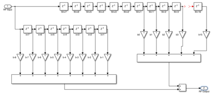
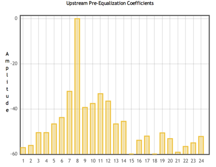
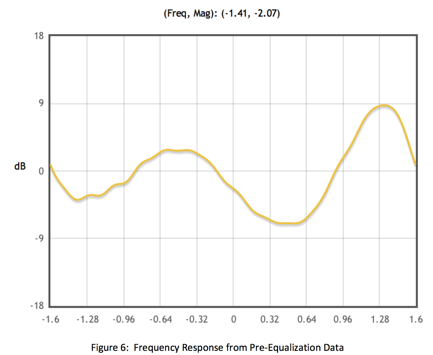

DOCSIS Pre-Equalization: Vastly Powerful, Often Undervalued

Overview

This paper will first provide a brief primer on DOCSIS to establish a baseline
for the document. Next the paper will examine what is DOCSIS pre-equalization.
How DOCSIS pre-equalization works and how DOCSIS pre-equalization can be
extended. In the greater context of the paper, the reader must consider the
implications of the extensions of DOCSIS pre-equalization. In section 5,
details will be provided on how DOCSIS pre-equalization can be used to
identify plant impairments and locate those impairments to within a few feet.
This turns every cable modem in your network into a very powerful
troubleshooting device. The implications are that DOCSIS pre-equalization as a
troubleshooting tool will change the cable industries maintenance practices,
significantly reduce maintenance costs and dramatically improve subscriber
satisfaction with overall service performance, for data and video.

Contents

Smaller providers have been hesitant to implement usage tiers for several
reasons, including backlash from angry customers. For example, Time Warner
took a PR beating in 2009 when they tried to impose usage-based pricing, and
that memory is still fresh in the minds of some providers. But, unlike a few
years ago, subscribers today are more likely to accept usage tiers. For one
thing, people have gotten used to dealing with data plans on their cell
phones. Plus, several national and regional broadband providers have
successfully implemented usage tiers, which will make it easier for smaller
providers to now put them in place. Another concern providers have had is how
to actively monitor usage and enforce limits. While early adopters had to
develop their own tools, there are now powerful tools available from third-
parties that are designed specifically to monitor and enforce usage-based
packages. Whether you build your own, or purchase a third-party product, make
sure your solution has features that will support the best practices for
enforcement as outlined in this paper.

Section 1 - Overview

This paper will first provide a brief primer on DOCSIS to establish a baseline
for the document. Next the paper will examine what is DOCSIS pre-equalization.
How DOCSIS pre-equalization works and how DOCSIS pre-equalization can be
extended. In the greater context of the paper, the reader must consider the
implications of the extensions of DOCSIS pre-equalization. In section 5,
details will be provided on how DOCSIS pre-equalization can be used to
identify plant impairments and locate those impairments to within a few feet.
This turns every cable modem in your network into a very powerful
troubleshooting device. The implications are that DOCSIS pre-equalization as a
troubleshooting tool will change the cable industries maintenance practices,
significantly reduce maintenance costs and dramatically improve subscriber
satisfaction with overall service performance, for data and video.

Section 2 - DOCSIS Primer

Data Over Cable Service Interface Specification (DOCSIS) is effectively a
transparent Ethernet bridge over a hybrid fiber/coax (HFC) network. There are
two (2) functional components in a DOCSIS network, the cable modem (CM) on the
subscriber side and the CMTS in the headend or hub site. The CMTS communicates
with the CMs on one or more 6 MHz wide (8 MHz in Euro-DOCSIS deployments), 64-
or 256-QAM (quadrature amplitude modulation) digitally encoded RF signals on
the downstream path of an HFC network between 108 and 1 GHz. The CMs
communicate with the CMTS using one or more quadrature phase shift keying
(QPSK), 8-, 16-, 32-, or 64-QAM digitally encoded RF signals, transmitted on
an upstream HFC frequency between 5 to 85MHz. The digital data, transported
via digitally modulated carriers, contains Media Access Control (MAC)
information, which enables the CMs to coexist with other CMs by using a Time
Division Multiple Access (TDMA) scheme or synchronous code division multiple
access (S-CDMA). In essence, the CMTS is the system scheduler, which
coordinates the power level, frequency, transmit time, and pre-equalization of
all CM signals on the DOCSIS network.

By virtue of the fact that CMs and the CMTS are able to communicate digital
data with each other over the HFC network for the purpose of “command-and-
control” processes, they are also able to transmit packets containing other
non-DOCSIS MAC related data. This is what fundamentally facilitates the
ability to send Ethernet traffic bi-directionally over an HFC network. The
CMTS-CM DOCSIS network transports IP based traffic in the same method that is
used to communicate MAC protocol between the devices. Now that the IP traffic
can traverse the HFC network, end users are also able to utilize this network
for the purpose of transmitting content destined for the multitude of
available data network services such as email, web browsing, IP video, and
voice over IP telephony (VoIP).

In summary, each user is assigned a unique cable modem, which conforms to the
DOCSIS standard. The CMTS works as a system scheduler enabling many cable
modems to reside on the same RF network. TDMA and/or S-CDMA is employed in
cable modem communications so that each modem is allocated a certain finite
time over which it may transmit and receive IP data. IP data destined for a
particular user is sent to that user’s modem by the CMTS one or more
downstream RF channel. This is the way an Ethernet network is able to be
transparently bridged from a data backbone to a subscriber’s home or business
location.

Section 3 - What is DOCSIS Pre-Equalization

DOCSIS pre-equalization is a feature that was first added in the DOCSIS 1.1
standard. The objective of pre-equalization is to improve upstream performance
in the presence of certain RF impairments. These impairments include, but are
not limited to, frequency response, micro-reflections, and group delay.

The method in which DOCSIS pre-equalization improves upstream performance in
the presence of these RF impairments is simple. The CMTS looks at messages
coming from the cable modem and evaluates the signal quality of the messages.
If the CMTS determines that the messages can be improved by pre- equalization,
the CMTS sends equalizer adjustment values to the cable modem. The cable modem
applies these equalizer adjustment values, called coefficients, to its pre-
equalizer. The result is that the cable modem transmits a pre-distorted signal
to compensate for impairments between the cable modem and the CMTS. As the
pre-distorted signal traverses the HFC network it will experience the effects
of RF impairments. By the time the pre-distorted signal from the cable modem
arrives at the CMTS it will no longer have any of the original pre-distortion,
as the RF impairments will have transformed it back into a near-ideal signal
that the CMTS intended to see. If further adjustments are required, the CMTS
will send more pre-equalizer coefficient values to the cable modem and the
cycle repeats. This cycle repeats at least once every thirty seconds for every
cable modem in the DOCSIS network, provided pre-equalization is enabled in the
CMTS.

An illustration of a cable modem signal is perhaps the best way to demonstrate
pre-equalization in action. Figure 1 below shows an upstream cable modem
signal as seen at the CMTS. This RF signal shows significant roll-off due to
plant impairments. This would cause the CMTS to have difficulty- demodulating
signal, resulting in codeword errors, lost subscriber data and poor subscriber
quality of experience (QoE).

Figure 1: Cable Modem Signal without Pre-Equalization

Once DOCSIS pre-equalization is enabled on the CMTS for this particular
upstream, the CMTS will instruct the cable modem to pre-distort the signals it
is transmitting via its internal equalizer. The pre- distortion would result
in a signal that has higher output at the high frequencies and less output at
the lower frequencies. This would be a mirror image of the signal seen in
figure 1. The result is the response shown in figure 2 below, where the signal
at the CMTS is flat after going through the RF impairments.

Figure 2: Cable Modem Signal with Pre-Equalization

Now the value of DOCSIS pre-equalization should be clear. What was once a very
poor, looking signal at the CMTS (figure 1), is now a near-perfect signal at
the CMTS (figure 2) thanks to pre-equalization in the cable modem.

Enabling Pre-Equalization in the CMTS

DOCSIS pre-equalization can have a 5-10 dB SNR (MER) improvement in the
upstream for the majority of DOCSIS cable modems if they are DOCSIS version
2.0 and higher. However the CMTS must be configured to take advantage of this
feature. Enabling DOCSIS pre-equalization is simple and usually is a one line
command in Cisco, Arris and Casa CMTSs. Here are example commands for each
CMTS:

The Cisco command for pre-equalization is highlighted in blue. It is ‘cable
upstream <n> equalization- coefficient’, where <n> is the upstream channel to
enable pre-equalization.

Again the Arris command for pre-equalization is highlighted in blue and is
‘cable pre-eq-enable true’. This must be issued under each interface cable-
upstream.

Finally, the Casa example is shown in blue. The line required is ‘logical-
channel <n> pre-equalization’, where <n> is the upstream of the desired
channel.

In all examples it should be noted that enabling pre-equalization is done in
the CMTS and it is a one-line command per upstream channel. Enabling pre-
equalization is not service affecting, though there are some precautions that
should be taken and discussed in advance with your DOCSIS network expert.

Once enabled, you should expect to see significant performance improvements in
upstream SNR (MER) for every upstream port enabled with pre-equalization.

Section 4 - How Exactly Does DOCSIS Pre-Equalization Work?

To understand how DOCSIS pre-equalization works we must understand the
difference between a mainline tap and an equalizer tap. In HFC networks
mainline taps are used to distribute signals on drop cables to subscribers’
homes. This terminology for tap must not be confused with same name of tap
that is used when discussing equalizers. They are completely separate terms
and will lead to great confusion unless this point is made clear.

A time delay element, two gain blocks and a summation of the signals as
follows in figure 3 can define two equalizer taps.

Figure 3: Simple Equalizer Taps

At first this may look complicated, but it is actually simple. A DOCSIS signal
from the cable modem will enter at port 1, RF Input1. If the CMTS has told the
cable modem to disable the amplifier gain in ‘bx’ and enable the amplifier to
full gain in ‘by’, then the signal will go through the main “tap” of figure 3
without any changes. The main tap is the amplifier with gain ‘by’.

On the other hand, if the CMTS tells the cable modem to attenuate amplifier
‘by’ and turn on the ‘bx’ amplifier, then signals will be forced to go through
the second tap leg of figure 3. This tap leg has a delay line in it. The delay
line in this tap leg will cause some of the signals to be delayed and then
amplified. At the same time, signals will be allowed to pass through amplifier
‘by’, the main tap, and have a different level of amplification. The output of
both amplifiers (the main tap and the secondary tap) will be added together in
the summation block. This is the block with two “+” marks on it. Then the
signal will be transmitted to the CMTS.

This two-tap example will have little impact on an upstream DOCSIS channel
since it only has one delay tap. Starting with DOCSIS 1.1 eight (8) taps were
added to DOCSIS cable modems. It was quickly realized that eight (8) taps were
not enough to have substantial improvement on the upstream. So the DOCSIS 2.0
and 3.0 standards added 24 taps to cable modems. This provides substantial
control over the upstream frequency, even at a bandwidth of 6.4 MHz to make
significance improvements in the presence of RF impairments.

The equalizers with 24 taps are significantly more complex than the two-tap
equalizer shown in figure 3. Figure 4 below shows a rough outline of a 24-tap
equalizer architecture. Note that this equalizer is not drawn with all 24 taps
as it would not easily fit on the size page of this document and still be
readable. However one should get a better concept of the complexity of the
pre-equalization circuitry that is built into every DOCSIS 2.0 and greater
cable modem.

Figure 4: DOCSIS 24-Tap Conceptual Architecture

There are two sections in the architecture of figure 4. The lower left bank of
taps is called pre-main tap taps. There are seven pre-main tap taps in a
DOCSIS cable modem and will be observed later in the paper. The top right
section consists of the main tap, which is the first gain block labeled b0.
The main tap is an important tap since, as described previously, if there are
no RF impairments, then all signals will traverse through this stage. So this
tap should ideally have a lot of RF energy going through it at all times and
thus have the highest value. The remaining taps are called the post-main tap
taps. There are 16 post-main tap taps in DOCSIS cable modems (DOCSIS 2.0 and
higher). When energy is observed in these taps it indicates that RF
impairments such as micro-reflections are present and the CMTS is activating
the gain states to compensate for these impairments. The higher the value of
energy in the post-main taps the greater the impairment.

The actual tap values can be displayed by querying the SNMP pre-equalization
coefficient string in the cable modem. Once this string is obtained it is
graphed in figure 5 below showing the levels of the tap values described thus
far:

Figure 5: DOCSIS Pre-Equalization Tap Values

The main tap is shown at position eight (8) on the x-axis. As discussed it has
the highest energy level. The pre-tap taps are at positions one (1) through
seven (7) and often indicate the presence of group delay. The post-main tap
taps are at positions nine (9) through 24. It is the post-main tap taps
(postMTT) that provides the most valuable information in troubleshooting a
DOCSIS network. This will be discussed in the next section.

From this section you should have a clear understanding of the difference
between a mainline tap and pre-equalizer tap. You should also have a much
better understanding of how a pre-equalizer works in addition to how the
individual taps can be visualized.

Section 5 - What Else Can DOCSIS Pre-Equalization Do?

So far this paper has discussed how DOCSIS pre-equalization can help overcome
upstream impairments and how pre-equalization works. Overcoming upstream
impairments is a great feature unto itself. However by analyzing the pre-
equalization coefficients one can learn much more about the DOCSIS upstream.

Two key things that can be observed by looking at pre-equalizer coefficients
are the type of impairments in the upstream that the equalizer is attempting
to overcome and the estimated distance to the impairment.

Why might this information be useful? If every cable modem is analyzed on a
cable plant for impairments, this information can be extremely powerful.
Groups of cable modems can be identified as having common problems, such as
micro-reflections or group delay. This same group of cable modems can provide
the estimated distance to the impedance mismatch causing the micro-reflection.
By mapping this distance, pinpointing the exact location is possible. This
enables the cable operator to dispatch a technician directly to the location
of a problem (minimizing MTTR) with prior knowledge of what to look for - an
impedance mis-match, such as a corroded cable.

Two things have occurred. First, the cable operator identified a problem
possibly before subscribers complained about the issue or even noticed it.
Second, the cable operator was able to dispatch a technician to the exact
location of the problem. Then once the problem is fixed the cable operator can
verify the repair by reviewing the reports from the cable modem pre-
equalization data. This really changes everything!

How is all of this accomplished? A mathematical function called a complex Fast
Fourier Transform (FFT) is performed. The FFT is just a complicated sounding
term for some math functions that translate the time domain to the frequency
domain or vice versa. The FFT is implemented on the cable modem equalizer
coefficients. This produces a frequency response of the upstream impairments
like the one shown in figure 6.

Figure 6: Frequency Response from Pre-Equalization Data

This frequency response shows a cable modem that is staying online, but is
making up for a severely impaired upstream. The frequency response of the
upstream is nearly 18 dB peak-to-valley. DOCSIS has an upstream requirement of
0.5 dB peak-to-valley, so this upstream does not meet the DOCSIS requirements.
Fortunately pre-equalization is making up for the difference.

After performing a complex FFT on the data additional information is made
available as shown in figure 7:

Figure 7: Pre-Equalization Table After Complex FFT

Figure 7 shows the MAC address of 32:27:14:24:77:81, highlighted in blue whose
frequency response is shown in figure 6. (Note that the MAC address is
fictitious for privacy reasons.) In this particular case, there are three
columns to focus on, postMTTER, MRLevel and TDR. postMTTR (Post-Main Tap to
Total Energy Ratio) tells us that there is a strong probability that a micro-
reflection exists in the return path. This is the likely reason that the
frequency response in figure 6 is so bad.

The MRLevel (micro-reflection level) provides an estimate of the level in dBc
of the micro-reflection based upon the peak postMTTR location.

The TDR (time domain reflectometer) provides an estimate in feet to the
location of the source of the micro-reflection. In the case of 183.4 feet,
this micro-reflection is likely located close or near to the tap feeding the
house. Some other low value numbers under TDR in figure 7 indicate that cable
modems with high micro-reflection levels are likely due to in-home wiring
problems.

There are many examples where the TDR will show spans of 500 to 2000 feet, in
which case many cable modems will be impacted, as this is a case of outside
plant. An example of this is shown in figure 8 [14], where the three red dots
on the map indicate cable modems with common upstream impairments mapped.

Figure 8: Mapping Upstream Impairments Based on Pre-Equalization

Comprehensive applications are available that collect cable modem DOCSIS pre-
equalization data, perform the analysis and identify upstream impairments
based on the data. One such example application can be seen in figure 9 and is
meant to give the reader a concept of the application. A number of major MSOs
currently have in-house systems similar to the application in figure 9 that
integrate with their back-office systems.

Figure 9: Proactive Network Maintenance Application for Pre-Equalization
Analysis

Section 6 - Summary

This paper examined pre-equalization, what it is, how it works, why it useful,
and how it can be further utilized. The reader should be able to take away a
sense of the value of DOCSIS pre-equalization. For some time it has been
deployed in DOCSIS networks to improve upstream performance, but only recently
has it been used as a method to proactively troubleshoot the DOCSIS network.
This will have substantial impacts on DOCSIS and HFC networks moving forward.

Combined with full-band capture modems, the utilization of pre-equalization
coefficients to proactively troubleshoot networks will change cable network
maintenance for evermore in a very positive way. First, the test equipment and
monitoring requirements will be impacted. There will be a dramatic decrease on
the dependency of sweep and maintenance technician tools in the industry.
Next, the ability of cable operators to have early identification of plant
impairments will be dramatically improved. Upon early identification, cable
operators will have knowledge of the exact location of impairments;
dramatically reducing time spent looking for impairments in the normal divide
and conquer method of troubleshooting. These legacy methods are expensive and
often result in poor quality of experience to the subscriber.

The industry is close to a new day where the tools currently in development
are widely adopted and accepted as required applications. The applications
discussed in this document.

Abbreviations and Acronyms

Adaptive pre-equalizer A circuit in a DOCSIS 1.1 or newer cable modem that
pre- equalizes or pre-distorts the transmitted upstream signal to compensate
for channel response impairments. In effect, the circuit creates a digital
filter that has approximately the opposite complex frequency response of the
channel through which the desired signal is to be transmitted.

Cable Modem (CM) A modulator-demodulator at subscriber locations intended for
use in conveying data communications on a cable television system.

Cable Modem Termination System (CMTS) Cable modem termination system, located
at the cable television system head-end or distribution hub, which provides
complementary functionality to the cable modems to enable data connectivity to
a wide- area network.

Channel A portion of the electromagnetic spectrum used to convey one or more
RF signals between a transmitter and receiver.

Coefficient Complex number that establishes the gain of each tap in an
adaptive equalizer.

Customer Premises Equipment Equipment at the end user’s premises; may be
provided by the end user or the service provider.

dBc Decibel below carrier Downstream In cable television, the direction of
transmission from the head-end to the

subscriber.

Fast Fourier transform (FFT) An algorithm to compute the discrete Fourier
transform (DFT), typically far more efficiently than methods such as
correlation or solving simultaneous linear equations.

Fiber Node In HFC, a point of interface between a fiber trunk and the coaxial
distribution.

Frequency response A complex quantity describing the flatness of a channel or
specified

DOCSIS Pre-Equalization: Vastly Powerful, Often Undervalued

frequency range, and that has two components: amplitude (magnitude)-versus-
frequency, and phase-versus-frequency.

Group Delay The difference in transmission time between the highest and lowest
of several frequencies through a device, circuit or system.

Micro-reflection A short time delay echo or reflection caused by an impedance
mismatch. A micro- reflection’s time delay is typically in the range from less
than a symbol period to several symbol periods.

MRLevel Micro-reflection level Modulation error ratio (MER) The ratio of
average symbol power to average error

power. The higher the MER, the cleaner the received signal. postMTT Post main
tap postMTTR Post-Main Tap to Total Energy Ratio Pre-equalizer See adaptive
pre-equalizer.

SNR Signal-to-noise ratio

Tap (1) In the feeder portion of a coaxial cable distribution network, a
passive device that comprises a combination of a directional coupler and
splitter to “tap” off some of the feeder cable RF signal for connection to the
subscriber drop. So-called self- terminating taps used at feeder ends-of-line
are splitters only and do not usually contain a directional coupler. Also
called a multitap. (2) The part of an adaptive equalizer where some of the
main signal is “tapped” off and which includes a delay element and multiplier.
The gain of the multipliers is set by the equalizer’s coefficients. (3) One
term of the difference equation in a finite impulse response or a infinite
impulse response filter. The difference equation of a FIR follows: y(n) =
b0x(n) + b1x(n-1) + b2x(n-2) + ... + bNx(n-N)

TDR Time domain reflectometer Upstream The direction from the subscriber
location toward the head-end.

Biography

Brady Volpe, President and Founder of The Volpe Firm, Inc., is involved in
providing technology consulting services and products to cable and telecom
operators & vendors World-Wide. Mr. Volpe has over 20 years of broadband cable
and telecommunications industry experience specializing in DOCSIS, MatLab
Simulation and Design, VoIP, Video, IPTV, RF, Digital Design, IP Security,
EPON, FTTx, SIP, Capacity Planning, Fiber Optic Transport and all things
broadband.

A highly respected speaker and industry thought leader, Mr. Volpe is a
frequent presenter at industry trade shows, conferences and regional seminars.
He has published numerous articles in worldwide trade journals and authored
several white papers on DOCSIS protocol and VoIP test and analysis. Mr. Volpe
lends his expertise to industry associations and protocol bodies and is often
sought out as an authority on DOCSIS, PacketCable, and VoIP. In addition, Mr.
Volpe is a long time IEEE, SCTE and SCTE standards member. He holds patent
number 7,885,195, “Test System with User Selectable Channel.” His blog,
bradyvolpe.com, now located at volpefirm.com, is the industry’s most
comprehensive DOCSIS tutorial and is used by a major MSO for training and
educating their workforce.

Mr. Volpe earned his master’s degree in electrical engineering, graduating
with Honors (4.0) from John Hopkins University Applied Physics Laboratory in
2004. He received his bachelor’s degree in electrical engineering from the
Pennsylvania State University. Throughout his studies, Mr. Volpe focused on
advanced telecommunications.

