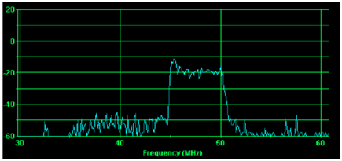
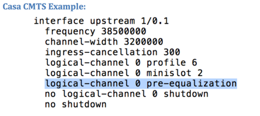
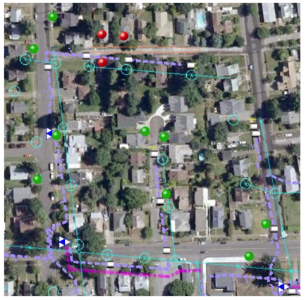
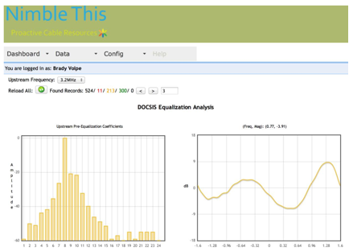
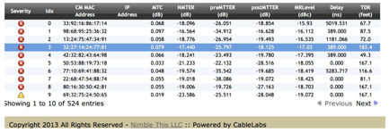

DOCSIS预均衡：非常强大，经常被低估

概观

本文将首先提供DOCSIS的简要介绍，以建立该文件的基准。 接下来，本文将研究什么是DOCSIS预均衡。
DOCSIS预均衡如何工作以及如何扩展DOCSIS预均衡。 在本文的更大背景下，读者必须考虑DOCSIS预均衡扩展的含义。
在第5节中，将介绍如何使用DOCSIS预均衡来识别植物损伤并将这些损伤定位在几英尺内的细节。
这将使您网络中的每个电缆调制解调器变成一个非常强大的故障排除设备。
其意义在于DOCSIS预均衡作为故障排除工具将改变电缆行业的维护实践，显着降低维护成本，并显着提高用户对数据和视频的整体服务性能满意度。

内容

由于几个原因，较小的提供商一直犹豫实施使用层级，包括愤怒的客户的反弹。
例如，时代华纳公司在2009年试图施加基于使用价格的公司时，公司遭到了殴打，而这些记忆在一些供应商的心目中仍然很新鲜。
但是，与几年前不同的是，今天的用户更有可能接受使用层级。 一方面，人们习惯于在手机上处理数据计划。
另外，一些国家和地区的宽带提供商已经成功地实施了使用层级，这将使小型供应商更容易地实现使用。 提供者所关心的另一个问题是如何主动监控使用情况并实施限制。
虽然早期采用者必须开发自己的工具，但是现在有三个可用的强大工具，专门用于监视和实施基于使用的包。
无论您是建立自己的还是购买第三方产品，请确保您的解决方案具有支持本文所述的强制执行最佳实践的功能。

第1节 \- 概述

本文将首先提供DOCSIS的简要介绍，以建立该文件的基准。 接下来，本文将研究什么是DOCSIS预均衡。
DOCSIS预均衡如何工作以及如何扩展DOCSIS预均衡。 在本文的更大背景下，读者必须考虑DOCSIS预均衡扩展的含义。
在第5节中，将介绍如何使用DOCSIS预均衡来识别植物损伤并将这些损伤定位在几英尺内的细节。 这将使您网络中的每个电缆调制解调器变成一个非常强大的故障排除设
其意义在于DOCSIS预均衡作为故障排除工具将改变电缆行业的维护实践，显着降低维护成本，并显着提高用户对数据和视频的整体服务性能满意度。

第2节 \- DOCSIS引物

有线服务接口规范（DOCSIS）中的数据通过混合光纤/同轴电缆（HFC）网络实际上是一个透明的以太网桥。
在DOCSIS网络中有两（2）个功能组件，用户侧的电缆调制解调器（CM）和前端或集线器站点中的CMTS。 CMTS在一个或多个6 MHz宽（Euro-
DOCSIS部署中为8 MHz），64或256-QAM（正交幅度调制）数字编码的RF信号与HFC网络的下行路径108和1之间进行通信千兆赫。 CM使用在5至
85MHz之间的上行HFC频率上发送的一个或多个正交相移键控（QPSK），8-，16-，32-或64-QAM数字编码RF信号与CMTS进行通信。 通过数字调
制载波传输的数字数据包含媒体访问控制（MAC）信息，其使得CM能够通过使用时分多址（TDMA）方案或同步码分多址（S-CDMA）方式与其他CM共存， 。
实质上，CMTS是协调DOCSIS网络上所有CM信号的功率电平，频率，发送时间和预均衡的系统调度器。

由于CM和CMTS能够通过HFC网络传输数字数据，用于“命令和控制”过程，因此它们还能够发送包含其他非DOCSIS MAC相关的数据包数据。
这从根本上促进了通过HFC网络双向发送以太网业务的能力。 CMTS-CM DOCSIS网络以与用于在设备之间传送MAC协议的相同方法传输基于IP的流量。 现
在，IP流量可以遍历HFC网络，终端用户也可以利用这个网络来发送目的地是用于多种可用数据网络服务的内容，例如电子邮件，网页浏览，IP视频和IP语音电话电话（
VoIP）。

总而言之，每个用户都被分配一个符合DOCSIS标准的唯一电缆调制解调器。 CMTS作为系统调度器，使许多电缆调制解调器驻留在同一个RF网络上。
在电缆调制解调器通信中采用TDMA和/或S-CDMA，使得每个调制解调器被分配一定的有限时间，通过它可以发送和接收IP数据。
去往特定用户的IP数据由CMTS一个或多个下行RF信道发送到该用户的调制解调器。 这是以太网网络能够从数据骨干网透明地桥接到订户的家庭或商业地点的方式。

第3节 \- 什么是DOCSIS预均衡

DOCSIS预均衡是DOCSIS 1.1标准中首次添加的功能。 预均衡的目标是在存在某些RF损伤的情况下改善上游性能。
这些损伤包括但不限于频率响应，微反射和组延迟。

在存在这些RF损伤的情况下DOCSIS预均衡改善上游性能的方法是简单的。 CMTS查看来自电缆调制解调器的消息，并评估消息的信号质量。
如果CMTS确定可以通过预均衡来改善消息，则CMTS将均衡器调整值发送到电缆调制解调器。 电缆调制解调器将这些称为系数的均衡器调整值应用于其均衡器。
结果是电缆调制解调器发送预失真信号以补偿电缆调制解调器和CMTS之间的损伤。 由于预失真的信号穿过HFC网络，将会遇到RF损伤的影响。
当电缆调制解调器的预失真信号到达CMTS时，它将不再具有任何原始的预失真，因为RF损伤将已经将其转换回CMTS意图看到的接近理想信号。
如果需要进一步调整，CMTS将向电缆调制解调器发送更多的均衡器系数值，并重复循环。
如果在CMTS中启用预均衡，则该周期对DOCSIS网络中的每个电缆调制解调器至少每30秒重复一次。

电缆调制解调器信号的图示也许是在行动中展示预均衡的最佳方法。 下图1显示了在CMTS上看到的上游电缆调制解调器信号。
该RF信号由于植物损伤而显示出显着的下降。 这将导致CMTS具有难以解调的信号，导致码字错误，丢失用户数据和差的用户体验质量（QoE）。

图1：无预均衡的有线调制解调器信号

一旦在该特定上游的CMTS上启用了DOCSIS预均衡，则CMTS将指示电缆调制解调器通过其内部均衡器对正在发送的信号进行预失真。
预失真将导致在高频处具有更高的输出并且在较低频率处具有较少的输出的信号。
这将是图1中看到的信号的镜像。结果是下面图2所示的响应，其中在通过RF损伤之后，CMTS处的信号是平坦的。

图2：具有预均衡的电缆调制解调器信号

现在DOCSIS预均衡的价值应该是明确的。
在CMTS（图1）曾经是一个非常差的看起来的信号，由于电缆调制解调器的预均衡，现在CMTS（图2）已经是近乎完美的信号。

在CMTS中启用预均衡

DOCSIS预均衡可以在大多数DOCSIS电缆调制解调器的上游具有5-10dB的SNR（MER）改善，如果它们是DOCSIS版本2.0及更高版本。
但是，必须将CMTS配置为利用此功能。 启用DOCSIS预均衡很简单，通常是Cisco，Arris和Casa CMTS中的一行命令。
以下是每个CMTS的示例命令：

用于预均衡的Cisco命令以蓝色突出显示。 它是“电缆上游” 均衡系数“，其中 是允许预均衡的上行信道。

再次，用于预均衡的Arris命令以蓝色突出显示，并且是“cable pre-eq-enable true”。 这必须在每个接口电缆 \- 上游发出。

最后，Casa示例显示为蓝色。 所需的线是“逻辑通道” 预均衡“，其中 是所需通道的上游。

在所有示例中，应当注意，使能预均衡是在CMTS中完成的，并且它是每个上行信道的单行命令。
启用预均衡并不影响服务，尽管您的DOCSIS网络专家预先应该采取预防措施并进行讨论。

一旦启用，您应该期望在具有预均衡功能的每个上行端口上可以看到上行信噪比（MER）的显着性能提升。

第4节 \- DOCSIS前期平均工作如何正常工作？

为了了解DOCSIS预均衡的工作原理，我们必须了解主线水龙头和均衡水龙头之间的区别。 在HFC网络中，主线水龙头用于将信号分配到订户家中。
用于抽头的术语不得与讨论均衡器时使用的相同名称的抽头相混淆。 它们是完全分开的术语，并将导致很大的混乱，除非这一点被明确。

时间延迟元件，两个增益块和如图3所示的信号的求和可以定义两个均衡器抽头。

图3：简单的均衡器抽头

起初这可能看起来很复杂，但实际上很简单。 来自电缆调制解调器的DOCSIS信号将进入端口1，RF输入1。
如果CMTS告诉电缆调制解调器禁止'bx'中的放大器增益，并使放大器能够在'通过'全面增益，则信号将通过图3的主“分接头”进行任何更改。
主抽头是具有增益'by'的放大器。

另一方面，如果CMTS告诉电缆调制解调器将放大器“衰减 ”并打开“bx”放大器，则信号将被迫通过图3的第二个分接支路。该抽头支路具有延迟线在里面。
此分支支路中的延迟线将导致某些信号被延迟然后被放大。 同时，信号将被允许通过放大器“主”，并具有不同的放大级别。
两个放大器（主抽头和次级抽头）的输出将在求和块中相加。 这是块上有两个“+”标记的。 然后信号将被传送到CMTS。

这个双抽头示例对上游DOCSIS通道几乎没有影响，因为它只有一个延迟抽头。 从DOCSIS 1.1开始，向DOCSIS电缆调制解调器添加了八（8）个水龙头。
很快意识到八（8）个水龙头不足以在上游有实质性的改善。 因此，DOCSIS 2.0和3.0标准为电缆调制解调器添加了24个抽头。
这提供了对上行频率的实质控制，即使在6.4MHz的带宽下，在存在RF损伤的情况下显着改善。

具有24个抽头的均衡器比图3所示的双抽头均衡器显着更复杂。下面的图4示出了24抽头均衡器架构的粗略概况。
请注意，该均衡器不会绘制所有24个水龙头，因为它不容易适合本文档的大小页面，仍然可读。 然而，应该得到一个更好的概念，即每个DOCSIS
2.0和更大的电缆调制解调器内置的预均衡电路的复杂性。

图4：DOCSIS 24抽头概念架构

在图4的架构中有两个部分。左下方的水龙头称为预主抽头龙头。 DOCSIS电缆调制解调器中有七个主要主抽头龙头，本文后面将会予以说明。
右上部分由主抽头组成，它是标记为b0的第一个增益块。 主抽头是一个重要的抽头，因为如前所述，如果没有RF损伤，则所有信号将穿过该阶段。
所以这个水龙头应该理所当然地有很多的射频能量经过它，因此具有最高的价值。 剩余的水龙头称为后主龙头水龙头。 DOCSIS电缆调制解调器（DOCSIS
2.0及更高版本）中有16个主抽头分接头。 当在这些抽头中观察到能量时，它表明存在诸如微观反射的RF损伤，并且CMTS正在激活增益状态以补偿这些损伤。
后主要水龙头的能源价值越高，损害就越大。

可以通过查询电缆调制解调器中的SNMP预均衡系数字符串来显示实际的抽头值。 一旦获得了这个字符串，它就在下面的图5中绘制，显示了迄今为止描述的抽头值的级别：

图5：DOCSIS预均衡点击值

主抽头显示在x轴上的位置8（8）处。 如所讨论的，它具有最高的能量水平。 预抽水龙头位于第1（1）至7（7）位，并经常表示存在组延迟。
后主龙头龙头位于九（9）至24号位置。这是主要的龙头龙头（postMTT），它为故障排除DOCSIS网络提供了最有价值的信息。 这将在下一节讨论。

从这一部分，您应该清楚地了解主线水龙头和预均衡水龙头之间的区别。 除了可以显示各个水龙头之外，您还应该更好地了解前置均衡器的工作原理。

第5节 \- DOCSIS预均衡化还能做什么？

到目前为止，本文已经讨论了DOCSIS预均衡如何帮助克服上游损伤和预均衡的工作原理。 克服上游障碍是本身的一大特色。
然而，通过分析预均衡系数，可以更多地了解DOCSIS上游。

通过观察预均衡器系数可以观察到的两个关键事项是均衡器试图克服的上游的损伤类型以及估计到损伤的距离。

为什么这些信息有用？ 如果每个电缆调制解调器都在有线电视机上进行分析，这些信息可能非常强大。
电缆调制解调器组可以被识别为具有常见的问题，例如微反射或组延迟。 同一组电缆调制解调器可以提供与导致微反射的阻抗失配的估计距离。
通过映射此距离，可以精确确定位置。 这使得电缆操作员能够直接将技术人员发送到问题的位置（最小化MTTR），并且先前知道要查找的内容 \-
阻抗不匹配，例如腐蚀的电缆。

有两件事情发生了。 首先，有线电视运营商在订阅者投诉这个问题之前就发现了一个问题，甚至注意到了这个问题。 第二，电缆运营商能够派出技术人员到问题的确切位置。
一旦问题被修复，电缆运营商可以通过查看电缆调制解调器预均衡数据的报告来验证修复。 这真的改变了一切！

所有这一切如何完成？ 执行称为复数快速傅里叶变换（FFT）的数学函数。 对于某些将时域转换为频域的数学函数，FFT只是一个复杂的探测术语，反之亦然。
FFT在电缆调制解调器均衡器系数上实现。 这产生了如图6所示的上游损伤的频率响应。

图6：预均衡数据的频率响应

这种频率响应显示一个正在上网的电缆调制解调器，但正在弥补上游严重受损。 上游的频率响应峰值接近18 dB。 DOCSIS的上游需求为0.5
dB峰谷，因此上游不符合DOCSIS要求。 幸运的是，预均衡正在弥补差异。

在对数据执行复杂FFT之后，附加信息可用，如图7所示：

图7：复合FFT后的均衡表

图7显示了32：27：14：24：77：81的MAC地址，蓝色突出显示，频率响应如图6所示。（请注意，MAC地址为隐私原因是虚构的）在这种特殊情况下是三列专
注于，postMTTER，MRLevel和TDR。 postMTTR（后主点击总能量比）告诉我们，返回路径中存在微反射的可能性很大。
这是图6中的频率响应如此糟糕的可能原因。

MRLevel（微反射电平）基于峰值postMTTR位置提供基于微反射的dBc级别的估计。

TDR（时域反射计）以英尺提供微反射源的位置估计。 在183.4英尺的情况下，这种微反射可能靠近或靠近进入房屋的水龙头。
图7中TDR下的一些其他低值数字表明，具有高微反射电平的电缆调制解调器可能是由于家庭内布线问题。

有很多例子，TDR将展示500到2000英尺的跨度，在这种情况下，许多电缆调制解调器将受到影响，因为这是外部工厂的情况。 一个例子如图8
[14]所示，其中地图上的三个红点表示映射了具有共同上游损伤的电缆调制解调器。

图8：基于前期均衡的上游损害对照

综合应用可收集电缆调制解调器DOCSIS预均衡数据，根据数据执行分析和识别上游损伤。 图9中可以看到一个这样的示例应用，并且旨在给读者一个应用的概念。
一些主要的MSO目前拥有与图9中的应用程序类似的内部系统，它们与后台系统集成在一起。

图9：预均衡分析的主动网络维护应用

第6节 \- 总结

本文审查了前均衡，它是什么，它是如何工作，为什么它有用，以及如何进一步利用。 读者应该能够消除DOCSIS预均衡的价值感。
一段时间以来，它已部署在DOCSIS网络中以提高上游性能，但最近才被用作主动排除DOCSIS网络故障的方法。
这将对DOCSIS和HFC网络前进产生重大影响。

结合全频段捕获调制解调器，利用预均衡系数来主动排除网络故障将以非常积极的方式更改有线网络维护。 首先，测试设备和监控要求将受到影响。
扫描和维护技术工具在行业中的依赖将大大减少。 接下来，电缆运营商能早日识别植物损伤的能力将大大提高。 经过早期鉴定，有线电视运营商将了解确切的损伤位置;
大大减少了在正常分割和征服方法中寻找损伤的时间。 这些遗留方法是昂贵的，并且经常导致用户的较差的体验质量。

行业接近新的一天，目前正在开发的工具被广泛采用并被接受为所需的应用程序。 本文档中讨论的应用程序。

缩写和缩略语

自适应预均衡器DOCSIS 1.1或更新的电缆调制解调器中的电路，其预均衡或预失真所发送的上行信号以补偿信道响应损害。
实际上，该电路产生数字滤波器，该数字滤波器具有大致相同的复频率响应，通过该频道响应要传输所需信号。

电缆调制解调器（CM）用于在有线电视系统上传送数据通信的用户位置的调制器解调器。

有线调制解调器终端系统（CMTS）有线调制解调器终端系统，位于有线电视系统头端或分配中心，为电缆调制解调器提供互补功能，以实现与广域网的数据连接。

通道用于在发射机和接收机之间传送一个或多个RF信号的电磁频谱的一部分。

系数在自适应均衡器中建立每个抽头的增益的复数。

客户驻地设备在最终用户场所的设备; 可以由最终用户或服务提供商提供。

dBc分贝以下载波下行在有线电视中，从头端传输的方向

订户。

快速傅立叶变换（FFT）计算离散傅里叶变换（DFT）的算法，通常比诸如相关或求解同时线性方程的方法更有效。

光纤节点在HFC中，光纤中继线与同轴分布之间的接口点。

频率响应描述通道的平坦度或指定的复数

DOCSIS预均衡：非常强大，经常被低估

频率范围，并且具有两个组件：幅度（幅度） \- 频率和相位对频率。

组延迟通过设备，电路或系统在几个频率的最高和最低之间的传输时间差。

微反射由阻抗失配引起的短时间延迟回波或反射。 微反射的时间延迟通常在小于符号周期到几个符号周期的范围内。

MRLevel微反射电平调制误差比（MER）平均符号功率与平均误差的比值

功率。 MER越高，接收信号越干净。 postMTT Post主要tap postMTTR后主点击到总能量比预均衡器请参见自适应预均衡器。

SNR信噪比

点击（1）在同轴电缆分配网络的馈电部分中，无源器件包括定向耦合器和分离器的组合，以“抽头”掉一些馈线电缆RF信号，以连接到用户线路。
在馈线末端使用的所谓自终端分接头只是分离器，通常不包含定向耦合器。 也称为多任务。 （2）自适应均衡器的一部分主要信号被“敲击”并包括延迟元件和乘法器。
乘法器的增益由均衡器的系数设置。 （3）有限脉冲响应或无限脉冲响应滤波器中的差分方程的一项。 FIR的差分方程如下：y（n）= b0x（n）\+
b1x（n-1）\+ b2x（n-2）\+ ... + bNx（nN）

TDR时域反射计上行从用户位置朝向头端的方向。

传

Volpe公司总裁兼创始人Brady Volpe，致力于为全球有线和电信运营商和供应商提供技术咨询服务和产品。 Volpe先生拥有超过20年的宽带电缆和电信
行业经验，专门从事DOCSIS，MatLab仿真和设计，VoIP，视频，IPTV，RF，数字设计，IP安全，EPON，FTTx，SIP，容量规划，光纤传输和
一切宽带

作为备受尊敬的演讲嘉宾和行业思想领袖，Volpe先生是行业展会，会议和区域研讨会的常客。
他在全球贸易刊物上发表了许多文章，并撰写了几篇有关DOCSIS协议和VoIP测试与分析的白皮书。
Volpe先生将其专业知识运用到行业协会和协议机构，并经常被作为DOCSIS，PacketCable和VoIP的权威机构。
此外，Volpe先生是IEEE，SCTE和SCTE长期以来的成员。 他拥有专利号为7,885,195的“用户可选择通道的测试系统”。他的博客bradyvol
pe.com现在位于volpefirm.com，是业界最全面的DOCSIS教程，被一个主要的MSO用于培训和教育他们的员工。

沃尔佩先生获得电气工程硕士学位，毕业于约翰霍普金斯大学应用物理实验室的荣誉学士学位（4.0）

他从宾夕法尼亚州立大学获得电气工程学士学位。 在他的学习期间，Volpe先生专注于先进的电信。

