# THE SPECTRAL EFFICIENCY OF DOCSIS® 3.1 SYSTEM

TABLE OF CONTENTS

OVERVIEW......................................................................
................................3

INTRODUCTION..................................................................
............................3

BASELINE DOCSIS 3.0 SPECTRAL
EFFICIENCIES...............................................5

DS DOCSIS 3.1 OFDM CHANNEL CONFIGURATION PARAMETERS THAT AFFECT SPECTRAL
EFFICIENCY
.......................................................................6

ESTIMATING DOCSIS 3.1 DS SPECTRAL
EFFICIENCY........................................9

US DOCSIS 3.1 OFDMA CHANNEL CONFIGURATION PARAMETERS THAT AFFECT SPECTRAL
EFFICIENCY
.....................................................................17

ESTIMATING DOCSIS 3.1 US SPECTRAL EFFICIENCY
.....................................20

EFFECT OF DIFFERENT NETWORK ARCHITECTURES ON DOCSIS 3.1 SPECTRAL EFFICIENCY ..
..............................................................................
...................27

BEST PRACTICES FOR MAXIMUM NETWORK PERFORMANCE .....................29
CONCLUSIONS ..................................................................
............................30 ACKNOWLEDGEMENTS ..............................
..................................................30 RELATED READINGS.........
.............................................................................3
0 REFERENCES .................................................................
................................32 ABBREVIATIONS & ACRONYMS
....................................................................33

OVERVIEW

This paper estimates the DOCSIS 3.1 DS and US spectral efficiencies taking
many DOCSIS 3.1 configuration parameters and channel SNR values into
consideration. The paper shows that DOCSIS 3.1 provides capacity improvements
over DOCSIS 3.0 systems. The analysis in this paper is performed for multiple
operating margins to accommodate variations in noise and SNR measurements,
etc. The article also discusses the benefits of different network
architectures like N+x, N+0, and digital optics on the system downstream
performance. Finally, the paper lists some best operation and maintenance
practices to yield well-performing networks that can offer large spectral
efficiencies.

INTRODUCTION

DOCSIS 3.1 systems promise a great deal of capacity potential. This is mainly
due to the variety of features that are utilized in the DOCSIS 3.1
specifications [1]. These include downstream (DS) and upstream (US) spectrum
expansion, modern PHY (i.e., OFDM), modern FEC (i.e., LDPC), DS Multiple
Modulation Profiles (MMP), high modulation orders, and many other features.
Understanding the potential of DOCSIS 3.1 capacities is essential in capacity
planning as well as in preparation for network evolution.

The DS and US capacities of DOCSIS 3.1 systems depend heavily on both the
supported spectral ranges and the spectral efficiencies.

DOCSIS 3.1 allows the extension of DS and US spectral ranges, which can lead
to increases in systems capacities. Even if the additional supported spectrum
is not completely clean due to band-specific noise sources (e.g., LTE, MoCA,
etc.) or due to the frequency response of existing HFC equipment (e.g., taps,
amplifiers), there is still potential capacity gain that can be obtained by
running at lower order modulations and utilizing DOCSIS 3.1 features such as
interleaving, exclusion bands, etc. to increase the capacity. Even if the
total power levels are kept constant, extending the supported spectrum can
yield increased capacities because the additional capacity offered by the
spectrum expansion could be many times larger than the capacity loss due to
running at a lower order modulation needed to accommodate the lower SNR values
that may occur from spreading the constant power over larger spectrum.

Beyond extending the spectral ranges, DOCSIS 3.1 also provides greatly
improved spectral efficiencies, which are determined by several factors
including channel configuration, guard and exclusion bands, plant
characteristics, etc.

Many channel parameters affect the spectral efficiency including the symbol
duration and FFT size, cyclic prefix, symbol shaping, scattered and continuous
pilots, Physical Layer Channel (PLC), Next Codeword Pointer (NCP), mini-slot
configurations and placement, FEC codeword arrangements, etc. The plant
characteristics such as SNR values, attenuation pattern, linear and non-linear
distortion also affect the system spectral efficiency. This article attempts
to take the effect of the channel configuration and plant characteristics into
consideration when estimating the theoretical DOCSIS 3.1 system spectral
efficiency, which is then compared to the spectral efficiency of current
DOCSIS 3.0 systems.

Not only is the spectral efficiency determined by the channel configuration
and plant characteristics, it is also affected by the network architecture. In
particular, the paper investigates how different architectures like N+x, N+0,
and digital optics may affect the system capacities.

The high capacities offered by DOCSIS 3.1 systems are enabled by the different
features listed above which leads to the support of higher modulation orders.
High modulation orders are more sensitive to noise and distortion and
therefore additional care must be taken in operating and maintaining HFC
plants in these cases. This article lists some of the network maintenance and
operational aspects that can be utilized to maintain well- performing networks
that offer high spectral efficiencies.

This paper is organized as follows. Section 2 discusses the baseline spectral
efficiency of DOCSIS 3.0 systems, which is used for comparisons in later
sections. The various DOCSIS 3.1 DS channel configuration parameters and
channel characteristics that affect the spectral efficiency are studied in
Section 3. Section 4 estimates the DS DOCSIS 3.1 spectral efficiency for a
particular channel configuration and compares it with DS DOCSIS 3.0 systems.
The US DOCSIS 3.1 channel configuration parameters and channel characteristics
that affect the spectral efficiency of DOCSIS 3.1 systems are discussed in
Section 5. Section 6 estimates the US DOCSIS 3.1 spectral efficiency for a
particular channel configuration and contrasts that with US DOCSIS 3.0
systems. The effect of different network architectures on DS and US spectral
efficiencies is investigated in section 7. Section 8 of the paper lists some
maintenance and operational practices that can be used to yield well-
performing networks. Finally, the paper is concluded in Section 9.

BASELINE DOCSIS 3.0 SPECTRAL

EFFICIENCIES

This section briefly discusses the DS and US spectral efficiencies for common
deployments of DOCSIS 3.0 systems. These spectral efficiency numbers will be
used as a baseline when estimating the percentage of spectral efficiency gain
offered by DOCSIS 3.1 systems.

The DS analysis for DOCSIS 3.0 systems in this paper assumes Annex B
deployments with 12% as minimum roll-off for the square-root-raised-cosine
pulse shaping filter. To estimate the maximum potential spectral efficiency of
DOCSIS 3.0 systems, QAM 256 is assumed. The concatenated RS FEC block is (128,
122), where the payload is 122 7-bit FEC symbols out of 128 FEC symbols that
comprises an FEC block. Trellis coding overhead is 19/20 and the SYNC trailer
overhead is 40 bits for every 88 RS FEC blocks (i.e., 88*128*7 = 78,848 bits).
MPEG framing (188, 184) is assumed.

The above assumptions yield the well-known capacity of 38.8107 Mbps in 6 MHz
before MPEG overhead is taken into consideration. The system capacity after
considering the MPEG overhead is 37.985 Mbps in 6 MHz. This yields a system
spectral efficiency of 6.33 bps/Hz at QAM 256 modulation order. The QAM-
independent DS system efficiency is 6.33/8 = 0.7914 sps/Hz.

The US analysis, on the other hand, is slightly more complicated because there
is large number of configurable US parameters that can affect the spectral
efficiency. These parameters include channel width, RS FEC, preamble length,
modulation order, guard time, etc. In this paper, certain assumptions that
tend to maximize the capacity of DOCSIS 3.0 signals are made. For instance,
the analysis assumes 6.4 MHz channel width, QAM 64 modulation order, 0.25
roll-off factor for the square-root-raised-cosine pulse shaping filter, and
maximum burst size of 4,096B with concatenation being enabled. Other
parameters are assumed in the analysis are shown in Table 1, which are used
for Interval Usage Code (IUC) 10 for one QAM 64 profile that is commonly used
by MSOs for long US grants.

The above configuration assumptions yield 26.6 Mbps per 6.4 MHz, which is
equivalent to 4.15 bps/Hz at QAM 64 modulation including symbol shaping,
preamble, guard time, and FEC overhead. Therefore, the QAM-independent system
efficiency is 4.15 / 6 = 0.692 sps/Hz.

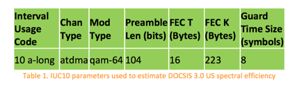

DS DOCSIS 3.1 OFDM CHANNEL CONFIGURATION PARAMETERS THAT AFFECT SPECTRAL
EFFICIENCY

The introduction of OFDM to the DOCSIS 3.1 specifications presents a new set
of channel parameters that have to be taken into consideration when estimating
the DS spectral efficiency. This is primarily due to the fact that the multi-
carrier OFDM technology is very different from the counterpart single-carrier
QAM technology that is currently deployed with DOCSIS 3.0 systems.

The capacity analysis of DOCSIS 3.1 is actually very complicated due to the
abundance of configurable and inter-dependent parameters. Therefore, some
simplifying assumptions are made in order to estimate the DOCSIS 3.1
capacities with reasonable analysis complexity. Observe that more accurate
analyses will require a specific channel model, traffic pattern, individual
modem SNR and channel characteristics, spectrum and channel plans, noise and
interference profiles, etc.

One of the key parameters that affect the spectral efficiency is the OFDM
subcarrier spacing. The DOCSIS 3.1 specification supports two different
subcarrier spacing values, namely 25 kHz and 50 kHz, which translate to
symbols with 40 usec and 20 usec useful symbol durations (FFT duration),
respectively. To enable the 192 MHz DS channels width supported by the DOCSIS
3.1 specifications, two different DS FFT sizes were proposed, mainly 8K FFT
that corresponds to 25 kHz subcarrier spacing and 4K FFT that corresponds to
50 kHz subcarrier spacing. As will be seen later in this paper, the 8K FFT
with 25 kHz subcarrier spacing is more efficient than 4K FFT with 50 kHz
subcarrier spacing. While the former is more efficient, the latter could be
used to provide more robustness to high-power impulse noise where larger
interleaver depth is supported.

Among the DS channel parameters that affect the system’s spectral efficiency
are guard bands. DOCSIS 3.1 DS signals must have 1 MHz of guard band on each
side whenever the OFDM channels are not synchronous. The term “synchronous DS
OFDM signals” here refers to the case where these signals have the same FFT
length, cyclic prefix, and are synchronized in time, frequency, and phase.
While asynchronous OFDM signals must have 1 MHz of guard band on each side,
synchronous OFDM signals can have their active spectrum adjacent to each other
with no guard band in between. This yields higher spectral efficiency since no
spectrum is left unused (i.e., saving a total of 80 subcarriers in 8K FFT case
and 40 subcarriers in the 4K FFT case). The analysis in this paper assumes
synchronous DS OFDM channels with 192 MHz bandwidth.

Observe that an OFDM signal is composed of subcarriers. Some of these
subcarriers can carry data while others are used for boot-strapping,
signaling, etc. Therefore, this introduces another channel parameter that
affects the spectral efficiency, which is the number of continuous and
scattered pilots. Continuous pilots are special subcarriers that exist in the
same frequency locations all the time and are used for frequency and phase
synchronization. The number of continuous pilots outside the PLC region in 192
MHz channel is configurable between 48 and 120\. Our analysis assumes about an
average value of 80 continuous pilots (excluding PLC continuous pilots) for
both 8K and 4K FFT cases.

Scattered pilots, on the other hand, are special subcarriers that travel
across frequency as time progresses. Scattered pilots are mainly used for
channel estimation. Scattered pilots are placed evenly across the OFDM channel
such that there is a single scattered pilot subcarrier in every 128
subcarriers. 190 MHz active channel width would approximately translate to 60
subcarriers with 8K FFT and 30 subcarriers with 4K FFT.

The PLC channel is a special narrow channel of 400 kHz width that is used to
carry signaling and boot-strapping information including time stamp, energy
management, preamble, key DS channel and ‘profile A’ parameters, etc. This 400
kHz channel translates to 16 25 kHz subcarriers in the 8K FFT case and 8 50
kHz subcarriers in the 4K FFT case. Note that the PLC requires 8 continuous
pilots around it and therefore the total number of continuous pilots is 88 (80
(outside the PLC region) + 8 (inside the PLC region)).

The cyclic prefix (CP) is a portion of the FFT output that is copied and
prepended to the same FFT output to form a complete OFDM symbol as shown in
Fig. 1, were TU is the useful symbol time (i.e., FFT duration). CP is used to
compensate for any Inter-symbol- Interference (ISI) caused by the channel
micro-reflections and also to avoid data loss caused by inaccurate timing in
the FFT trigger. Since the selection of the CP depends on the micro-reflection
pattern on the channel, many CP values are supported in the specifications.
The analysis in this paper assumes a median value of 2.5 usec for both 8K and
4K FFT cases.

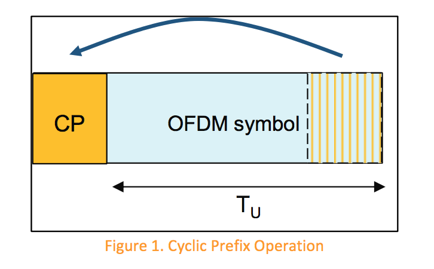

DOCSIS 3.1 has the symbol shaping feature which yields sharper channel
spectral edges that maximize the system capacity and reduce co-channel
interference to adjacent channels. The analysis in this paper assumes that
shaping is applied to the signal to yield sharp channel spectral edges where
the DS active spectrum is ‘contained’ within 190 MHz out of the 192 MHz
channel (i.e., the energy outside the 190 MHz spectrum is insignificant). The
capacity gain in the frequency domain may come at the cost of the symbol
shaping process in time domain, where the shaping is applied to the whole OFDM
symbol including the CP. The larger the symbol shaping roll-off period is, the
less robust the CP becomes. This effect is not analyzed in the paper because
the CP and shaping roll-off period have to be jointly optimized as these two
parameters are not independent and this topic is outside the scope of this
paper. For simplicity, the analysis in this paper assumes that shaping yields
the sharp edges while no significant capacity loss is caused in the time
domain because of overlapping time-domain symbols.

Another parameter that affects the channel capacity is the number of Next
Codeword (CW) Pointer (NCP) Message Blocks (MB) within an OFDM symbol. Each
NCP MB is 3- bytes in size and points to the beginning of a codeword within
the OFDM symbol. Since more than one CW and/or DS profile can exist within a
single OFDM symbol, the spec supports multiple NCP MB per OFDM symbol (up to
10 active NCPs). The analysis in this paper assumes a median value of 6 NCPs
(5 data NCPs and 1 CRC NCP). The modulation order for NCPs is assumed to be
QAM 64. Since the size of each NCP is 3 bytes and there is 50% LDPC FEC rate
that is applied to NCPs, a total of 48 subcarriers will be needed to
accommodate 6 NCP MBs and that is applicable to both 8K and 4K FFT cases.

As mentioned above, one of the major improvements in DOCSIS 3.1 is the
introduction of the LDPC FEC, which is much more efficient than RS FEC. The
FEC scheme chosen for the DS of DOCSIS 3.1 is concatenated LDPC with BCH,
where 14,232 bits are encoded to yield a single 16,200-bit codeword with
effective code rate of 0.8785. Simulations showed that this FEC scheme
provides about 3 dB of SNR gain over the concatenated RS FEC that is currently
used in DS DOCSIS 3.0 systems in the presence of Additive White Gaussian Noise
(AWGN). No shortened CWs are assumed in this analysis. It is assumed that a
CMTS under heavy traffic load conditions (which is the case when high spectral
efficiencies are needed) will be able to schedule packets to fully fill most
CWs.

It should be noted that the above parameters do not form an exhaustive list of
items that affect the spectral efficiency. There are other DOCSIS 3.1 features
and configuration parameters that could affect the system spectral efficiency
as well, but are not considered in the analysis presented in this paper.
Example of these features/parameters include exclusion band/subcarriers,
shortened CWs, randomization/scrambling, variable bit loading and CM grouping,
interleavers, traffic mix/pattern, packet size, etc.

ESTIMATING DOCSIS 3.1 DS SPECTRAL

EFFICIENCY

This section attempts to estimate the DOCSIS 3.1 DS spectral efficiency and
compare it with the maximum that is offered by DOCSIS 3.0. The estimates are
performed for an AWGN channel assuming a synchronous OFDM channel with
configuration parameters that were discussed in Section 3 and are summarized
in Table 2 for convenience.

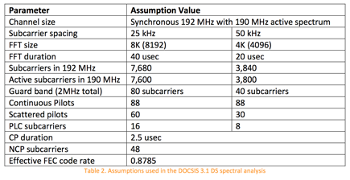

Using the assumptions in Table 2, the DOCSIS 3.1 QAM-independent spectral
efficiency for asynchronous channels with 8K FFT size can be estimated to be
0.7954 sps/Hz (i.e., ((7,680-80-88-60-16-48)/7,680)* (40/42.5)* 0.8785). On
the other hand, synchronous channels provide more efficient QAM-independent
spectral efficiency, which is calculated to be 0.8040 sps/Hz.

Similarly, the QAM-independent spectral efficiency for the 4K FFT case can be
calculated using the parameters in Table 2. In particular, the DOCSIS 3.1 QAM-
independent spectral efficiency for asynchronous channels can be estimated to
be 0.7374 sps/Hz (i.e., ((3,840-40-88-30-8-48)/3,840)* (20/22.5)* 0.8785). On
the other hand, synchronous channels provide more efficient QAM-independent
spectral efficiency, which is calculated to be 0.7451 sps/Hz.

The above QAM-independent spectral efficiency numbers are useful in estimating
the system overhead regardless of which modulation order is used. It can also
help in comparing the efficiency of multiple systems when it relates to
overhead. For instance, it is noted from the above analysis that the
configuration for 8K FFT has less overhead than the D3.0 configuration
calculated in section 2, which in turn has less overhead than the 4K FFT case
(i.e., 0.8040 < 0.7914 < 0.7451 sps/Hz, respectively.). Note that the analysis
so far only considers the amount of overhead in the system and cannot lead to
any final conclusions yet.

In order to fully compare different systems, it is required to estimate the
actual system spectral efficiency in units of bits per seconds per Hz
(bps/Hz). The actual spectral efficiency can be calculated via applying the
above QAM-independent spectral efficiency numbers to different QAM modulation
orders. However, the orders of the QAM modulations depend on the channel SNR.
Therefore, the rest of the analysis in this section relates to the process of
applying the QAM-independent spectral efficiency to the different modulation
orders given channel SNR values. For the sake of simplicity, the analysis in
this paper assumes an AWGN channel with no other noise types being present.

Figure 2 shows the distribution of DS SNR values collected via millions of CMs
on Comcast Cable network (the figure is courtesy of David Urban, Comcast).
Note that these are SNR values measured by the CMs which are normally measured
at the QAM slicer inside the CM. In order to estimate the SNR measurements at
the input of the CMs, the CMs noise figures and implementation losses need to
be considered. Therefore, laboratory experiments were performed and showed
that the CM implementation loss only dominates the measurements when the SNR
at the input of the CM is very large (> 55 dB). The experiments showed that
the CM has insignificant implementation loss for the range of SNR values that
are covered by the distribution shown in Fig. 2. As a result, the analysis
here assumes that the CM has 0 dB implementation loss and therefore the
distribution is also considered to represent SNR values at the input of CMs.

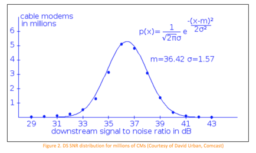

An additional step to compensate for DOCSIS 3.1 pilot boosting was taken
before applying the QAM-independent spectral efficiency numbers to the SNR
values given in Fig. 2. In particular, the reported SNR readings were dropped
by 0.25 dB to compensate for the boosting of continuous and scattered pilots
in 8K FFT case (i.e., 10*log10(((7,600- 88-60)+4*(88+60))/7,600)) as shown in
Fig. 3. This process was performed to fairly compare with DOCSIS 3.0 systems
assuming constant power allocation per unit of bandwidth. Although an
additional SNR shift by 0.14 dB is needed to compensate for pilot boosting in
the 4K FFT case, it was deemed insignificant and therefore the 0.25 dB-
shifted SNR distribution shown in Fig. 3 was used to analyze the spectral
efficiency of both 8K and 4K FFT cases.

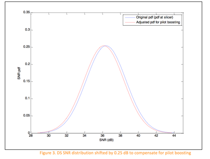

The process of applying the QAM-independent spectral efficiency to different
QAM orders was performed using the DOCSIS 3.1 Multiple Modulation Profile
(MMP) feature. The analysis was performed for multiple SNR operating margins,
which could be used to compensate for different types of noise and
uncertainties in SNR measurements, etc. The MSOs are expected to run DOCSIS
3.1 systems with lower operating margin than what is currently used for DOCSIS
3.0 systems due to multiple reasons including:

•  Modulation profiles are more optimized to CM channels conditions using the
DOCSIS 3.1 variable bit loading feature.

•  MSOs will likely know a lot more about their networks performance utilizing
the DOCSIS 3.1 Proactive Network Maintenance (PNM) features.

•  MSOs can move CMs that experience performance issues from the current
profile to a more robust profile using the Multiple Modulation Profile (MMP)
feature.

•  Running with large operating margins to achieve near-zero pre-FEC error
rates means that the FEC will not be working hard or correcting many errors
and therefore the LDPC coding gain (over RS FEC) will not be utilized.

Figure 4 shows the application of the multiple modulation profiles to the
shifted SNR distribution shown in Fig. 3 for both 8K and 4K FFT cases. In this
case (SNR operating margin = 0 dB), the weighted average spectral efficiency
is calculated to be 8.1996  bps/Hz and 7.5989 bps/Hz for the 8K and 4K FFT
cases, respectively. Note that these weighed average spectral efficiency
numbers are scaled by the QAM-independent spectral efficiency numbers
calculated earlier. The SNR or CNR thresholds used to map modulation orders to
different regions on the distribution graph are based on the column labeled
‘CNR up to 1 GHz’ provided in Table 3 per the DOCSIS 3.1 PHY specifications
[1]. For simplicity, SNR and CNR are considered roughly equivalent in this
analysis.

Comparing the obtained DOCSIS 3.1 spectral efficiencies to the spectral
efficiency of DOCSIS 3.0 system calculated in Section 2 (6.33 bps/Hz) yields
an estimated gain in the spectral efficiency of 30% and 20%, for the 8K and 4K
FFT cases, respectively. Note that the gain shown by these sub-optimal
configurations for the 8K and 4K FFT cases is an improvement above and beyond
the maximum that DOCSIS 3.0 can offer.

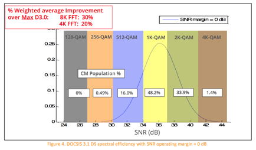

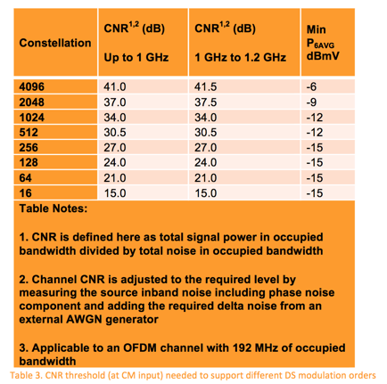

Similar analyses were performed for operating margins of 1 dB, 2 dB, 3 dB, 4
dB, as shown in Figs. 5 - 8, respectively. The results of these analyses are
summarized in Table 4.

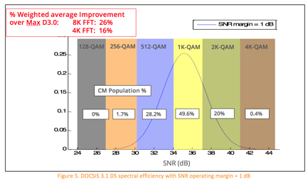

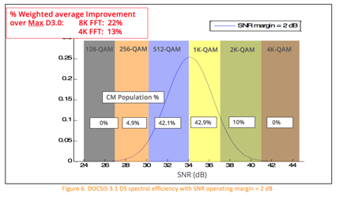

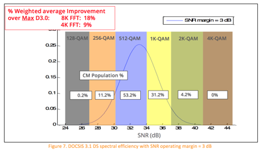

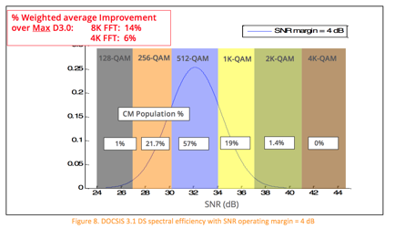

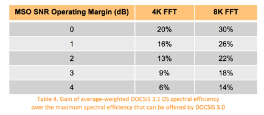

Note that the above gain numbers may actually be better than they appear
because the analysis here compares the DOCSIS 3.1 spectral efficiency in
different scenario against the _maximum _spectral efficiency that can be
offered by DOCSIS 3.0 systems, where the analysis for DOCSIS 3.0 in Section 2
assumed QAM 256 modulation and 0 dB operating margin.

The gain numbers provided in this article are only for a particular sub-
optimal OFDM channel configuration. Besides optimizing the parameters, the
DOCSIS 3.1 has additional features and/or factors that will potentially
increase the DS spectral efficiency of DOCSIS 3.1 systems. These include

•  Gateway architecture, which yields less DS signal attenuation.

•  DOCSIS 3.1 can capitalize on any plant upgrades (e.g., less cascades,
digital  optics) or clean ups because it supports high modulation orders.

•  OFDM is much more robust than single-carrier technology in non-AWGN
environments. The above analyses only assumed AWGN. Other sources of noise
(colored noise, ingress, impulse) will better show the superiority of OFDM
when compared to single-carrier technologies used in DOCSIS 3.0 [2] [3] [4].

•  Lower operating margins could be used in DOCSIS 3.1 networks.

•  Finer resolution frequency domain CM equalizers.

US DOCSIS 3.1 OFDMA CHANNEL CONFIGURATION PARAMETERS THAT AFFECT SPECTRAL
EFFICIENCY  This section discusses the various OFDMA channel configuration
parameters that affect the spectral efficiency. These include the guard bands,
cyclic prefix, symbol shaping, FEC overhead, pilot pattern, US minislot
structure, configuration, and placement, etc.

As was the case for the DS analysis, the US analysis is performed for 25 kHz
and 50 kHz subcarrier spacing, which translate to 4K and 2K FFT sizes,
respectively. 96 MHz channel with 95 MHz of active spectrum is assumed.
Therefore, each OFDMA symbol will contain 3,800 active 25 kHz subcarriers in
the 4K FFT case and 1,900 active 50 kHz subcarriers in the 2K FFT case.

The US OFDMA channels are not assumed to be synchronous because it will likely
be long time before one CM will need to fill multiple US OFDMA channels. No
exclusion zones are assumed in this analysis.

The CP value is again assumed to be a median value of 2.5 usec for both 4K and
2K FFT cases. Similar to the DS analysis, the effect of symbol shaping is
assumed to yield sharp spectral edges and the loss due to time domain shaping
is considered insignificant due to symbol overlapping.

The minislot size in terms of frequency is fixed and equals 400 kHz.
Therefore, the width of the minislot is 16, 25 kHz subcarriers in the 4K FFT
case and 8, 50 kHz subcarriers in the 2K FFT case. The duration of the
minislot equals the duration of the OFDMA frame and is configurable. The
duration of the minislot in this analysis is assumed to be at the maximum
allowed value of 9 and 18 OFDMA symbols for the 4K FFT and 2K FFT cases,
respectively. Therefore, each minislot contains 144 subcarriers in both 4K and
2K FFT cases.

Observe that since each OFDMA symbol contains 3,800 active subcarriers and the
minislot covers 9 OFDMA symbols in the 4K FFT case, the total number of active
subcarriers in an OFDMA frame is 34,200 subcarriers (out of 34,560 subcarriers
within 96 MHz channel covering 9 symbols). Similarly, the OFDMA frame in the
2K FFT case contains 34,200 active subcarriers out of 34,560 subcarriers
within 96 MHz channel covering 18 OFDMA symbols. Note that the OFDMA frame
capacity in terms of number of subcarriers is identical for both 4K and 2K FFT
cases.

Since the active spectrum is only 95 MHz and the minislot size is 400 kHz, the
maximum number of minislots that can be supported in this scenario is 237
(cannot have fractional minislots). There will be only 34,128 usable
subcarriers out of 34,200 active subcarriers within the OFDMA frame. Note that
this number is identical for both 4K and 2K FFT cases because the frame size
and minislot capacity in terms of number of subcarriers are identical for both
FFT cases as shown above.

The guard bands (total of 1 MHz) will further reduce the usable number of
subcarriers within an OFDMA frame. The guard bands will consume 360
subcarriers (40 subcarriers per OFDMA symbol for 9 symbols) in the 4K FFT
case. Similarly, guard bands will consume 360 subcarriers (20 subcarriers per
OFDMA symbol for 18 symbols) in the 2K FFT case.

For the analysis of this paper, it is assumed that only one edge minislot per
OFDMA frame is present. The rest (236) will be body minislots. Moreover, the
modulation of complementary pilots is assumed to be similar to data modulation
in this exercise, which can be reasonable approximation because the number of
complementary pilots in the minislot is very small.

Regarding pilot structures, the DOCSIS 3.1 PHY spec supports different
structures that could be used for different channel conditions, etc. In the
analysis of this paper, pilot structures 8 and 1 are assumed for the 4K and 2K
FFT cases, respectively. Both structures contain 4 pilot subcarriers per edge
minislot and 2 pilot subcarriers per body minislot as shown in Fig. 9.

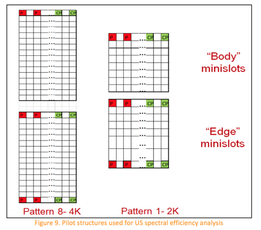

Regarding the FEC, DOCSIS3.1 PHY specifications supports quasi-cyclic LDPC
codes for the US. Theoretical simulations showed that these codes can offer up
to 6 dB improvements over the RS FEC that is currently used in US DOCSIS 3.0.
The DOCSIS 3.1 PHY specifications support multiple LDPC CW sizes with
different FEC rates as listed below. The analysis in this paper assumes long
full CWs, with a FEC code rate of 0.889. No short codewords were assumed.

•  Long: Rate 0.89 (16200,14400)

•  Medium: Rate 0.85 (5940,5040)

•  Small: Rate 0.75 (1120,840)

ESTIMATING DOCSIS 3.1 US SPECTRAL

EFFICIENCY

This section attempts to estimate the DOCSIS 3.1 US spectral efficiency and
compare it with that is offered by DOCSIS 3.0. The estimates are performed for
an AWGN channel assuming an asynchronous OFDM channel with configuration
parameters that were discussed in Section 5 and are summarized in Table 5 for
convenience.

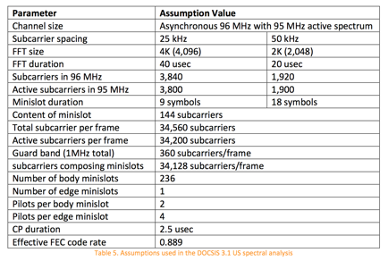

The assumptions in Table 5 are used to calculated the DOCSIS 3.1 QAM-
independent spectral efficiency for the 4K FFT case to yield 0.8146 sps/Hz
(i.e., ((34,200-0.5*144-1*4- 236*2)/34,560)*(40/42.5)*(0.8889)). Similarly,
the QAM-independent spectral efficiency for the 2K FFT case can be calculated
to be 0.7694 sps/Hz (i.e., ((34,200-0.5*144-1*4-
236*2)/34,560)*(20/22.5)*(0.8889)).

Using the above QAM-independent spectral efficiency numbers, it can be
observed that the overhead consumed by both 4K and 2K FFT cases is less than
what is consumed by DOCSIS 3.0 which was calculated in Section 2. In
particular, the QAM-independent spectral efficiencies for 4K is greater than
that for 2K FFT which in turn is greater than the DOCSIS 3.0 QAM-independent
spectral efficiency that was calculated in section 2 (i.e., 0.8146 < 0.7694 <
0.692, respectively). Note that the analysis so far only considers the amount
of overhead in the system and cannot lead to any final conclusions yet.

As was the case for the DS analysis, it is required to estimate the actual
system spectral efficiency in units of bits per seconds per Hz (bps/Hz) in
order to fully compare different systems. The actual spectral efficiency can
be calculated via applying the above QAM- independent spectral efficiency
numbers to different QAM modulation orders. However, the orders of the QAM
modulations depend on the channel SNR. Therefore, the rest of the analysis in
this section relates to the process of applying the QAM- independent spectral
efficiency to the different modulation orders given channel SNR values.
Similar to the DS analysis, the US analysis in this section assumes an AWGN
channel with no other noise types being present.

Figure 10 shows the distribution of US SNR values on Comcast Cable network
(the figure is courtesy of David Urban, Comcast). Note that these are SNR
values measured at the CMTS QAM slicer. Similar to the DS analysis, the US
analysis here assumes that these SNR values are applicable as well at the
input of the CMTS given insignificant CMTS implementation loss for the range
of SNR values that are covered by the distribution shown in Fig. 10. As a
result, the analysis here assumes that the CMTS has 0 dB implementation loss
and therefore the distribution also could represent SNR values at the input of
CMTS.

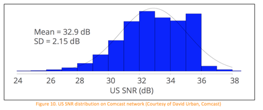

Figure 11 shows the application of the modulation profiles to the SNR
distribution shown in Fig. 10 for both 4K and 2K FFT cases. In this case (SNR
margin = 0 dB), the weighted average spectral efficiency is calculated to be
7.047 bps/Hz and 6.656 bps/Hz for the 4K and 2K FFT cases, respectively. Note
that these weighed average spectral efficiency numbers are scaled by the QAM-
independent spectral efficiency numbers calculated earlier. The SNR or CNR
thresholds used to map modulation orders to different regions on the
distribution graph are provided in Table 6 per the DOCSIS 3.1

PHY specifications [1]. For simplicity, SNR and CNR are considered roughly
equivalent in this analysis.

Comparing the obtained DOCSIS 3.1 spectral efficiencies to the spectral
efficiency of DOCSIS 3.0 system calculated in Section 2 (4.15 bps/Hz) yields
an estimated gain in the spectral efficiency of 70% and 60%, for the 4K and 2K
FFT cases, respectively.

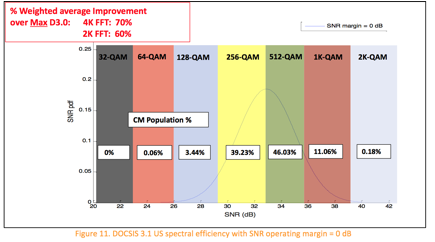

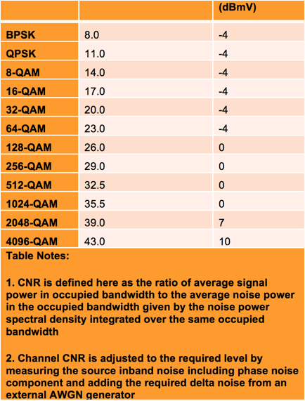

The process of applying the QAM-independent spectral efficiency numbers to
different QAM orders was performed for multiple SNR operating margins (1 dB, 2
dB, 3 dB, and 4 dB) as shown in Figs. 12 - 15 and summarized in Table 7.
Multiple operating margins could be used to compensate for different types of
noise and uncertainties in SNR measurements, etc. As mentioned earlier, the
MSOs are expected to run DOCSIS 3.1 systems with lower operating margin than
what is currently used for DOCSIS 3.0 systems.

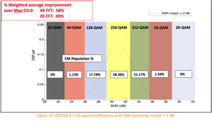

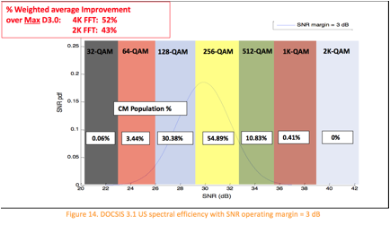

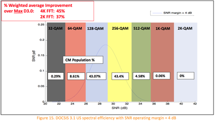

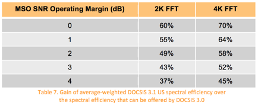

Note that some of the above gain numbers may actually be better than they
appear because the analysis here compares the DOCSIS 3.1 spectral efficiency
in different scenario against the DOCSIS 3.0 spectral efficiency, where the
analysis for DOCSIS 3.0 in Section 2 assumed QAM 64 modulation and 0 dB
operating margin.

The gain numbers provided in this article are only for a certain sub-optimal
OFDM channels configuration. Besides optimizing the parameters, the DOCSIS 3.1
has additional features and/or factors that will potentially increase the US
spectral efficiency of DOCSIS 3.1 systems. These include

•  Gateway architecture, which yields less US signal attenuation and less
noise funneling, which translates to higher SNR values at the CMTS.

•  DOCSIS 3.1 can capitalize on any plant upgrades (e.g., smaller cascades,
digital optics) or clean ups because it supports high modulation orders.

•  OFDM is much more robust than single-carrier technology in non-AWGN
environments. The above analyses only assumed AWGN. Other sources of noise
(colored noise, ingress, impulse) will better show the superiority of OFDM
when compared to single-carrier technologies used in DOCSIS 3.0 [2] [3] [4].

•  Lower operating margins could be used in DOCSIS 3.1 systems.

•  Fine resolution frequency domain CM pre-equalizers & CMTS post-equalizers

•  Increased CM transmit power levels, which translates to higher SNR values.
In  particular, DOCSIS 3.1 requires CMs to support maximum CM transmit power
of  at least 65 dBmV. Higher values are permitted but not specified.

•  US modulation profile optimization across the spectrum occurs with minislot
granularity in DOCSIS 3.1 as opposed to fixed modulation across the 6.4 MHz
channel width in DOCSIS 3.0.

•  Larger US DOCSIS 3.1 channel width enables more simultaneous transmitters,
which allows quicker transmission of US TCP ACKs and leads to reduced TCP RTT
and therefore increased DS TCP throughput.

•  Wider DOCSIS 3.1 channels will allow for less CCF headers (higher
efficiency).

EFFECT OF DIFFERENT NETWORK ARCHITECTURES ON DOCSIS 3.1 SPECTRAL EFFICIENCY

This section discusses the effect of different network architectures like N+x,
N+0, and digital optics on the spectral efficiency that can be offered by
DOCSIS 3.1. The answer to this question is that it depends on the starting
point of the network conditions. A few examples are discussed here to
illustrate the effect of plant upgrades on the system spectral efficiency.

Assume a 1 GHz system with 79 analog video and 75 digital QAM channels and
about 10-20 km long analog optical fiber link. The power of analog channels is
assumed to be set 6 dB higher than the QAM channels. The DS composite CNR
(CCNR) for the analog and digital QAM signals can improve as the plant moves
from N+6 to N+3 to N+0 cascades as shown in Table 8.

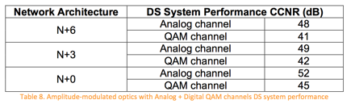

If the above system is converted to a fully digital system and the QAM channel
power was raised as a result of reclaiming the analog channels, the DS CCNR
numbers further improve as shown in Table 9. Note that there is a benefit from
reducing the number of cascaded elements which yields higher CNR values, which
in turn lead to higher capacities. In particular, the numbers in Table 9 show
3.5 dB of CCNR gain when moving from N+6 to N+0. Observe that given an optical
CNR of 48 dB (N+0), the cable side CNR values for the N+3 and N+6 cases can be
calculated to be 50.3 dB and 47.1 dB, respectively.

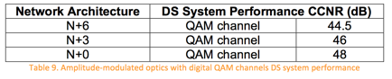

It is apparent that there is a benefit from reducing the number of cascades.
However, would upgrading the plant from amplitude-modulated optics to digital
optics help? The bottom line is that upgrading to digital optics can only be
justified and lead to significant advantages when the performance of the
analog optical link is not satisfactory. This can occur when the fiber links
are very long or when many lambdas are multiplexed onto a single fiber and
cause nonlinear optical noise. Specifically, when the performance of the
analog optical link limits the performance of the whole system and yields low
DS CCNR values, moving to digital optics can help in achieving large DS CCNR
values needed to support high modulation orders.

When a plant upgrade occurs to move from amplitude-modulated optics to digital
optics, the remote source (i.e., remote PHY (RPHY) or Remote CCAP (RCCAP)
module) CNR is actually what defines the system performance. This is because
the headend to fiber node performance is irrelevant in the digital optics
world. To achieve the desired benefits, the signal out of the RPHY/RCCAP
module must possess high CNR values, which after combining with the cascaded
cable part of the network, should yield large CCNR values at the End of Line
(EOL) that can result in tangible value. For instance, Table 10 shows the
minimum CNR values that the signals out of the RPHY/RCCAP module must have
such that EOL DS CCNR values higher than those listed in Table 9 can be
obtained. Note that as the cascade length increases, the pressure on the
remote module signal quality decrease due to the noise contributions from
longer cascades. In a nutshell, when amplitude-modulated optics limit the
system performance, moving to digital optics can provide capacity improvements
provided that the RPHY/RCCAP module source CNR is large enough to achieve the
desired EOL DS CCNR values. It should be noted that the CCNR at the CM slicer
also depends on the performance of the CM.

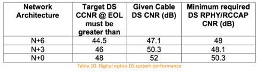

While the above analysis is performed for the DS only, it is expected that the
US will also benefit when the number of cascades is reduced and/or when
digital optics are deployed to circumvent problems resulting from amplitude-
modulated optics limiting the system performance.

BEST PRACTICES FOR MAXIMUM NETWORK

PERFORMANCE

Many different features are enabled by DOCSIS 3.1 which can result in
optimization of the modulation order. The bit-loading feature can take the
plant’s SNR (on a subcarrier basis) into consideration to yield the maximum
possible capacity while avoiding the need for large SNR margins. The MMP
feature enables the MSOs to change from one modulation profile to another to
accommodate variations in noise. Therefore, service providers will be able to
operate their networks at much smaller SNR margins than they are currently
using with DOCSIS 3.0. Low SNR margin is not the only way to increase the
capacity of HFC networks using DOCSIS 3.1. In addition, optimizing the various
OFDM and LDPC parameters to account for the plant’s unique noise and channel
characteristics is also very crucial.

The low SNR margin and high modulation orders enabled by DOCSIS 3.1 lead to a
very sensitive operating environment, where healthy networks with high SNR
values are needed in order to maintain reliable service. Healthy networks can
be achieved when plant equipment including connectors, amplifiers, taps, and
cables are well maintained, loose connections are terminated to reduce noise,
aging components such as lasers, amplifiers, and passives are proactively
replaced, and automatic network monitoring tools are heavily utilized to
observe and address dynamic network conditions. Following proper installation
practices by technicians in the field and inside the homes can also help
significantly in reducing noise, interference, and signal attenuation on cable
networks.

The DOCSIS 3.1 PNM features can be very helpful in many aspects including
optimizing the systems configurations and performing efficient plant
maintenance and trouble- shooting.

In addition to the outside plant, there are several home network implications
in the DOCSIS 3.1 era that require heightened awareness. Specifically, end
users should take note of how their service is affected when they re-wire
their home networks and add/remove new connections within their residences.
End users should appreciate that the newly-introduced gateway style
architecture, where the cable modem is placed at the point of entry of the
house or at most after one splitter, enables them to get the best service and
performance. On the other hand, burying the cable modem behind many splitters
can result in degraded performance. End users must also understand that
leaving loose and un-terminated connectors in their houses not only can affect
their service but also affects their neighbors as they present an entry point
for noise and interference in the system. Appropriate end user education
programs (with brochures and email reminders) may prove helpful.

CONCLUSIONS

This article discussed the spectral efficiency of DOCSIS 3.1 and showed
examples to demonstrate spectral efficiency gain for DOCSIS 3.1 systems over
DOCSIS 3.0 systems. The analyses showed that the spectral efficiency of DOCSIS
3.1 depends on the selected operating margin. For 0 dB operating margin, the
analyses for DS (8K FFT) and US (4K FFT) showed that DOCSIS 3.1 spectral
efficiencies can be 8.1996 bps/Hz and 7.047 bps/Hz, respectively, which is
about 30% and 70% gain over the estimated DS and US DOCSIS 3.0 spectral
efficiencies of 6.33 bps/Hz and 4.15 bps/Hz, respectively.

The analyses showed that as the operating margins increase, the spectral
efficiency gain over DOCSIS 3.0 decreases. For instance, in the DS (8K FFT),
the spectral efficiency gain drops from 30% to 14% when the margin is
increased from 0 dB to 4 dB. Similarly, for the US (4K FFT), the spectral
efficiency gain drops from about 70% to 45% when the margin is increased from
0 dB to 4 dB.

The discussions in this paper also showed that potential DS CCNR gain of 3.5
dB can be achieved when moving from N+6 to N+0 network architecture. Moreover,
the paper showed that when amplitude-modulated optics limit the system
performance, digital optics can provide capacity improvements provided that
the RPHY/RCCAP module output CNR is large enough to achieve the desired EOL
CCNR values.

ACKNOWLEDGEMENTS

The authors would like to thank Dave Urban of Comcast for providing the DS &
US SNR distributions. The authors would like also to acknowledge their ARRIS
colleagues Brent Arnold, David Bowler, Stephane Chapeau, Venk Mutalik, and
Frank O’Keeffe, for their significant contributions to this paper.

RELATED READINGS

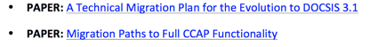

MEET ONE OF OUR EXPERTS: Ayham Al-Banna

When it comes to DOCSIS-based cable access networks, Ayham Al-Banna is at the
forefront of innovation and expertise. At ARRIS, his role is to define the
architecture and guide the evolution of the company’s CCAP and CMTS solutions,
and he is the holder of several granted and pending patents in this area. But
his influence truly transcends the cable industry. Through his work on the
DOCSIS 3.1 PHY committee and its covert predecessor the Advanced MAC PHY
committee, Ayham has helped shape this exciting new specification from the
very beginning. And when he’s not busy inventing the future, he’s sharing his
knowledge with his peers at IEEE events and industrial conferences, presenting
new ideas to customers to help them architect better cable access networks,
and inspiring the minds of tomorrow through his work as an Advisory Council
member for Miami University and his adjunct teaching role at several other
universities.

