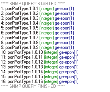
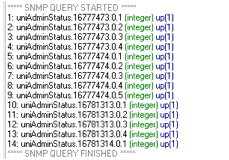

# EponIndex 说明

## 设备MIB

### 第一类使用No的

在EponIndex中的典型方法有

public static Long getSlotNo(Long index)

public static Long getPonNo(Long index)

public static Long getSniNo(Long index)

public static Long getOnuNo(Long index)

public static Long getUniNo(Long index)

public static Long getOnuCardNo(Long index)

其中ponDeviceIndex的Composed syntax:是INTEGER

固定是1

ponCardIndex是Slot No

ponPortIndex是 Pon No

### 第二类使用EponDeviceIndex的

此类index在EponIndex中被归纳为mibIndex，最典型的方法是

    public static Long getOnuIndexByMibIndex(Long index) {

        return (index.longValue() & 0x00FFFFFFL) << 16;

    }

    public static Long getOnuMibIndexByIndex(Long index) {

        return ((index.longValue() & 0xFFFFFF0000L) >> 16) | 0x01000000L;

}

用于EMS侧数据库index与EponDeviceIndex之间的转换

其中uniAttributeDeviceIndex的Composed syntax是EponDeviceIndex

其格式是32位整数

1-8位为Device No  固定是1

9-16位为slot No

17-24位为PON No

25-32位为 ONU No

|--d8--||--s8--||--p8--||--o8--|  

uniAttributeCardIndex是onu slot No

uniAttributePortIndex是 onu UNI No

## EMS侧数据库保存的index

epon采用5级索引来定位。 示例： 0x0203150103=8641642755L 表示slot 2，pon 3， onu 15，onu slot
1（sfu默认为1），uni 3.

从slot，pon，onu，onu slot，uni对应的No号，后面为0的不用填写

 *   EponIndex index = new EponIndex(2);//slot 2

 *   assertEquals(index.getUniIndex().longValue(), 8589934592L);//

 *   index = new EponIndex(2, 3);//2号槽，3端口

 *   assertEquals(index.getUniIndex().longValue(), 8640266240L);

 *   index = new EponIndex(2, 3, 21);//2号槽，Pon 3，21号ONU

 *   assertEquals(index.getUniIndex().longValue(), 8641642496L);

 *   index = new EponIndex(2, 3, 21, 1, 3);//2号槽，Pon 3，21号ONU，3号端口

在EponIndex中典型方法是

public EponIndex(Integer... id)

public static Long getSlotIndex(Long index)

public static String getPortIndex(Long index)

public static Long getOnuIndex(Long index)

public static String getOnuPonIndex(Long index)

public static Long getOnuCardIndex(Long index)

public static Long getUniIndex(Long index)

