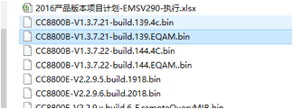
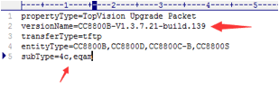
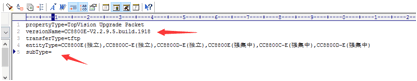
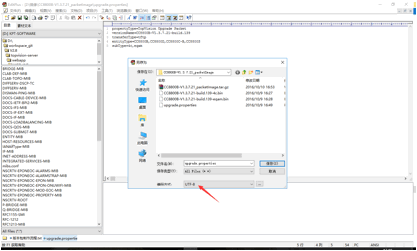
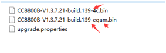
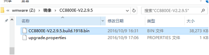
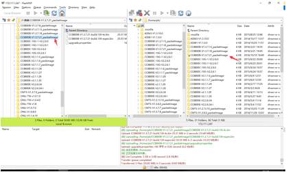
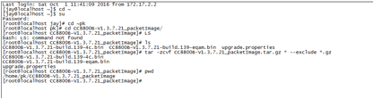
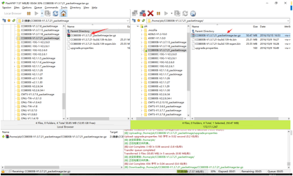

# 在openKm上下载安装包

# 为每个版本建立自己的目录

Z:\镜像\CC8800B-V1.3.7.21_packetImage

# 编辑upgrade文件

subType需要与文件名对应，关注大小写，对E型没有subType区分，这里可以为空

# 将UPGRADE文件另存为UTF-8的编码

# 修改镜像名称

如果没有subType区分的可以不用改名称

# 上传到linux

# 登陆linux进入到对应的版本目录，并执行打包命令

tar -zcvf CC8800B-V1.3.7.21_packetImage.tar.gz * --exclude *.gz

# 将打包好的文件传回windows

# 上传到FTP服务器

